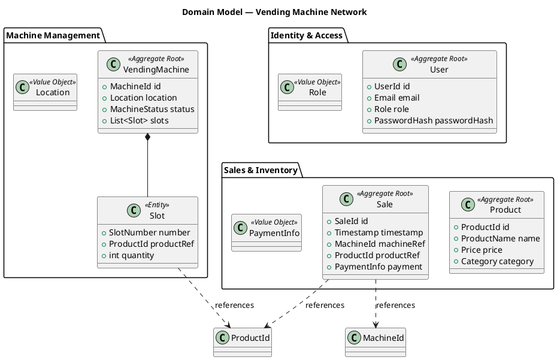

# 2. Domain Model (DDD)

## 2.1 Bounded Contexts

<!-- TODO: Identify and describe bounded contexts (e.g., Identity & Access, Machine Management, Sales & Inventory) -->

| Bounded Context | Description | Key Aggregates |
|-----------------|-------------|----------------|
| Identity & Access | User management, authentication, authorization | User |
| Machine Management | Vending machine lifecycle, telemetry, maintenance | VendingMachine |
| Sales & Inventory | Product catalog, stock, transactions, pricing | Product, Sale |
| *(add more if needed)* | | |

## 2.2 Aggregate: User (Identity & Access Context)

### Aggregate Root: `User`
<!-- TODO: Define properties, invariants, behaviors -->

| Element | Type | Description |
|---------|------|-------------|
| `User` | Aggregate Root | <!-- TODO --> |
| `UserId` | Value Object | <!-- TODO --> |
| `Email` | Value Object | <!-- TODO --> |
| `Role` | Value Object / Enum | Customer, Operator, Administrator |
| `PasswordHash` | Value Object | <!-- TODO --> |

### Invariants
<!-- TODO: e.g., "A User must have exactly one Role", "Email must be unique" -->

### Domain Events
<!-- TODO: e.g., UserRegistered, UserRoleChanged -->

## 2.3 Aggregate: VendingMachine (Machine Management Context)

### Aggregate Root: `VendingMachine`

| Element | Type | Description |
|---------|------|-------------|
| `VendingMachine` | Aggregate Root | <!-- TODO --> |
| `MachineId` | Value Object | <!-- TODO --> |
| `Location` | Value Object | <!-- TODO: GPS coords, address --> |
| `MachineStatus` | Value Object / Enum | Online, Offline, Maintenance |
| `Slot` | Entity | <!-- TODO: slot number, product reference, quantity --> |

### Invariants
<!-- TODO: e.g., "A machine must have between 1 and N slots", "Stock quantity ≥ 0" -->

### Domain Events
<!-- TODO: e.g., MachineTelemetryReceived, SlotRestocked, MachineStatusChanged -->

## 2.4 Aggregate: Product (Sales & Inventory Context)

### Aggregate Root: `Product`

| Element | Type | Description |
|---------|------|-------------|
| `Product` | Aggregate Root | <!-- TODO --> |
| `ProductId` | Value Object | <!-- TODO --> |
| `ProductName` | Value Object | <!-- TODO --> |
| `Price` | Value Object | <!-- TODO: currency, amount --> |
| `Category` | Value Object | <!-- TODO --> |

### Invariants
<!-- TODO: e.g., "Price must be > 0", "ProductName must not be empty" -->

## 2.5 Aggregate: Sale (Sales & Inventory Context)

### Aggregate Root: `Sale`

| Element | Type | Description |
|---------|------|-------------|
| `Sale` | Aggregate Root | <!-- TODO --> |
| `SaleId` | Value Object | <!-- TODO --> |
| `Timestamp` | Value Object | <!-- TODO --> |
| `MachineId` | Value Object (reference) | <!-- TODO --> |
| `ProductId` | Value Object (reference) | <!-- TODO --> |
| `PaymentInfo` | Value Object | <!-- TODO: method, amount, status --> |

### Domain Events
<!-- TODO: e.g., SaleCompleted, PaymentFailed -->

## 2.6 Domain Model Class Diagram

<!-- TODO: Replace/expand this PlantUML stub with the final diagram -->

## 2.7 Aggregate Interaction Map
<!-- TODO: Show how aggregates communicate (domain events, references by ID) -->
