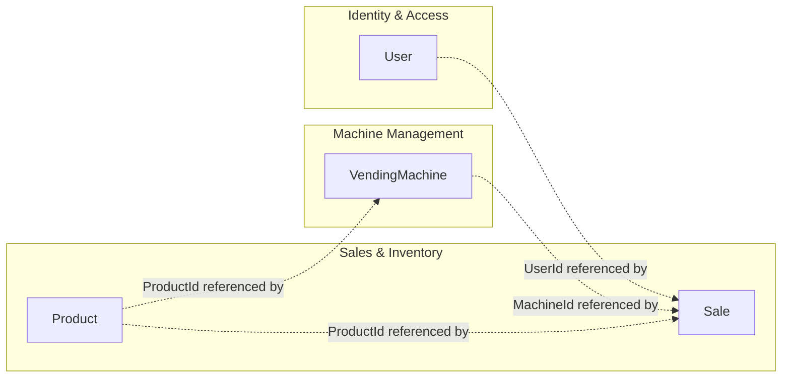
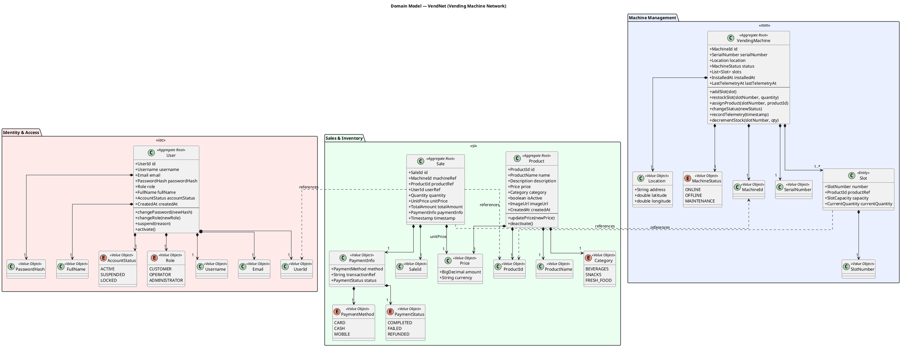
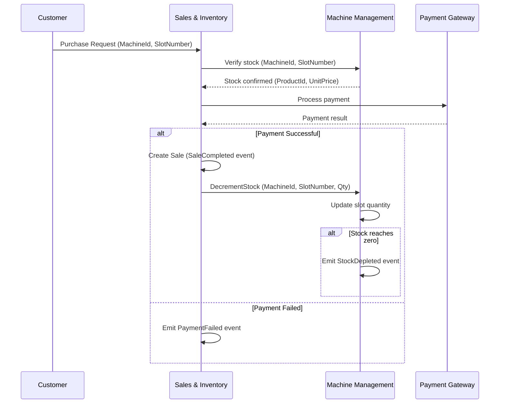

# 2. Domain Model (DDD)

> For the full DDD class diagram in draw.io format, see [System/DDD/](../System/DDD/).

## 2.1 Bounded Contexts

The system is decomposed into three bounded contexts, each encapsulating a cohesive set of domain concepts and business rules.

| Bounded Context | Description | Key Aggregates |
|-----------------|-------------|----------------|
| **Identity & Access** | User lifecycle management, authentication, authorization, and role assignment | User |
| **Machine Management** | Vending machine registration, telemetry, slot configuration, and maintenance tracking | VendingMachine |
| **Sales & Inventory** | Product catalog, pricing, sales transactions, payment processing, and stock tracking | Product, Sale |

### Context Map

Aggregates communicate exclusively through **references by ID** (not direct object references) and **domain events**. This ensures loose coupling between bounded contexts and allows independent evolution.

---

## 2.2 Aggregate: User (Identity & Access Context)

### Aggregate Root: `User`

Represents a registered user of the system. Users are assigned exactly one role that determines their authorization scope.

| Element | Type | Description |
|---------|------|-------------|
| `User` | **Aggregate Root** | Registered user with credentials and role assignment |
| `UserId` | Value Object | UUID-based unique identifier |
| `Username` | Value Object | Unique alphanumeric username (3–30 chars) |
| `Email` | Value Object | RFC 5322-compliant email address, unique in the system |
| `PasswordHash` | Value Object | BCrypt hash of the user's password (never stored in plaintext) |
| `Role` | Value Object / Enum | One of: `CUSTOMER`, `OPERATOR`, `ADMINISTRATOR` |
| `FullName` | Value Object | User's display name |
| `AccountStatus` | Value Object / Enum | `ACTIVE`, `SUSPENDED`, `LOCKED` |
| `CreatedAt` | Value Object | Timestamp of account creation (immutable) |

### Invariants

- A User **must** have exactly one Role.
- Email **must** be unique across all users.
- Username **must** be unique and between 3–30 alphanumeric characters.
- PasswordHash **must** be present and generated via BCrypt.
- AccountStatus defaults to `ACTIVE` on creation.
- A `SUSPENDED` or `LOCKED` user cannot authenticate.

### Domain Events

| Event | Trigger | Payload |
|-------|---------|---------|
| `UserRegistered` | New user created | UserId, Email, Role, CreatedAt |
| `UserRoleChanged` | Administrator changes a user's role | UserId, OldRole, NewRole, ChangedBy |
| `UserSuspended` | Administrator suspends account | UserId, Reason, SuspendedBy |
| `UserPasswordChanged` | User changes own password | UserId, ChangedAt |

---

## 2.3 Aggregate: VendingMachine (Machine Management Context)

### Aggregate Root: `VendingMachine`

Represents a physical vending machine and its current state. Each machine contains a set of Slots that hold products.

| Element | Type | Description |
|---------|------|-------------|
| `VendingMachine` | **Aggregate Root** | Physical vending machine in the network |
| `MachineId` | Value Object | UUID-based unique identifier |
| `SerialNumber` | Value Object | Manufacturer serial number (unique, alphanumeric) |
| `Location` | Value Object | Geographic location: address, GPS coordinates (latitude, longitude) |
| `MachineStatus` | Value Object / Enum | `ONLINE`, `OFFLINE`, `MAINTENANCE` |
| `Slot` | **Entity** | Individual product slot within the machine (has identity within aggregate) |
| `SlotNumber` | Value Object | Positional identifier within the machine (1-based integer) |
| `SlotCapacity` | Value Object | Maximum quantity the slot can hold |
| `CurrentQuantity` | Value Object | Current stock count in the slot |
| `ProductId` | Value Object (reference) | Reference to the Product assigned to this slot |
| `InstalledAt` | Value Object | Timestamp of machine installation |
| `LastTelemetryAt` | Value Object | Timestamp of last received telemetry data |

### Invariants

- A VendingMachine **must** have a unique SerialNumber.
- A VendingMachine **must** have between 1 and 50 Slots.
- SlotNumber **must** be unique within its VendingMachine.
- CurrentQuantity **must** satisfy: `0 ≤ CurrentQuantity ≤ SlotCapacity`.
- SlotCapacity **must** be > 0.
- A Slot **may** have a null ProductId (empty/unassigned slot).
- MachineStatus defaults to `OFFLINE` on creation.

### Domain Events

| Event | Trigger | Payload |
|-------|---------|---------|
| `MachineRegistered` | New machine added to the network | MachineId, SerialNumber, Location |
| `MachineStatusChanged` | Status transitions (e.g., Online→Maintenance) | MachineId, OldStatus, NewStatus |
| `SlotRestocked` | Operator refills a slot | MachineId, SlotNumber, ProductId, NewQuantity |
| `SlotAssigned` | Product assigned to a slot | MachineId, SlotNumber, ProductId |
| `TelemetryReceived` | Machine sends telemetry data | MachineId, Timestamp, StatusData |
| `StockDepleted` | Slot reaches zero quantity after a sale | MachineId, SlotNumber, ProductId |

---

## 2.4 Aggregate: Product (Sales & Inventory Context)

### Aggregate Root: `Product`

Represents an item available for sale through the vending machine network.

| Element | Type | Description |
|---------|------|-------------|
| `Product` | **Aggregate Root** | Sellable product in the catalog |
| `ProductId` | Value Object | UUID-based unique identifier |
| `ProductName` | Value Object | Display name of the product (1–100 chars, non-empty) |
| `Description` | Value Object | Optional product description (max 500 chars) |
| `Price` | Value Object | Monetary amount with currency (e.g., EUR 1.50). Contains `amount` (BigDecimal) and `currency` (ISO 4217) |
| `Category` | Value Object | Product category (e.g., `BEVERAGES`, `SNACKS`, `FRESH_FOOD`) |
| `IsActive` | Value Object | Whether the product is currently available for sale |
| `ImageUrl` | Value Object | Optional URL to product image |
| `CreatedAt` | Value Object | Timestamp of product creation (immutable) |

### Invariants

- ProductName **must** not be empty and **must** be between 1–100 characters.
- Price.amount **must** be > 0.
- Price.currency **must** be a valid ISO 4217 code.
- A Product with `IsActive = false` **cannot** be assigned to new Slots.

### Domain Events

| Event | Trigger | Payload |
|-------|---------|---------|
| `ProductCreated` | New product added to catalog | ProductId, ProductName, Price, Category |
| `ProductPriceChanged` | Administrator updates price | ProductId, OldPrice, NewPrice, ChangedBy |
| `ProductDeactivated` | Product removed from active catalog | ProductId, DeactivatedBy |

---

## 2.5 Aggregate: Sale (Sales & Inventory Context)

### Aggregate Root: `Sale`

Represents a completed sales transaction at a vending machine. Sales are **immutable** once created — they record a historical event.

| Element | Type | Description |
|---------|------|-------------|
| `Sale` | **Aggregate Root** | Immutable record of a sales transaction |
| `SaleId` | Value Object | UUID-based unique identifier |
| `MachineId` | Value Object (reference) | Reference to the VendingMachine where the sale occurred |
| `ProductId` | Value Object (reference) | Reference to the Product that was sold |
| `UserId` | Value Object (reference) | Reference to the Customer who made the purchase (nullable for anonymous sales) |
| `Quantity` | Value Object | Number of items purchased (positive integer) |
| `UnitPrice` | Value Object | Price per unit at the time of sale (snapshot, not a live reference) |
| `TotalAmount` | Value Object | `Quantity × UnitPrice` |
| `PaymentInfo` | Value Object | Payment method (`CARD`, `CASH`, `MOBILE`), transaction reference, payment status (`COMPLETED`, `FAILED`, `REFUNDED`) |
| `Timestamp` | Value Object | Exact date-time of the sale (UTC, immutable) |

### Invariants

- A Sale **must** reference a valid MachineId and ProductId.
- Quantity **must** be ≥ 1.
- UnitPrice **must** be > 0.
- TotalAmount **must** equal `Quantity × UnitPrice`.
- Timestamp **must** not be in the future.
- PaymentInfo.status **must** be `COMPLETED` for the sale to be finalized.
- Sale records are **immutable** after creation (append-only).

### Domain Events

| Event | Trigger | Payload |
|-------|---------|---------|
| `SaleCompleted` | Successful purchase transaction | SaleId, MachineId, ProductId, TotalAmount, Timestamp |
| `PaymentFailed` | Payment processing fails | MachineId, ProductId, UserId, Reason |
| `SaleRefunded` | Administrator processes a refund | SaleId, RefundAmount, RefundedBy |

---

## 2.6 Domain Model Class Diagram

> The full diagram source is also available at [`../System/DDD/DDD.drawio`](../System/DDD/DDD.drawio).

---

## 2.7 Aggregate Interaction Map

Aggregates interact exclusively through **ID references** and **domain events**. No aggregate holds a direct object reference to another aggregate.

### Cross-Aggregate References

| Source Aggregate | Referenced ID | Target Aggregate | Relationship |
|-----------------|---------------|-----------------|-------------|
| Slot (within VendingMachine) | `ProductId` | Product | Which product is loaded in the slot |
| Sale | `MachineId` | VendingMachine | Where the sale occurred |
| Sale | `ProductId` | Product | What was sold |
| Sale | `UserId` | User | Who made the purchase (nullable) |

### Domain Event Flow

### Aggregate Summary

| # | Aggregate | Bounded Context | Root Entity | Key Entities | Key Value Objects |
|---|-----------|----------------|-------------|-------------|-------------------|
| 1 | **User** | Identity & Access | User | — | UserId, Username, Email, PasswordHash, Role, FullName, AccountStatus |
| 2 | **VendingMachine** | Machine Management | VendingMachine | Slot | MachineId, SerialNumber, Location, MachineStatus, SlotNumber, SlotCapacity, CurrentQuantity |
| 3 | **Product** | Sales & Inventory | Product | — | ProductId, ProductName, Description, Price, Category, ImageUrl |
| 4 | **Sale** | Sales & Inventory | Sale | — | SaleId, Quantity, UnitPrice, TotalAmount, PaymentInfo, Timestamp |
