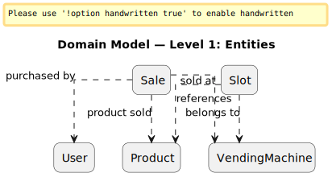
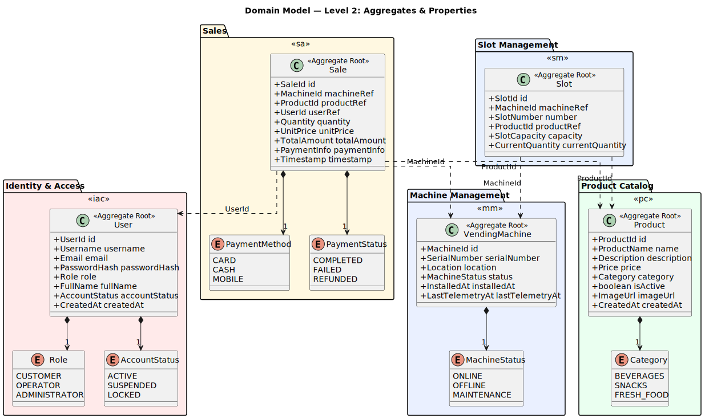
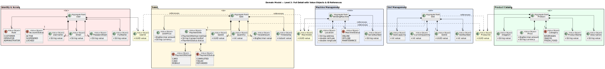

# 2. Domain Model (DDD)

> For the full DDD class diagram in draw.io format, see [System-To-Be/DDD/](../System-To-Be/DDD/).

## 2.1 Bounded Contexts

The system is decomposed into five bounded contexts, each encapsulating a cohesive set of domain concepts and business rules.

| Bounded Context        | Description                                                                   | Key Aggregates |
| ---------------------- | ----------------------------------------------------------------------------- | -------------- |
| **Identity & Access**  | User lifecycle management, authentication, authorization, and role assignment | User           |
| **Machine Management** | Vending machine registration, telemetry, location, and maintenance tracking   | VendingMachine |
| **Slot Management**    | Slot configuration, product assignment, stock tracking within machines        | Slot           |
| **Product Catalog**    | Product catalog, pricing, categories, and product lifecycle management        | Product        |
| **Sales**              | Sales transactions, payment processing, and transaction history               | Sale           |

### Context Map

> Source: [`DDD_Context_Map.puml`](../System-To-Be/DDD/DDD_Context_Map.puml)

Aggregates communicate exclusively through **references by ID** (not direct object references) and **domain events**. This ensures loose coupling between bounded contexts and allows independent evolution.

---

## 2.2 Aggregate: User (Identity & Access Context)

### Aggregate Root: `User`

Represents a registered user of the system. Users are assigned exactly one role that determines their authorization scope.

| Element         | Type                | Description                                                    |
| --------------- | ------------------- | -------------------------------------------------------------- |
| `User`          | **Aggregate Root**  | Registered user with credentials and role assignment           |
| `UserId`        | Value Object        | UUID-based unique identifier                                   |
| `Username`      | Value Object        | Unique alphanumeric username (3–30 chars)                      |
| `Email`         | Value Object        | RFC 5322-compliant email address, unique in the system         |
| `PasswordHash`  | Value Object        | BCrypt hash of the user's password (never stored in plaintext) |
| `Role`          | Value Object / Enum | One of: `CUSTOMER`, `OPERATOR`, `ADMINISTRATOR`                |
| `FullName`      | Value Object        | User's display name                                            |
| `AccountStatus` | Value Object / Enum | `ACTIVE`, `SUSPENDED`, `LOCKED`                                |
| `CreatedAt`     | Value Object        | Timestamp of account creation (immutable)                      |

### Invariants

- A User **must** have exactly one Role.
- Email **must** be unique across all users.
- Username **must** be unique and between 3–30 alphanumeric characters.
- PasswordHash **must** be present and generated via BCrypt.
- AccountStatus defaults to `ACTIVE` on creation.
- A `SUSPENDED` or `LOCKED` user cannot authenticate.

## 2.3 Aggregate: VendingMachine (Machine Management Context)

### Aggregate Root: `VendingMachine`

Represents a physical vending machine and its current state.

| Element           | Type                | Description                                                         |
| ----------------- | ------------------- | ------------------------------------------------------------------- |
| `VendingMachine`  | **Aggregate Root**  | Physical vending machine in the network                             |
| `MachineId`       | Value Object        | UUID-based unique identifier                                        |
| `SerialNumber`    | Value Object        | Manufacturer serial number (unique, alphanumeric)                   |
| `Location`        | Value Object        | Geographic location: address, GPS coordinates (latitude, longitude) |
| `MachineStatus`   | Value Object / Enum | `ONLINE`, `OFFLINE`, `MAINTENANCE`                                  |
| `InstalledAt`     | Value Object        | Timestamp of machine installation                                   |
| `LastTelemetryAt` | Value Object        | Timestamp of last received telemetry data                           |

### Invariants

- A VendingMachine **must** have a unique SerialNumber.
- MachineStatus defaults to `OFFLINE` on creation.

## 2.4 Aggregate: Slot (Slot Management Context)

### Aggregate Root: `Slot`

Represents an individual product slot within a vending machine. Each Slot is its own aggregate, referencing its parent VendingMachine and assigned Product by ID.

| Element           | Type                     | Description                                            |
| ----------------- | ------------------------ | ------------------------------------------------------ |
| `Slot`            | **Aggregate Root**       | Individual product slot within a machine               |
| `SlotId`          | Value Object             | UUID-based unique identifier                           |
| `MachineId`       | Value Object (reference) | Reference to the VendingMachine this slot belongs to   |
| `SlotNumber`      | Value Object             | Positional identifier within the machine (1-based int) |
| `ProductId`       | Value Object (reference) | Reference to the Product assigned to this slot         |
| `SlotCapacity`    | Value Object             | Maximum quantity the slot can hold                     |
| `CurrentQuantity` | Value Object             | Current stock count in the slot                        |

### Invariants

- A Slot **must** reference a valid MachineId.
- SlotNumber **must** be unique within its VendingMachine.
- CurrentQuantity **must** satisfy: `0 ≤ CurrentQuantity ≤ SlotCapacity`.
- SlotCapacity **must** be > 0.
- A Slot **may** have a null ProductId (empty/unassigned slot).

## 2.5 Aggregate: Product (Product Catalog Context)

### Aggregate Root: `Product`

Represents an item available for sale through the vending machine network.

| Element       | Type               | Description                                                                                              |
| ------------- | ------------------ | -------------------------------------------------------------------------------------------------------- |
| `Product`     | **Aggregate Root** | Sellable product in the catalog                                                                          |
| `ProductId`   | Value Object       | UUID-based unique identifier                                                                             |
| `ProductName` | Value Object       | Display name of the product (1–100 chars, non-empty)                                                     |
| `Description` | Value Object       | Optional product description (max 500 chars)                                                             |
| `Price`       | Value Object       | Monetary amount with currency (e.g., EUR 1.50). Contains `amount` (BigDecimal) and `currency` (ISO 4217) |
| `Category`    | Value Object       | Product category (e.g., `BEVERAGES`, `SNACKS`, `FRESH_FOOD`)                                             |
| `IsActive`    | Value Object       | Whether the product is currently available for sale                                                      |
| `ImageUrl`    | Value Object       | Optional URL to product image                                                                            |
| `CreatedAt`   | Value Object       | Timestamp of product creation (immutable)                                                                |

### Invariants

- ProductName **must** not be empty and **must** be between 1–100 characters.
- Price.amount **must** be > 0.
- Price.currency **must** be a valid ISO 4217 code.
- A Product with `IsActive = false` **cannot** be assigned to new Slots.

## 2.6 Aggregate: Sale (Sales Context)

### Aggregate Root: `Sale`

Represents a completed sales transaction at a vending machine. Sales are **immutable** once created — they record a historical event.

| Element       | Type                     | Description                                                                                                          |
| ------------- | ------------------------ | -------------------------------------------------------------------------------------------------------------------- |
| `Sale`        | **Aggregate Root**       | Immutable record of a sales transaction                                                                              |
| `SaleId`      | Value Object             | UUID-based unique identifier                                                                                         |
| `MachineId`   | Value Object (reference) | Reference to the VendingMachine where the sale occurred                                                              |
| `ProductId`   | Value Object (reference) | Reference to the Product that was sold                                                                               |
| `UserId`      | Value Object (reference) | Reference to the Customer who made the purchase (nullable for anonymous sales)                                       |
| `Quantity`    | Value Object             | Number of items purchased (positive integer)                                                                         |
| `UnitPrice`   | Value Object             | Price per unit at the time of sale (snapshot, not a live reference)                                                  |
| `TotalAmount` | Value Object             | `Quantity × UnitPrice`                                                                                               |
| `PaymentInfo` | Value Object             | Payment method (`CARD`, `CASH`, `MOBILE`), transaction reference, payment status (`COMPLETED`, `FAILED`, `REFUNDED`) |
| `Timestamp`   | Value Object             | Exact date-time of the sale (UTC, immutable)                                                                         |

### Invariants

- A Sale **must** reference a valid MachineId and ProductId.
- Quantity **must** be ≥ 1.
- UnitPrice **must** be > 0.
- TotalAmount **must** equal `Quantity × UnitPrice`.
- Timestamp **must** not be in the future.
- PaymentInfo.status **must** be `COMPLETED` for the sale to be finalized.
- Sale records are **immutable** after creation (append-only).

## 2.7 Domain Model Diagrams

> The PlantUML sources and SVG outputs are available at [`../System-To-Be/DDD/`](../System-To-Be/DDD/).

The domain model is presented at three levels of detail, progressively revealing more structure.

### 2.7.1 Level 1 — Entities

Shows only the entities with high-level references between them.

> Source: [`DDD_Level1.puml`](../System-To-Be/DDD/DDD_Level1.puml)

### 2.7.2 Level 2 — Aggregates & Properties

Adds aggregate boundaries (packages), attributes on aggregate roots, and enums.

> Source: [`DDD_Level2.puml`](../System-To-Be/DDD/DDD_Level2.puml)

### 2.7.3 Level 3 — Full Detail with Value Objects & ID References

The complete domain model including all Value Objects. Cross-aggregate references are shown as dashed arrows between ID Value Objects, enforcing the DDD rule that aggregates only reference each other by identity.

> Source: [`DDD_Level3.puml`](../System-To-Be/DDD/DDD_Level3.puml)

---

## 2.8 Aggregate Interaction Map

Aggregates interact exclusively through **ID references**. No aggregate holds a direct object reference to another aggregate.

### Cross-Aggregate References

| Source Aggregate | Referenced ID | Target Aggregate | Relationship                        |
| ---------------- | ------------- | ---------------- | ----------------------------------- |
| Slot             | `MachineId`   | VendingMachine   | Which machine the slot belongs to   |
| Slot             | `ProductId`   | Product          | Which product is loaded in the slot |
| Sale             | `MachineId`   | VendingMachine   | Where the sale occurred             |
| Sale             | `ProductId`   | Product          | What was sold                       |
| Sale             | `UserId`      | User             | Who made the purchase (nullable)    |
