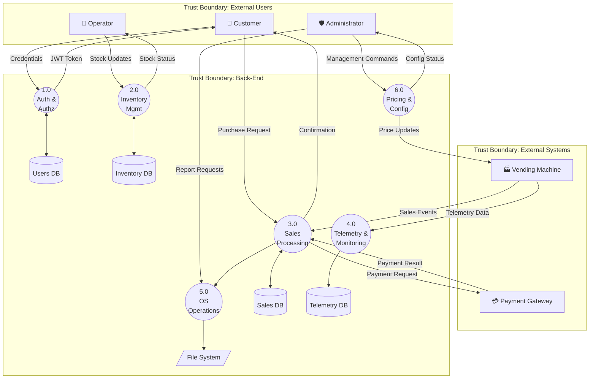

# 3. Data Flow Diagrams

 **DFD Generation:** The Level 0 DFD is generated programmatically using [pytm](https://github.com/OWASP/pytm) (OWASP Pythonic Threat Modeling framework). The source script is at [`diagrams/dfd_level0.py`](diagrams/dfd_level0.py).

 To regenerate:
 ```bash
 cd Deliverables/Phase1/Report/diagrams
 python dfd_level0.py --dfd | dot -Tpng -o dfd_level0.png
 python dfd_level0.py --dfd | dot -Tsvg -o dfd_level0.svg
 ```

## 3.1 Level 0 — Context Diagram

The Level 0 DFD (Context Diagram) presents the VendNet system as a single process interacting with all external entities. It identifies the main data flows, data stores, and trust boundaries at the highest level of abstraction.

### 3.1.1 DFD Level 0 Diagram


*Figure 3.1: Level 0 Data Flow Diagram generated with pytm. Source: [`diagrams/dfd_level0.py`](diagrams/dfd_level0.py)*

### 3.1.2 DFD Notation Reference

The diagram uses standard DFD notation as defined by the OWASP Threat Modeling methodology:

| Name | Representation | Description |
|------|----------------|-------------|
 | External Entity | Square/Rectangle | Entities outside the system that interact via entry/exit points (Actors and External Systems) |
| Process | Circle | A task that handles, transforms, or routes data within the system |
 | Data Store | Open-ended rectangle (cylinder) | Persistent storage: database, file system |
| Data Flow | Labeled arrow | Movement of data between elements; direction shown by arrowhead |
| Trust Boundary | Dashed red rectangle | Where the level of trust changes for data crossing the boundary |

### 3.1.3 External Entities

| ID | Entity | Type | Description |
|----|--------|------|-------------|
| E1 | **Customer** | Actor | End-user who purchases products via vending machines or the companion mobile/web app. Can view product catalog and own purchase history. |
| E2 | **Operator** | Actor | Field technician / maintenance staff responsible for restocking machines, accessing machine telemetry and logs, and reporting machine issues. |
| E3 | **Administrator** | Actor | System-wide manager with full access: manages user accounts, sets product pricing, configures system settings, generates reports, triggers backups, and manages security configuration. |
| E4 | **Vending Machine** | External System | Physical vending machine at a remote location. Sends telemetry data (temperature, status), sales events, and stock levels to the back-end. Receives configuration and price updates. |
| E5 | **Payment Gateway** | External System | External third-party payment processor (e.g., Stripe). Handles card/mobile payment authorization and settlement. |

### 3.1.4 Processes

| ID | Process | Description |
|----|---------|-------------|
| 0.0 | **VendNet Back-End** | Central process: REST API (Java / Spring Boot) that handles authentication, authorization, inventory management, sales processing, telemetry ingestion, pricing/configuration, and OS-level operations (encrypted backups, audit log rotation, report directory generation). |

### 3.1.5 Data Stores

| ID | Data Store | Type | Description |
|----|-----------|------|-------------|
| DS1 | **MySQL Database** | Relational DB | MySQL 8.4 LTS storing users, products, vending machines, slots, sales, telemetry, and audit records. Encrypted at rest (TDE) and in transit (TLS). |
| DS2 | **Server File System** | OS File Storage | OS-level file storage under `/var/vendnet/` for encrypted database backups, rotated audit logs, and generated report directory structures. Access sandboxed with strict path validation. |

### 3.1.6 Data Flows

| # | From | To | Data | Protocol | Encrypted |
|---|------|----|------|----------|-----------|
| 1 | Customer | VendNet Back-End | Credentials, Purchase Requests, Catalog Queries | HTTPS | Yes |
| 2 | VendNet Back-End | Customer | JWT Token, Catalog Data, Purchase Confirmation | HTTPS | Yes |
| 3 | Operator | VendNet Back-End | Stock Updates, Machine Log Requests, Issue Reports | HTTPS | Yes |
| 4 | VendNet Back-End | Operator | Stock Status, Machine Logs, Issue Acknowledgements | HTTPS | Yes |
| 5 | Administrator | VendNet Back-End | Management Commands, Config Changes, Report Requests | HTTPS | Yes |
| 6 | VendNet Back-End | Administrator | Reports, System Status, User Lists, Audit Logs | HTTPS | Yes |
| 7 | Vending Machine | VendNet Back-End | Telemetry Data, Sales Events, Stock Levels | HTTPS (mTLS) | Yes |
| 8 | VendNet Back-End | Vending Machine | Configuration Updates, Price Changes | HTTPS (mTLS) | Yes |
| 9 | VendNet Back-End | Payment Gateway | Payment Authorization Requests | HTTPS | Yes |
| 10 | Payment Gateway | VendNet Back-End | Payment Confirmation / Rejection | HTTPS | Yes |
| 11 | VendNet Back-End | MySQL Database | SQL Queries (CRUD Operations) | MySQL/TLS | Yes |
| 12 | MySQL Database | VendNet Back-End | Query Results (Data Records) | MySQL/TLS | Yes |
| 13 | VendNet Back-End | Server File System | Backup Files, Audit Logs, Report Directories | Local I/O | N/A (local) |
| 14 | Server File System | VendNet Back-End | Backup Status, Log Contents, Report Files | Local I/O | N/A (local) |

### 3.1.7 Trust Boundaries

| ID | Trust Boundary | Description |
|----|----------------|-------------|
| TB1 | **Internet / Public Network** | Boundary between public internet users (Customers, Operators, Administrators accessing via HTTPS) and the VendNet back-end. All traffic crossing this boundary must be encrypted with TLS 1.2+ and authenticated via JWT. This is the primary attack surface for external threats. |
| TB2 | **External Systems Network** | Boundary between external systems (physical Vending Machines and the Payment Gateway) and the VendNet back-end. Vending machines authenticate via mutual TLS (mTLS) with client certificates. The Payment Gateway uses HTTPS with API key authentication. |
| TB3 | **VendNet Back-End (Internal)** | Internal trust zone encompassing the VendNet API server, the relational database, and the server file system. Access restricted to the application service account. Network-level isolation via firewall rules ensures no direct external access to the database or file system. |
| TB4 | **Database Zone** | Sub-boundary within TB3 isolating the MySQL database server. Only the application's database connection pool can access the database through a dedicated private network interface. Credentials stored in environment variables, never in source code. |
| TB5 | **File System Zone** | Sub-boundary within TB3 for OS-level file operations. All file-system access is sandboxed to `/var/vendnet/` with strict path validation (whitelist patterns) to prevent path-traversal attacks. Directory permissions restrict access to the application service account only. |

### 3.1.8 Entry Points

Entry points define the interfaces through which potential attackers can interact with the application.

| ID | Name | Description | Trust Level(s) |
|----|------|-------------|----------------|
| EP1 | HTTPS API Endpoint (port 443) | Primary REST API entry point for all user interactions. All endpoints require TLS. | Anonymous User, Authenticated Customer, Operator, Administrator |
| EP2 | Machine Telemetry Endpoint | Dedicated API endpoint for vending machine telemetry and event ingestion. Requires mTLS client certificate. | Authenticated Vending Machine |
| EP3 | Payment Callback Endpoint | Webhook endpoint for receiving payment confirmation/rejection from the Payment Gateway. Validated via HMAC signature. | Payment Gateway (verified) |

### 3.1.9 Exit Points

Exit points are where data leaves the system and may enable client-side attacks (e.g., information disclosure).

| ID | Name | Description | Security Concern |
|----|------|-------------|------------------|
| XP1 | API JSON Responses | All API responses to users/machines | Must not leak internal details (stack traces, SQL errors). Generic error messages enforced. |
| XP2 | Payment Requests | Outbound requests to Payment Gateway | Must not include raw card data; only tokenized references. |
| XP3 | Machine Config Push | Configuration data sent to vending machines | Must not include sensitive admin credentials or internal network details. |
| XP4 | Report File Downloads | Report files served via API to Administrators | Access control enforced; files contain sensitive business data (sales, user info). |

---

## 3.2 Level 1 — Decomposed DFD

<!-- TODO: Finalize — this is a structural placeholder. -->



### Level 1 Process Descriptions

| Process | Name | Description |
|---------|------|-------------|
| 1.0 | Authentication & Authorization | <!-- TODO --> |
| 2.0 | Inventory Management | <!-- TODO --> |
| 3.0 | Sales Processing | <!-- TODO --> |
| 4.0 | Telemetry & Monitoring | <!-- TODO --> |
| 5.0 | OS Operations | <!-- TODO --> |
| 6.0 | Pricing & Configuration | <!-- TODO --> |

---

## 3.3 Level 2 — Detailed Sub-Process DFDs

### 3.3.1 Process 3.0: Sales Processing — Level 2 Decomposition

<!-- TODO: Decompose into sub-processes such as:
  3.1 Validate Purchase Request
  3.2 Process Payment
  3.3 Update Stock
  3.4 Record Sale
-->

### 3.3.2 Process 5.0: OS Operations — Level 2 Decomposition

<!-- TODO: Decompose into sub-processes such as:
  5.1 Generate Encrypted Backup
  5.2 Rotate Audit Logs
  5.3 Generate Vendor Report Directory Structure
-->

### 3.3.3 Justification for Decomposition Decisions

| Process | Decomposed? | Justification |
|---------|-------------|---------------|
| 1.0 Auth | <!-- TODO --> | <!-- TODO --> |
| 2.0 Inventory | <!-- TODO --> | <!-- TODO --> |
| 3.0 Sales | Yes | <!-- TODO: e.g., involves multiple sub-steps: validation, payment, stock update, recording --> |
| 4.0 Telemetry | <!-- TODO --> | <!-- TODO --> |
| 5.0 OS Ops | Yes | <!-- TODO: e.g., file-system operations each have distinct security concerns --> |
| 6.0 Pricing | <!-- TODO --> | <!-- TODO --> |
