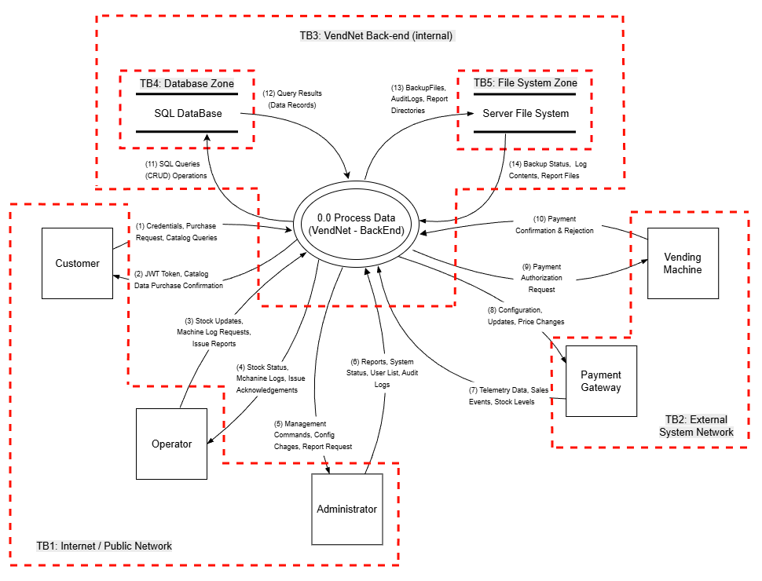
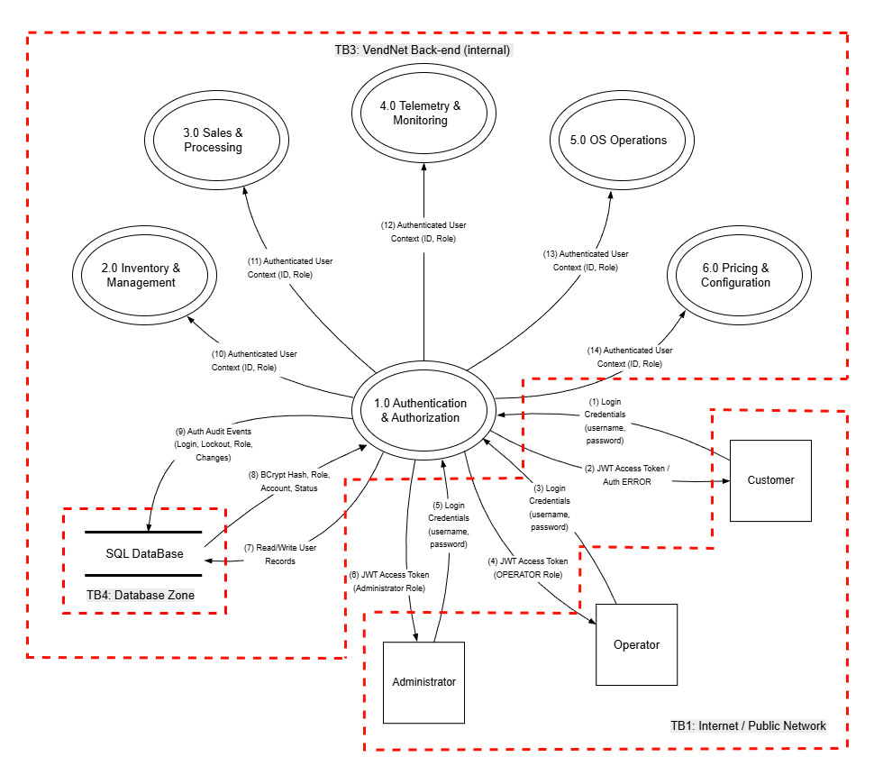
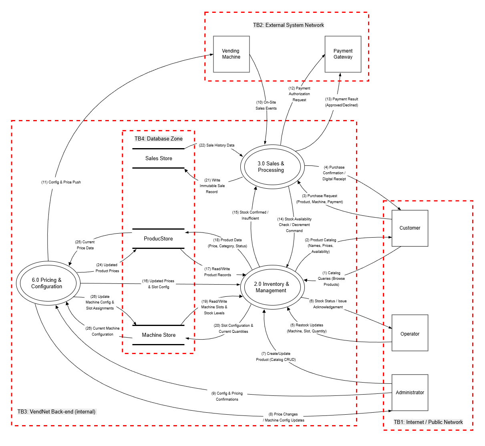
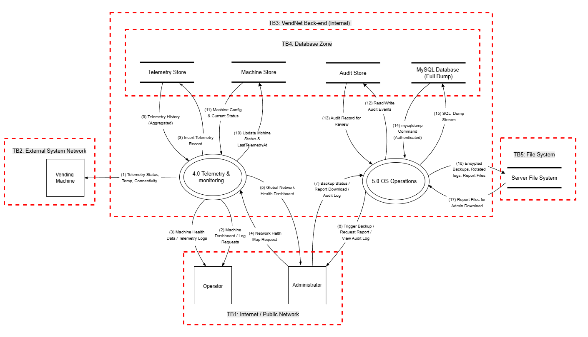
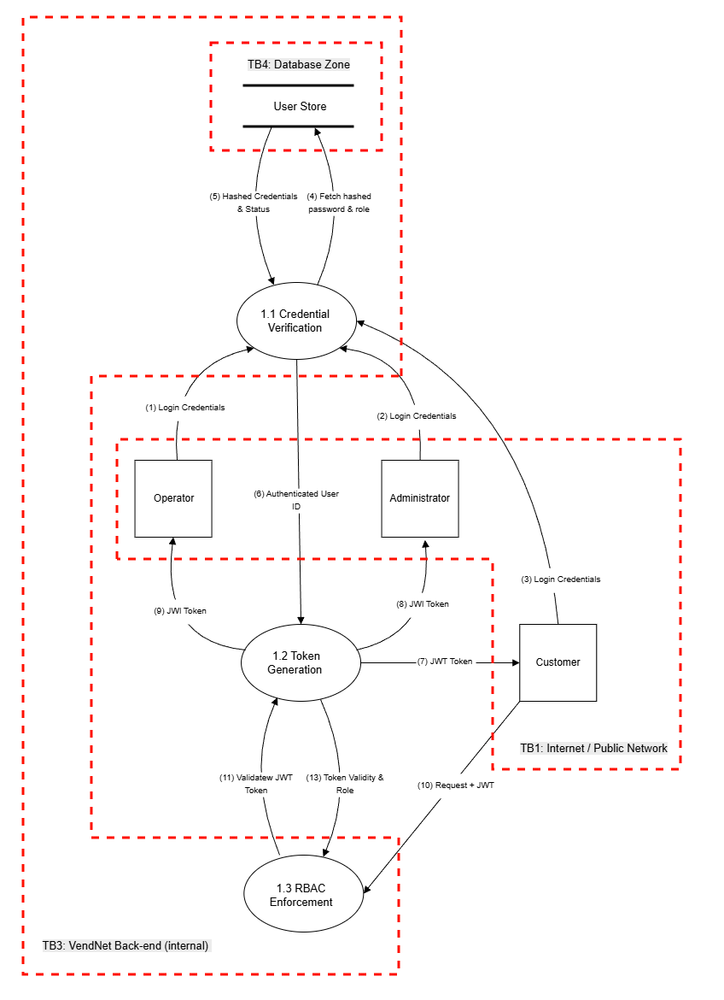
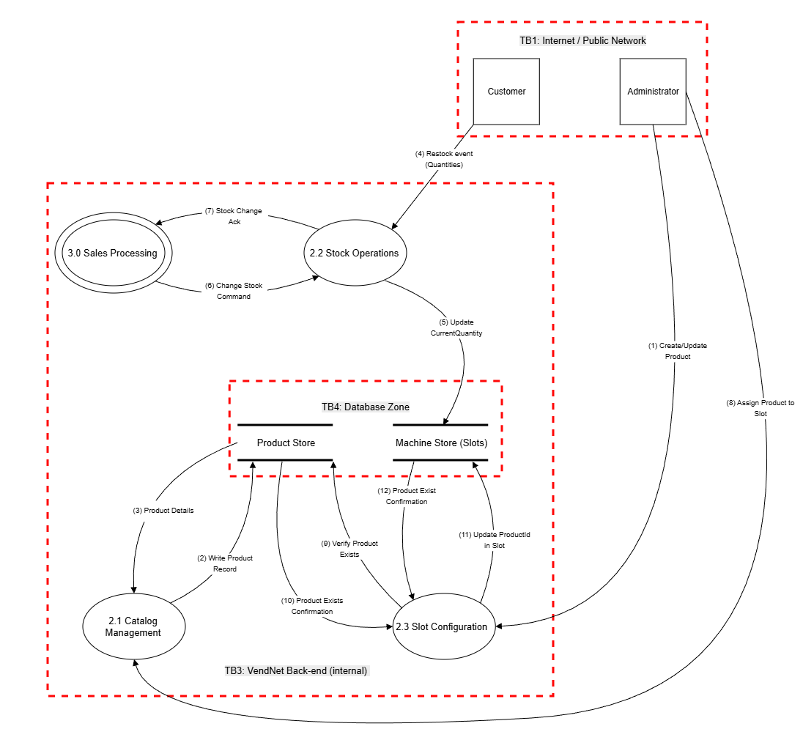
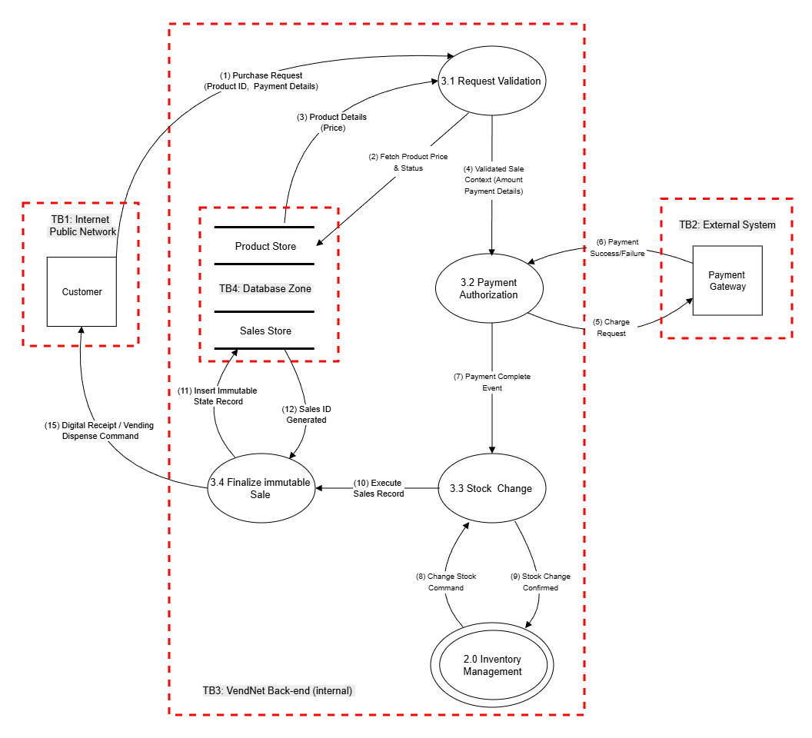
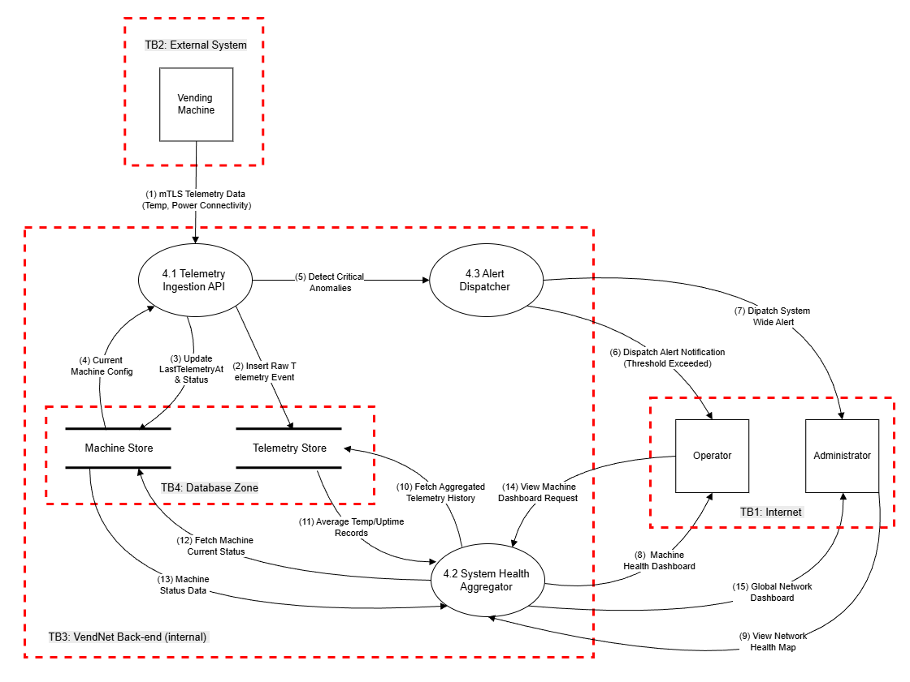
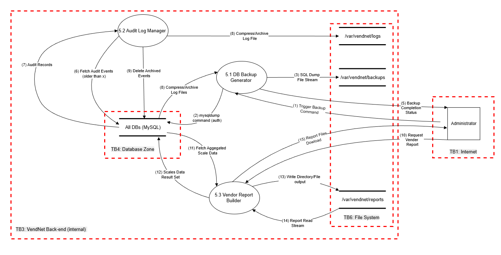
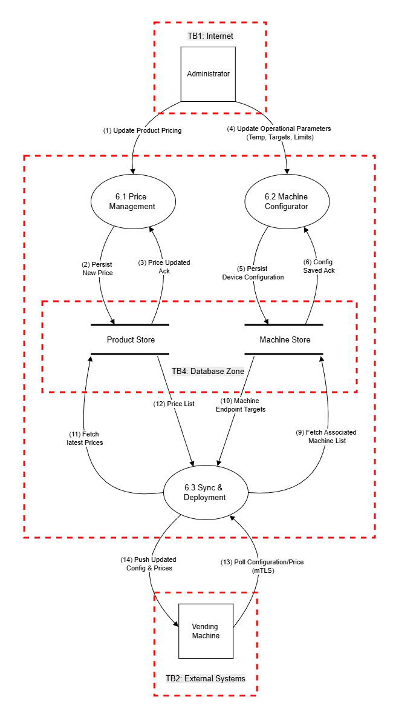

# 3. Data Flow Diagrams

## 3.1 Level 0 — Context Diagram

The Level 0 Data Flow Diagram (DFD), or Context Diagram, establishes the foundational scope of the VendNet system. It represents the entire back-end as a single central process, highlighting the high-level interactions between the system and its various external entities, data stores, and defined trust boundaries.

### 3.1.1 DFD Level 0 Visual Representation

*Figure 1: Level 0 Data Flow Diagram showcasing the VendNet ecosystem and its primary data exchanges.*

### 3.1.2 System Entities and Actors

The VendNet environment interacts with five distinct external entities, categorized by their role within the ecosystem:

*   **Customer (E1):** End-users interacting via the applications to browse catalogs, authenticate, and perform purchases.
*   **Operator (E2):** Field personnel responsible for physical maintenance. They provide stock updates, request machine logs, and submit issue reports.
*   **Administrator (E3):** Privileged users managing the system's core configuration, including user management, pricing, and system-wide audit reporting.
*   **Vending Machine (E4):** Physical hardware at remote locations. These systems act as external clients that provide telemetry and sales data while receiving configuration updates.
*   **Payment Gateway (E5):** A third-party processor that handles the secure authorization and settlement of financial transactions.

### 3.1.3 Internal Processing and Data Persistence

At the heart of the system is the **VendNet Back-End (Process 0.0)**. This central REST API, built on Java and Spring Boot, serves as the orchestrator for all business logic, including authentication, telemetry ingestion, and reporting. To maintain state and ensure operational integrity, the process interacts with two primary data stores:

*   **MySQL Database (DS1):** A relational storage unit containing sensitive data such as user credentials, transaction histories, and audit logs, protected by Transparent Data Encryption (TDE).
*   **Server File System (DS2):** OS-level storage used for managing encrypted backups and the structured generation of system reports.

### 3.1.4 Data Flow Summary

Data movement within VendNet is categorized by the communication protocol and the nature of the information exchanged:

*   **User & Management Traffic (Flows 1-6):** Customers, Operators, and Administrators interact with the back-end via HTTPS. This includes credential submission, JWT-based authentication, catalog queries, and the retrieval of management reports.
*   **External Integration (Flows 7-10):** Vending Machines utilize mutual TLS (mTLS) for secure telemetry reporting and receiving price updates. Financial interactions with the Payment Gateway are conducted via secure HTTPS webhooks and requests.
*   **System Persistence (Flows 11-14):** Internal communication between the back-end and the data stores occurs via TLS-encrypted SQL queries for the database and direct Local I/O for file system operations, such as log rotation and backup management.

### 3.1.5 Security Architecture and Trust Boundaries

The system is segmented into logical trust boundaries to isolate risks and enforce security controls:

*   **TB1 (Internet / Public Network):** The primary attack surface where external users interact with the system. All traffic here must be encrypted and authenticated.
*   **TB2 (External Systems Network):** A specialized boundary for hardware and third-party integrations, utilizing certificate-based authentication (mTLS) for machines and HMAC signatures for payment callbacks.
*   **TB3 (Internal Back-End):** The trusted zone for the application logic. Direct external access is prohibited, and the zone is restricted to the application service account.
*   **TB4 & TB5 (Database & File System Zones):** Sub-isolated zones that protect the data stores. Access is strictly limited to the application's private network interface and explicitly validated file paths to prevent unauthorized lateral movement or path-traversal attacks.

### 3.1.6 Entry Points

Entry points define the interfaces through which potential attackers can interact with the application.

*   **EP1 (HTTPS API Endpoint, Port 443):** Primary REST API entry point for all user interactions. All endpoints require TLS. Accessed by Anonymous Users, Customers, Operators, and Administrators.
*   **EP2 (Machine Telemetry Endpoint):** Dedicated API endpoint for vending machine telemetry and event ingestion. Requires mTLS client certificate validation from physical hardware.
*   **EP3 (Payment Callback Endpoint):** Webhook endpoint for receiving payment confirmation/rejection from the Payment Gateway. Validated via cryptographic HMAC signature.

### 3.1.7 Exit Points

Exit points are where data leaves the system and may enable client-side attacks (e.g., information disclosure).

*   **XP1 (API JSON Responses):** Responses to users/machines. Security concern: Must not leak internal details (stack traces, SQL errors). Generic error handling is enforced.
*   **XP2 (Payment Requests):** Outbound requests to the Payment Gateway. Security concern: Must not include raw card data; only tokenized references are permitted.
*   **XP3 (Machine Config Push):** Configuration data sent to vending machines. Security concern: Must not include sensitive administrator credentials or internal network topologies.
*   **XP4 (Report File Downloads):** Files served via API to Administrators. Security concern: Access control must be strictly enforced, as files contain aggregated business data and PII.

---

## 3.2 Level 1 — Decomposed DFD

The Level 1 DFD decomposes the single **0.0 VendNet Back-End** process from the Level 0 diagram into six sub-processes. Each sub-process represents a major functional area of the system, with its own data flows to/from data stores and external entities. Trust boundaries from Level 0 are carried forward and refined.

### 3.2.1 DFD Level 1 Visual Representation

The complex internal routing of the VendNet back-end is visually segmented into three focused operational views to ensure clarity.

#### 3.2.1.1 Focused View — Authentication & Authorization
Detailed view of **1.0 Authentication & Authorization** showing credential flows from all actors, JWT token issuance, data store access, and auth context propagation to all downstream processes.

*Figure 2: Level 1 DFD — Authentication & Authorization Focused View.*

#### 3.2.1.2 Focused View — Core Business (Sales, Inventory, Pricing)
Detailed view of **2.0 Inventory Management**, **3.0 Sales Processing**, and **6.0 Pricing & Configuration** showing the complete purchase flow, operator restocking, admin catalog/pricing management, inter-process stock coordination, and granular data store access within the SQL Database.

*Figure 3: Level 1 DFD — Core Business Focused View.*

#### 3.2.1.3 Focused View — Operations (Telemetry & OS Operations)
Detailed view of **4.0 Telemetry & Monitoring** and **5.0 OS Operations** showing vending machine telemetry ingestion, operator/admin monitoring, database backups, audit log rotation, report generation, and the file system trust boundaries.

*Figure 4: Level 1 DFD — Operations Focused View.*

### 3.2.2 System Sub-Processes

The monolithic backend is separated into the following key sub-processes:

*   **1.0 Authentication & Authorization:** Handles user login (verifying BCrypt-hashed passwords), JWT issuance, and RBAC enforcement. Every internal request is first validated here.
*   **2.0 Inventory Management:** Manages the product catalog, vending machine slot assignments, and stock levels. Provides real-time stock availability data to the Sales process for purchase validation.
*   **3.0 Sales Processing:** Orchestrates the sales lifecycle: validates purchase requests, coordinates external payment authorization, requests stock decrements, and persists the immutable sale record.
*   **4.0 Telemetry & Monitoring:** Ingests mTLS-authenticated telemetry data from vending machines (temperature, connectivity). Updates physical machine statuses and persists logs for administrative dashboards.
*   **5.0 OS Operations:** Executes server-level operations: generates AES-256 encrypted database backups via `ProcessBuilder`, rotates audit logs, and creates structured reports, strictly sandboxed to prevent path traversal.
*   **6.0 Pricing & Configuration:** Manages product pricing updates and operational configurations. Pushes updated configuration states to physical vending machines via mTLS.

### 3.2.3 Security Architecture and Trust Boundaries

*   **TB1 (Internet / Public Network):** Contains Customer, Operator, Administrator. Protected by TLS 1.2+ for all traffic, JWT-based authentication, and API rate limiting.
*   **TB2 (External Systems Network):** Contains Vending Machine, Payment Gateway. Protected by mTLS with client certificates for vending machines, and HTTPS + API key + HMAC signature verification for Payment Gateway webhooks.
*   **TB3 (VendNet Back-End Internal):** Encompasses Processes 1.0–6.0. Enforces network-level isolation via firewall rules and ensures all inter-process communication happens within the same JVM.
*   **TB4 (Database Zone):** Contains the isolated data stores. Protected via MySQL/TLS encrypted connections and column-level encryption for sensitive fields.
*   **TB5/ (File System Zone):** Contains the Server File System. Sandboxed strictly to `/var/vendnet/` with whitelist pattern validation to block path-traversal attacks.

### 3.2.4 Key Security Observations

*   **Authentication Gateway Pattern:** All external requests pass through **1.0 Authentication & Authorization** before reaching any other sub-process, creating a centralized enforcement point.
*   **Payment Isolation:** The **3.0 Sales Processing** module is the sole component that communicates with external systems regarding financial clearing. No raw card data is stored.
*   **File System Sandboxing:** The **5.0 OS Operations** module is the sole bridge to the host operating system, constrained tightly by file path whitelisting to protect backend host resources.

---

## 3.3 Level 2 — Decomposed DFDs

The Level 2 Data Flow Diagrams provide a granular view of the internal mechanics within each of the six primary sub-processes. This decomposition exposes specific security-critical operations, pinpointing exact data interactions, internal state changes, localized threat vectors, and data sensitivity classifications.

### 3.3.1 Process 1.0: Authentication & Authorization

*Figure 5: Level 2 DFD — Authentication & Authorization.*

*   **Sub-Processes & Logic:** **1.1 Credential Verification** acts as the initial checkpoint, validating raw credentials against BCrypt hashes. Upon success, **1.2 Token Generation** constructs a cryptographically signed JWT. Finally, **1.3 RBAC Enforcement** intercepts all subsequent requests, verifying tokens and asserting privileges before routing traffic internally.
*   **Data Persistence, Flow & Sensitivity:** Operates strictly with the **User Store** (TB4). 
    *   *Data Classification: **High Sensitivity (Credentials & Tokens)***. Passwords must never be stored in plain text or logged. Issued JWTs act as bearer tokens and represent high-value targets for session hijacking.
*   **Security Observations:** Enforces the "Authentication Gateway" pattern. By isolating BCrypt verification (1.1) and JWT signing (1.2), the system restricts access to cryptographic secrets, directly mitigating spoofing and privilege escalation vectors.

### 3.3.2 Process 2.0: Inventory Management

*Figure 6: Level 2 DFD — Inventory Management.*

*   **Sub-Processes & Logic:** **2.1 Catalog Management** handles administrative CRUD operations. **2.2 Stock Operations** processes physical restocks and transactional deductions. **2.3 Slot Configuration** ties physical slots to specific products for geographical availability.
*   **Data Persistence, Flow & Sensitivity:** Interacts with the **Product Store** and the **Machine Store** (TB4). 
    *   *Data Classification: **Moderate Sensitivity (Operational Business Data)***. While public catalog data is non-sensitive, machine slot mappings and backend stock volumes represent proprietary business operations requiring protection from unauthorized tampering.
*   **Security Observations:** Separating catalog creation (Admin only) from physical restocking (Operator access) enforces the principle of least privilege. Strict input validation prevents tampering attacks resulting in negative stock values.

### 3.3.3 Process 3.0: Sales Processing

*Figure 7: Level 2 DFD — Sales Processing.*

*   **Sub-Processes & Logic:** **3.1 Request Validation** verifies product existence and pricing. Control passes to **3.2 Payment Authorization**, which issues a tokenized charge request to the Gateway. Once confirmed, **3.3 Stock Change** interfaces with Inventory Management to physically lock and decrement availability. Finally, **3.4 Finalize Immutable Sale** generates the unique Sales ID, commits the record, and issues the digital receipt.
*   **Data Persistence, Flow & Sensitivity:** Reads from the **Product Store**, writes to the isolated **Sales Store** (TB4), and initiates outbound HTTPS requests to the Payment Gateway (TB2).
    *   *Data Classification: **High Sensitivity (Financial & Transactional)***. Employs tokenized payment data. Raw PCI data is strictly prohibited. The Sales Store maintains an immutable financial ledger critical for non-repudiation.
*   **Security Observations:** Isolating external payment communication strictly within 3.2 ensures financial transaction data doesn't leak into core logic. The sequential flow guarantees stock is decremented and sales are finalized *only after* cryptographic financial authorization.

### 3.3.4 Process 4.0: Telemetry & Monitoring

*Figure 8: Level 2 DFD — Telemetry & Monitoring.*

*   **Sub-Processes & Logic:** The **4.1 Telemetry Ingestion API** serves as the mTLS gateway for hardware sensory data. The **4.3 Alert Dispatcher** actively monitors this stream for critical anomalies to dispatch real-time alerts. The **4.2 System Health Aggregator** periodically averages historical data to populate administrative dashboards.
*   **Data Persistence, Flow & Sensitivity:** Write streams flow from Vending Machines (TB2) into the **Telemetry Store** and **Machine Store**. Read streams flow to user dashboards (TB1).
    *   *Data Classification: **Moderate Sensitivity (Infrastructure Telemetry)***. Exposes internal hardware states and network health mapping. If intercepted, it could aid attackers in targeting unmonitored hardware maintenance windows.
*   **Security Observations:** Reliance on mTLS at the ingestion edge prevents hardware spoofing. Segregating write-heavy ingestion (4.1) from read-heavy aggregation (4.2) ensures a volumetric telemetry flood (DoS) cannot crash administrative interfaces.

### 3.3.5 Process 5.0: OS Operations

*Figure 9: Level 2 DFD — OS Operations.*

*   **Sub-Processes & Logic:** **5.1 DB Backup Generator** executes authenticated `mysqldump` processes, streaming and encrypting the output. **5.2 Audit Log Manager** sweeps the database for aged events, compressing them into archives. **5.3 Vendor Report Builder** aggregates historical sales into formatted files.
*   **Data Persistence, Flow & Sensitivity:** Bridges the MySQL Database (TB4) and the localized OS boundary, explicitly defined here as **TB5: File System**. Writes encrypted backups, compressed logs, and generated reports to disk.
    *   *Data Classification: **Critical Sensitivity (System Secrets, PII, Full DB)***. This process handles complete, unredacted data dumps. A breach here exposes the entire organization, mandating AES-256 encryption at rest.
*   **Security Observations:** Contains the highest risk for command injection and path-traversal. Mitigated by using explicit argument lists in `ProcessBuilder` (disabling shell expansion) with environment variables. All file I/O interactions across TB5 validate against strict regex whitelists (`^[a-zA-Z0-9_-]+$`).

### 3.3.6 Process 6.0: Pricing & Configuration

*Figure 10: Level 2 DFD — Pricing & Configuration.*

*   **Sub-Processes & Logic:** **6.1 Price Management** and **6.2 Machine Configurator** persist administrative updates to the core database. They emit internal events to **6.3 Sync & Deployment**, which identifies target machines and securely pushes payloads to physical hardware.
*   **Data Persistence, Flow & Sensitivity:** Updates from TB1 are persisted to the **Product Store** and **Machine Store**. Process 6.3 establishes outbound mTLS to distribute data to Vending Machines (TB2).
    *   *Data Classification: **Moderate Sensitivity (Hardware Configuration)***. Includes proprietary pricing models and device thermal targets. Malicious alteration could cause physical hardware damage or severe financial discrepancies.
*   **Security Observations:** The "persist-then-sync" pattern ensures the central database remains the absolute source of truth. Deploying via mTLS guarantees sensitive operational parameters cannot be intercepted or tampered with in transit.

### 3.3.7 Decomposition Justification

The architectural complexity and varying threat models across the system necessitate the decomposition of all six Level 1 processes into Level 2 DFDs:

*   **1.0 Auth:** Decomposed to map distinct credential hashing, JWT cryptography, and RBAC enforcement (mitigating Spoofing/Privilege Elevation).
*   **2.0 Inventory:** Decomposed to separate administrative catalog creation from operational physical restocking.
*   **3.0 Sales:** Decomposed to visually isolate high-risk financial integrations from routine database validations.
*   **4.0 Telemetry:** Decomposed to distinguish the high-volume ingestion edge (prone to DoS) from internal alert dispatching.
*   **5.0 OS Ops:** Decomposed to detail precise interactions with the localized File System boundary to analyze Path Traversal and Encryption-at-Rest.
*   **6.0 Pricing:** Decomposed to map the internal event-driven architecture bridging administrative UIs with mTLS edge-device synchronization.

### 3.3.8 Level 2 Summary of Trust Boundaries

Throughout the decomposed Level 2 diagrams, the system's trust boundaries remain consistent but are applied to specific sub-components. 

| Trust Boundary | P1.0 Auth | P2.0 Inventory | P3.0 Sales | P4.0 Telemetry | P5.0 OS Ops | P6.0 Pricing |
|----------------|:---------:|:--------------:|:----------:|:--------------:|:-----------:|:------------:|
| **TB1: Public Network** | ✓ | ✓ | ✓ | ✓ | ✓ | ✓ |
| **TB2: External Systems** | — | — | ✓ | ✓ | — | ✓ |
| **TB3: Internal Back-End** | ✓ | ✓ | ✓ | ✓ | ✓ | ✓ |
| **TB4: Database Zone** | ✓ | ✓ | ✓ | ✓ | ✓ | ✓ |
| **TB5: File System Zone** | — | — | — | — | ✓ | — |