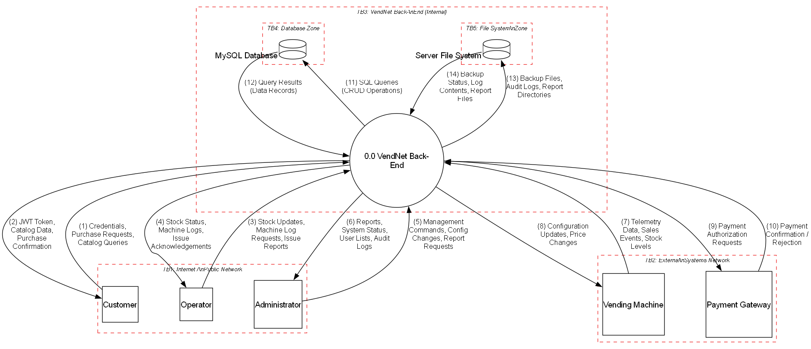
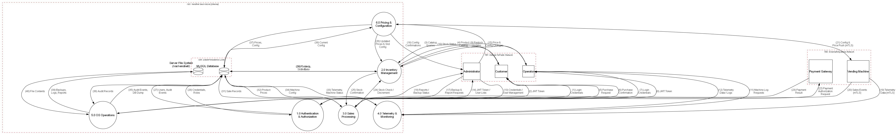
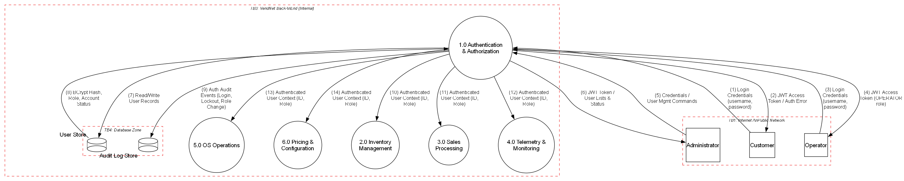
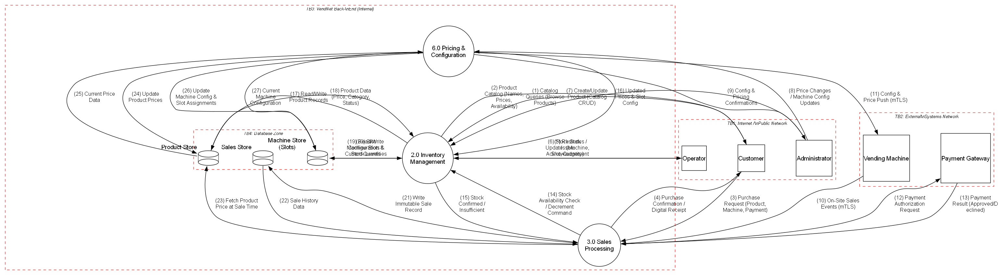
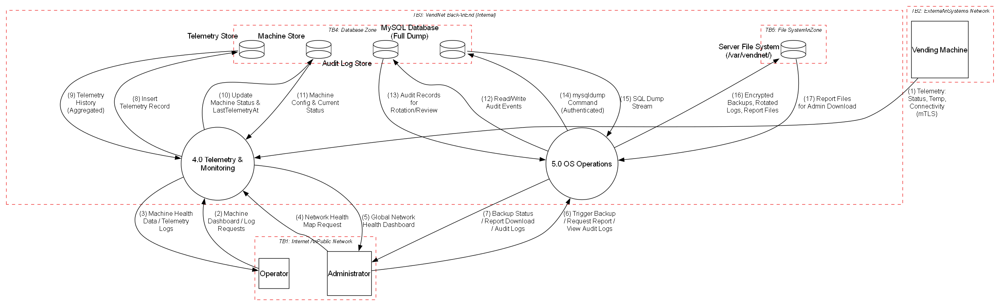

# 3. Data Flow Diagrams

 **DFD Generation:** All DFDs are generated programmatically using [pytm](https://github.com/OWASP/pytm) (OWASP Pythonic Threat Modeling framework) and rendered to PNG via [Graphviz](https://graphviz.org/).

 To regenerate all diagrams:
 ```bash
 cd Deliverables/Phase1/Report/diagrams
 # Level 0
 python dfd_level0.py --dfd | dot -Tpng -o dfd_level0.png
 # Level 1 (Master + 3 Focused Views)
 python dfd_level1.py --dfd | dot -Tpng -o dfd_level1.png
 python DFD/Level_1/pytm/dfd_level1_view_auth.py --dfd | dot -Tpng -o DFD/Level_1/pytm/dfd_level1_view_auth.png
 python DFD/Level_1/pytm/dfd_level1_view_core.py --dfd | dot -Tpng -o DFD/Level_1/pytm/dfd_level1_view_core.png
 python DFD/Level_1/pytm/dfd_level1_view_ops.py --dfd | dot -Tpng -o DFD/Level_1/pytm/dfd_level1_view_ops.png
 # Level 2 (one per decomposed process)
 python dfd_level2_p1_auth.py --dfd | dot -Tpng -o dfd_level2_p1_auth.png
 python dfd_level2_p2_inventory.py --dfd | dot -Tpng -o dfd_level2_p2_inventory.png
 python dfd_level2_p3_sales.py --dfd | dot -Tpng -o dfd_level2_p3_sales.png
 python dfd_level2_p4_telemetry.py --dfd | dot -Tpng -o dfd_level2_p4_telemetry.png
 python dfd_level2_p5_os_ops.py --dfd | dot -Tpng -o dfd_level2_p5_os_ops.png
 python dfd_level2_p6_pricing.py --dfd | dot -Tpng -o dfd_level2_p6_pricing.png
 ```

## 3.1 Level 0 — Context Diagram

The Level 0 DFD (Context Diagram) presents the VendNet system as a single process interacting with all external entities. It identifies the main data flows, data stores, and trust boundaries at the highest level of abstraction.

### 3.1.1 DFD Level 0 Diagram



*Figure 3.1: Level 0 Data Flow Diagram generated with pytm. Source: [`diagrams/dfd_level0.py`](diagrams/dfd_level0.py)*

### 3.1.2 DFD Notation Reference

The diagram uses standard DFD notation as defined by the OWASP Threat Modeling methodology:

| Name | Representation | Description |
|------|----------------|-------------|
 | External Entity | Square/Rectangle | Entities outside the system that interact via entry/exit points (Actors and External Systems) |
| Process | Circle | A task that handles, transforms, or routes data within the system |
 | Data Store | Open-ended rectangle (cylinder) | Persistent storage: database, file system |
| Data Flow | Labeled arrow | Movement of data between elements; direction shown by arrowhead |
| Trust Boundary | Dashed red rectangle | Where the level of trust changes for data crossing the boundary |

### 3.1.3 External Entities

| ID | Entity | Type | Description |
|----|--------|------|-------------|
| E1 | **Customer** | Actor | End-user who purchases products via vending machines or the companion mobile/web app. Can view product catalog and own purchase history. |
| E2 | **Operator** | Actor | Field technician / maintenance staff responsible for restocking machines, accessing machine telemetry and logs, and reporting machine issues. |
| E3 | **Administrator** | Actor | System-wide manager with full access: manages user accounts, sets product pricing, configures system settings, generates reports, triggers backups, and manages security configuration. |
| E4 | **Vending Machine** | External System | Physical vending machine at a remote location. Sends telemetry data (temperature, status), sales events, and stock levels to the back-end. Receives configuration and price updates. |
| E5 | **Payment Gateway** | External System | External third-party payment processor (e.g., Stripe). Handles card/mobile payment authorization and settlement. |

### 3.1.4 Processes

| ID | Process | Description |
|----|---------|-------------|
| 0.0 | **VendNet Back-End** | Central process: REST API (Java / Spring Boot) that handles authentication, authorization, inventory management, sales processing, telemetry ingestion, pricing/configuration, and OS-level operations (encrypted backups, audit log rotation, report directory generation). |

### 3.1.5 Data Stores

| ID | Data Store | Type | Description |
|----|-----------|------|-------------|
| DS1 | **MySQL Database** | Relational DB | MySQL 8.4 LTS storing users, products, vending machines, slots, sales, telemetry, and audit records. Encrypted at rest (TDE) and in transit (TLS). |
| DS2 | **Server File System** | OS File Storage | OS-level file storage under `/var/vendnet/` for encrypted database backups, rotated audit logs, and generated report directory structures. Access sandboxed with strict path validation. |

### 3.1.6 Data Flows

| # | From | To | Data | Protocol | Encrypted |
|---|------|----|------|----------|-----------|
| 1 | Customer | VendNet Back-End | Credentials, Purchase Requests, Catalog Queries | HTTPS | Yes |
| 2 | VendNet Back-End | Customer | JWT Token, Catalog Data, Purchase Confirmation | HTTPS | Yes |
| 3 | Operator | VendNet Back-End | Stock Updates, Machine Log Requests, Issue Reports | HTTPS | Yes |
| 4 | VendNet Back-End | Operator | Stock Status, Machine Logs, Issue Acknowledgements | HTTPS | Yes |
| 5 | Administrator | VendNet Back-End | Management Commands, Config Changes, Report Requests | HTTPS | Yes |
| 6 | VendNet Back-End | Administrator | Reports, System Status, User Lists, Audit Logs | HTTPS | Yes |
| 7 | Vending Machine | VendNet Back-End | Telemetry Data, Sales Events, Stock Levels | HTTPS (mTLS) | Yes |
| 8 | VendNet Back-End | Vending Machine | Configuration Updates, Price Changes | HTTPS (mTLS) | Yes |
| 9 | VendNet Back-End | Payment Gateway | Payment Authorization Requests | HTTPS | Yes |
| 10 | Payment Gateway | VendNet Back-End | Payment Confirmation / Rejection | HTTPS | Yes |
| 11 | VendNet Back-End | MySQL Database | SQL Queries (CRUD Operations) | MySQL/TLS | Yes |
| 12 | MySQL Database | VendNet Back-End | Query Results (Data Records) | MySQL/TLS | Yes |
| 13 | VendNet Back-End | Server File System | Backup Files, Audit Logs, Report Directories | Local I/O | N/A (local) |
| 14 | Server File System | VendNet Back-End | Backup Status, Log Contents, Report Files | Local I/O | N/A (local) |

### 3.1.7 Trust Boundaries

| ID | Trust Boundary | Description |
|----|----------------|-------------|
| TB1 | **Internet / Public Network** | Boundary between public internet users (Customers, Operators, Administrators accessing via HTTPS) and the VendNet back-end. All traffic crossing this boundary must be encrypted with TLS 1.2+ and authenticated via JWT. This is the primary attack surface for external threats. |
| TB2 | **External Systems Network** | Boundary between external systems (physical Vending Machines and the Payment Gateway) and the VendNet back-end. Vending machines authenticate via mutual TLS (mTLS) with client certificates. The Payment Gateway uses HTTPS with API key authentication. |
| TB3 | **VendNet Back-End (Internal)** | Internal trust zone encompassing the VendNet API server, the relational database, and the server file system. Access restricted to the application service account. Network-level isolation via firewall rules ensures no direct external access to the database or file system. |
| TB4 | **Database Zone** | Sub-boundary within TB3 isolating the MySQL database server. Only the application's database connection pool can access the database through a dedicated private network interface. Credentials stored in environment variables, never in source code. |
| TB5 | **File System Zone** | Sub-boundary within TB3 for OS-level file operations. All file-system access is sandboxed to `/var/vendnet/` with strict path validation (whitelist patterns) to prevent path-traversal attacks. Directory permissions restrict access to the application service account only. |

### 3.1.8 Entry Points

Entry points define the interfaces through which potential attackers can interact with the application.

| ID | Name | Description | Trust Level(s) |
|----|------|-------------|----------------|
| EP1 | HTTPS API Endpoint (port 443) | Primary REST API entry point for all user interactions. All endpoints require TLS. | Anonymous User, Authenticated Customer, Operator, Administrator |
| EP2 | Machine Telemetry Endpoint | Dedicated API endpoint for vending machine telemetry and event ingestion. Requires mTLS client certificate. | Authenticated Vending Machine |
| EP3 | Payment Callback Endpoint | Webhook endpoint for receiving payment confirmation/rejection from the Payment Gateway. Validated via HMAC signature. | Payment Gateway (verified) |

### 3.1.9 Exit Points

Exit points are where data leaves the system and may enable client-side attacks (e.g., information disclosure).

| ID | Name | Description | Security Concern |
|----|------|-------------|------------------|
| XP1 | API JSON Responses | All API responses to users/machines | Must not leak internal details (stack traces, SQL errors). Generic error messages enforced. |
| XP2 | Payment Requests | Outbound requests to Payment Gateway | Must not include raw card data; only tokenized references. |
| XP3 | Machine Config Push | Configuration data sent to vending machines | Must not include sensitive admin credentials or internal network details. |
| XP4 | Report File Downloads | Report files served via API to Administrators | Access control enforced; files contain sensitive business data (sales, user info). |

---

## 3.2 Level 1 — Decomposed DFD

The Level 1 DFD decomposes the single **0.0 VendNet Back-End** process from the Level 0 diagram into six sub-processes. Each sub-process represents a major functional area of the system, with its own data flows to/from data stores and external entities. Trust boundaries from Level 0 are carried forward and refined.

> **DFD Generation:** The Level 1 DFD is split into a **master overview** and **three focused views** for readability. All are generated with [pytm](https://github.com/OWASP/pytm).
>
> To regenerate:
> ```bash
> cd Deliverables/Phase1/Report/diagrams
> python dfd_level1.py --dfd | dot -Tpng -o dfd_level1.png
> python DFD/Level_1/pytm/dfd_level1_view_auth.py --dfd | dot -Tpng -o DFD/Level_1/pytm/dfd_level1_view_auth.png
> python DFD/Level_1/pytm/dfd_level1_view_core.py --dfd | dot -Tpng -o DFD/Level_1/pytm/dfd_level1_view_core.png
> python DFD/Level_1/pytm/dfd_level1_view_ops.py --dfd | dot -Tpng -o DFD/Level_1/pytm/dfd_level1_view_ops.png
> ```

### 3.2.1 DFD Level 1 — Master Overview

The master diagram shows all six sub-processes, five external entities, consolidated data stores (MySQL Database, Server File System), and trust boundaries. Data flows are limited to primary external ↔ process interactions, key inter-process flows, and consolidated data store access.



*Figure 3.2: Level 1 DFD — Master Overview. Source: [`diagrams/dfd_level1.py`](diagrams/dfd_level1.py)*

### 3.2.1a Focused View — Authentication & Authorization

Detailed view of **1.0 Authentication & Authorization** showing credential flows from all actors, JWT token issuance, data store access (User Store, Audit Log Store), and auth context propagation to all downstream processes.



*Figure 3.2a: Level 1 DFD — Authentication & Authorization Focused View. Source: [`diagrams/DFD/Level_1/pytm/dfd_level1_view_auth.py`](diagrams/DFD/Level_1/pytm/dfd_level1_view_auth.py)*

### 3.2.1b Focused View — Core Business (Sales, Inventory, Pricing)

Detailed view of **2.0 Inventory Management**, **3.0 Sales Processing**, and **6.0 Pricing & Configuration** showing the complete purchase flow, operator restocking, admin catalog/pricing management, inter-process stock coordination, and granular data store access (Product Store, Machine Store, Sales Store).



*Figure 3.2b: Level 1 DFD — Core Business Focused View. Source: [`diagrams/DFD/Level_1/pytm/dfd_level1_view_core.py`](diagrams/DFD/Level_1/pytm/dfd_level1_view_core.py)*

### 3.2.1c Focused View — Operations (Telemetry & OS Operations)

Detailed view of **4.0 Telemetry & Monitoring** and **5.0 OS Operations** showing vending machine telemetry ingestion, operator/admin monitoring, database backups, audit log rotation, report generation, and the file system trust boundary (TB5).



*Figure 3.2c: Level 1 DFD — Operations Focused View. Source: [`diagrams/DFD/Level_1/pytm/dfd_level1_view_ops.py`](diagrams/DFD/Level_1/pytm/dfd_level1_view_ops.py)*

### 3.2.2 Sub-Processes

| ID | Process | Description |
|----|---------|-------------|
| 1.0 | **Authentication & Authorization** | Handles user login (credential verification against BCrypt-hashed passwords), JWT token issuance and validation, Role-Based Access Control (RBAC) enforcement for all incoming requests, user account management (create, update, suspend), and session lifecycle. Every request to other sub-processes is first validated here for proper authentication and authorization. |
| 2.0 | **Inventory Management** | Manages the product catalog (CRUD operations), vending machine slot assignments, and stock levels. Operators update stock quantities after physical restocking. Provides real-time stock availability data to the Sales process for purchase validation. Receives pricing updates from Pricing & Configuration. |
| 3.0 | **Sales Processing** | Orchestrates the complete sales transaction lifecycle: validates purchase requests (product availability, machine status), coordinates payment authorization with the external Payment Gateway, requests stock decrement from Inventory Management, and persists the immutable Sale record. Handles both customer-initiated (app) and machine-initiated (on-site) sales. |
| 4.0 | **Telemetry & Monitoring** | Ingests telemetry data from vending machines (status, temperature, connectivity, stock levels) authenticated via mTLS. Updates machine status (ONLINE/OFFLINE/MAINTENANCE) in the Machine Store. Persists telemetry records for monitoring dashboards and operator log requests. |
| 5.0 | **OS Operations** | Executes OS-level server operations: generates AES-256 encrypted database backups via `ProcessBuilder`, rotates and compresses audit log files, and creates structured report directory trees under `/var/vendnet/`. All file-system paths are validated against whitelist patterns to prevent path-traversal attacks. Serves generated reports and audit logs to Administrators via the API. |
| 6.0 | **Pricing & Configuration** | Manages product pricing updates and machine configuration (slot assignments, operational parameters). Propagates updated prices to the Product Store and Inventory Management. Pushes configuration and price changes to physical vending machines via mTLS. |

### 3.2.3 Data Stores (Refined)

The single MySQL Database from Level 0 is decomposed into logical data stores that map to database table groups. The Server File System remains as in Level 0.

| ID | Data Store | Accessed By | Description |
|----|-----------|-------------|-------------|
| DS1.1 | **User Store** | 1.0 Auth | User accounts: credentials (BCrypt-hashed passwords), roles (`CUSTOMER`, `OPERATOR`, `ADMINISTRATOR`), account status (`ACTIVE`, `SUSPENDED`, `LOCKED`), and profile data. |
| DS1.2 | **Product Store** | 2.0 Inventory, 6.0 Pricing | Product catalog: names, descriptions, prices (amount + ISO 4217 currency), categories, active/inactive status. |
| DS1.3 | **Machine Store** | 2.0 Inventory, 4.0 Telemetry, 6.0 Pricing | Vending machine records: serial numbers, locations (address, GPS), status, slot configuration (slot number, capacity, current quantity, assigned product). |
| DS1.4 | **Sales Store** | 3.0 Sales | Immutable sales transaction records: sale ID, machine reference, product reference, user reference, quantity, unit price snapshot, total amount, payment info, and UTC timestamp. |
| DS1.5 | **Telemetry Store** | 4.0 Telemetry | Time-series telemetry data from vending machines: status readings, temperature, connectivity timestamps. |
| DS1.6 | **Audit Log Store** | 1.0 Auth, 5.0 OS Ops | Security audit records: login attempts (success/failure), data access events, admin actions, RBAC decisions, and OS operation events (backup triggers, log rotations). |
| DS2 | **Server File System** | 5.0 OS Ops | OS-level file storage under `/var/vendnet/` for encrypted backups (`/backups/`), rotated audit log files (`/logs/audit/`), and generated report directory structures (`/reports/`). |

### 3.2.4 Data Flows

#### External Entity → Sub-Process Flows

| # | From | To | Data | Protocol | Description |
|---|------|----|------|----------|-------------|
| 1 | Customer | 1.0 Auth | Login Credentials | HTTPS | Customer submits username/password for authentication |
| 2 | 1.0 Auth | Customer | JWT Token / Auth Error | HTTPS | Returns JWT on success; generic error on failure (no user enumeration) |
| 3 | Customer | 2.0 Inventory | Catalog Queries | HTTPS | Customer requests product catalog listings (validated by 1.0 Auth) |
| 4 | 2.0 Inventory | Customer | Catalog Data | HTTPS | Returns product names, prices, availability |
| 5 | Customer | 3.0 Sales | Purchase Request | HTTPS | Customer submits purchase (product, machine, quantity, payment method) |
| 6 | 3.0 Sales | Customer | Purchase Confirmation / Receipt | HTTPS | Returns sale confirmation or rejection reason |
| 7 | Operator | 1.0 Auth | Operator Credentials | HTTPS | Operator authenticates |
| 8 | 1.0 Auth | Operator | JWT Token / Auth Error | HTTPS | Returns JWT with OPERATOR role claim |
| 9 | Operator | 2.0 Inventory | Stock Updates, Issue Reports | HTTPS | Operator submits restock updates and machine issue reports |
| 10 | 2.0 Inventory | Operator | Stock Status, Issue Ack | HTTPS | Returns current stock levels and acknowledgements |
| 11 | Operator | 4.0 Telemetry | Machine Log Requests | HTTPS | Operator requests machine telemetry/log data |
| 12 | 4.0 Telemetry | Operator | Machine Logs, Telemetry Data | HTTPS | Returns telemetry history and diagnostics |
| 13 | Administrator | 1.0 Auth | Admin Credentials | HTTPS | Administrator authenticates |
| 14 | 1.0 Auth | Administrator | JWT Token / Auth Error | HTTPS | Returns JWT with ADMINISTRATOR role claim |
| 15 | Administrator | 1.0 Auth | User Mgmt Commands | HTTPS | Admin creates/updates/suspends users and changes roles |
| 16 | 1.0 Auth | Administrator | User Lists, Account Status | HTTPS | Returns user account listings |
| 17 | Administrator | 6.0 Pricing | Price Changes, Config Updates | HTTPS | Admin sets product prices and machine configuration |
| 18 | 6.0 Pricing | Administrator | Config Status, Confirmations | HTTPS | Confirms pricing/config changes applied |
| 19 | Administrator | 5.0 OS Ops | Report Requests, Backup Triggers | HTTPS | Admin requests reports, triggers backups, requests audit logs |
| 20 | 5.0 OS Ops | Administrator | Reports, Backup Status, Audit Logs | HTTPS | Returns generated reports, backup status, audit log data |
| 21 | Vending Machine | 4.0 Telemetry | Telemetry Data, Stock Levels | HTTPS (mTLS) | Machine sends periodic telemetry and stock levels |
| 22 | Vending Machine | 3.0 Sales | Sales Events | HTTPS (mTLS) | Machine reports completed on-site sale events |
| 23 | 6.0 Pricing | Vending Machine | Price Updates, Config Changes | HTTPS (mTLS) | Pushes updated pricing and configuration to machines |
| 24 | 3.0 Sales | Payment Gateway | Payment Authorization Request | HTTPS | Sends payment request with amount, currency, tokenized card data |
| 25 | Payment Gateway | 3.0 Sales | Payment Result | HTTPS | Returns authorization result and transaction reference |

#### Internal Sub-Process Flows

| # | From | To | Data | Description |
|---|------|----|------|-------------|
| 26 | 1.0 Auth | 2.0 Inventory | Authenticated User Context | Passes verified identity and role for authorization enforcement |
| 27 | 1.0 Auth | 3.0 Sales | Authenticated User Context | Passes verified identity and role for authorization enforcement |
| 28 | 1.0 Auth | 4.0 Telemetry | Authenticated User Context | Passes verified identity and role for authorization enforcement |
| 29 | 1.0 Auth | 5.0 OS Ops | Authenticated User Context | Passes verified identity and role for authorization enforcement |
| 30 | 1.0 Auth | 6.0 Pricing | Authenticated User Context | Passes verified identity and role for authorization enforcement |
| 31 | 3.0 Sales | 2.0 Inventory | Stock Availability Check, Stock Decrement | Sales queries stock availability and requests decrement after payment |
| 32 | 2.0 Inventory | 3.0 Sales | Stock Confirmation / Rejection | Confirms or rejects stock availability |
| 33 | 3.0 Sales | 5.0 OS Ops | Sale Audit Event | Emits audit event after each transaction |
| 34 | 6.0 Pricing | 2.0 Inventory | Updated Prices, Slot Config | Propagates price updates and slot assignments |

#### Sub-Process → Data Store Flows

| # | From | To | Data | Protocol | Description |
|---|------|----|------|----------|-------------|
| 35 | 1.0 Auth | User Store | Read/Write User Records | MySQL/TLS | Reads credentials/roles for verification; writes new users and status changes |
| 36 | User Store | 1.0 Auth | User Data (Hashed Credentials, Roles) | MySQL/TLS | Returns user records with BCrypt hashes and role assignments |
| 37 | 1.0 Auth | Audit Log Store | Auth Audit Events | MySQL/TLS | Records login success/failure, lockouts, role changes |
| 38 | 2.0 Inventory | Product Store | Read/Write Product Records | MySQL/TLS | Reads product catalog; writes product updates |
| 39 | Product Store | 2.0 Inventory | Product Data | MySQL/TLS | Returns product records (name, price, category, status) |
| 40 | 2.0 Inventory | Machine Store | Read/Write Machine & Slot Records | MySQL/TLS | Reads machine/slot data; writes stock level updates |
| 41 | Machine Store | 2.0 Inventory | Machine & Slot Data | MySQL/TLS | Returns machine records with slot configs and stock quantities |
| 42 | 3.0 Sales | Sales Store | Write Sale Record | MySQL/TLS | Persists immutable sale transaction record |
| 43 | Sales Store | 3.0 Sales | Sale History Data | MySQL/TLS | Returns sale history for customer queries and admin reporting |
| 44 | 4.0 Telemetry | Telemetry Store | Write Telemetry Records | MySQL/TLS | Persists telemetry data from vending machines |
| 45 | Telemetry Store | 4.0 Telemetry | Telemetry History | MySQL/TLS | Returns historical telemetry for monitoring and operator logs |
| 46 | 4.0 Telemetry | Machine Store | Machine Status Update | MySQL/TLS | Updates machine status and lastTelemetryAt timestamp |
| 47 | 5.0 OS Ops | Server File System | Backup Files, Audit Logs, Report Dirs | Local I/O | Writes encrypted backups, rotated logs, report directory structures |
| 48 | Server File System | 5.0 OS Ops | Backup Status, Log Contents, Report Files | Local I/O | Reads backup metadata, log contents, and report files |
| 49 | 5.0 OS Ops | Audit Log Store | Operational Audit Events | MySQL/TLS | Records OS operation events (backups, log rotations, report generation) |
| 50 | Audit Log Store | 5.0 OS Ops | Audit Records | MySQL/TLS | Reads audit records for admin review and log rotation |
| 51 | 6.0 Pricing | Product Store | Update Product Prices | MySQL/TLS | Updates product prices in the catalog |
| 52 | Product Store | 6.0 Pricing | Current Price Data | MySQL/TLS | Returns current pricing for configuration |
| 53 | 6.0 Pricing | Machine Store | Update Machine Config | MySQL/TLS | Updates slot assignments and operational parameters |
| 54 | Machine Store | 6.0 Pricing | Machine Config Data | MySQL/TLS | Returns current machine configuration |

### 3.2.5 Trust Boundaries (Refined from Level 0)

The Level 0 trust boundaries are carried forward with refinements to reflect the decomposed sub-processes.

| ID | Trust Boundary | Contains | Security Controls |
|----|----------------|----------|-------------------|
| TB1 | **Internet / Public Network** | Customer, Operator, Administrator | TLS 1.2+ for all traffic; JWT-based authentication; rate limiting on authentication endpoints; input validation at API boundary |
| TB2 | **External Systems Network** | Vending Machine, Payment Gateway | mTLS with client certificates for vending machines; HTTPS + API key + HMAC signature verification for Payment Gateway webhooks |
| TB3 | **VendNet Back-End (Internal)** | Processes 1.0–6.0 | Network-level isolation via firewall rules; no direct external access to internal processes; all inter-process communication within the same JVM (in-process calls) |
| TB4 | **Database Zone** | User Store, Product Store, Machine Store, Sales Store, Telemetry Store, Audit Log Store | MySQL/TLS encrypted connections; dedicated connection pool with least-privilege credentials; credentials in environment variables; column-level encryption for sensitive fields (password hashes, payment data) |
| TB5 | **File System Zone** | Server File System | Sandboxed to `/var/vendnet/` with strict path validation (whitelist patterns `^[a-zA-Z0-9_-]+$`); directory permissions (`700`/`750`); AES-256 encryption for backup files; HMAC checksums for audit log integrity |

### 3.2.6 Key Security Observations

1. **Authentication Gateway Pattern:** All external requests pass through **1.0 Authentication & Authorization** before reaching any other sub-process. This creates a single enforcement point for identity verification and RBAC decisions.

2. **Payment Isolation:** The **3.0 Sales Processing** sub-process is the only component that communicates with the external Payment Gateway, limiting the attack surface for payment-related threats. No raw card data is stored — only tokenized references.

3. **File System Sandboxing:** The **5.0 OS Operations** sub-process is the sole component with file-system access, and it is constrained by TB5. All file paths are validated against whitelist patterns before any I/O operation.

4. **Audit Trail Coverage:** Both **1.0 Auth** and **5.0 OS Ops** write to the Audit Log Store, ensuring comprehensive coverage of security-relevant events (authentication, authorization decisions, data access, and OS operations).

5. **Data Store Separation:** The monolithic MySQL Database from Level 0 is logically separated into six stores with distinct access patterns, enabling fine-grained access control (e.g., the Sales process has no direct access to the User Store).

---

## 3.3 Level 2 — Detailed Sub-Process DFDs

Level 2 DFDs decompose each Level 1 sub-process into finer-grained sub-processes. Following the DFD levelling technique, each Level 1 process that exhibits sufficient internal complexity is "exploded" into its own Level 2 diagram.

> **Generation:** Each Level 2 DFD is a standalone pytm script. To regenerate:
> ```bash
> cd Deliverables/Phase1/Report/diagrams
> python dfd_level2_p1_auth.py --dfd | dot -Tpng -o dfd_level2_p1_auth.png
> python dfd_level2_p2_inventory.py --dfd | dot -Tpng -o dfd_level2_p2_inventory.png
> python dfd_level2_p3_sales.py --dfd | dot -Tpng -o dfd_level2_p3_sales.png
> python dfd_level2_p4_telemetry.py --dfd | dot -Tpng -o dfd_level2_p4_telemetry.png
> python dfd_level2_p5_os_ops.py --dfd | dot -Tpng -o dfd_level2_p5_os_ops.png
> python dfd_level2_p6_pricing.py --dfd | dot -Tpng -o dfd_level2_p6_pricing.png
> ```

### 3.3.1 Process 1.0: Authentication & Authorization — Level 2

Decomposes into: **1.1 Credential Verification**, **1.2 Token Generation & Management**, **1.3 RBAC Enforcement**.


*Figure 3.3.1: Level 2 DFD — Authentication & Authorization. Source: [`diagrams/dfd_level2_p1_auth.py`](diagrams/dfd_level2_p1_auth.py)*

### 3.3.2 Process 2.0: Inventory Management — Level 2

Decomposes into: **2.1 Catalog Management**, **2.2 Stock Operations**, **2.3 Slot Configuration**.


*Figure 3.3.2: Level 2 DFD — Inventory Management. Source: [`diagrams/dfd_level2_p2_inventory.py`](diagrams/dfd_level2_p2_inventory.py)*

### 3.3.3 Process 3.0: Sales Processing — Level 2

Decomposes into: **3.1 Request Validation**, **3.2 Payment Authorization**, **3.3 Stock Decrement**, **3.4 Finalize Immutable Sale**.


*Figure 3.3.3: Level 2 DFD — Sales Processing. Source: [`diagrams/dfd_level2_p3_sales.py`](diagrams/dfd_level2_p3_sales.py)*

### 3.3.4 Process 4.0: Telemetry & Monitoring — Level 2

Decomposes into: **4.1 Telemetry Ingestion API**, **4.2 System Health Aggregator**, **4.3 Alert Dispatcher**.


*Figure 3.3.4: Level 2 DFD — Telemetry & Monitoring. Source: [`diagrams/dfd_level2_p4_telemetry.py`](diagrams/dfd_level2_p4_telemetry.py)*

### 3.3.5 Process 5.0: OS Operations — Level 2

Decomposes into: **5.1 DB Backup Generator**, **5.2 Audit Log Rotator**, **5.3 Vendor Report Builder**.


*Figure 3.3.5: Level 2 DFD — OS Operations. Source: [`diagrams/dfd_level2_p5_os_ops.py`](diagrams/dfd_level2_p5_os_ops.py)*

### 3.3.6 Process 6.0: Pricing & Configuration — Level 2

Decomposes into: **6.1 Price Management**, **6.2 Machine Configurator**, **6.3 Sync & Deployment**.


*Figure 3.3.6: Level 2 DFD — Pricing & Configuration. Source: [`diagrams/dfd_level2_p6_pricing.py`](diagrams/dfd_level2_p6_pricing.py)*

### 3.3.7 Justification for Decomposition Decisions

| Process | Decomposed? | Justification |
|---------|-------------|---------------|
| 1.0 Auth | Yes | Three distinct security-critical sub-steps (credential verification, token management, RBAC enforcement) each with different threat profiles. The auth gateway pattern warrants detailed analysis. |
| 2.0 Inventory | Yes | Catalog CRUD, stock operations, and slot configuration have different access patterns and authorization requirements (Admin vs. Operator). |
| 3.0 Sales | Yes | Multi-step transaction involving validation, external payment, stock coordination, and immutable record creation — each step has distinct threat vectors. |
| 4.0 Telemetry | Yes | Telemetry ingestion (mTLS), health aggregation, and alert dispatching are functionally distinct with different data sensitivity levels. |
| 5.0 OS Ops | Yes | File-system operations (backup, log rotation, reporting) each have distinct security concerns — encryption, integrity, path-traversal prevention — warranting individual analysis. |
| 6.0 Pricing | Yes | Price management, machine configuration, and sync/deployment to edge devices involve different trust boundaries and threat models. |
