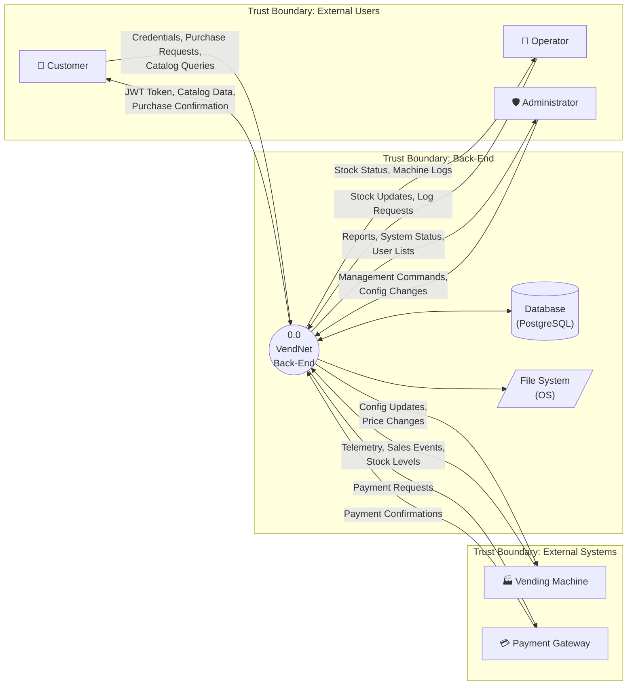
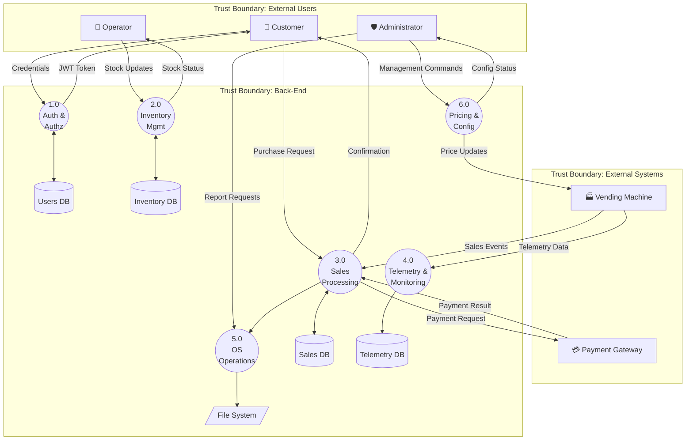

# 3. Data Flow Diagrams

## 3.1 Level 0 — Context Diagram

<!-- TODO: Finalize diagram. Ensure trust boundaries are correct. -->

### Trust Boundaries Identified

| # | Trust Boundary | Description |
|---|----------------|-------------|
| TB1 | External Users ↔ Back-End | <!-- TODO: describe --> |
| TB2 | External Systems (VM, Payment GW) ↔ Back-End | <!-- TODO: describe --> |
| TB3 | Back-End Application ↔ Database | <!-- TODO: describe --> |
| TB4 | Back-End Application ↔ File System (OS) | <!-- TODO: describe --> |

---

## 3.2 Level 1 — Decomposed DFD

<!-- TODO: Finalize — this is a structural placeholder. -->

### Level 1 Process Descriptions

| Process | Name | Description |
|---------|------|-------------|
| 1.0 | Authentication & Authorization | <!-- TODO --> |
| 2.0 | Inventory Management | <!-- TODO --> |
| 3.0 | Sales Processing | <!-- TODO --> |
| 4.0 | Telemetry & Monitoring | <!-- TODO --> |
| 5.0 | OS Operations | <!-- TODO --> |
| 6.0 | Pricing & Configuration | <!-- TODO --> |

---

## 3.3 Level 2 — Detailed Sub-Process DFDs

### 3.3.1 Process 3.0: Sales Processing — Level 2 Decomposition

<!-- TODO: Decompose into sub-processes such as:
  3.1 Validate Purchase Request
  3.2 Process Payment
  3.3 Update Stock
  3.4 Record Sale
-->

### 3.3.2 Process 5.0: OS Operations — Level 2 Decomposition

<!-- TODO: Decompose into sub-processes such as:
  5.1 Generate Encrypted Backup
  5.2 Rotate Audit Logs
  5.3 Generate Vendor Report Directory Structure
-->

### 3.3.3 Justification for Decomposition Decisions

| Process | Decomposed? | Justification |
|---------|-------------|---------------|
| 1.0 Auth | <!-- TODO --> | <!-- TODO --> |
| 2.0 Inventory | <!-- TODO --> | <!-- TODO --> |
| 3.0 Sales | Yes | <!-- TODO: e.g., involves multiple sub-steps: validation, payment, stock update, recording --> |
| 4.0 Telemetry | <!-- TODO --> | <!-- TODO --> |
| 5.0 OS Ops | Yes | <!-- TODO: e.g., file-system operations each have distinct security concerns --> |
| 6.0 Pricing | <!-- TODO --> | <!-- TODO --> |
