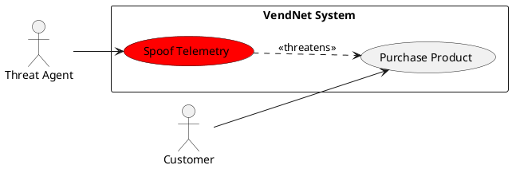

# 5. Abuse Cases

## 5.1 Overview
<!-- TODO: Briefly explain abuse case methodology and how they relate to STRIDE threats -->

## 5.2 Abuse Case: AC-01 — [Title]

| Field | Detail |
|-------|--------|
| **ID** | AC-01 |
| **Title** | <!-- TODO: e.g., "Attacker spoofs vending machine telemetry" --> |
| **Threat Ref** | T-XX |
| **DFD Element** | <!-- TODO: e.g., "Data Flow: VM → P4 (Telemetry)" --> |
| **STRIDE Category** | <!-- TODO: e.g., Spoofing, Tampering --> |
| **Threat Agent** | <!-- TODO: e.g., External attacker, Malicious insider --> |
| **Preconditions** | <!-- TODO: e.g., Attacker has network access to VM communication channel --> |
| **Attack Steps** | <!-- TODO: numbered steps --> |
| **Impact** | <!-- TODO: e.g., False inventory data, financial loss --> |
| **Severity** | <!-- TODO: Critical / High / Medium / Low --> |
| **Mapped Mitigation** | M-XX |
| **Mapped Requirement** | SR-XX |

### Abuse Case Diagram (optional)

<!-- TODO: UML use-case diagram showing the misuse case -->

## 5.3 Abuse Case: AC-02 — [Title]
<!-- TODO: Repeat template -->

## 5.4 Abuse Case: AC-03 — [Title]
<!-- TODO: Repeat template -->

<!-- ... Continue for AC-04 through AC-08+ ... -->

## 5.N Abuse Case Summary

| AC ID | Title | Threat Ref | STRIDE | Severity | Mitigation |
|-------|-------|------------|--------|----------|------------|
| AC-01 | <!-- TODO --> | T-XX | S | <!-- TODO --> | M-XX |
| AC-02 | <!-- TODO --> | T-XX | T | <!-- TODO --> | M-XX |
| ... | | | | | |
