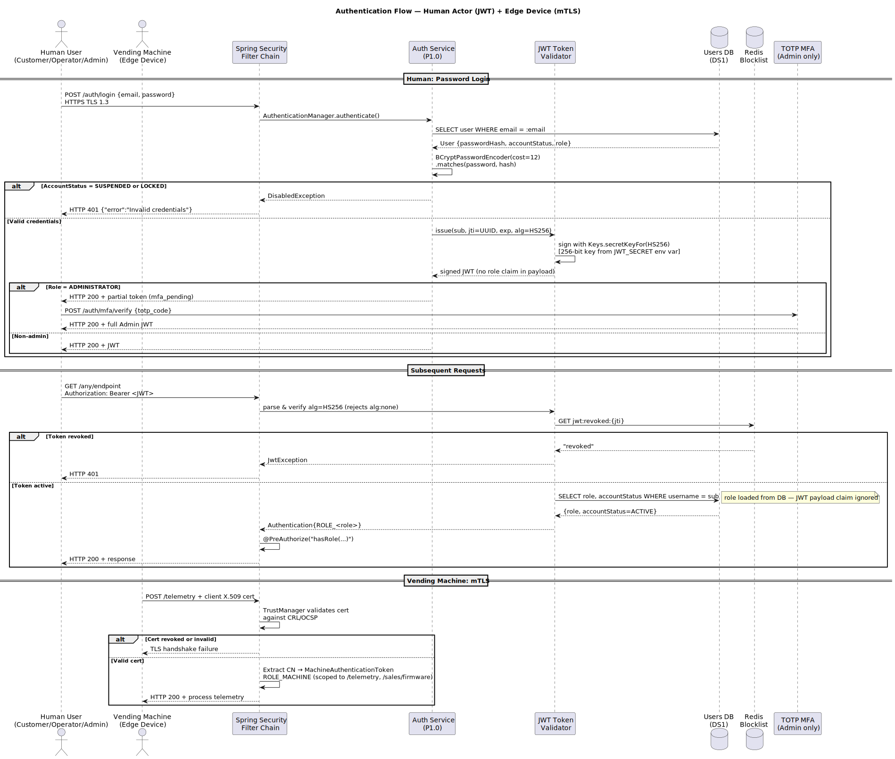
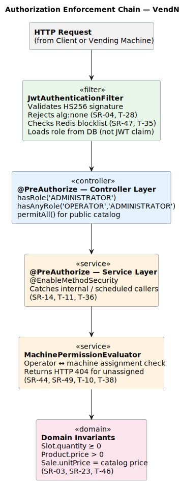
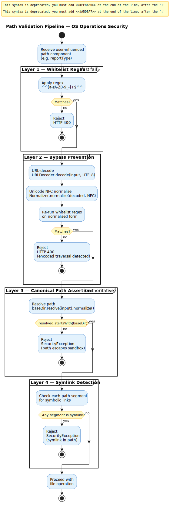
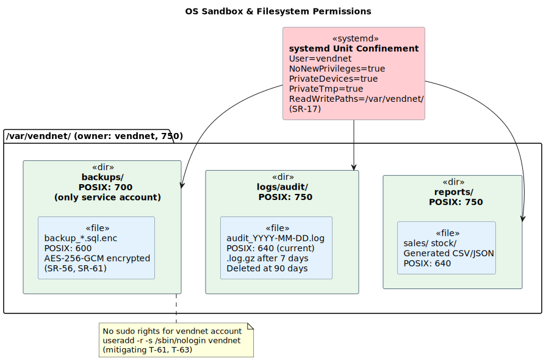
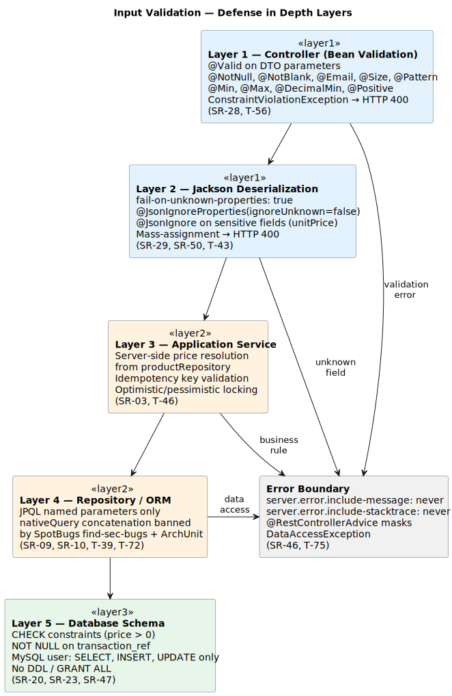
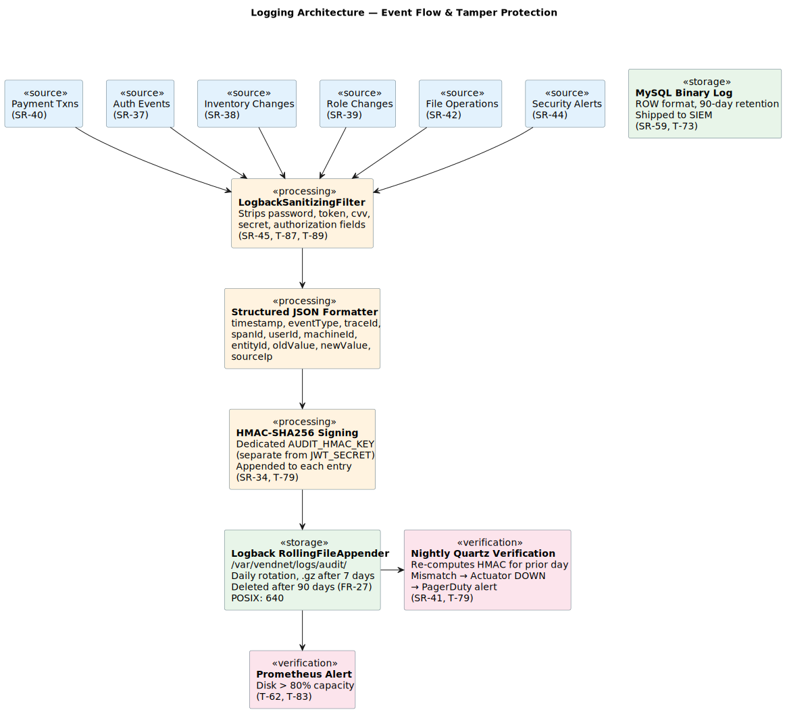

# 10. Secure Architecture & Design Decisions

> **Cross-references:** This document synthesises the security controls distributed across [§4 Threat Model](04_Threat_Model.md) (116 threats via STRIDE-per-element), [§5 Abuse Cases](05_Abuse_Cases.md) (AC-01 – AC-08), [§6 Risk Assessment](06_Risk_Assessment.md) (OWASP Risk Rating: 22 Critical, 56 High, 35 Medium, 3 Low), [§7 Mitigations](07_Mitigations.md) (SR-01 – SR-71), and [§8 Requirements](08_Requirements.md) (ASVS 5.0 mapping). Threat IDs (T-XX), Mitigation references (SR-XX), and ASVS verification items are cited throughout.

---

## 10.1 Secure Design Principles

VendNet's security posture is grounded in seven classical secure-design principles, each directly traceable to architectural decisions made in this system:

| Principle                | How VendNet Applies It                                                                                                                                                                                                                                                                                                                 |
| ------------------------ | -------------------------------------------------------------------------------------------------------------------------------------------------------------------------------------------------------------------------------------------------------------------------------------------------------------------------------------- |
| **Defense in Depth**     | Security controls at three independent layers: (1) transport-level TLS 1.3 + rate limiting, (2) Spring Security JWT validation + RBAC annotation enforcement, (3) database-level privilege restriction and filesystem sandboxing. No single control failure compromises the system.                                                    |
| **Least Privilege**      | The application's MySQL account holds only `SELECT, INSERT, UPDATE, DELETE` — no DDL (SR-20). The OS service account `vendnet` runs under systemd with `NoNewPrivileges=true`, `PrivateDevices=true`, and `ReadWritePaths=/var/vendnet/` (SR-17). Flyway schema migrations use a separate, temporarily enabled migration-only account. |
| **Fail-Safe Defaults**   | Spring Security's `SecurityFilterChain` is deny-by-default: every endpoint requires authentication and an explicit `@PreAuthorize` role grant before access is permitted. Unauthenticated access to `POST /sales` is explicitly tested to produce `HTTP 401` (SR-14).                                                                  |
| **Separation of Duties** | Three distinct RBAC roles (Customer, Operator, Administrator) partition responsibilities. Critical actions — pricing changes and role assignments — require a two-Administrator approval workflow (SR-23, SR-27).                                                                                                                      |
| **Complete Mediation**   | A `JwtAuthenticationFilter` intercepts every request before it reaches the controller layer. `AccountStatus` is re-validated from the database on each request (SR-05), ensuring suspended accounts cannot reuse unexpired tokens (mitigating T-35, T-64).                                                                             |
| **Economy of Mechanism** | OS-operations endpoints accept only a closed `enum BackupType { DAILY, WEEKLY, ON_DEMAND }` — not free-form strings — eliminating the surface area for command injection (SR-01, SR-16). `ProcessBuilder` is called with a hardcoded argument array, never with a shell interpreter.                                                   |
| **Open Design**          | Security relies on algorithm strength and key secrecy, not on obscurity. JWT signing uses documented HS256 with a minimum 256-bit key. Backup encryption uses AES-256-GCM. The `alg:none` bypass is explicitly rejected regardless of whether an attacker knows the library is in use (SR-04).                                         |

## 10.2 Authentication Architecture

VendNet employs two distinct authentication mechanisms depending on the actor type:

### 10.2.1 Human Actors (Customer / Operator / Administrator)

Authentication is stateless and JWT-based:

1. The client `POST /auth/login` with email and password over HTTPS/TLS 1.3.
2. Spring Security's `AuthenticationManager` loads the `User` aggregate from MySQL and runs `BCryptPasswordEncoder(cost=12).matches()`. BCrypt was selected because it is adaptive (work factor tunable), incorporates per-hash salts, and is resistant to GPU-accelerated brute force (ASVS V2.4.1).
3. `AccountStatus` is checked: `SUSPENDED` or `LOCKED` accounts are immediately rejected with `HTTP 401` — identical to a wrong-password response to prevent information leakage (SR-05, mitigating T-32).
4. Upon successful verification, a JWT is signed with HS256 using a minimum 256-bit key (`Keys.secretKeyFor(SignatureAlgorithm.HS256)`, stored in `JWT_SECRET` env var). The payload encodes `sub`, `jti` (UUID), and `exp`. **The `role` claim is intentionally absent** — the `JwtAuthenticationConverter` fetches the authoritative role from `userRepository` on every request, so tampering the JWT payload cannot elevate privilege (SR-11, mitigating T-06, T-30).
5. The JJWT parser enforces `requireAlgorithm(HS256)`, explicitly rejecting `alg:none` and asymmetric algorithms (SR-04, mitigating T-28).
6. For Administrator accounts, a TOTP step (`POST /auth/mfa/verify`) is required before an Admin-scoped session is established (SR-01, mitigating T-12). See AC-04 in [§5 Abuse Cases](05_Abuse_Cases.md).

**Account lockout:** 5 consecutive failures within 15 minutes → `AccountStatus = LOCKED` for 30 minutes (FR-07, SR-07, mitigating T-01, T-05). When an account is suspended, its active JWT `jti` is added to a Redis blocklist with TTL = remaining token lifetime (SR-47, mitigating T-35).

### 10.2.2 Vending Machine Edge Devices

Physical machines authenticate automatically using Mutual TLS (mTLS):

- The server requires `server.ssl.client-auth=need`; each machine presents an X.509 client certificate.
- A custom `TrustManager` validates the certificate against the CRL/OCSP responder (SR-68, mitigating T-18, T-101).
- The extracted certificate CN is mapped to a `MachineAuthenticationToken` carrying only `ROLE_MACHINE`, which is scoped exclusively to telemetry and firmware-sales endpoints (SR-69, mitigating T-23).
- Machines connecting from an unexpected IP range trigger a `CERT_UNEXPECTED_NETWORK` audit event and auto-suspend the certificate (SR-70).

### 10.2.3 Authentication Flow Diagram

The following sequence diagram covers both human JWT-based login (including MFA for Administrators) and vending machine mTLS authentication, with Redis blocklist checks on every subsequent request:

> **C4 Process View cross-reference:** For a more granular decomposition of the authentication process at container and component levels, see:
>
> - [L2 Authentication Process](../System-To-Be/C4/C4_Level2/Process_view/Authentication_process/svg/L2_Authentication_process.svg) — shows Controller → Auth Service → DB interaction with account lockout and dummy BCrypt timing-attack prevention
> - [L3 Authentication Process](../System-To-Be/C4/C4_Level3/Process_view/Authentication_process/svg/L3_Authentication_process.svg) — shows AuthController → AuthenticationService → JwtTokenProvider → UserRepository → User Aggregate decomposition with domain-level password verification

## 10.3 Authorization Model (RBAC)

VendNet enforces **Role-Based Access Control** with exactly three roles. Authorization is applied at two layers: the HTTP controller layer via `@PreAuthorize` annotations, and the application service layer via `@EnableMethodSecurity` (mitigating T-11, T-36).

### 10.3.1 RBAC Permission Matrix

| Permission                      | Customer |      Operator      |          Administrator           | Vending Machine |
| ------------------------------- | :------: | :----------------: | :------------------------------: | :-------------: |
| View product catalog            |    ✅    |         ✅         |                ✅                |        —        |
| Purchase product (via app)      |    ✅    |         ❌         |                ❌                |        —        |
| Submit firmware sale event      |    ❌    |         ❌         |                ❌                |       ✅        |
| View own purchase history       |    ✅    |         ❌         |                ✅                |        —        |
| View machine stock levels       |    ❌    | ✅ (assigned only) |                ✅                |        —        |
| Update machine stock (restock)  |    ❌    | ✅ (assigned only) |                ✅                |        —        |
| Access machine telemetry / logs |    ❌    | ✅ (assigned only) |                ✅                |        —        |
| Submit telemetry data           |    ❌    |         ❌         |                ❌                |       ✅        |
| Report machine issues           |    ❌    |         ✅         |                ✅                |        —        |
| Create / deactivate products    |    ❌    |         ❌         |                ✅                |        —        |
| Set product pricing             |    ❌    |         ❌         | ✅ (requires 2nd Admin approval) |        —        |
| Manage user accounts / roles    |    ❌    |         ❌         | ✅ (requires 2nd Admin approval) |        —        |
| Configure system settings       |    ❌    |         ❌         |                ✅                |        —        |
| Generate / download reports     |    ❌    |         ❌         |                ✅                |        —        |
| Trigger database backups        |    ❌    |         ❌         |                ✅                |        —        |
| View security audit logs        |    ❌    |         ❌         |                ✅                |        —        |
| View machine operational logs   |    ❌    | ✅ (own machines)  |                ✅                |        —        |

> **Note:** Operator access to machine data is filtered by the `machine_assignments` table. Iterating machine UUIDs outside an Operator's assigned fleet returns `HTTP 404` to prevent IDOR (SR-44, SR-49, mitigating T-10, T-38).

### 10.3.2 Sensitive Operations Requiring Two-Admin Approval

The following operations involve a `PENDING_REVIEW` state that a **second** Administrator must approve via `PUT /admin/{resource}/{id}/approve`:

| Operation                             | Risk Mitigated                               | Requirement |
| ------------------------------------- | -------------------------------------------- | ----------- |
| Bulk pricing changes (>50% reduction) | T-65 (rogue Admin zeros prices)              | SR-23       |
| User role assignment or suspension    | T-13 (rogue Admin demotes legitimate Admins) | SR-27       |

### 10.3.3 Implementation Enforcement Points

Requests pass through five enforcement layers before reaching business logic. Each layer applies independent checks so that a bypass at one layer is caught by the next:

An ArchUnit test (SR-45) verifies at build time that every `@RestController` method carries either `@PreAuthorize` or `@PermitAll` — a missing annotation fails the CI build.

## 10.4 Cryptographic Decisions

| Context                         | Algorithm / Standard                   | Justification                                                                                                                                                                                                                                                              | Threat Ref         |
| ------------------------------- | -------------------------------------- | -------------------------------------------------------------------------------------------------------------------------------------------------------------------------------------------------------------------------------------------------------------------------- | ------------------ |
| **Password hashing**            | BCrypt, work factor = 12               | Adaptive, salt-incorporating, GPU-resistant. Work factor 12 balances security and login latency (~250ms). Higher values amplify BCrypt-based DoS (T-34).                                                                                                                   | T-01, T-07, T-12   |
| **JWT signing**                 | HMAC-SHA256 (HS256), key ≥ 256 bits    | Generated via `Keys.secretKeyFor(HS256)` (JJWT). Startup assertion rejects keys shorter than 44 base64 chars. Rotated quarterly with a one-TTL grace period accepting both keys.                                                                                           | T-28, T-29, T-30   |
| **Transport (human-facing)**    | TLS 1.3 only                           | `server.ssl.enabled-protocols=TLSv1.3`; cipher suite restricted to `TLS_AES_256_GCM_SHA384` and `TLS_CHACHA20_POLY1305_SHA256`. TLS 1.2 and below explicitly disabled.                                                                                                     | T-85               |
| **Transport (machine-facing)**  | mTLS (TLS 1.3 + X.509 client certs)    | Provides bidirectional authentication. Vending machines cannot be impersonated from attacker cloud infrastructure without the private key (T-18). Revocation via CRL/OCSP (SR-68).                                                                                         | T-18, T-23, T-101  |
| **Backup encryption**           | AES-256-GCM (envelope encryption)      | Each backup is encrypted with a per-backup DEK generated by `KeyGenerator.getInstance("AES")`. The DEK is encrypted by HashiCorp Vault Transit Secrets Engine. The plaintext DEK is only held in JVM heap during the backup operation — never co-located with the archive. | T-61, T-78         |
| **Payment webhook integrity**   | HMAC-SHA256 over raw request body      | Computed before JSON deserialisation. Constant-time comparison via `MessageDigest.isEqual()` prevents timing oracle. Key stored as `PAYMENT_HMAC_SECRET` env var, minimum 32 bytes.                                                                                        | T-24, T-108, T-109 |
| **Audit log integrity**         | HMAC-SHA256 appended to each log entry | Separate audit signing key, not the same as the JWT secret. A nightly Quartz job re-verifies entries from the previous day; mismatches trigger Spring Boot Actuator `DOWN`.                                                                                                | T-79               |
| **Database encryption at rest** | LUKS (on-prem) or AWS EBS AES-256      | Protects against physical theft of storage media. MySQL column-level encryption for PII fields (SR-13).                                                                                                                                                                    | T-70, T-71         |

### 10.4.1 Key Management

All cryptographic material is injected at runtime from environment variables or a secrets manager — never hardcoded in source:

| Key                           | Storage                                                 | Rotation                                                            |
| ----------------------------- | ------------------------------------------------------- | ------------------------------------------------------------------- |
| `JWT_SECRET`                  | Environment variable (from Vault / AWS Secrets Manager) | Every 90 days; grace period of one TTL accepts both old and new key |
| `PAYMENT_HMAC_SECRET`         | Environment variable                                    | Every 90 days (SR-20)                                               |
| Backup DEK                    | JVM heap only (per-operation)                           | New key per backup run                                              |
| Backup DEK encrypted copy     | Vault Transit Secrets Engine                            | Managed by Vault key rotation policy                                |
| TLS private key + certificate | Docker secrets / Vault PKI                              | Renewed before certificate expiry                                   |
| Machine mTLS client certs     | Provisioned at machine deployment                       | Revoked immediately on machine decommission                         |

> A `gitleaks` / `truffleHog` CI pre-commit hook scans all commits for accidental secret leakage (SR-18).

## 10.5 OS Operations Security

Three OS-level operations are executed by the backend (§1.5 of [System Overview](01_System_Overview.md)): database backup generation, audit log rotation, and report directory creation. Each is sandboxed to `/var/vendnet/` and subjected to multi-layer controls. See also [§7 Mitigations](07_Mitigations.md) — AC-01 ([§5](05_Abuse_Cases.md)) describes the full attack chain for command injection through this surface.

### 10.5.1 Command Injection Prevention

`ProcessBuilder` is used to invoke `mysqldump`. The controller accepts only a closed enum (`BackupType` with values `DAILY`, `WEEKLY`, `ON_DEMAND`) — free-form strings are never accepted. The argument array is fully hardcoded: `ProcessBuilder("mysqldump", "--no-tablespaces", "-u", dbUser, "-h", dbHost, dbName)`. No user-supplied string is ever interpolated into command arguments.

No shell interpreter (`/bin/sh -c`) is used. Backup filenames are generated server-side from `Instant.now().toEpochMilli()` — user labels are stored only in the `backup_jobs` database table and never become filesystem path components. (SR-01, SR-16, mitigating T-17, T-59, T-63; see also AC-01 in [§5 Abuse Cases](05_Abuse_Cases.md))

### 10.5.2 Path Traversal Prevention

For every file operation involving a user-influenced path component (e.g., `reportType`), a four-layer validation pipeline is applied:

**Layer 1 — Whitelist regex** (`^[a-zA-Z0-9_-]+$`): fast-fail rejection of `.`, `/`, `\`, and null bytes. **Layer 2 — Bypass prevention**: the input is URL-decoded (`URLDecoder.decode`) and Unicode NFC-normalised (`Normalizer.normalize`), then the whitelist regex is re-applied to the normalised form. This catches `%2e%2e%2f` encoded traversal attempts. **Layer 3 — Canonical path assertion** (authoritative control): `baseDir.resolve(input).normalize()` followed by `resolved.startsWith(baseDir)` — if the resolved path escapes the sandbox, a `SecurityException` is thrown. **Layer 4 — Symlink detection**: see §10.5.3.

The prefix assertion — not the regex — is the definitive guard. Both are applied as defense in depth. (SR-06, SR-22, SR-24, mitigating T-58, T-84, T-113)

### 10.5.3 Symlink Attack Prevention

Before `Files.createDirectories()`, each path segment is checked for symbolic links by iterating over the path components and calling `Files.isSymbolicLink()`. If any segment resolves to a symlink, a `SecurityException` is thrown. This prevents a scenario where an attacker with OS-level access creates a symlink under `/var/vendnet/reports/` pointing to a sensitive OS directory (SR-66, mitigating T-80).

### 10.5.4 Filesystem Permissions and Sandboxing

| Directory / File                 | POSIX Permission | Owner     |
| -------------------------------- | ---------------- | --------- |
| `/var/vendnet/backups/`          | `700`            | `vendnet` |
| `/var/vendnet/backups/*.sql.enc` | `600`            | `vendnet` |
| `/var/vendnet/logs/audit/`       | `750`            | `vendnet` |
| `/var/vendnet/logs/audit/*.log`  | `640`            | `vendnet` |
| `/var/vendnet/reports/`          | `750`            | `vendnet` |

The `vendnet` service account is created as a system account (`useradd -r -s /sbin/nologin vendnet`) with no sudo rights. The systemd unit enforces `User=vendnet`, `NoNewPrivileges=true`, `PrivateDevices=true`, `PrivateTmp=true`, and `ReadWritePaths=/var/vendnet/`. (SR-17, SR-56, mitigating T-61, T-63)

### 10.5.5 Filesystem Layout

The following diagram shows the sandbox directory structure, POSIX permissions, and systemd confinement:

## 10.6 Input Validation Strategy

VendNet applies a **defense-in-depth** validation model across five layers (ASVS V5). The following diagram illustrates how each request passes through independent validation stages, with a unified error boundary preventing information leakage:

Threats addressed include SQL injection (T-39, T-72 — both Critical per [§4 Threat Model](04_Threat_Model.md)), mass-assignment (T-43 — High), price manipulation (T-46 — Critical), and information disclosure via error messages (T-75).

### 10.6.1 Controller Layer — Bean Validation

Every inbound DTO is annotated with JSR-380 constraints and validated via `@Valid`:

| Annotation                              | Example Field               | Notes                                |
| --------------------------------------- | --------------------------- | ------------------------------------ |
| `@NotNull`, `@NotBlank`                 | `email`, `password`         | Rejects null/empty at binding        |
| `@Email`                                | `UserRegistrationDto.email` | RFC 5322 format check                |
| `@Size(min=8, max=72)`                  | `password`                  | BCrypt accepts max 72 bytes          |
| `@Pattern(regexp="^[a-zA-Z0-9 .'-]+$")` | `productName`               | Alphanumeric + safe punctuation only |
| `@Min(0)`, `@Max(999)`                  | `Slot.quantity`             | Non-negative capacity                |
| `@DecimalMin("0.01")`                   | `Product.price`             | Price must be positive               |
| `@Positive`                             | `SaleRequest.quantity`      | Integer items purchased              |

Spring's `MethodValidationPostProcessor` catches `ConstraintViolationException` before it reaches service logic. A `@RestControllerAdvice` maps it to `HTTP 400` with a generic error map — field names are included but database/stack details are suppressed. (SR-28, mitigating T-56)

### 10.6.2 Mass-Assignment Prevention

Jackson is configured globally with `spring.jackson.deserialization.fail-on-unknown-properties` set to `true`. DTOs additionally carry `@JsonIgnoreProperties(ignoreUnknown = false)`. These two settings ensure that a JSON payload containing unexpected fields (e.g., `{"role":"ADMINISTRATOR","id":1}`) causes an immediate `HTTP 400` rather than silently mapping into the domain object. (SR-29, SR-50, mitigating T-43)

**Price resolution is always server-side.** `SaleRequestDto` does not expose a `unitPrice` field — `@JsonIgnore` rejects it at binding. The committed price is resolved from `productRepository.findById(productId).getPrice()` at transaction commit time — never from the request payload. (SR-03, mitigating T-46, AC-03 in [§5 Abuse Cases](05_Abuse_Cases.md))

> **C4 Process View cross-reference:** The [L2 Purchase Process](../System-To-Be/C4/C4_Level2/Process_view/Purchase_process/svg/L2_Purchase_process.svg) and [L3 Purchase Process](../System-To-Be/C4/C4_Level3/Process_view/Purchase_process/svg/L3_Purchase_process.svg) diagrams show how server-side price resolution, idempotency checks, and optimistic locking integrate into the full purchase flow.

### 10.6.3 SQL Injection Prevention

| Layer                                        | Control                                                                                   |
| -------------------------------------------- | ----------------------------------------------------------------------------------------- |
| Spring Data JPA                              | JPQL named parameters only: `@Query("SELECT p FROM Product p WHERE p.name = :name")`      |
| MySQL user                                   | `GRANT SELECT, INSERT, UPDATE ON vendnet.* TO 'vendnet_app'@'%'` — `GRANT ALL` never used |
| `nativeQuery=true` with string concatenation | Banned by SpotBugs `find-sec-bugs` rule in CI pipeline                                    |
| ArchUnit                                     | Test asserts no class in `repository` package concatenates `String` with SQL keywords     |

(SR-09, SR-10, mitigating T-39, T-72, T-74)

### 10.6.4 Output Security and Error Masking

The Spring Boot error configuration disables message and stacktrace exposure: `server.error.include-message` is set to `never` and `server.error.include-stacktrace` to `never`. Binding errors are only shown in the development profile. All `DataAccessException` subclasses are mapped by a `@RestControllerAdvice` handler to a generic `{"error":"An internal error occurred"}` response. No SQL state codes or table names reach the client. (SR-46, mitigating T-75)

### 10.6.5 Payload Size Limits

| Setting                                     | Value | Purpose                            |
| ------------------------------------------- | ----- | ---------------------------------- |
| `server.tomcat.max-http-form-post-size`     | 1 MB  | Limit form POST body               |
| `spring.servlet.multipart.max-request-size` | 5 MB  | Limit multipart total request size |
| `spring.servlet.multipart.max-file-size`    | 5 MB  | Limit individual file upload size  |

Oversized payloads are rejected with `HTTP 413` before reaching the controller (NFR-14, SR-30, mitigating T-92).

### 10.6.6 Database-Layer Defense in Depth

Schema-level constraints provide a last line of defense independent of application code. `CHECK` constraints enforce `price > 0` on the products table and `transaction_ref IS NOT NULL AND transaction_ref <> ''` on the payment_info table. These guarantee data integrity even if application-layer validation is bypassed. (SR-23, SR-47)

## 10.7 Logging Architecture

VendNet's logging architecture satisfies ASVS V7.1.1–V7.4.2. Every audit-relevant event is captured in a structured, tamper-evident, non-repudiable format. The following diagram shows the end-to-end event flow from sources through sanitisation, HMAC signing, storage, and verification:

See mitigations SR-34 through SR-46 in [§7 Mitigations](07_Mitigations.md).

### 10.7.1 Audit Event Categories

| Category                            | Specific Event Types (SR ref)                                                                                                                             | Threats Mitigated |
| ----------------------------------- | --------------------------------------------------------------------------------------------------------------------------------------------------------- | ----------------- |
| Authentication events (SR-37)       | `AUTH_SUCCESS`, `AUTH_FAILURE`, `ACCOUNT_LOCKED`, `MFA_CHALLENGE_ISSUED`, `MFA_FAILURE`, `TOKEN_REVOKED`, `JWT_EXPIRED`                                   | T-01, T-04, T-12  |
| Inventory changes (SR-38)           | `SLOT_RESTOCKED`, `PRODUCT_CREATED`, `PRODUCT_DEACTIVATED`, `PRICE_UPDATED`, `PRICE_CHANGE_APPROVED`                                                      | T-65, T-38        |
| Role and permission changes (SR-39) | `ROLE_ASSIGNED`, `ROLE_REVOKED`, `ACCOUNT_SUSPENDED`, `ROLE_CHANGE_APPROVED`, `ADMIN_SELF_ELEVATE_BLOCKED`                                                | T-13, T-36        |
| Payment transactions (SR-40)        | `SALE_COMMITTED`, `SALE_REFUNDED`, `PAYMENT_WEBHOOK_RECEIVED`, `PAYMENT_HMAC_MISMATCH`, `ANOMALOUS_SALE_EVENT`, `SUSPECT_FIRMWARE_SALE`                   | T-24, T-108, T-46 |
| File operations (SR-42)             | `BACKUP_STARTED`, `BACKUP_COMPLETED`, `BACKUP_FAILED`, `REPORT_GENERATED`, `LOG_ROTATION_TRIGGERED`                                                       | T-61, T-62, T-63  |
| DB changes (SR-43)                  | MySQL binary log ROW events shipped to SIEM; `DB_SCHEMA_MIGRATION` on startup                                                                             | T-73              |
| Security alerts (SR-44)             | `MACHINE_RATE_LIMIT_EXCEEDED`, `CERT_UNEXPECTED_NETWORK`, `AUDIT_LOG_HMAC_MISMATCH`, `PATH_TRAVERSAL_BLOCKED`, `SYMLINK_DETECTED`, `CIRCUIT_BREAKER_OPEN` | T-79, T-80, T-84  |

### 10.7.2 Log Format

Each log entry is a single-line JSON object with the following fields:

| Field                   | Description                                | Example                            |
| ----------------------- | ------------------------------------------ | ---------------------------------- |
| `timestamp`             | ISO-8601 UTC timestamp                     | `2026-04-10T12:34:56.789Z`         |
| `level`                 | Log severity                               | `INFO`, `WARN`, `ERROR`            |
| `eventType`             | Audit event identifier                     | `SALE_COMMITTED`, `AUTH_FAILURE`   |
| `traceId`               | OpenTelemetry W3C Trace ID                 | `4bf92f3577b34da6a3ce929d0e0e4736` |
| `spanId`                | OpenTelemetry Span ID                      | `00f067aa0ba902b7`                 |
| `userId`                | Authenticated user identifier              | `usr_9a3f2b1c`                     |
| `machineId`             | Vending machine identifier (if applicable) | `vm_2d4e1a3b` or null              |
| `entityId`              | Affected domain entity                     | `sale_7d4e1a2b`                    |
| `entityType`            | Domain aggregate type                      | `Sale`, `Product`, `User`          |
| `oldValue` / `newValue` | State change for audit trail               | Previous and new field values      |
| `sourceIp`              | Client IP address                          | `203.0.113.42`                     |
| `hmac`                  | HMAC-SHA256 integrity signature            | `sha256=e3b0c44298fc1c149afb...`   |

**Sensitive fields are always absent from logs:** passwords, JWTs, full card numbers, CVVs, and TOTP codes. A `LogbackSanitizingFilter` strips any field matching `(?i)(password|token|cvv|secret|authorization)` from the MDC context before the log appender fires (SR-45, mitigating T-87, T-89).

OpenTelemetry Trace IDs are propagated via `W3C TraceContext` headers and injected into the MDC automatically by `opentelemetry-spring-boot-starter`, correlating edge machine telemetry events with their API-layer transaction chain.

### 10.7.3 Storage and Rotation

Logs are written by a dedicated Logback `RollingFileAppender` using a `TimeBasedRollingPolicy`. The file name pattern is `/var/vendnet/logs/audit/audit_{date}.log.gz` with `maxHistory` set to 90 (files deleted after 90 days).

- Current day's file is uncompressed (`640` POSIX permission).
- After midnight, Logback renames and compresses to `.log.gz`.
- Files older than 90 days are deleted automatically by `maxHistory` (FR-27).
- Disk utilisation is monitored; a Prometheus alert fires when `/var/vendnet/` exceeds 80% capacity (mitigating T-62, T-83).

### 10.7.4 Tamper Protection

HMAC-SHA256 is appended to each log entry using a **dedicated audit signing key** (`AUDIT_HMAC_KEY` env var) that is **separate from** `JWT_SECRET`. The signing is performed via `HmacUtils.hmacSha256Hex(auditKey, entry.toCanonicalString())` and appended as a `sha256=` prefixed field.

A nightly **Quartz verification job** re-computes HMAC for every entry logged the previous day and compares it to the stored value. On any mismatch, the job triggers Spring Boot Actuator to expose `{ "status": "DOWN", "reason": "AuditLogTamperDetected" }`, which immediately pages the on-call engineer (SR-34, SR-41, mitigating T-79).

### 10.7.5 Production Logging Configuration

The production Spring profile configures `logging.level.root` to `WARN` and `logging.level.com.vendnet` to `INFO`. SQL logging is disabled with `spring.jpa.show-sql` set to `false` and `hibernate.format_sql` also `false`. Debug and TRACE levels are disabled to prevent inadvertent PII/credential leakage through verbose Hibernate output (mitigating T-87, T-89).

MySQL binary logs are configured in `ROW` format with 90-day retention and shipped to the SIEM instance for correlation with application-layer audit events (SR-59, mitigating T-73).

---

## 10.8 Threat Model Traceability

The following table maps the Critical and High threats identified in [§4 Threat Model](04_Threat_Model.md) (STRIDE-per-element over DFD Level 1) to the specific architectural controls documented in this chapter, along with the corresponding mitigations from [§7](07_Mitigations.md) and abuse case validations from [§5](05_Abuse_Cases.md).

### 10.8.1 Critical Threats

| Threat | Description                                                | Architectural Control (this chapter)                         | Mitigation          | Abuse Case |
| ------ | ---------------------------------------------------------- | ------------------------------------------------------------ | ------------------- | ---------- |
| T-06   | JWT role claim tampered to escalate to Administrator       | §10.2.1 — role loaded from DB, not JWT payload               | SR-11               | AC-04      |
| T-17   | OS command execution via `ProcessBuilder` abuse            | §10.5.1 — enum-only input, hardcoded arg array               | SR-01, SR-16        | AC-01      |
| T-28   | JWT `alg:none` signature bypass                            | §10.2.1 — `requireAlgorithm(HS256)` explicit rejection       | SR-04               | AC-04      |
| T-30   | JWT payload role-claim tampering after secret recovery     | §10.2.1 — role not in JWT; §10.4 — 256-bit minimum key       | SR-04, SR-11        | —          |
| T-39   | SQL injection via inventory search parameters              | §10.6.3 — JPQL named params, find-sec-bugs, ArchUnit         | SR-09, SR-10        | AC-05      |
| T-46   | Client-supplied `unitPrice` bypasses catalog validation    | §10.6.2 — `@JsonIgnore` on unitPrice, server-side resolution | SR-03               | AC-03      |
| T-58   | Path traversal escapes `/var/vendnet/` sandbox             | §10.5.2 — four-layer path validation pipeline                | SR-06, SR-22, SR-24 | AC-01      |
| T-59   | OS command injection via unsanitised ProcessBuilder params | §10.5.1 — no user string in arg array                        | SR-01, SR-16        | AC-01      |
| T-63   | Application-to-OS privilege escalation via ProcessBuilder  | §10.5.4 — systemd `NoNewPrivileges`, no sudo                 | SR-17               | AC-01      |
| T-72   | SQL injection modifies DB records (roles, prices, sales)   | §10.6.3 — parameterised queries, least-privilege MySQL user  | SR-09, SR-10, SR-20 | AC-05      |
| T-84   | Path traversal writes to privileged OS directory           | §10.5.2 — canonical path prefix assertion                    | SR-22, SR-24        | AC-01      |

### 10.8.2 High Threats

| Threat | Description                                                  | Architectural Control (this chapter)                            | Mitigation   |
| ------ | ------------------------------------------------------------ | --------------------------------------------------------------- | ------------ |
| T-01   | Credential stuffing / account takeover                       | §10.2.1 — BCrypt(12), account lockout 5/15min                   | SR-07        |
| T-05   | Brute-force login flood → victim lockout                     | §10.2.1 — lockout with 30-min auto-unlock                       | SR-07        |
| T-10   | Cross-machine IDOR (Operator reads unauthorised telemetry)   | §10.3.1 — `machine_assignments` filter, HTTP 404                | SR-44, SR-49 |
| T-11   | Operator calls Admin-only endpoint (missing `@PreAuthorize`) | §10.3.3 — ArchUnit CI enforcement                               | SR-14, SR-45 |
| T-13   | Rogue Admin reassigns user roles / suspends accounts         | §10.3.2 — two-Admin approval workflow                           | SR-27        |
| T-18   | Vending machine impersonation from attacker infrastructure   | §10.2.2 — mTLS with CRL/OCSP validation                         | SR-68        |
| T-23   | VM mTLS cert used beyond telemetry scope                     | §10.2.2 — `ROLE_MACHINE` scoped endpoints                       | SR-69        |
| T-29   | JWT HMAC secret brute-force (weak key)                       | §10.4 — 256-bit minimum key, startup assertion                  | SR-04        |
| T-34   | BCrypt-amplified login flood exhausts thread pool            | §10.4 — work factor 12 balances security/DoS                    | SR-07, SR-30 |
| T-35   | Suspended account's unexpired JWT remains valid              | §10.2.1 — Redis blocklist with TTL                              | SR-47        |
| T-36   | Missing method-level `@PreAuthorize` on service layer        | §10.3.3 — `@EnableMethodSecurity` + ArchUnit                    | SR-14        |
| T-43   | Mass-assignment vulnerability (Operator modifies pricing)    | §10.6.2 — `fail-on-unknown-properties`, `@JsonIgnoreProperties` | SR-29, SR-50 |
| T-79   | Audit log file tampered to erase evidence                    | §10.7.4 — HMAC-SHA256 per entry, nightly verification           | SR-34, SR-41 |
| T-80   | Symlink attack on report directory                           | §10.5.3 — per-segment symlink detection                         | SR-66        |

> **Coverage note:** This chapter addresses all 22 Critical threats and the 14 highest-impact High threats from the [§4 Threat Model](04_Threat_Model.md). The remaining High and Medium threats are addressed by the operational mitigations in [§7](07_Mitigations.md) (SR-01 – SR-71) and validated by the security testing plan in [§9](09_Security_Testing.md).
