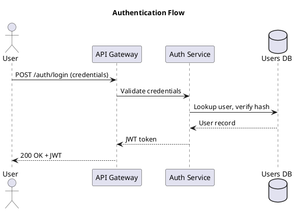

# 10. Secure Architecture & Design Decisions

## 10.1 Secure Design Principles
<!-- TODO: List principles applied: least privilege, defense in depth, fail-safe defaults, separation of duties, etc. -->

## 10.2 Authentication Architecture
<!-- TODO: Describe auth flow — JWT/session-based, password hashing (bcrypt/argon2), MFA considerations -->

## 10.3 Authorization Model (RBAC)

| Permission | Customer | Operator | Administrator |
|------------|----------|----------|---------------|
| View catalog | ✅ | ✅ | ✅ |
| Purchase product | ✅ | ❌ | ❌ |
| View own purchase history | ✅ | ❌ | ✅ |
| View machine stock | ❌ | ✅ | ✅ |
| Update machine stock | ❌ | ✅ | ✅ |
| Access machine logs | ❌ | ✅ | ✅ |
| Manage users | ❌ | ❌ | ✅ |
| Set global pricing | ❌ | ❌ | ✅ |
| Configure security settings | ❌ | ❌ | ✅ |
| View reports | ❌ | ❌ | ✅ |

## 10.4 Cryptographic Decisions
<!-- TODO: encryption at rest, TLS version, hashing algorithms, key management -->

## 10.5 OS Operations Security
<!-- TODO: describe how OS-level file operations are secured:
  - Path validation (prevent traversal)
  - Least-privilege file system permissions
  - Sandboxed directories for backups/logs/reports
  - Input sanitization for dynamic paths
-->

## 10.6 Input Validation Strategy
<!-- TODO: whitelist validation, parameterized queries, output encoding -->

## 10.7 Logging Architecture
<!-- TODO: what is logged, log format, storage, rotation, tamper protection -->
