# Introduction

The combination of two architectural representation models will be adopted: **C4** and **4+1**.

## 4+1 View Model [Krutchen-1995]

The 4+1 View Model proposes describing the system through complementary views, allowing the requirements of various software stakeholders—such as users, system administrators, project managers, architects, and developers—to be analyzed separately. The views are defined as follows:

- **Logical view**: related to the software aspects that aim to address business challenges.
- **Process view**: related to the flow of processes or interactions within the system.
- **Development view**: related to the organization of the software in its development environment.
- **Physical view**: related to the mapping of various software components to hardware, i.e., where the software is executed.
- **Scenarios view**: related to the association of business processes with actors capable of triggering them.

## C4 Model [Brown-2020][C4-2020]

The C4 Model advocates describing the software through four levels of abstraction: system, container, component, and code. Each level adopts a finer granularity than the one preceding it, providing more detailed insights into progressively smaller parts of the system.

### Levels of the C4 Model

- **Level 1** – System Context: Provides a high-level overview of the system, its purpose, and how it interacts with external entities such as users and other systems.
- **Level 2** – Container: Breaks down the system into major deployable units (e.g., applications, databases, services), defining their responsibilities and interactions.
- **Level 3** – Component: Details the internal structure of each container, identifying key components and their roles in the system.

## Combining C4 and 4+1 Models

By combining these models, we create a comprehensive and multi-dimensional representation of VendNet. The **C4 model** organizes the system into different levels of detail, while the **4+1 model** represents the system from multiple perspectives relevant to different stakeholders.

---

# Level 1 – System Context

At the highest level of abstraction, the **System Context** provides a broad overview of VendNet, defining its purpose and how it interacts with external entities such as users, vending machines, and third-party payment services.

### System DDD

The Domain-Driven Design Context Map organizes VendNet into five bounded contexts — **Identity & Access** (User entity), **Machine Management** (VendingMachine entity), **Slot Management** (Slot entity), **Product Catalog** (Product entity), and **Sales** (Sale entity). Cross-context references are maintained through typed IDs (dashed dependency arrows): Sale references UserId, MachineId, and ProductId; Slot references MachineId and ProductId. This ensures loose coupling and independent evolvability across contexts. The full DDD model is detailed in [Section 2 — Domain Model](../../Report/02_Domain_Model.md) and the [DDD diagrams](../DDD/).

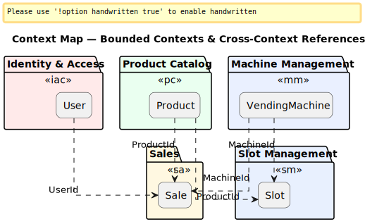

## Process View

The Process View at this level illustrates the key interactions between actors and the VendNet system for security-critical and business-critical operations. Rather than generic CRUD flows, these diagrams focus on processes that involve authentication, external system integration, failure handling, and OS-level security — reflecting the concerns most relevant to a secure software design.

| Process                 | Actor(s)        | Security Concerns Illustrated                                                                                                              |
| ----------------------- | --------------- | ------------------------------------------------------------------------------------------------------------------------------------------ |
| **User Authentication** | All users       | Credential validation, brute-force protection, account lockout, JWT issuance                                                               |
| **User Registration**   | Administrator   | Input sanitization, BCrypt hashing, uniqueness checks, RBAC enforcement, audit logging                                                     |
| **Create Product**      | Administrator   | File upload validation, magic bytes verification, image re-encoding, EXIF stripping, path traversal prevention, polyglot attack mitigation |
| **Purchase Product**    | Customer        | Payment gateway integration, idempotency, timeout/network failure handling, stock race conditions                                          |
| **Machine Restock**     | Operator        | RBAC enforcement, authorization checks, domain invariant validation, concurrent modification                                               |
| **Telemetry Ingestion** | Vending Machine | mTLS client certificate authentication, machine identity verification, rate limiting, spoofing prevention                                  |
| **Encrypted Backup**    | Administrator   | Path traversal prevention, AES-256 encryption, file permission hardening, audit logging                                                    |

### L1 User Authentication

Shows the high-level authentication flow including credential validation, failed attempt tracking, account lockout after threshold, and JWT token issuance.

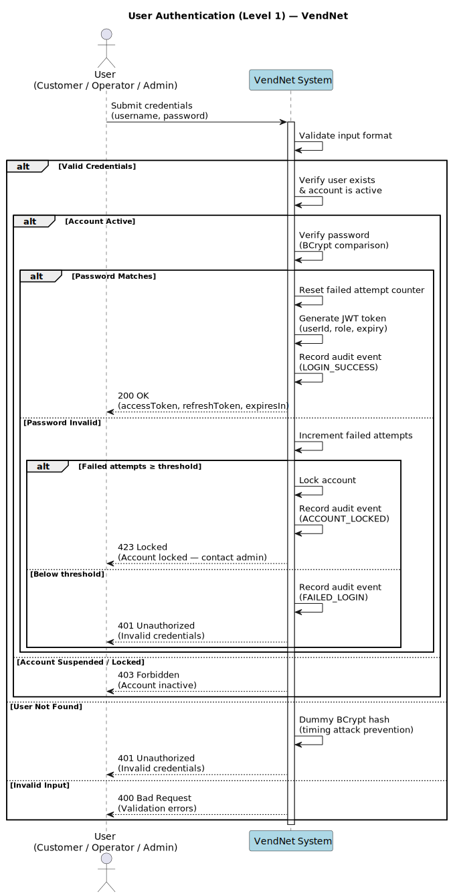

### L1 Purchase Product (Sales with Payment)

The most complex process — a customer selects a product and pays through an external payment gateway. The diagram covers the success path as well as critical failure scenarios: payment declined, gateway timeout, and network failures. Idempotency keys prevent duplicate charges across retries.

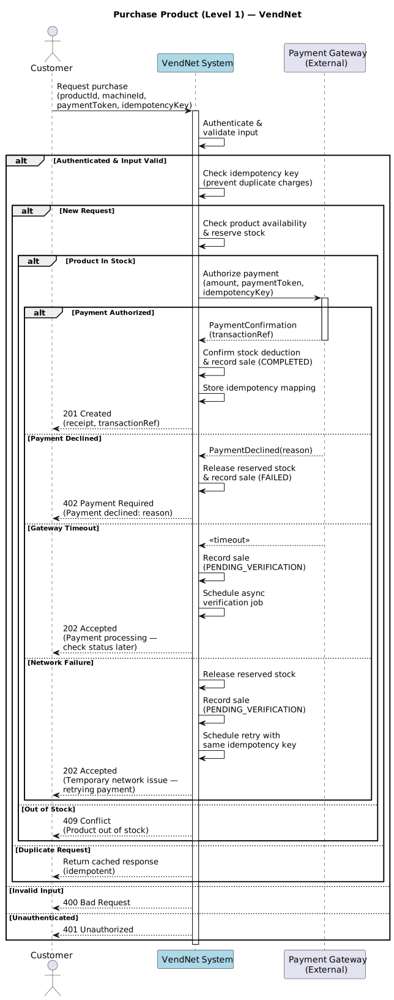

### L1 Machine Restock

An operator restocks a vending machine slot. The diagram shows RBAC enforcement (only Operator/Admin roles), machine and slot existence validation, and capacity constraint checking.

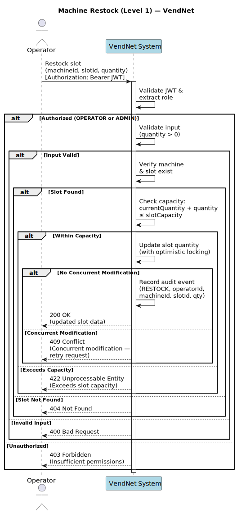

### L1 User Registration (Admin Creates User)

An administrator creates a new user account. The diagram shows RBAC enforcement (only admin can create users), input validation, username and email uniqueness checks, BCrypt password hashing (never stored in plaintext), and audit event logging.

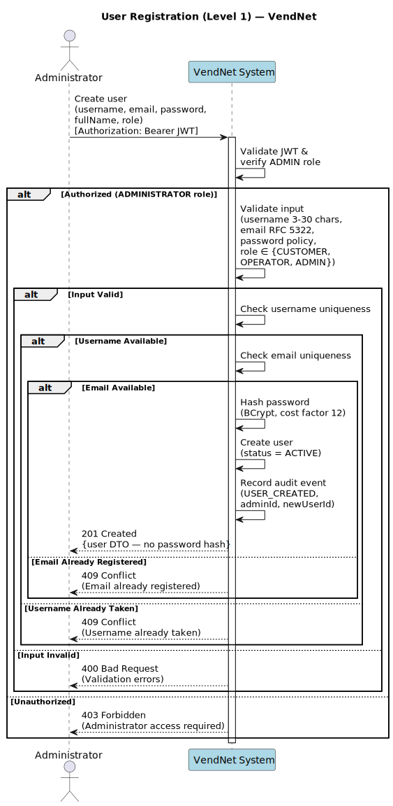

### L1 Create Product (with Secure Image Upload)

An administrator creates a new product including a product image. This process highlights the security-critical file upload pipeline: file size enforcement, extension whitelisting, magic bytes verification (detecting disguised files regardless of extension), image re-encoding to strip EXIF metadata and neutralize embedded payloads (polyglot attacks), UUID filename generation (discarding the original filename to prevent path traversal), and isolated storage outside the webroot.

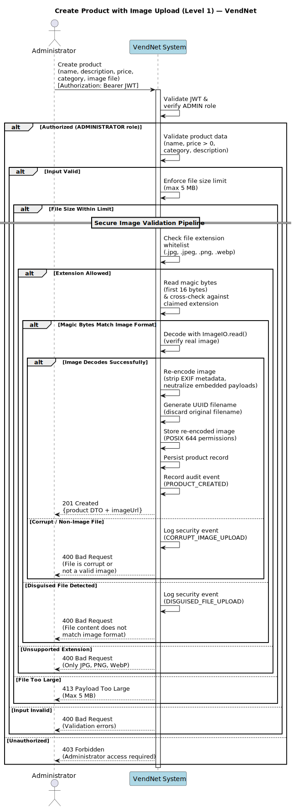

### L1 Telemetry Ingestion (Vending Machine → System)

A vending machine sends telemetry data to the back-end. The diagram shows mTLS client certificate authentication, machine identity verification against registered devices, data validation, alert evaluation (temperature thresholds, critical error codes), and security violation logging for unauthorized or unregistered machines.

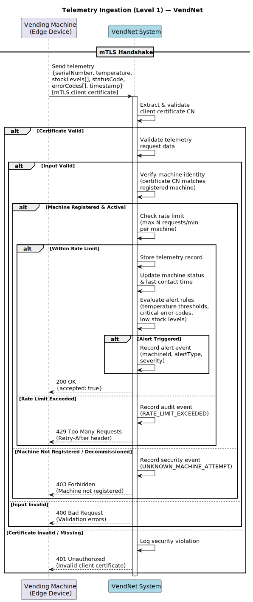

### L1 Encrypted Database Backup

An administrator triggers an on-demand encrypted backup. The diagram shows RBAC enforcement, path validation (whitelist pattern to prevent path traversal), AES-256 encryption, file permission hardening, and audit logging.

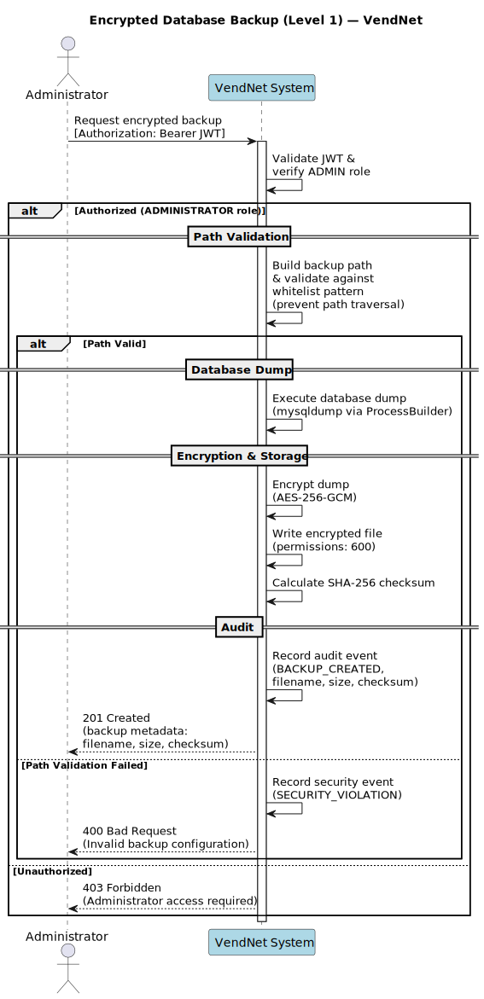

## Implementation View

The Implementation View at this level depicts VendNet as a single C4 System component and the external interfaces it exposes or consumes. The diagram shows:

- **VendNet** as the central system (C4 `«Component» «System (C4)»`).
- **External actor interfaces:** Mobile Consumer App, Admin Dashboard Web UI, and Operator Portal Web UI connecting to VendNet.
- **External system interfaces:** Payment Gateway Interface (mock gateway used for simulating real-world payment scenarios — successful transactions, declines, timeouts, and network failures) and Vending Machine (Edge) connecting via a distinct port.
- **VendNet REST API** as the provided interface exposed by the system.
- **Security note on the Payment Gateway:** No storage of sensitive card data (e.g., CVV), idempotent request handling to prevent duplicate charges, input validation and error handling, and preparedness for secure webhook validation mechanisms.

### L1 - Implementation View

---

# Level 2 – Container View

At this level, we zoom into **VendNet** to identify its major deployable units ("containers"). Each container represents a separate running process or storage mechanism.

## Logical View

The Logical View zooms into the VendNet system to identify its major containers. The diagram is split into two levels of detail: a top-level system context view showing VendNet as a single box with its external interfaces, and a zoomed-in view revealing the internal containers.

The VendNet system is composed of the following containers:

- **Mobile App** (`«component» «container (C4)»`): A mobile application for customers to interact with the vending machine network.
- **Web Portals App** (`«component» «container (C4)»`): A web application serving the Admin Dashboard Web UI and Operator Portal Web UI.
- **VendNet Backend** (`«component» «container (C4)»`): The core backend that exposes the API interface consumed by Mobile App and Web Portals App, and provides the VendNet REST API to external consumers.

External interfaces shown in the diagram include: Mobile Consumer App, Payment Gateway Interface, Vending Machine (Edge), Admin Dashboard Web UI, Operator Portal Web UI, and the VendNet REST API.

### L2 - Logical View

## Process View

The Process View at this level shows the sequence of interactions between containers (API application, database, external systems) for each security-relevant process. The diagrams reveal how containers collaborate, which containers are involved in each failure scenario, and where security boundaries are crossed.

### L2 User Authentication

Zooms into the container interactions during login: the Controller validates input, the Auth Service queries the database for the user record, performs BCrypt password comparison, manages failed attempt counters, and issues JWT tokens. Note the dummy BCrypt hash when a user is not found (timing attack prevention).

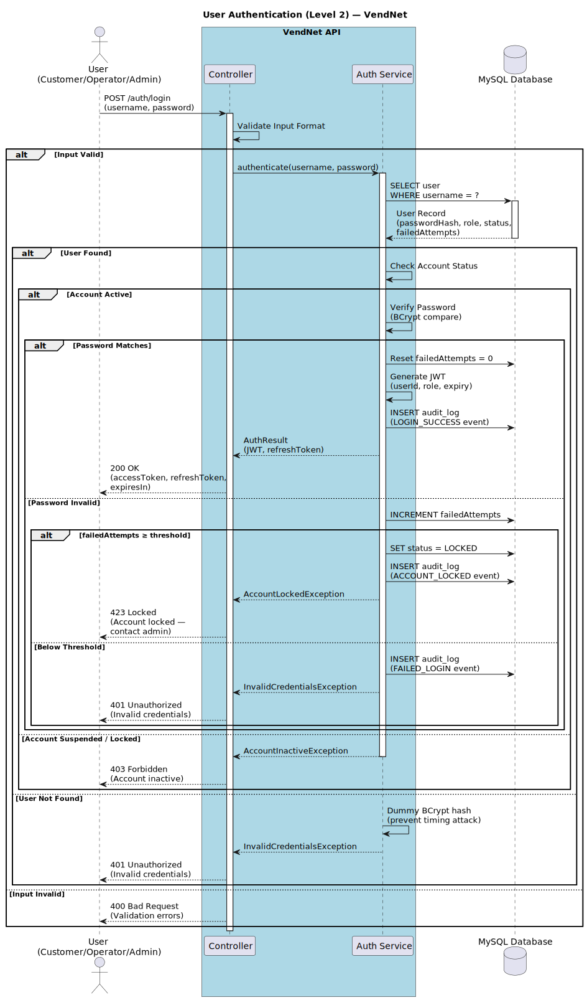

### L2 Purchase Product (Sales with Payment)

Shows the full container-level flow for a purchase: Controller authentication/validation, Sales Service orchestrating idempotency checks against the database, stock validation with locking, payment authorization through the external Payment Gateway, and all failure paths (declined, timeout, network failure). The database records sale status transitions (`COMPLETED`, `FAILED`, `PENDING_VERIFICATION`) and stores idempotency key mappings.

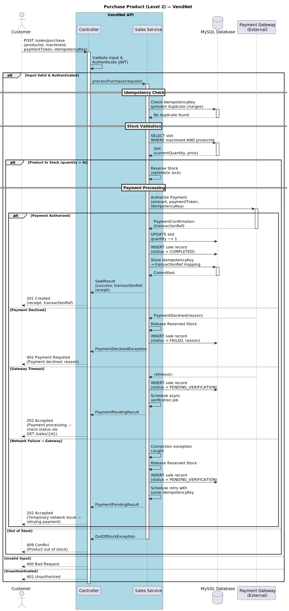

### L2 Machine Restock

Shows the container interactions for a restock operation: JWT validation with role extraction, Controller input validation, Slot Service querying the database with optimistic locking to handle concurrent modifications, and audit log insertion. Includes the concurrent modification detection path (409 Conflict).

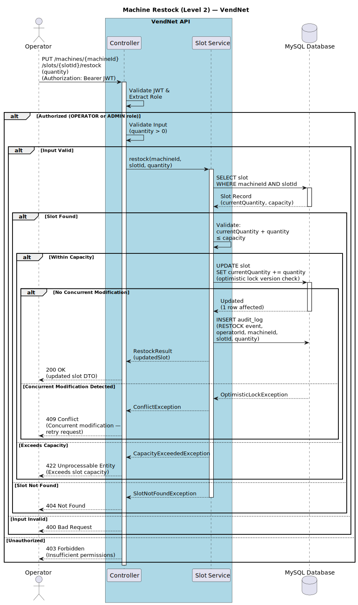

### L2 User Registration

Shows the container interactions for user creation: Controller validates the JWT and admin role, validates the DTO (username length, email format, password policy), User Service performs uniqueness checks against the database (separate queries for username and email), BCrypt hashes the password with cost factor 12, persists the user, and records an audit event.

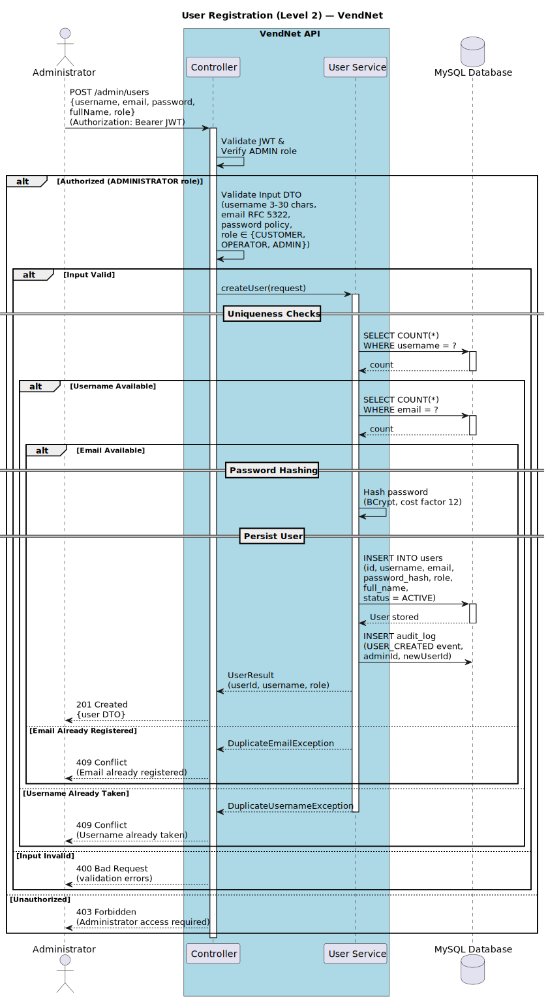

### L2 Create Product (with Secure Image Upload)

Shows the container-level flow for product creation with image upload: Controller validates JWT/admin role and product DTO, then delegates to a `FileValidationService` that executes a multi-layered file security pipeline — extension whitelist, magic bytes reading (first 16 bytes: `FF D8 FF` for JPEG, `89 50 4E 47` for PNG, `52 49 46 46...57 45 42 50` for WebP), `ImageIO.read()` decode verification (catches corrupt/crafted files that pass magic bytes), image re-encoding via `ImageIO.write()` (strips EXIF/XMP metadata, neutralizes polyglot payloads), and UUID filename generation. The re-encoded image is written to `/var/vendnet/images/` with POSIX `644` permissions. A `ProductService` then persists the product to the database with the stored image path and records an audit event. Security violations (disguised files, corrupt images) are logged as separate security events.

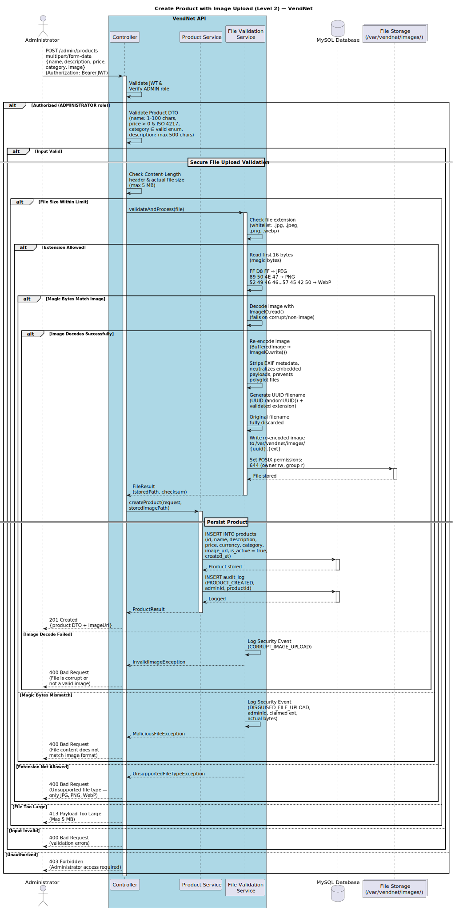

### L2 Telemetry Ingestion

Shows the container interactions for machine telemetry: the mTLS handshake authenticates the edge device, the Controller extracts the client certificate CN, the Telemetry Service verifies the machine identity against the database, applies rate limiting (preventing DoS from compromised machines), persists the telemetry record, updates machine status, and evaluates alert rules. Includes paths for rate limit exceeded (429), unknown/decommissioned machines (403), and invalid certificates (401).

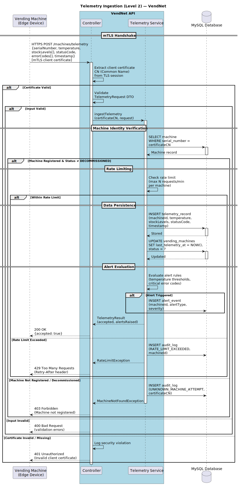

### L2 Encrypted Database Backup

Shows the interaction between the API application, MySQL database (for the dump), and the Server File System (for encrypted storage). Highlights path validation, the `mysqldump` process execution via ProcessBuilder, AES-256-GCM encryption, SHA-256 checksum generation, and audit logging of both successful backups and security violations.

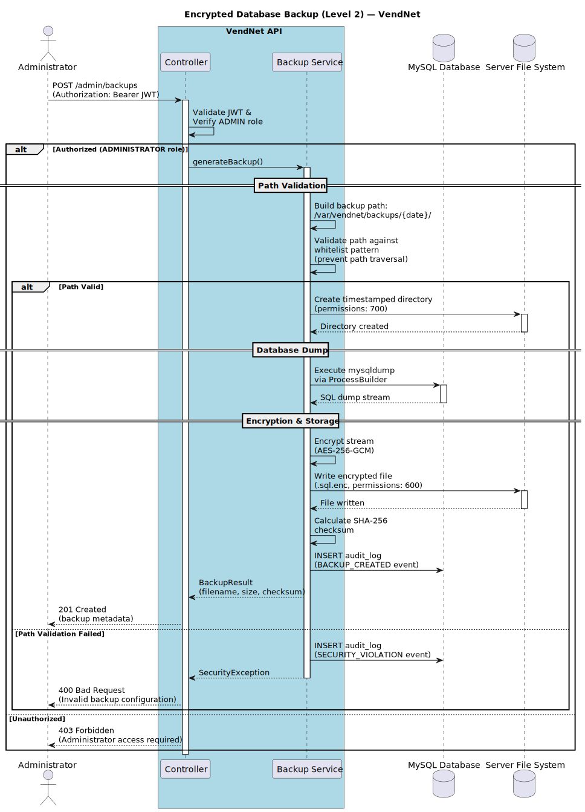

## Implementation View

The Implementation View at this level decomposes the VendNet system into its deployable containers and their infrastructure dependencies. The diagram shows a top-level system context with a zoomed-in view revealing:

- **VendNet Java Spring Backend** (`«component» «container (C4)»`): The core backend application exposing the REST API interface, connected to the MySQL DB via a Driver interface and to the File System Repository via a Linker interface.
- **Mobile App** (`«component» «container (C4)»`): Client application for customers.
- **Web Portals App** (`«component» «container (C4)»`): Web application for Admin Dashboard and Operator Portal, providing Dashboards access to Grafana.
- **MySQL DB** (`«component» «container (C4)»`): Relational database accessed by the backend via a Driver interface.
- **File System Repository** (`«component» «container (C4)»`): Server file system accessed by the backend via a Linker interface.
- **Grafana** (`«component» «container (C4)»`): Observability dashboards connected to the Web Portals App for Dashboards access, and receiving System Logs from the backend.
- **Open Telemetry** (`«component» «container (C4)»`): Telemetry collector receiving System Logs from the backend and feeding into Grafana.

### L2 - Implementation View

## Physical View

The Physical View illustrates how the system's containers are deployed onto infrastructure and how they communicate over the network. The diagram shows:

- **Client Devices** (localhost): Browser hosting the Web Portals App (Admin + Operator), plus Mobile App and Client UI.
- **Vending Machine Fleet (Edge Device):** Machine and Machine UI System communicating with the backend via HTTP/S + mTLS on port 8080.
- **GitHub:** Cloud and GitHub Actions for CI/CD, connected to the Docker Compose Network via git.
- **Application Server (Docker Host):** Hosts a Docker Compose Network containing:
  - **VendNet Java Spring Backend** on port 8080, receiving HTTP/S & JSON requests from client devices and vending machines.
  - **MySQL 8.4** on port 3306, accessed by the backend via JDBC.
  - **Grafana** on port 3000, providing dashboards accessed via HTTP/S.
  - **OpenTelemetry** on port 4317, receiving System Logs from the backend.
- **File System Repository** (`/var/vendnet/`): Stores backups, audit logs, and reports on the host file system.
- **Payment Gateway Provider (External):** External Payment Service with the Payment Gateway Interface, connected to the backend via HTTP/S & JSON.

### L2 - Physical View

## Mapping View

The Mapping View shows the correspondence between the Logical View (left) and the Implementation View (right) side-by-side, with `«manifest»` dependency arrows tracing how each logical container maps to its implementation artifact. The Logical View containers (Mobile App, VendNet Backend, Web Portals App) are mapped to their implementation counterparts (Mobile App, VendNet Java Spring Backend, Web Portals App, MySQL DB, File System Repository, Grafana, Open Telemetry) via manifest relationships.

### L2 - Mapping View

---

# Level 3 – Component View

At this level, we zoom into the **REST API Application** container to examine its internal components. The architecture follows a layered approach inspired by Clean Architecture and Domain-Driven Design (DDD).

## Logical View

The Logical View zooms into the **REST API VendNet System** container (`«component» «container (C4)»`) and reveals its internal layered architecture, organized from outermost (infrastructure) to innermost (domain). External interfaces shown at the boundary are: VendNet REST API, Vending Machine (Edge), System Files, and Payment Gateway.

### L3 - Logical View

### Layer Descriptions:

#### 1. Frameworks and Drivers Layer (outermost)

The outermost layer containing infrastructure components that interface with external systems:

- **Routing:** Handles HTTP request routing (connected to VendNet REST API and Vending Machine Edge interfaces).
- **Persistence (JPA Framework) — Core Data Store [MySQL]:** Database persistence infrastructure.
- **Filesystem Driver:** Interfaces with the System Files for backup and log storage.
- **Payment Driver:** Interfaces with the external Payment Gateway.

#### 2. Interface Adapters Layer

Adapters that convert data between the domain/application format and external formats:

- **Controller:** Receives HTTP requests from Routing and translates them into application-level calls.
- **Repository:** Provides data access abstraction, connected to the Persistence component.
- **Files Repository Linker:** Bridges application-level file operations to the Filesystem Driver.
- **Payment Adapter:** Bridges application-level payment operations to the Payment Driver.
- **DTO:** Data Transfer Objects connecting Controllers to Application Services via provided/required interfaces.
- **Data Model:** Mapping between persistence entities and domain objects.

#### 3. Application Business Rules Layer

Orchestrates use cases and coordinates the domain layer:

- **Application Service:** Implements use-case logic, consuming DTOs from the Interface Adapters layer and coordinating with the domain model and repository interfaces.

#### 4. Enterprise Business Rules Layer (innermost)

The core of the application, containing the domain model independent of any infrastructure concern:

- **Domain Model (DDD):** Core domain objects (Aggregates, Entities, Value Objects) encapsulating business rules and state. All upper layers depend inward toward this layer.

## Process View

The Process View at this level traces a request through the internal components of the REST API Application — Controllers, Application Services, Domain Aggregates, Repositories, and Infrastructure services. These diagrams reveal how Clean Architecture layers interact, where domain invariants are enforced, and how infrastructure concerns (database locking, encryption, external API calls) are isolated behind abstractions.

### L3 User Authentication

Traces the full authentication flow through internal components: `AuthController` validates the DTO, `AuthenticationService` coordinates with `UserRepository` to load the `User` aggregate, the domain model performs BCrypt verification and manages account lockout state, and `JwtTokenProvider` generates signed tokens. Key security details: timing-attack prevention via dummy BCrypt hash for missing users, domain-level failed attempt tracking, and audit event recording.

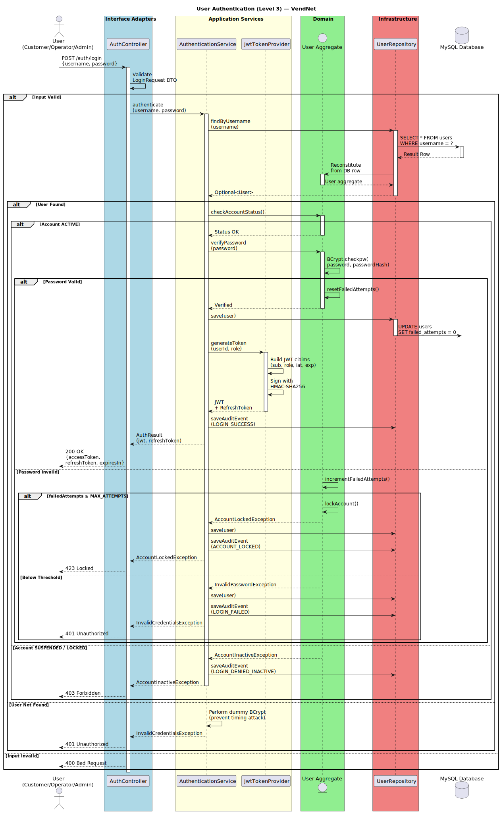

### L3 Purchase Product (Sales with Payment)

The most detailed diagram in the system — traces the purchase flow through all architectural layers. `SalesController` validates and authenticates, `PurchaseService` orchestrates the entire flow: `IdempotencyService` checks for duplicate requests against the database, `SlotRepository` retrieves the slot with a pessimistic lock (`SELECT ... FOR UPDATE`), the `Slot` aggregate validates stock and reserves a unit, `PaymentGatewayClient` calls the external gateway with the idempotency key, and the `Sale` aggregate enforces domain invariants (quantity ≥ 1, totalAmount = qty × price). All four failure paths are fully traced: payment declined (stock released, sale recorded as FAILED), gateway timeout (sale marked PENDING_VERIFICATION, async verification scheduled), network failure (retry scheduled with same idempotency key), and duplicate request (cached response returned).

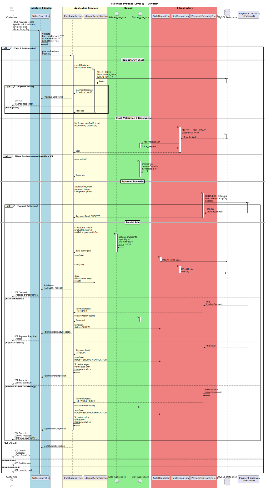

### L3 Machine Restock

Traces the restock operation through `SlotController`, `RestockService`, `MachineRepository`, and `SlotRepository`. The `VendingMachine` aggregate validates machine status (rejects if OFFLINE), the `Slot` aggregate enforces capacity constraints (`currentQuantity + quantity ≤ slotCapacity`), and the repository uses pessimistic locking (`SELECT ... FOR UPDATE`) to prevent concurrent modification. Audit events are recorded with operator identity, machine, slot, and quantity.

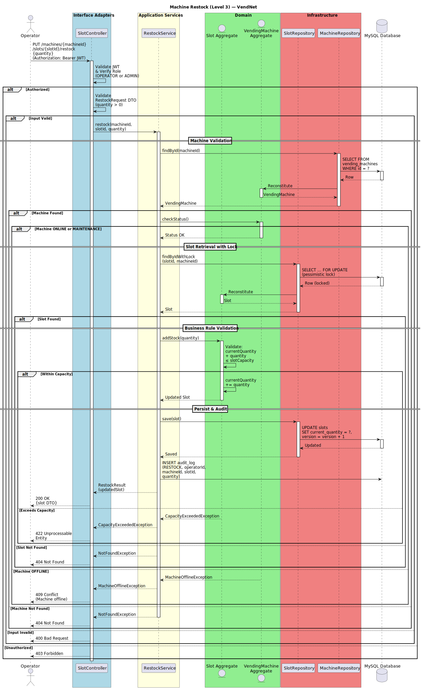

### L3 User Registration

Traces the registration flow through `UserController`, `UserRegistrationService`, `User` aggregate, and `UserRepository`. The controller validates the DTO (username 3-30 alphanumeric, email RFC 5322, password with minimum 12 chars + complexity rules). The service performs uniqueness checks via separate repository calls. The `User` aggregate enforces domain invariants during construction: validates username format, validates email format, hashes password via BCrypt with cost factor 12, sets initial status to `ACTIVE`, and generates a UUID. The response DTO never exposes the password hash.

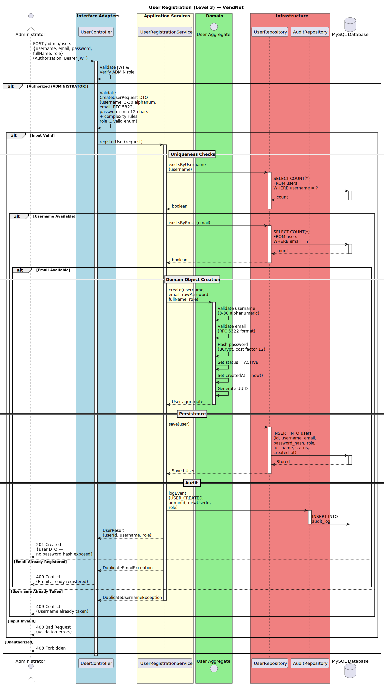

### L3 Create Product (with Secure Image Upload)

The most detailed view of the secure file upload pipeline — traces the flow through all architectural layers in five stages. **Stage 1 (File Security):** `FileValidationService` sanitizes the original filename (strips path components, rejects `..`), applies extension whitelist (case-insensitive), reads and cross-checks magic bytes against the claimed extension (rejects mismatches like a `.jpg` with PNG magic), decodes via `ImageIO.read()` to verify the file is a real image, re-encodes via `ImageIO.write()` to produce clean bytes (stripping all EXIF/XMP metadata and neutralizing embedded payloads), and computes a SHA-256 checksum. **Stage 2 (Storage):** `ImageStorageService` constructs the target path with canonical path resolution (prevents symlink traversal via `resolve().startsWith(allowedRoot)`), writes with `CREATE_NEW` semantics, and sets POSIX `640` permissions. **Stage 3 (Domain):** The `Product` aggregate enforces invariants — name validation (no HTML/script tags), price > 0 with scale ≤ 2, valid ISO 4217 currency. **Stage 4 (Persistence):** `ProductRepository` stores the product with image URL and checksum. **Stage 5 (Audit):** Records `PRODUCT_CREATED` with admin identity and image metadata. All security violations (disguised files, corrupt uploads) are logged via `AuditRepository`.

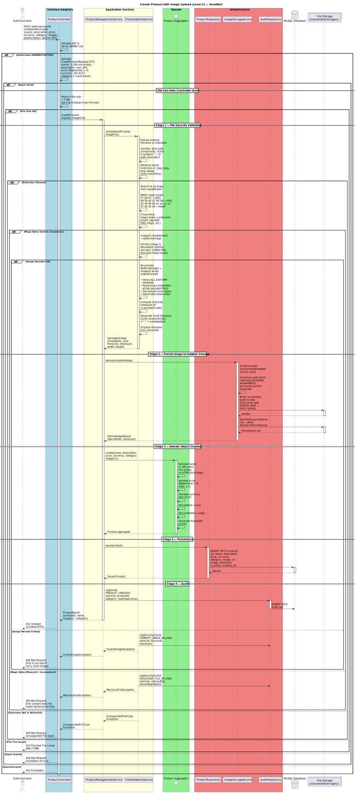

### L3 Telemetry Ingestion

Traces the full telemetry flow through `TelemetryController`, `TelemetryIngestionService`, `AlertEvaluationService`, `VendingMachine` aggregate, `MachineRepository`, and `TelemetryRepository`. Key security details: the X.509 client certificate CN is extracted from the Spring `SecurityContext`, then cross-checked against the `serialNumber` in the request body to prevent spoofing (a machine presenting a valid certificate but claiming to be a different machine). Rate limiting is enforced per-machine via database count queries. The `VendingMachine` aggregate updates its status based on the telemetry data. The `AlertEvaluationService` checks temperature thresholds, critical error codes, and minimum stock levels.

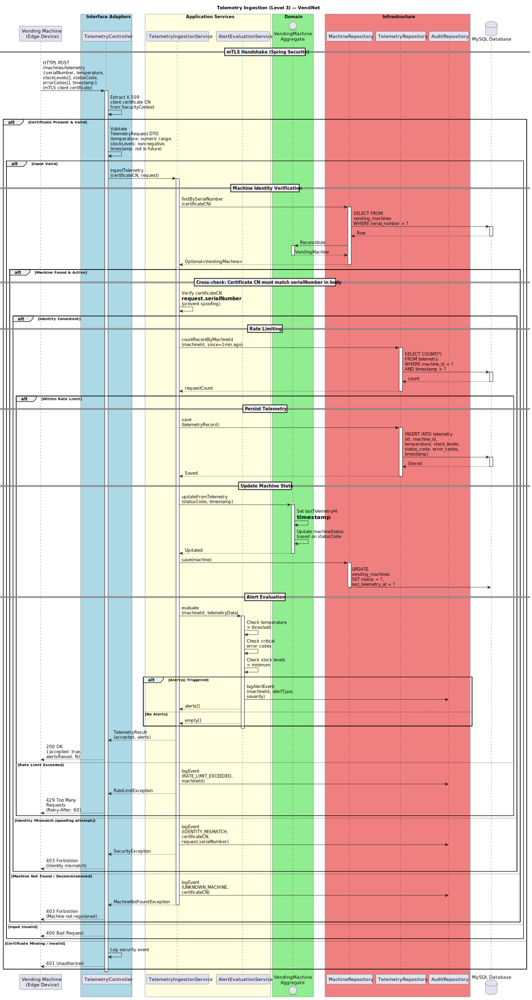

### L3 Encrypted Database Backup

Traces the backup flow through `BackupController`, `BackupService`, `OsOperationsService`, `EncryptionService`, and `AuditRepository`. Shows path construction and whitelist validation (regex pattern matching + canonicalization to prevent path traversal), `ProcessBuilder`-based mysqldump execution, AES-256-GCM encryption with random IV from a secure keystore, SHA-256 checksum generation, POSIX file permission setting, old backup rotation (30-day retention), and audit logging of both successful operations and security violations.

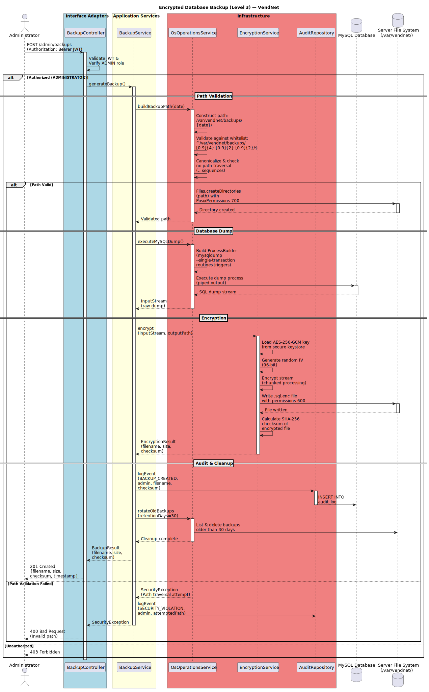

## Implementation View

The Implementation View shows how the layered architecture maps to the package structure within the **REST API VendNet System**. The diagram is organized top-down by layer:

- **Infrastructure:** Contains `Routes` (HTTP routing configuration) and `Persistence` (JPA/database access).
- **Interface Adapters:** Contains `Controllers` (REST controllers handling HTTP requests) and `Repositories` (repository interface implementations). Controllers depend on the Persistence layer.
- **Application Services / Use Case Services:** Contains `AppServices` package with `IAppServices` (service interfaces), `ImplAppServices` (service implementations), and `IRepositories` (repository interfaces). `ImplAppServices` depends on both `IAppServices` and `IRepositories`.
- **Entities / Core / Domain:** Contains `Aggregates`, `Value Objects`, and `Shared` domain model packages — the innermost layer with no outward dependencies.

### L3 - Implementation View

---

# Scenarios View (Use Cases)

The Scenarios View connects the architecture to user requirements. The use case diagram below shows the interactions between actors and the system's functional areas, organized by bounded context.

**Actors:**

- **Customer:** Interacts with Sales (UC8: Purchase Product, UC9: View Purchase History) and Product Catalog (UC3: Browse Product Catalog).
- **Vending Machine (Edge Device):** Participates in Sales (UC8: Purchase Product) and Machine Management (UC6: Receive Machine Telemetry).
- **Operator:** Interacts with Product Catalog (UC3: Browse Product Catalog), Machine Management (UC6: Receive Machine Telemetry), and Slot Management (UC7: Restock Machine Slots).
- **Administrator:** Has the broadest access — Identity & Access (UC2: Manage Users), Product Catalog (UC3, UC4), Machine Management (UC5, UC6), Slot Management (UC7), Observability (UC13: View Dashboards & Metrics), and OS Operations (UC10, UC11, UC12).

**Bounded contexts shown in the diagram:**

- **Sales:** UC8 (Purchase Product), UC9 (View Purchase History).
- **Product Catalog:** UC3 (Browse Product Catalog), UC4 (Manage Products & Pricing).
- **Machine Management:** UC5 (Manage Vending Machines), UC6 (Receive Machine Telemetry).
- **Identity & Access:** UC1 (Authenticate), UC2 (Manage Users). All protected use cases include UC1 via `«Include»` dependencies.
- **Slot Management:** UC7 (Restock Machine Slots).
- **Observability:** UC13 (View Dashboards & Metrics).
- **OS Operations:** UC10 (Generate Encrypted Backup), UC11 (Manage Audit Logs), UC12 (Generate Reports).

### Use Case Diagram

### Use Case Summary

| Use Case ID | Name                          | Primary Actor(s)                           | Description                                                                                                                                      |
| ----------- | ----------------------------- | ------------------------------------------ | ------------------------------------------------------------------------------------------------------------------------------------------------ |
| UC1         | **Authenticate**              | All users                                  | Users authenticate via credentials; system validates, tracks failed attempts, issues JWT tokens. All protected use cases include UC1.            |
| UC2         | **Manage Users**              | Administrator                              | Administrators can create, view, update, and disable user accounts with role assignment (Customer, Operator, Administrator).                     |
| UC3         | **Browse Product Catalog**    | Customer, Operator, Admin                  | View the product catalog with filtering and search. Available to all authenticated users.                                                        |
| UC4         | **Manage Products & Pricing** | Administrator                              | Administrators can create, update, deactivate products, and set pricing/categorization.                                                          |
| UC5         | **Manage Vending Machines**   | Administrator                              | Administrators can register, view, update, and decommission vending machines, including slot configuration.                                      |
| UC6         | **Receive Machine Telemetry** | Vending Machine, Operator                  | Vending machines send telemetry via mTLS; Operators view telemetry dashboards and machine logs.                                                  |
| UC7         | **Restock Machine Slots**     | Operator                                   | Operators update slot quantities, assign products to slots, and report machine issues.                                                           |
| UC8         | **Purchase Product**          | Customer, Vending Machine, Payment Gateway | Customer selects product; system processes payment through gateway, updates stock, records sale. Handles payment failures and idempotency.       |
| UC9         | **View Purchase History**     | Customer                                   | Customers browse their own purchase history with filtering by date and product.                                                                  |
| UC10        | **Generate Encrypted Backup** | Administrator                              | On-demand or scheduled encrypted database backups with AES-256, path validation, and audit logging.                                              |
| UC11        | **Manage Audit Logs**         | Administrator                              | System rotates, compresses, and archives audit logs following retention policy. Administrators can view logs.                                    |
| UC12        | **Generate Reports**          | Administrator                              | Trigger report generation (sales, stock, maintenance), creating structured directories and files on the server.                                  |
| UC13        | **View Dashboards & Metrics** | Administrator                              | View Grafana dashboards for system health, API latency, error rates, JVM metrics, and security events via the OpenTelemetry observability stack. |
