# Introduction

The combination of two architectural representation models will be adopted: **C4** and **4+1**.

## 4+1 View Model [Krutchen-1995]
The 4+1 View Model proposes describing the system through complementary views, allowing the requirements of various software stakeholders—such as users, system administrators, project managers, architects, and developers—to be analyzed separately. The views are defined as follows:

- **Logical view**: related to the software aspects that aim to address business challenges.
- **Process view**: related to the flow of processes or interactions within the system.
- **Development view**: related to the organization of the software in its development environment.
- **Physical view**: related to the mapping of various software components to hardware, i.e., where the software is executed.
- **Scenarios view**: related to the association of business processes with actors capable of triggering them.

## C4 Model [Brown-2020][C4-2020]
The C4 Model advocates describing the software through four levels of abstraction: system, container, component, and code. Each level adopts a finer granularity than the one preceding it, providing more detailed insights into progressively smaller parts of the system.

### Levels of the C4 Model
- **Level 1** – System Context: Provides a high-level overview of the system, its purpose, and how it interacts with external entities such as users and other systems.
- **Level 2** – Container: Breaks down the system into major deployable units (e.g., applications, databases, services), defining their responsibilities and interactions.
- **Level 3** – Component: Details the internal structure of each container, identifying key components and their roles in the system.

## Combining C4 and 4+1 Models

By combining these models, we create a comprehensive and multi-dimensional representation of VendNet. The **C4 model** organizes the system into different levels of detail, while the **4+1 model** represents the system from multiple perspectives relevant to different stakeholders.

---

# Level 1 – System Context

At the highest level of abstraction, the **System Context** provides a broad overview of VendNet, defining its purpose and how it interacts with external entities such as users, vending machines, and third-party payment services.

### System DDD

## Logical View

**VendNet** is a REST-oriented backend service designed to manage a geographically distributed vending machine network. It provides functionalities for managing machines, products, sales transactions, and users. The system integrates with external payment gateways and vending machine edge devices, and performs OS-level operations (backups, log rotation, report directory generation).

### L1 - Logical View

### Diagram Description:
The diagram illustrates the interactions between VendNet and its external environment:

- **VendNet System:** The core backend that processes API requests, manages business logic (users, machines, products, sales), and orchestrates data flow between actors, external systems, and persistence.
- **Vending Machine (Edge):** Physical devices that send telemetry data, report sales events, receive configuration/price updates, and communicate.
- **Payment Gateway:** External payment processor (e.g., Stripe, PayPal) used for card and mobile payments at vending machines.

## Process View

The Process View at this level illustrates the fundamental interactions between actors and the system for core CRUD operations.

### L1 Create Process

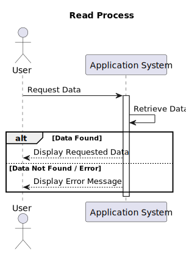

### L1 Read/List Process

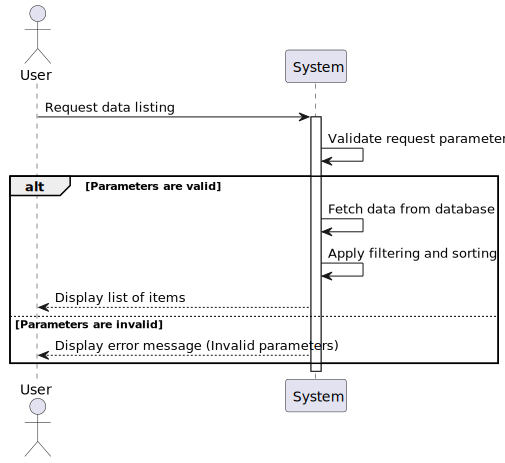

### L1 Update Process

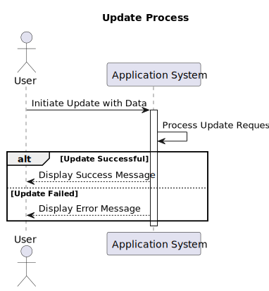

### L1 Delete Process

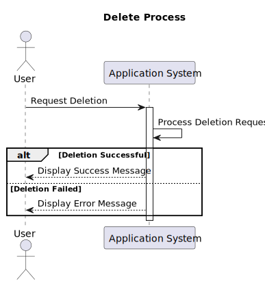

---

# Level 2 – Container View

At this level, we zoom into **VendNet** to identify its major deployable units ("containers"). Each container represents a separate running process or storage mechanism.

## Logical View

VendNet is composed of the following containers:

- **REST API Application (Java/Spring Boot):** The core backend handling all API requests, business logic, and external integrations.
- **MySQL Database:** Persistent relational storage for all domain data (users, machines, products, sales, audit events).
- **File System (OS):** Server file system used for backup storage, audit log rotation, and report directory generation.

### L2 - Logical View

### Diagram Description:

- **REST API Application (Java/Spring Boot):** The core of the system. This container handles all incoming API requests, executes business logic via DDD aggregates, and coordinates with the database and external services. It is a self-contained, deployable Spring Boot application.
- **MySQL Database:** Stores all persistent domain data with ACID compliance. Accessed via Spring Data JPA/Hibernate.
- **File System:** Managed via Java NIO for OS-level operations: encrypted backups (`/var/vendnet/backups/`), audit log rotation (`/var/vendnet/logs/audit/`), and vendor report directories (`/var/vendnet/reports/`).
- **Payment Gateway (External):** Processes payment transactions via HTTPS/JSON.
- **Vending Machine Fleet (External):** Edge devices communicating via HTTPS with mutual TLS authentication.

## Process View

The Process View at this level shows the sequence of interactions between containers for a typical CRUD operation.

### L2 Create Process

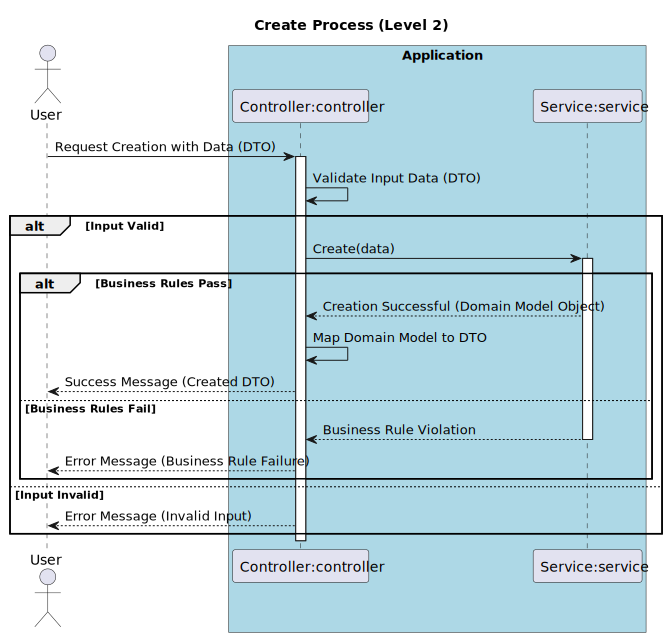

### L2 Read/List Process

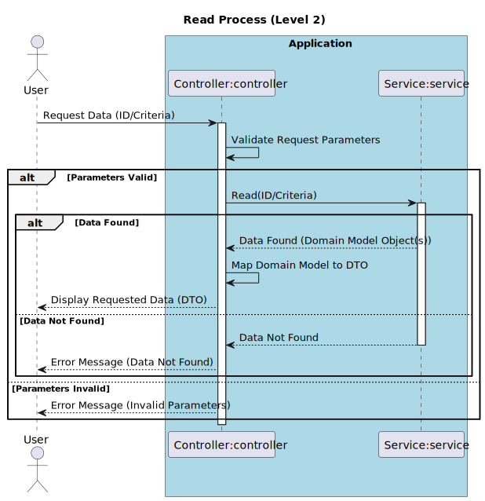

### L2 Update Process

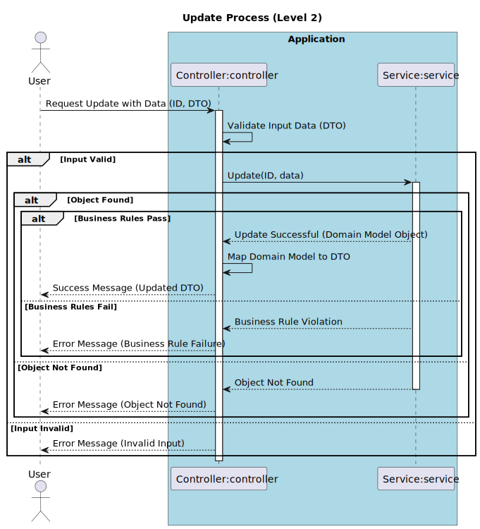

### L2 Delete Process

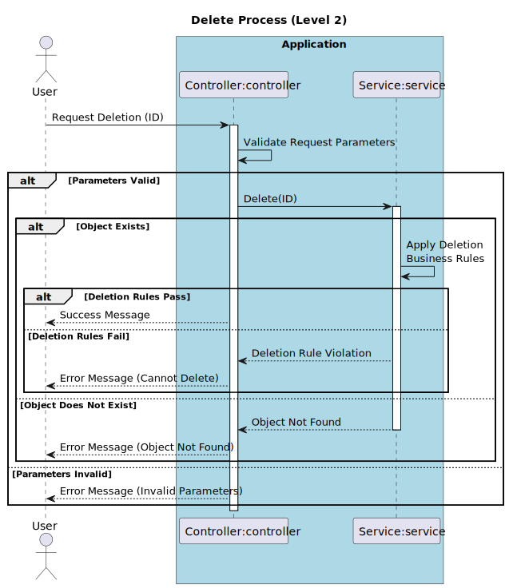

## Implementation View

The Implementation View describes how the software is organized in its development environment. VendNet follows a Gradle-based project structure with a layered DDD architecture.

### L2 - Implementation View

## Physical View

The Physical View illustrates how the system's containers are deployed onto infrastructure.

### L2 - Physical View

---

# Level 3 – Component View

At this level, we zoom into the **REST API Application** container to examine its internal components. The architecture follows a layered approach inspired by Clean Architecture and Domain-Driven Design (DDD).

## Logical View

The system is structured into distinct layers, each with a specific responsibility:

### L3 - Logical View

### Layer Descriptions:

#### 1. Enterprise Business Rules (Domain Layer)
The core of the application, containing the domain model and business logic independent of any infrastructure concern.
- **Aggregates & Entities:** Core domain objects like `User`, `VendingMachine`, `Product`, and `Sale`, encapsulating business rules and state.
- **Value Objects:** Immutable types like `Price`, `Location`, `PaymentInfo`, `Email`.
- **Domain Events:** Events like `SaleCompleted`, `SlotRestocked`, `UserRegistered`.

#### 2. Application Business Rules (Application Layer)
Orchestrates use cases, directs the domain layer, with no knowledge of UI, databases, or external frameworks.
- **Application Services:** Implements use-case logic (e.g., `ProcessSaleService`, `RestockMachineService`), coordinating between repositories and the domain model.

#### 3. Interface Adapters Layer
Adapters that convert data between the domain/application format and external formats.
- **Controllers:** Handles incoming HTTP requests, validates input, calls appropriate application services.
- **Repositories (Interfaces):** Abstraction over data persistence.
- **DTOs:** Data Transfer Objects for API request/response serialization.

#### 4. Framework and Driver Layer
Frameworks, tools, and drivers.
- **Spring Web:** API routing and HTTP server.
- **Spring Data JPA / Hibernate:** Repository interface implementations for MySQL.
- **OS Operations Service:** Java NIO-based service for backups, log rotation, report directories.
- **Payment Gateway Client:** HTTP client for external payment processor integration.

## Process View

The Process View traces a request through the components within the REST API Application.

### L3 Create Process

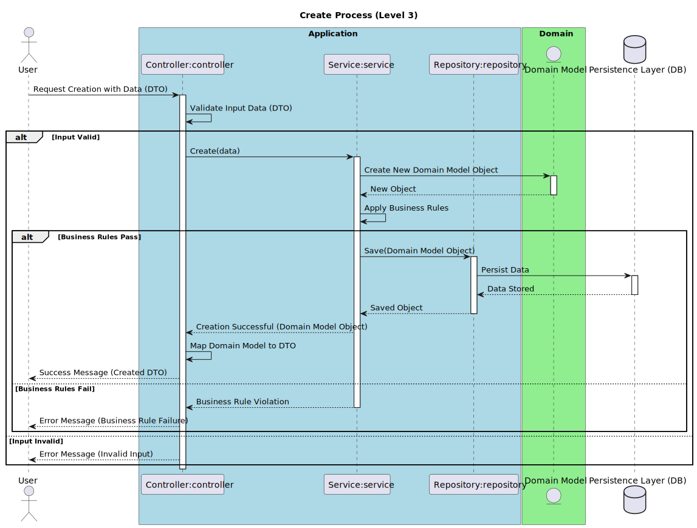

### L3 Read/List Process

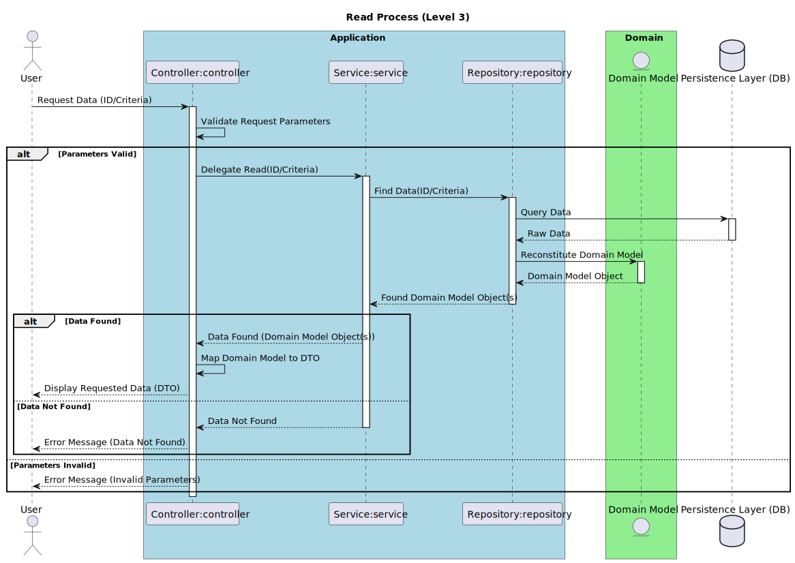

### L3 Update Process

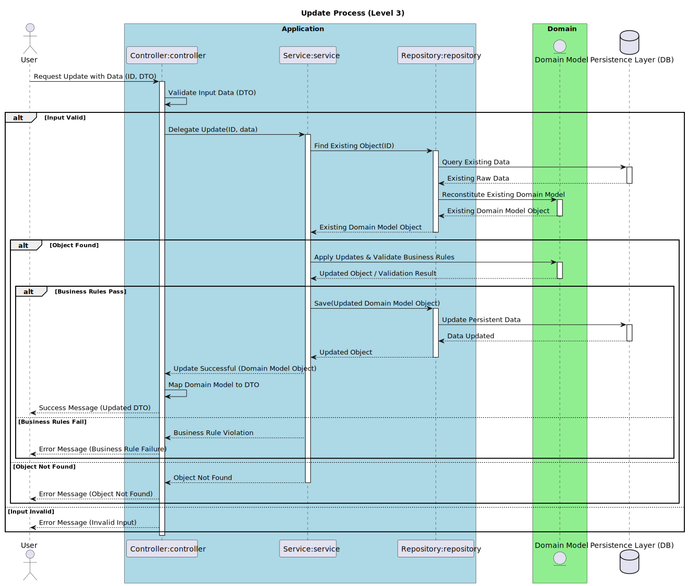

### L3 Delete Process

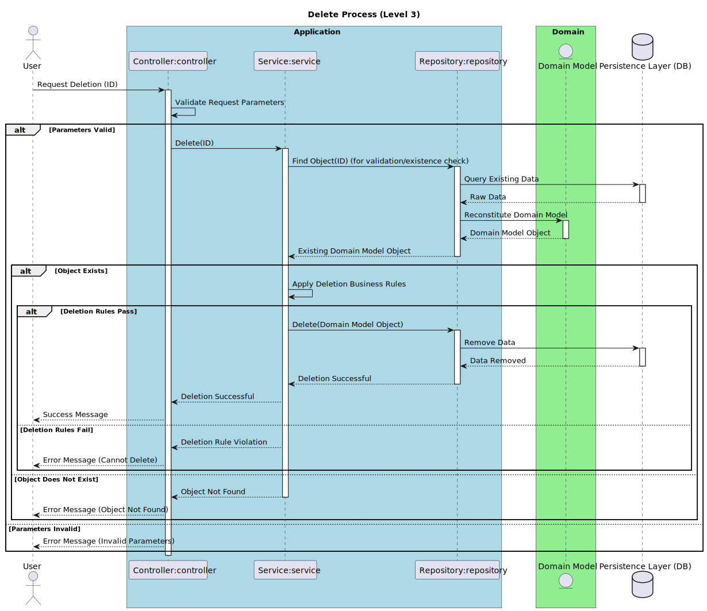

## Implementation View

The Implementation View shows how components map to the package structure within the project:

- `{aggregate}management.model`: Core domain model (Aggregates, Entities, Value Objects).
- `{aggregate}management.services`: Application services and use case implementations.
- `{aggregate}management.api`: REST controllers and DTOs for the web layer.
- `{aggregate}management.repositories`: Repository interfaces and implementations.
- `infrastructure.os`: OS-level operations (backup, log rotation, report generation).
- `infrastructure.security`: Authentication, authorization, JWT handling.

### L3 - Implementation View

---

# Scenarios View (Use Cases)

The Scenarios View connects the architecture to user requirements. Below is a summary of the primary use cases that VendNet supports.

| Use Case ID | Description |
|-------------|-------------|
| UC1 | **Manage Users:** Administrators can create, view, update, and disable user accounts with role assignment (Customer, Operator, Administrator). |
| UC2 | **Manage Products:** Administrators can create, view, update, and deactivate products in the catalog, including pricing and categorization. |
| UC3 | **Manage Vending Machines:** Administrators can register, view, update, and decommission vending machines, including slot configuration. |
| UC4 | **Restock Machines:** Operators can update slot quantities, assign products to slots, and report machine issues. |
| UC5 | **Process Sales:** The system processes purchase transactions from vending machines, integrating with the payment gateway and updating stock levels. |
| UC6 | **View Catalog & Purchase History:** Customers can browse the product catalog and view their own purchase history. |
| UC7 | **Receive Telemetry:** The system ingests telemetry data from vending machines (status, stock levels, error codes). |
| UC8 | **Generate Reports:** Administrators can trigger report generation (sales, stock, maintenance), which creates structured directories and files on the server. |
| UC9 | **Manage Backups:** The system performs scheduled encrypted database backups and supports on-demand backup triggers by Administrators. |
| UC10 | **Audit Log Management:** The system rotates, compresses, and archives audit logs following a defined retention policy. |
