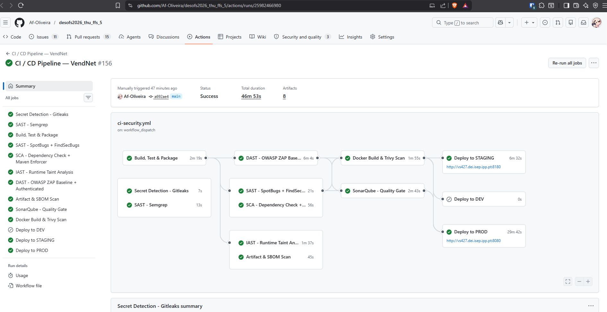
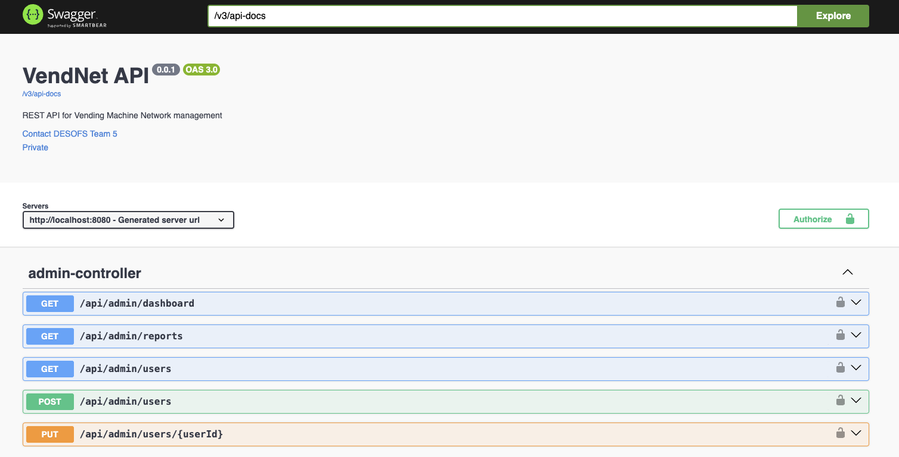
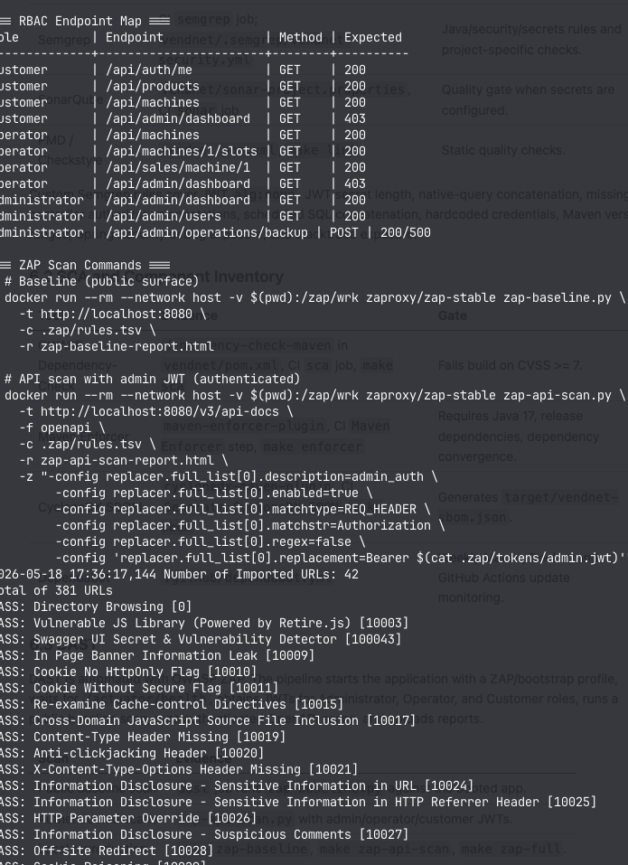
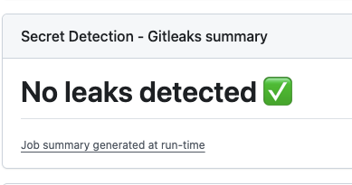

# DESOFS 2025/2026 — Project Phase 2: Sprint 1 Deliverable

## VendNet — Development, Testing, and DevSecOps Pipeline Report

| Field | Value |
|---|---|
| Course | Desenvolvimento de Software Seguro (DESOFS) |
| Deliverable | Project: Phase 2 — Sprint 1 |
| Submission milestone | 18/05/2026 |
| Repository | `desofs2026_thu_ffs_5` |
| System | VendNet — Vending Machine Network back-end |
| Main application | `vendnet/` |
| Technology stack | Java 17, Spring Boot 3.5.x, Maven, MySQL, Docker, GitHub Actions |

---

## 1. Executive Summary

Sprint 1 focused on converting the Phase 1 SSDLC analysis and design artifacts into executable security gates. The result is a Spring Boot back-end supported by an automated DevSecOps pipeline covering build, tests, SAST, SCA, DAST, IAST-style runtime taint tracking, SBOM generation, artifact/image scanning, secret detection, architecture validation, and deployment smoke checks.

The implemented work directly supports the Phase 2 Sprint 1 rubric:

| Rubric criterion | Evidence in this sprint |
|---|---|
| Organization and Language | This report links every major claim to repository files, commands, tests, or deliverable references. |
| Development | VendNet implements a REST API with DDD-inspired layers, multiple aggregates, RBAC roles, JWT authentication, OS-level operations, audit/security controls, and MySQL persistence support. |
| Build and Test | Maven build, JUnit/Spring tests, ArchUnit architecture tests, abuse-case regression tests, IAST tests, E2E tests, JaCoCo coverage, and generated Surefire reports. |
| Pipeline Automation | `.github/workflows/ci-security.yml`, root `Makefile`, `vendnet/Makefile`, Dockerfile, Docker Compose profiles, ZAP automation, Trivy, Gitleaks, Dependency-Check, SonarQube, and Dependabot. |
| ASVS | Sprint security controls are mapped to Phase 1 security requirements and ASVS references, especially authentication, authorization, validation, file handling, logging, and component analysis. |



---

## 2. Project Context and Sprint Scope

VendNet is a centralized REST API for managing a distributed vending-machine network. Phase 1 defined the domain, threat model, abuse cases, mitigations, requirements, secure architecture, and security test plan. Sprint 1 implemented and automated the first executable controls needed to prove those plans are being enforced during development.

### 2.1 Phase 1 Inputs Used

| Phase 1 artifact | Relevance for Sprint 1 |
|---|---|
| `Deliverables/Phase1/Report/01_System_Overview.md` | Defines REST API, MySQL, RBAC roles, OS-level operations, and technology stack. |
| `Deliverables/Phase1/Report/02_Domain_Model.md` | Defines bounded contexts and aggregates: `User`, `VendingMachine`, `Slot`, `Product`, and `Sale`. |
| `Deliverables/Phase1/Report/05_Abuse_Cases.md` | Defines AC-01 through AC-08, used as regression-test and DAST/IAST guidance. |
| `Deliverables/Phase1/Report/08_Requirements.md` | Defines FR/NFR/SR requirements and ASVS references, especially SR-01 through SR-46. |
| `Deliverables/Phase1/Report/09_Security_Testing.md` | Defines SAST, DAST, SCA, IAST, integration, and abuse-case testing methodology. |
| `Deliverables/Phase1/ASVS_Checklist/ASVS_5.0_Tracker.md` | Baseline ASVS tracker used for Sprint 1 traceability. |

### 2.2 Sprint 1 Objectives

| Objective | Status | Evidence |
|---|---:|---|
| Build and test the back-end on every push/PR | Done | `.github/workflows/ci-security.yml`, `vendnet/pom.xml`, `vendnet/Makefile` |
| Automate SAST and code-quality checks | Done | SpotBugs/FindSecBugs, Semgrep, SonarQube configuration |
| Automate SCA and dependency governance | Done | OWASP Dependency-Check, Maven Enforcer, CycloneDX SBOM, Dependabot |
| Add security regression tests derived from abuse cases | Done | `vendnet/src/test/java/pt/isep/desofs/vendnet/AbuseCaseRegressionTest.java` |
| Add architecture and authorization tests | Done | `LayeredArchitectureTest.java`, `SecurityAnnotationArchTest.java` |
| Add runtime taint tracking/IAST-style tests | Done | `IastTaintTrackingFilter.java`, `IastIntegrationTest.java` |
| Automate DAST with OWASP ZAP | Done | `.github/workflows/ci-security.yml`, `vendnet/Makefile`, `.zap/` |
| Harden container build and scan images/artifacts | Done | `vendnet/Dockerfile`, Trivy jobs, artifact scan job |
| Provide local reproducibility through Makefiles | Done | root `Makefile`, `vendnet/Makefile` |

---

## 3. Development Work Completed

### 3.1 Back-end Architecture

The implemented back-end follows the layered architecture specified in Phase 1:

| Layer | Package / artifact | Responsibility |
|---|---|---|
| API | `vendnet/src/main/java/.../api/controller/` | REST endpoints, DTO handling, request/response boundaries |
| Application | `vendnet/src/main/java/.../application/service/` | Use-case orchestration, authentication, business flows |
| Domain | `vendnet/src/main/java/.../domain/model/` | Aggregates and domain objects |
| Infrastructure | `vendnet/src/main/java/.../infrastructure/` | Persistence, security filters, OS/file operations, external concerns |
| Configuration | `vendnet/src/main/java/.../config/` | Spring Security, bootstrap, observability, application configuration |

This structure is enforced by ArchUnit tests in:

- `vendnet/src/test/java/pt/isep/desofs/vendnet/LayeredArchitectureTest.java`
- `vendnet/src/test/java/pt/isep/desofs/vendnet/architecture/LayeredArchitectureArchTest.java`
- `vendnet/src/test/java/pt/isep/desofs/vendnet/architecture/NamingConventionArchTest.java`

### 3.2 Domain-Driven Design Coverage

The project requirement asks for at least three aggregates. VendNet implements more than the minimum:

| Aggregate | Evidence |
|---|---|
| `User` | `domain/model/user/`, authentication/RBAC tests, user management tests |
| `VendingMachine` | `domain/model/machine/`, `MachineController`, `MachineServiceTest` |
| `Slot` | `domain/model/slot/`, stock and inventory tests |
| `Product` | `domain/model/product/`, catalog tests |
| `Sale` | `domain/model/sale/`, sales service and purchase tests |
| `AuditLog` / telemetry models | Audit and monitoring support for security events |

### 3.3 Authorization and Authentication

Sprint 1 implements role-based access control with three roles:

- **Customer**
- **Operator**
- **Administrator**

Key evidence:

| Control | Evidence |
|---|---|
| Method-level security enabled | `SecurityConfig.java` uses `@EnableMethodSecurity`. |
| Stateless JWT authentication | `JwtAuthenticationFilter.java`, `JwtService.java`. |
| JWT `alg:none` rejection | `JwtService.rejectAlgNone(...)`, `AbuseCaseRegressionTest.jwt_withAlgNone_isRejected`. |
| Strong JWT secret guard | `JwtService` rejects secrets shorter than 32 characters. |
| Account status validation | `JwtAuthenticationFilter` blocks suspended and locked users. |
| Controller authorization annotations | `LayeredArchitectureTest.every_public_controller_method_has_PreAuthorize_annotation`. |
| RBAC integration testing | `RbacIntegrationTest.java`. |

### 3.4 OS-Level Backend Functionality

The project specification requires back-end execution of operating system functionality such as creating directories and reading/writing files. Sprint 1 includes OS/file operations with security validation:

| Feature | Evidence | Security relevance |
|---|---|---|
| Backup generation | `BackupServiceImpl.java` | Uses `ProcessBuilder` to invoke `mysqldump`, writes under the VendNet storage sandbox, encrypts output with AES-GCM, and records audit events. |
| Backup rotation | `BackupServiceImpl.rotateBackups(...)` | Deletes expired backup directories inside the validated sandbox. |
| Report directory creation | `ReportDirectoryServiceImpl.java` | Creates report directories with `Files.createDirectories(...)` only for allowlisted report types. |
| Path validation abstraction | `PathValidator.java` | Central point for sandbox validation and symlink checks. |
| Admin-only operations endpoint | `OperationsController.java` | Exposes `/api/admin/operations/backup` and `/api/admin/operations/reports/sales` with `@PreAuthorize("hasRole('ADMINISTRATOR')")`. |



---

## 4. DevSecOps Pipeline Implementation

The main automated pipeline is `.github/workflows/ci-security.yml`. It is supported by `.github/dependabot.yml`, the root `Makefile`, `vendnet/Makefile`, `vendnet/pom.xml`, `vendnet/Dockerfile`, Docker Compose files, and `.zap/` ZAP automation.

### 4.1 Pipeline Stages

| Stage | Job / command | Security purpose |
|---|---|---|
| Secret detection | `secret-detect` using Gitleaks | Prevent committed credentials and API keys. |
| Semgrep SAST | `semgrep` job | Static checks for Java and secrets; custom rules are stored in `vendnet/.semgrep/vendnet-security.yml`. |
| Build, test, package | `build` job with `./mvnw verify -P integration-test` | Compiles, runs unit/integration/architecture/security tests, uploads reports. |
| Coverage gate | JaCoCo via Maven profile `ci-security` | Enforces domain/application coverage threshold. |
| SBOM generation | CycloneDX Maven plugin | Produces `vendnet-sbom.json` for component inventory. |
| SpotBugs + FindSecBugs | `sast` job | Java bytecode/static security analysis. |
| SCA | `sca` job | Maven Enforcer and OWASP Dependency-Check fail on high CVSS findings. |
| IAST-style runtime gate | `iast` job | Runs custom taint-tracking integration tests. |
| SonarQube | `sonar` job | Quality gate when Sonar secrets are configured. |
| Docker + Trivy | `docker-build` job | Builds container image and scans for high/critical CVEs. |
| DAST | `dast` job | Starts the app and runs OWASP ZAP baseline plus authenticated API scans. |
| Artifact scan | `artifact-scan` job | Nightly/manual JAR filesystem scan with Trivy and SBOM upload. |
| Deployment smoke tests | `deploy-dev`, `deploy-staging`, `deploy-prod` | Loads image on target environment and checks `/actuator/health`. |

### 4.2 Local Pipeline Reproducibility

Run from the repository root:

```bash
make pipeline
make security-scan
make smoke-test-stage
```

Run from `vendnet/`:

```bash
make test
make verify
make coverage
make sast
make sca
make archunit
make abuse-tests
make integration-test
make sbom
make enforcer
make docker-build
make docker-scan
make secret-scan
make zap-baseline
make zap-api-scan
make zap-full
make ci-local-pipeline
```

---

## 5. Build and Test Evidence

### 5.1 Tooling

| Tool | Evidence | Purpose |
|---|---|---|
| Maven Wrapper | `vendnet/mvnw` | Reproducible build execution. |
| JUnit 5 / Spring Boot Test | `spring-boot-starter-test`, test classes | Unit and integration tests. |
| Spring Security Test | `spring-security-test` | Authentication and authorization testing. |
| Testcontainers | `testcontainers`, `mysql` | Integration testing with real database-compatible flows. |
| ArchUnit | `archunit-junit5` | Enforces DDD/layering/security annotation rules. |
| JaCoCo | `jacoco-maven-plugin` | Coverage report and CI coverage gate. |
| Maven Failsafe | `integration-test`, `iast`, `e2e` profiles | Integration, IAST, and end-to-end test separation. |

### 5.2 Current Local Test Evidence

The generated Surefire reports under `vendnet/target/surefire-reports/` currently summarize:

| Metric | Value |
|---|---:|
| Test report XML files | 31 |
| Total tests | 241 |
| Failures | 0 |
| Errors | 0 |
| Skipped | 0 |

Representative test suites:

- `AbuseCaseRegressionTest.java`
- `IastIntegrationTest.java`
- `LayeredArchitectureTest.java`
- `RbacIntegrationTest.java`
- `SecurityAnnotationArchTest.java`
- `AuthControllerIntegrationTest.java`
- `ControllerIntegrationTests.java`
- `SystemFunctionalTests.java`
- `domain/model/**/**Test.java`
- `application/service/**Test.java`

---

## 6. Security Testing Evidence

### 6.1 SAST

| Tool | Evidence | Gate |
|---|---|---|
| SpotBugs + FindSecBugs | `vendnet/pom.xml`, CI `sast` job, `make sast` | Max effort, Low threshold. |
| Semgrep | CI `semgrep` job; `vendnet/.semgrep/vendnet-security.yml` | Java/security/secrets rules and project-specific checks. |
| SonarQube | `vendnet/sonar-project.properties`, CI `sonar` job | Quality gate when secrets are configured. |
| PMD / Checkstyle | `vendnet/pom.xml`, `make lint` | Static quality checks. |

Custom Semgrep rules cover JWT `alg:none`, JWT secret length, native-query concatenation, missing controller authorization annotations, scheduled SQL concatenation, hardcoded credentials, Maven version ranges, Spring Security debug exposure, and stacktrace exposure.


### 6.2 SCA and Component Inventory

| Tool | Evidence | Gate |
|---|---|---|
| OWASP Dependency-Check | `dependency-check-maven` in `vendnet/pom.xml`, CI `sca` job, `make sca` | Fails build on CVSS >= 7. |
| Maven Enforcer | `maven-enforcer-plugin`, CI `Maven Enforcer` step, `make enforcer` | Requires Java 17, release dependencies, dependency convergence. |
| CycloneDX SBOM | `cyclonedx-maven-plugin`, CI `Generate CycloneDX SBOM`, `make sbom` | Generates `target/vendnet-sbom.json`. |
| Dependabot | `.github/dependabot.yml` | Weekly Maven, Docker, and GitHub Actions update monitoring. |

### 6.3 DAST

DAST is automated with OWASP ZAP. The pipeline starts the application with a ZAP/bootstrap profile, waits for `/actuator/health`, obtains JWTs for Administrator, Operator, and Customer roles, runs a public baseline scan, runs authenticated OpenAPI scans, and uploads reports.

| Scan | Evidence |
|---|---|
| Public baseline scan | `dast` job runs `zap-baseline.py` against the booted app. |
| Authenticated scans | `zap-api-scan.py` with admin/operator/customer JWTs. |
| Local reproduction | `make zap-baseline`, `make zap-api-scan`, `make zap-full`. |



### 6.4 IAST-Style Runtime Taint Tracking

Sprint 1 implements a custom runtime taint tracker:

- `vendnet/src/main/java/.../infrastructure/security/IastTaintTrackingFilter.java`
- `vendnet/src/main/java/.../infrastructure/security/TaintAwareHttpServletResponseWrapper.java`
- `vendnet/src/test/java/pt/isep/desofs/vendnet/IastIntegrationTest.java`

The filter detects suspicious runtime flows such as SQL injection-like query parameters, path traversal-like inputs, and command-injection-like shell metacharacters. The IAST build gate fails if confirmed exploitable command-injection flows reach a successful `2xx` response.


### 6.5 Secret Detection

| Control | Evidence |
|---|---|
| CI secret scan | `.github/workflows/ci-security.yml` job `Secret Detection - Gitleaks`. |
| Pre-commit protection | `vendnet/.pre-commit-config.yaml`. |
| Gitleaks configuration | `vendnet/.gitleaks.toml` and root `.gitleaks.toml`. |
| Local command | `make secret-scan` from `vendnet/`. |




### 6.6 Container and Artifact Scanning

| Control | Evidence |
|---|---|
| Hardened multi-stage image | `vendnet/Dockerfile` uses JDK build stage and JRE Alpine runtime stage. |
| Non-root runtime user | Dockerfile creates and runs as `vendnet:vendnet`. |
| Healthcheck | Dockerfile healthchecks `/actuator/health`. |
| Image scan | CI `Docker Build & Trivy Scan`, `make docker-scan`. |
| JAR filesystem scan | CI `artifact-scan` job with Trivy filesystem mode. |

---

## 7. Abuse Case Regression Coverage

| Abuse case | Sprint 1 executable evidence | Related SR / ASVS |
|---|---|---|
| AC-01 — OS command injection via backup endpoint | `backupEndpoint_requiresAdminRole`, `backupEndpoint_adminCanTrigger`, IAST command-injection detection | SR-06, SR-26, SR-42 / V4.1.2, V5.3.6, V7.1.3 |
| AC-02 — Forged payment webhook | Missing/invalid/forged/modified signature tests | SR-19 / V9.1.3 |
| AC-03 — Client-supplied price manipulation | Sale structure verification; sales service tests | SR-24 / V5.1.1 |
| AC-04 — JWT `alg:none` bypass | `jwt_withAlgNone_isRejected`; Semgrep JWT rules | SR-03, SR-04 / V2.2.1, V2.2.2 |
| AC-05 — SQL injection | SQLi payload regression test; Semgrep native query rule; IAST SQL taint test | SR-09 / V5.2.1 |
| AC-06 — Path traversal | Path traversal regression test; path sandbox services; IAST path taint test | SR-26, SR-27 / V5.3.6, V5.3.7 |
| AC-07 — TOCTOU stock race | Slot structure/domain tests and inventory tests | SR-15, SR-25 / V5.2.5, V5.1.2 |
| AC-08 — Telemetry flood | Telemetry endpoint regression and monitoring hooks | SR-18, SR-30, SR-31 / V9.1.2, V5.1.5 |

---

## 8. ASVS Traceability

The detailed Phase 1 tracker remains in `Deliverables/Phase1/ASVS_Checklist/ASVS_5.0_Tracker.md`. Sprint 1 adds implementation and pipeline evidence for the following ASVS areas:

| ASVS area | Requirement | Sprint 1 evidence |
|---|---|---|
| V1.2 Injection Prevention | SR-09, SR-10 | JPA/ORM usage, Semgrep native-query rule, SpotBugs/FindSecBugs, IAST SQL taint tests. |
| V2.3 Business Logic Security | SR-15, SR-24, SR-25 | Sales/slot domain tests, abuse-case tests, server-side sale invariants. |
| V4.1 Access Control | SR-02, SR-06, SR-08 | `@PreAuthorize`, `@EnableMethodSecurity`, ArchUnit security annotation tests, RBAC integration tests. |
| V5 File Handling | SR-26, SR-27 | `PathValidator`, sandboxed report/backup services, path traversal tests. |
| V6 Authentication | SR-01, SR-03, SR-04, SR-07 | JWT service, BCrypt, JWT secret length guard, `alg:none` rejection, authentication tests. |
| V7 Session / Token Handling | SR-05, SR-08 | Stateless JWT filter, account status validation, token blocklist support. |
| V9 Token Security | SR-03, SR-04 | Signed JWT parsing with required key verification and explicit `alg:none` rejection. |
| V11 Cryptography | SR-14, SR-19 | AES-GCM backup encryption, HMAC webhook verification tests. |
| V14 Configuration / Components | SR-32, SR-33, SR-34 | Dependency-Check, Maven Enforcer, CycloneDX, Dependabot, Trivy. |
| V16 Logging and Errors | SR-37 to SR-46 | Audit log model, backup audit events, CI properties disabling stacktrace/error details. |

---

## 9. Artifact Inventory

### 9.1 Pipeline and Automation Files

| File | Purpose |
|---|---|
| `.github/workflows/ci-security.yml` | Main CI/CD security pipeline. |
| `.github/workflows/ci.yml` | Legacy/manual workflow compatibility. |
| `.github/dependabot.yml` | Weekly dependency update monitoring for Maven, Docker, and GitHub Actions. |
| `Makefile` | Repository-level build, environment, deployment, smoke-test, and security-scan automation. |
| `vendnet/Makefile` | Application-level local developer automation for build/test/SAST/SCA/DAST/E2E/SBOM/Trivy/Gitleaks. |
| `docker-compose.yml`, `docker-compose.dev.yml`, `docker-compose.stage.yml`, `docker-compose.prod.yml` | Local, development, staging, and production-like environments. |

### 9.2 Build, Security, and Quality Files

| File | Purpose |
|---|---|
| `vendnet/pom.xml` | Maven build, plugins, profiles, SAST/SCA/SBOM/coverage configuration. |
| `vendnet/Dockerfile` | Hardened multi-stage image with non-root runtime user. |
| `vendnet/sonar-project.properties` | SonarQube project configuration. |
| `vendnet/.semgrep/vendnet-security.yml` | Project-specific Semgrep security rules. |
| `vendnet/.pre-commit-config.yaml` | Pre-commit Gitleaks hook. |
| `vendnet/.gitleaks.toml` | Gitleaks allowlist/configuration. |
| `vendnet/dependency-check-suppressions.xml`, `vendnet/owasp-suppressions.xml` | Dependency-Check suppression support. |
| `vendnet/checkstyle.xml`, `vendnet/pmd-ruleset.xml` | Code quality configuration. |

### 9.3 DAST and E2E Files

| File | Purpose |
|---|---|
| `.zap/rules.tsv` | ZAP scan policy. |
| `.zap/seed-data.sh` | ZAP authentication token seeding. |
| `vendnet/e2e/README.md` | E2E testing documentation. |
| `vendnet/e2e/run-e2e.sh` | E2E execution script. |
| `vendnet/e2e/*.postman_collection.json` | Newman/Postman test collection. |
| `vendnet/e2e/*.postman_environment.json` | Newman/Postman local environment. |

### 9.4 Representative Code and Test Files

| File | Purpose |
|---|---|
| `SecurityConfig.java` | Spring Security chain, method security, stateless sessions, public/protected endpoints. |
| `JwtService.java` | JWT generation/validation, secret length guard, `alg:none` rejection, blocklist support. |
| `JwtAuthenticationFilter.java` | Request authentication and account status validation. |
| `IastTaintTrackingFilter.java` | Runtime taint-flow detection. |
| `TaintAwareHttpServletResponseWrapper.java` | Response status tracking for IAST. |
| `BackupServiceImpl.java` | OS-level backup generation, encryption, rotation, auditing. |
| `ReportDirectoryServiceImpl.java` | OS-level report directory creation and cleanup. |
| `OperationsController.java` | Admin-only OS operation endpoints. |
| `LayeredArchitectureTest.java`, `SecurityAnnotationArchTest.java` | Architecture and authorization enforcement tests. |
| `AbuseCaseRegressionTest.java`, `IastIntegrationTest.java`, `RbacIntegrationTest.java` | Security regression, IAST, and RBAC tests. |

---

## 10. Sprint 1 Rubric Self-Assessment

| Criterion | Weight | Self-assessment evidence |
|---|---:|---|
| Organization and Language | 5% | Deliverable is organized by rubric category and links to concrete files, commands, tests, and screenshots. |
| Development | 30% | Spring Boot back-end with DDD layers, multiple aggregates, RBAC, JWT security, OS operations, Docker support, audit/security services, and testable API endpoints. |
| Build and Test | 30% | Maven lifecycle, 241 local Surefire tests passing, ArchUnit, abuse-case regression, RBAC, IAST, E2E support, coverage gate, and smoke tests. |
| Pipeline Automation | 20% | GitHub Actions pipeline automates build/test, SAST, SCA, IAST, DAST, SBOM, Trivy, secrets, Docker image build, and environment deployment/smoke tests. |
| ASVS | 15% | Sprint 1 controls are traced to SRs and ASVS areas, especially V1, V2, V4, V5, V6, V9, V11, V14, and V16. |

---