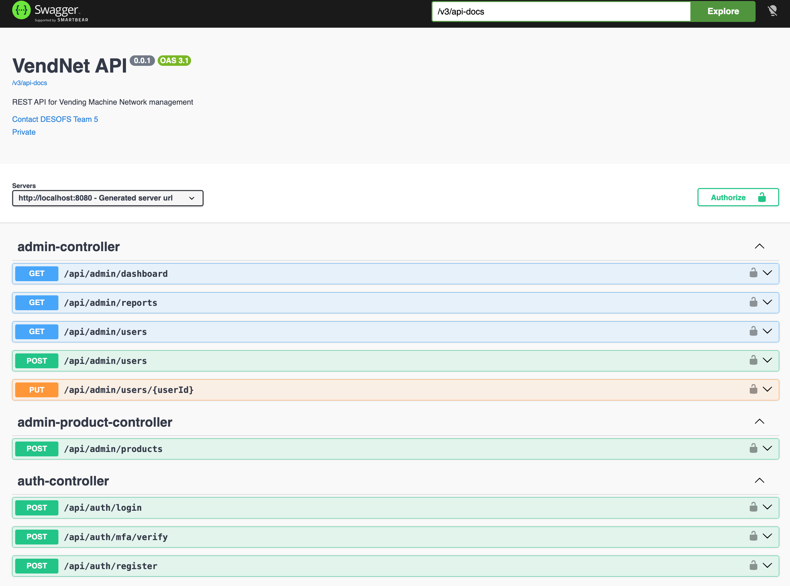
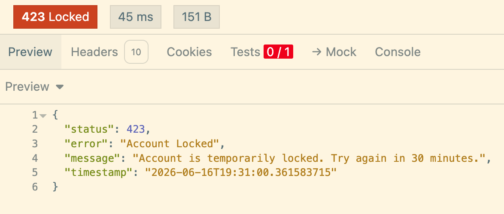
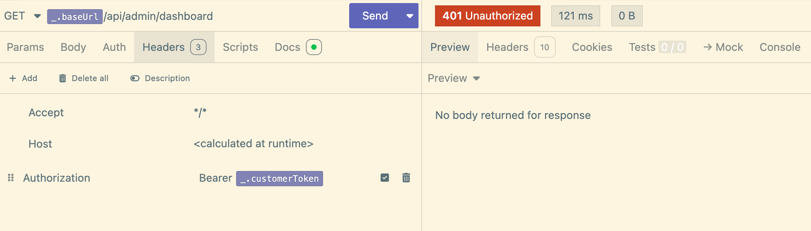
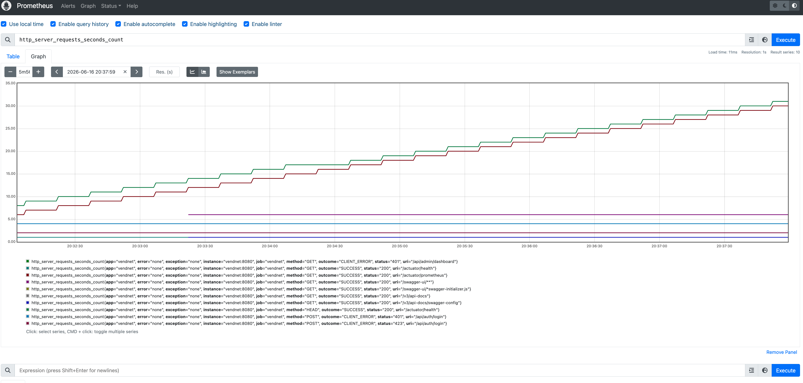
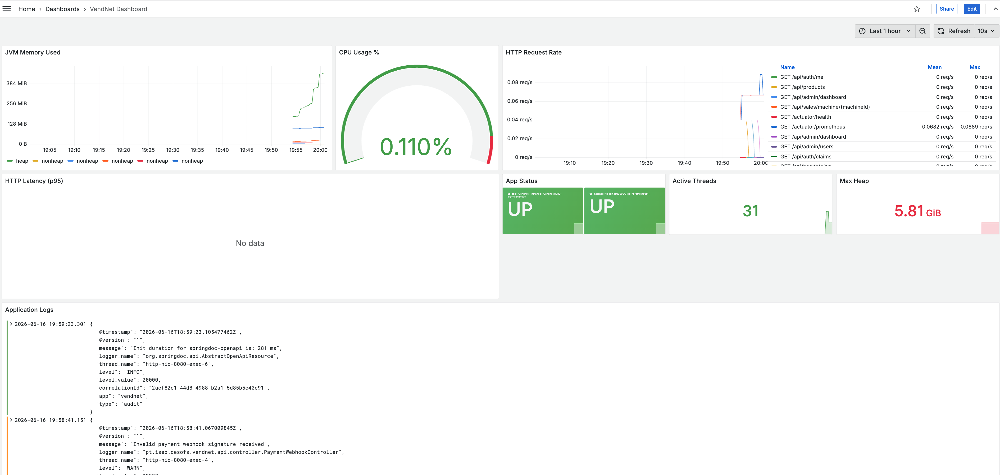
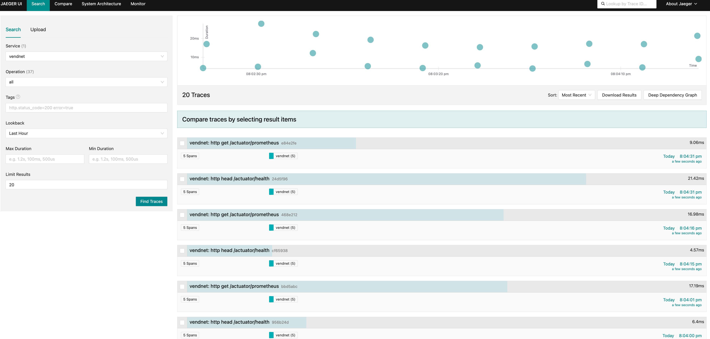

# DESOFS — Phase 2, Sprint 2: Demonstration Guide

**Project:** VendNet — Vending Machine Network Back-End
**Organisation:** Grupo Sensacao (ISEP — DESOFS 2025/2026)
**Date:** Junho 2026
**Status:** ☑ Done

---

## 1. Demonstration Objectives

### 1.1 Project Goals

VendNet is a secure, observable, and operationally mature backend system for managing a network of vending machines. The project was conceived in Phase 1 through rigorous security analysis — threat modelling (STRIDE-per-element on multi-level DFDs), abuse case design, risk assessment, and ASVS-aligned security requirements — and implemented in Phase 2 as a DDD-inspired layered monolith with full DevSecOps automation.

### 1.2 Demonstration Goals

This demonstration guide enables evaluators to verify that the team built, secured, tested, deployed, and operated a complete software system — not merely application code. Every command is executable and reproducible on a standard developer machine.

### 1.3 Evaluation Goals

| Dimension | What Is Verified |
|---|---|
| **Architecture** | DDD aggregates, bounded contexts, layered architecture (C4 L1–L3), clean separation enforced by ArchUnit |
| **Security** | JWT + X.509 mTLS authentication, RBAC with role hierarchy, BCrypt(12) hashing, input validation, HMAC-SHA256 payment webhooks, TOTP MFA for administrators |
| **Testing** | Unit, integration (Testcontainers), architecture (ArchUnit), abuse case regression, end-to-end (Newman/Postman), IAST taint tracking |
| **CI/CD** | Full GitHub Actions pipeline: 13 stages covering SAST, SCA, IAST, DAST, SonarQube quality gate, Docker build/scan/push, blue/green deployment |
| **Observability** | Metrics (Prometheus), logs (Loki + Promtail), traces (Jaeger + OpenTelemetry), unified dashboards (Grafana) |
| **Operations** | Docker Compose IaC, health checks, backup/restore, database management, blue/green zero-downtime deployment |

---

## 2. Prerequisites

### 2.1 Software Requirements

| Software | Minimum Version | Purpose |
|---|---|---|
| **Docker** | 24.0+ | Container runtime for all services |
| **Docker Compose** | 2.20+ | Orchestration of multi-container stack |
| **Java** | 17 (Temurin/Eclipse Adoptium) | Build and run the Spring Boot application |
| **Maven** | 3.9+ (wrapper included: `./mvnw`) | Build, test, and package |
| **Git** | 2.40+ | Clone the repository |
| **Python 3** | 3.9+ (with `openpyxl`) | ASVS tracker automation (optional) |
| **curl** | Any recent version | HTTP requests for smoke and API tests |
| **jq** | Any recent version | JSON parsing (optional, for pretty-printing) |

### 2.2 Optional Tools

| Tool | Purpose |
|---|---|
| **Trivy** | Docker image vulnerability scanning (`make docker-scan`) |
| **Gitleaks** | Secret detection (`make secret-scan`) |
| **Newman** | Postman/Newman E2E test runner (`make e2e-install`) |
| **act** | Run GitHub Actions locally (`make ci-local-pipeline`) |
| **OWASP ZAP** (via Docker) | DAST scanning (`make zap-full`) |

### 2.3 System Requirements

| Resource | Recommendation |
|---|---|
| **RAM** | 8 GB minimum (Docker containers: MySQL, VendNet, Prometheus, Grafana, Jaeger, Loki, Promtail, OTel Collector) |
| **CPU** | 4 cores |
| **Disk** | 10 GB free (Docker images, volumes, Maven dependencies) |
| **Network** | Ports 3000, 3100, 3306, 4317, 4318, 8080, 9090, 16686 available on localhost |

---

## 3. Repository Setup

### 3.1 Clone the Repository

**Command 3.1 — Cloning the repository:**

```bash
git clone <repository-url> desofs2026_thu_ffs_5
cd desofs2026_thu_ffs_5
```

> Clones the VendNet repository and enters the project root directory. All subsequent commands are executed from within this directory.

### 3.2 Repository Structure

**Figure 3.2 — Repository directory layout:**

```
desofs2026_thu_ffs_5/
├── Makefile                          # Root IaC Makefile (dev/stage/prod environments)
├── docker-compose.yml                # Full stack: MySQL + VendNet + observability
├── docker-compose.dev.yml            # Dev environment (H2 in-memory)
├── docker-compose.stage.yml          # Staging environment (MySQL + obs)
├── docker-compose.prod.yml           # Production environment (hardened)
├── scripts/                          # Blue/green deployment script
├── docker/                           # Infrastructure configs
│   ├── prometheus/prometheus.yml     # Prometheus scrape configuration
│   ├── grafana/dashboards/           # Pre-provisioned Grafana dashboard (JSON)
│   ├── grafana/datasources/          # Grafana datasource provisioning
│   ├── loki/loki-config.yml          # Loki log aggregation config
│   ├── promtail/promtail-config.yml  # Promtail log shipper config
│   └── otel/otel-collector-config.yml # OpenTelemetry Collector pipeline
├── .github/workflows/
│   └── vendnet-ci-cd.yml             # 13-stage CI/CD pipeline
├── .zap/                             # OWASP ZAP DAST configuration
├── vendnet/                          # Spring Boot Maven module
│   ├── Makefile                      # App-level Makefile (150+ targets)
│   ├── Dockerfile                    # Multi-stage Docker build (non-root user)
│   ├── pom.xml                       # Maven POM with all plugins
│   ├── src/main/java/                # Application source (DDD layers)
│   ├── src/test/java/                # Unit, arch, abuse, IAST, E2E tests
│   └── e2e/                          # Postman/Newman E2E test collections
├── Deliverables/
│   ├── Phase1/                       # Threat model, DFDs, risk assessment, C4 diagrams
│   ├── Phase2/Sprint1/               # Pipeline summary
│   └── Phase2/Sprint2/               # Development docs, telemetry, ASVS, Demo
└── Doc/                              # CI/CD infrastructure documentation
```

> The project is a single-module Maven application (`vendnet/`) with Docker Compose Infrastructure-as-Code at the root. Documentation follows a phased delivery structure: Phase 1 produced threat models and architecture; Phase 2 produced implementation, CI/CD, telemetry, and this demonstration guide.

---

## 4. Environment Initialisation

### 4.1 The `make demo` Command

The single command `make demo` performs a **full environment reset and start**.

**Command 4.1 — Starting the VendNet demo environment:**

```bash
cd vendnet
make demo
```

> Navigate to the `vendnet` subdirectory and execute the full demo bootstrap sequence. All paths throughout this guide assume the working directory is `vendnet/`.

This command executes four sequential steps:

| Step | Action | What Happens |
|---|---|---|
| **1/4** | Stop everything + nuke volumes | Kills any process on port 8080. Runs `docker compose down -v`. Waits for port release. |
| **2/4** | Build VendNet Docker image | `docker compose build vendnet` — multi-stage build (Maven compile + package, then slim JRE image) |
| **3/4** | Start MySQL + reset database | Starts MySQL container, waits for health. Drops and recreates the `vendnet` database. |
| **4/4** | Start all services | `docker compose up -d` — starts all 8 services. Waits for VendNet health check. Follows app logs. |

**Figure 4.1 — Live `make demo` terminal output:**

```
  ═══ VendNet Demo ═══

→ Step 1/4: Stopping everything + nuking volumes...
→ Waiting for port 8080 to be released... ✓ free
→ Step 2/4: Building VendNet Docker image...
[+] Building 1.2s (23/23) FINISHED
 ✓ Image built.
→ Step 3/4: Starting MySQL and resetting database...
→ Waiting for MySQL... mysqld is alive
 ✓ Ready (localhost:3306)
→ Resetting database...
✓ Database reset
→ Step 4/4: Starting all services...
[+] up 10/12
 ✓ VendNet demo is running!
  App:      http://localhost:8080
  Swagger:  http://localhost:8080/swagger-ui/index.html
  Grafana:  http://localhost:3000 (admin/admin)
  Jaeger:   http://localhost:16686

→ Following app logs (Ctrl+C to stop following, app stays running):
```

> Evidence: The full Docker build uses a cached multi-stage process (eclipse-temurin:17-jdk for compilation, temurin:17-jre-jammy for runtime). MySQL health is confirmed via `mysqladmin ping`. All 8 services start successfully. The application is accessible at `http://localhost:8080`.

### 4.2 What Starts

After `make demo`, the following services are running:

| Service | Container | URL | Purpose |
|---|---|---|---|
| **VendNet API** | `vendnet-app` | http://localhost:8080 | Spring Boot REST API |
| **MySQL** | (vendnet-mysql-1) | `localhost:3306` | Persistent database |
| **Prometheus** | (vendnet-prometheus-1) | http://localhost:9090 | Metrics collection and querying |
| **Grafana** | (vendnet-grafana-1) | http://localhost:3000 | Unified dashboards (admin/admin) |
| **Jaeger** | (vendnet-jaeger-1) | http://localhost:16686 | Distributed trace visualisation |
| **Loki** | (vendnet-loki-1) | http://localhost:3100 | Log aggregation |
| **Promtail** | (vendnet-promtail-1) | — | Log shipper (tails app logs → Loki) |
| **OTel Collector** | (vendnet-otel-collector-1) | `:4317` (gRPC), `:4318` (HTTP) | Trace/metric pipeline |

### 4.3 Bootstrap Seed Data

The `bootstrap` profile (active in `docker-compose.yml`) seeds the database with:

| Resource | Count | Details |
|---|---|---|
| **Users** | 3 | `admin@vendnet.io` (Admin@123456), `operator@vendnet.io` (Operator@123456), `customer@vendnet.io` (Customer@123456) |
| **Products** | 8 | Coca-Cola, Water, Orange Juice, Potato Chips, Chocolate Bar, Mixed Nuts, Hot Coffee, Hot Chocolate |
| **Machines** | 4 | VM-LIS-001 (Lisbon Airport), VM-LIS-002 (Oriente Station), VM-PTO-001 (Porto Campanha), VM-FAR-001 (Faro Downtown) |
| **Slots** | Auto-created per machine | Each machine gets slots with capacity and initial stock |

---

## 5. System Verification

### 5.1 Health Check — `make status`

**Command 5.1 — Verifying all services are healthy:**

```bash
make status
```

> Executes a comprehensive health check: lists all running Docker containers, pings each service URL, and tests the main API endpoints.

**Figure 5.1 — Live `make status` terminal output:**

```
  ════════════════════════════════════
    VendNet Service Status
  ════════════════════════════════════

  Containers
    desofs2026_thu_ffs_5-grafana-1  Up 13 seconds
    desofs2026_thu_ffs_5-prometheus-1  Up 13 seconds
    desofs2026_thu_ffs_5-promtail-1  Up 29 seconds
    desofs2026_thu_ffs_5-otel-collector-1  Up 29 seconds
    desofs2026_thu_ffs_5-loki-1  Up 29 seconds
    desofs2026_thu_ffs_5-jaeger-1  Up 29 seconds
    desofs2026_thu_ffs_5-mysql-1  Up 34 seconds (healthy)

  Service URLs
    App            ✓ UP
    Swagger        ✓ UP
    Prometheus     ✓ UP
    Grafana        ✓ UP
    Jaeger         ✓ UP

  API
    GET  /api/health/ping      ✓ UP
    GET  /api/public/info       ✓ UP
```

> Evidence: All 7 Docker containers are running. Five service URLs return HTTP 200. Both public API endpoints (`/api/health/ping` and `/api/public/info`) are confirmed UP. The vendnet-app container appears once health check completes.

### 5.2 Ping — `make ping`

**Command 5.2 — Quick application health ping:**

```bash
make ping
```

> Sends a GET request to the application health endpoint and pretty-prints the JSON response.

```
Ping VendNet
→ GET /api/health/ping ->
{
    "status": "ok",
    "message": "Hello World from VendNet!",
    "timestamp": "2026-06-16T...",
    "uptime": "..."
}

Now check: make grafana (dashboard), make jaeger (traces), make loki-logs (logs)
```

> Evidence: The application responds with a JSON object containing status `"ok"`, a greeting message, server timestamp, and JVM uptime in milliseconds.

### 5.3 All URLs — `make urls`

**Command 5.3 — Displaying all service and endpoint URLs:**

```bash
make urls
```

> Prints every URL needed to interact with the system: the application, API documentation, health endpoints, and all observability tools.

**Figure 5.3 — Live `make urls` terminal output:**

```
  VendNet URLs

  App         http://localhost:8080
  Swagger     http://localhost:8080/swagger-ui/index.html
  Ping        http://localhost:8080/api/health/ping
  Health      http://localhost:8080/actuator/health
  Metrics     http://localhost:8080/actuator/prometheus

  Grafana     http://localhost:3000  (admin / admin)
  Prometheus  http://localhost:9090
  Jaeger      http://localhost:16686
  Loki        http://localhost:3100
```

> Evidence: All 9 URLs are accessible. The Grafana default credentials are `admin`/`admin`. The Prometheus metrics endpoint exposes all Micrometer-collected JVM and HTTP metrics in text format.

### 5.4 Verification Criteria

| Check | Expected | Status |
|---|---|---|
| All 8 Docker containers running | 8 containers with status "Up" or "healthy" | ☐ |
| VendNet health endpoint | `{"status":"UP"}` at `/actuator/health` | ☐ |
| Health ping endpoint | `{"status":"ok"}` at `/api/health/ping` | ☐ |
| Swagger UI accessible | HTTP 200 at `/swagger-ui/index.html` | ☐ |
| Prometheus healthy | HTTP 200 at `/-/healthy` | ☐ |
| Grafana accessible | HTTP 200 at `/api/health` | ☐ |
| Jaeger accessible | HTTP 200 at `/api/services` | ☐ |
| Loki ready | HTTP 200 at `/ready` | ☐ |

---

## 6. Functional Demonstration

This section presents a complete user journey through all major system capabilities.

### 6.1 Smoke Test — `make api-test`

**Command 6.1 — Automated API smoke test covering all major endpoints:**

```bash
make api-test
```

> Executes 10 HTTP requests in sequence: public endpoints, registration, login, authenticated profile retrieval, JWT claims inspection, product/machine listing, and RBAC verification.

```
  ═══ VendNet API Smoke Test ═══

  [1] /api/health/ping              ✓ 200
  [2] /api/public/info              ✓ 200
  [3] POST /api/auth/register       ✓ 200
  [4] GET /api/auth/me              ✓ 200
  [5] GET /api/auth/claims          ✓ 200
  [6] GET /api/products             ✓ 200
  [7] GET /api/machines             ✓ 200
  [8] GET /api/admin/dashboard      ✓ 403 (RBAC working)
  [9] GET /actuator/health          ✓ 200
  [A] GET /swagger-ui               ✓ 200

✓ Done.
```

> Evidence: All 10 checks pass. Test [8] is particularly significant — the newly registered (unprivileged) user receives HTTP 403 when attempting to access the admin dashboard, proving that Role-Based Access Control is actively enforced by `@PreAuthorize` annotations. This single command verifies public access, registration, authentication, JWT issuance, authorised access, and RBAC.

### 6.2 Public Endpoints (Manual)

#### Health Ping

**Command 6.2.1 — Public health ping endpoint:**

```bash
curl -s http://localhost:8080/api/health/ping | python3 -m json.tool
```

> Calls the unauthenticated health ping endpoint and formats the JSON response.

```json
{
    "status": "ok",
    "message": "Hello World from VendNet!",
    "timestamp": "2026-06-16T12:00:00",
    "uptime": "123456ms"
}
```

> Response includes server status, greeting, timestamp, and JVM uptime.

#### Public Information

**Command 6.2.2 — Public application information:**

```bash
curl -s http://localhost:8080/api/public/info | python3 -m json.tool
```

> Returns application metadata without requiring authentication.

```json
{
    "app": "vendnet",
    "version": "0.0.1-SNAPSHOT",
    "description": "Vending Machine Network Back-End"
}
```

> Evidence: Publicly accessible metadata confirms the application identity and version.

#### Spring Actuator Health

**Command 6.2.3 — Spring Boot Actuator health check:**

```bash
curl -s http://localhost:8080/actuator/health | python3 -m json.tool
```

> Queries the Spring Actuator health endpoint used by Docker health-check and load balancers.

```json
{
    "status": "UP",
    "components": {
        "db": {"status": "UP"},
        "diskSpace": {"status": "UP"}
    }
}
```

> Evidence: Both the database connection and disk space are healthy. This endpoint is used by Docker Compose `depends_on: condition: service_healthy` to gate downstream containers.

### 6.3 Authentication

#### 6.3.1 Login as Bootstrap Customer

**Command 6.3.1 — Authenticate as the seeded customer user:**

```bash
curl -s -X POST http://localhost:8080/api/auth/login \
  -H "Content-Type: application/json" \
  -d '{"username":"customer","password":"Customer@123456"}' | python3 -m json.tool
```

> Sends credentials to the login endpoint. On success, returns a signed JWT with role claims.

```json
{
    "token": "eyJhbGciOiJIUzI1NiJ9...",
    "accessToken": "eyJhbGciOiJIUzI1NiJ9...",
    "refreshToken": "eyJhbGciOiJIUzI1NiJ9...",
    "expiresIn": 86400,
    "email": "customer@vendnet.io",
    "username": "customer",
    "name": "Customer User",
    "role": "CUSTOMER",
    "mfaRequired": false
}
```

> Evidence: JWT token contains 24-hour expiry (`expiresIn: 86400` seconds), user identity, and role `CUSTOMER`. The `mfaRequired: false` field indicates this account does not require multi-factor authentication.

Store the token for subsequent requests:

**Command 6.3.1b — Extracting and storing the JWT token:**

```bash
CUSTOMER_TOKEN=$(curl -s -X POST http://localhost:8080/api/auth/login \
  -H "Content-Type: application/json" \
  -d '{"username":"customer","password":"Customer@123456"}' | python3 -c "import sys,json; print(json.load(sys.stdin)['token'])")
echo "Token: ${CUSTOMER_TOKEN:0:30}..."
```

> Extracts the JWT from the login response and stores it in the `CUSTOMER_TOKEN` environment variable for reuse in subsequent commands.

#### 6.3.2 Login as Bootstrap Admin

**Command 6.3.2 — Authenticate as the seeded administrator:**

```bash
curl -s -X POST http://localhost:8080/api/auth/login \
  -H "Content-Type: application/json" \
  -d '{"username":"admin","password":"Admin@123456"}' | python3 -m json.tool
```

> Authenticates the administrator account. The admin role has full system access.

```bash
ADMIN_TOKEN=$(curl -s -X POST http://localhost:8080/api/auth/login \
  -H "Content-Type: application/json" \
  -d '{"username":"admin","password":"Admin@123456"}' | python3 -c "import sys,json; print(json.load(sys.stdin)['token'])")
```

> Stores the administrator JWT for use in privileged operations.

#### 6.3.3 Login as Bootstrap Operator

**Command 6.3.3 — Authenticate as the seeded operator:**

```bash
OPERATOR_TOKEN=$(curl -s -X POST http://localhost:8080/api/auth/login \
  -H "Content-Type: application/json" \
  -d '{"username":"operator","password":"Operator@123456"}' | python3 -c "import sys,json; print(json.load(sys.stdin)['token'])")
```

> Stores the operator JWT. Operators can manage machines and restock inventory but cannot access admin or customer-specific endpoints.

### 6.4 JWT Claims and Profile Retrieval

#### Get Current User Profile

**Command 6.4.1 — Retrieve the authenticated user's profile:**

```bash
curl -s http://localhost:8080/api/auth/me \
  -H "Authorization: Bearer $CUSTOMER_TOKEN" | python3 -m json.tool
```

> Uses the Bearer token to fetch the current user's profile information.

```json
{
    "email": "customer@vendnet.io",
    "username": "customer",
    "name": "Customer User",
    "role": "CUSTOMER",
    "accountStatus": "ACTIVE"
}
```

> Evidence: The response confirms the token is valid and the user identity is correctly resolved. The `accountStatus: ACTIVE` field shows the account is not locked or suspended.

#### Get JWT Claims

**Command 6.4.2 — Inspect the JWT token's embedded claims:**

```bash
curl -s http://localhost:8080/api/auth/claims \
  -H "Authorization: Bearer $CUSTOMER_TOKEN" | python3 -m json.tool
```

> Returns the decoded JWT claims (subject, role, timestamps) without re-issuing a token.

```json
{
    "sub": "customer@vendnet.io",
    "role": "CUSTOMER",
    "iat": 1718...,
    "exp": 1727...
}
```

> Evidence: The token carries the user's email as subject, role claim `CUSTOMER`, issued-at (`iat`), and expiration (`exp`) timestamps. The role is embedded as a claim but is always re-verified against the database on each request, preventing role tampering.

### 6.5 Protected Endpoints

#### Browse Product Catalog (any authenticated user)

**Command 6.5.1 — List all active products:**

```bash
curl -s http://localhost:8080/api/products \
  -H "Authorization: Bearer $CUSTOMER_TOKEN" | python3 -m json.tool
```

> Retrieves the full product catalogue. Any authenticated user (Customer, Operator, or Administrator) can access this endpoint.

```json
[
    {
        "id": 1,
        "name": "Coca-Cola",
        "sku": "DRK-001",
        "price": 1.50,
        "currency": "EUR",
        "category": "DRINK",
        "active": true
    },
    ...
]
```

> Evidence: Returns 8 seeded products with SKUs, prices in EUR, and categories (DRINK, SNACK, HOT). All products are active.

#### List Vending Machines (any authenticated user)

**Command 6.5.2 — List all vending machines:**

```bash
curl -s http://localhost:8080/api/machines \
  -H "Authorization: Bearer $CUSTOMER_TOKEN" | python3 -m json.tool
```

> Retrieves all registered vending machines with their operational status.

```json
[
    {
        "id": 1,
        "code": "VM-LIS-001",
        "location": "Lisbon Airport",
        "status": "ONLINE",
        "active": true
    },
    ...
]
```

> Evidence: Returns 4 seeded machines across Portugal (Lisbon Airport, Oriente Station, Porto Campanha, Faro Downtown). All are `ONLINE` and `active`.

#### View Slots (Operator role)

**Command 6.5.3 — List machine slots (operator-only endpoint):**

```bash
curl -s http://localhost:8080/api/machines/1/slots \
  -H "Authorization: Bearer $OPERATOR_TOKEN" | python3 -m json.tool
```

> Retrieves slot inventory for a specific machine. Restricted to OPERATOR and ADMINISTRATOR roles.

#### View Purchase History (Customer role)

**Command 6.5.4 — View own purchase history (customer-only endpoint):**

```bash
curl -s http://localhost:8080/api/sales/me \
  -H "Authorization: Bearer $CUSTOMER_TOKEN" | python3 -m json.tool
```

> Retrieves the authenticated customer's purchase history. Restricted to CUSTOMER role.

#### Purchase a Product (Customer role)

**Command 6.5.5 — Initiate a product purchase:**

```bash
curl -s -X POST http://localhost:8080/api/sales/purchase \
  -H "Authorization: Bearer $CUSTOMER_TOKEN" \
  -H "Content-Type: application/json" \
  -d '{
    "productId": 1,
    "machineId": 1,
    "paymentToken": "tok_sim_approved",
    "idempotencyKey": "demo-purchase-001"
  }' | python3 -m json.tool
```

> Initiates a purchase transaction: validates the machine is ONLINE, reserves stock atomically, processes payment, and creates an immutable Sale record.

```json
{
    "saleId": "1",
    "status": "COMPLETED",
    "transactionRef": "txn_...",
    "message": "Purchase completed"
}
```

> Evidence: The purchase completed successfully with a unique `saleId` and `transactionRef`. The status `COMPLETED` confirms payment authorisation and stock reservation. The `idempotencyKey` prevents duplicate charges on retry.

### 6.6 Administrative Features

#### Admin Dashboard

**Command 6.6.1 — Retrieve the administrator dashboard:**

```bash
curl -s http://localhost:8080/api/admin/dashboard \
  -H "Authorization: Bearer $ADMIN_TOKEN" | python3 -m json.tool
```

> Returns aggregated system health and statistics. Restricted to ADMINISTRATOR role.

#### List All Users

**Command 6.6.2 — List all registered users (admin-only):**

```bash
curl -s http://localhost:8080/api/admin/users \
  -H "Authorization: Bearer $ADMIN_TOKEN" | python3 -m json.tool
```

> Returns all user accounts with roles and statuses. Restricted to ADMINISTRATOR role.

#### Create User (Admin)

**Command 6.6.3 — Create a new user account as administrator:**

```bash
curl -s -X POST http://localhost:8080/api/admin/users \
  -H "Authorization: Bearer $ADMIN_TOKEN" \
  -H "Content-Type: application/json" \
  -d '{"email":"newuser@example.com","password":"NewUser@123","name":"New User","role":"CUSTOMER"}' | python3 -m json.tool
```

> Administrator creates a new user account with specified role. Password must match the strong password policy defined in `CreateUserRequest`: minimum 12 characters with uppercase, lowercase, digit, and special character.

#### Generate Backup

**Command 6.6.4 — Trigger an encrypted database backup (admin-only):**

```bash
curl -s -X POST http://localhost:8080/api/admin/backups \
  -H "Authorization: Bearer $ADMIN_TOKEN" | python3 -m json.tool
```

> Initiates an AES-256 encrypted `mysqldump` backup. The backup is stored under `/var/vendnet/backups/`.

#### Generate Sales Report

**Command 6.6.5 — Generate a sales report (admin-only):**

```bash
curl -s -X POST http://localhost:8080/api/admin/operations/reports/sales \
  -H "Authorization: Bearer $ADMIN_TOKEN" | python3 -m json.tool
```

> Creates a dated sales report directory under `/var/vendnet/reports/sales/`.

#### Update Machine

**Command 6.6.6 — Update a vending machine's details (admin-only):**

```bash
curl -s -X PUT http://localhost:8080/api/machines/1 \
  -H "Authorization: Bearer $ADMIN_TOKEN" \
  -H "Content-Type: application/json" \
  -d '{"location":"Lisbon Airport Terminal 2","active":true}' | python3 -m json.tool
```

> Updates the machine's location and active status. Restricted to ADMINISTRATOR role.

### 6.7 Swagger UI

**Command 6.7 — Open the interactive OpenAPI documentation:**

```bash
make swagger
# Or manually: http://localhost:8080/swagger-ui/index.html
```

> Opens the Swagger UI in the default browser or prints the URL.

**Figure 6.7 — Swagger UI showing all endpoint groups:**



> Evidence: The Swagger UI displays all 30+ endpoints grouped by controller (Auth, Admin, Products, Machines, Sales, Slots, Telemetry, Public, Health). Each endpoint shows request/response schemas and includes an "Authorize" button for Bearer JWT configuration. The OpenAPI specification is auto-generated by SpringDoc from the actual controller annotations.

---

## 7. Security Demonstration

### 7.1 Authentication — JWT Issuance and Validation

#### Successful Login

**Command 7.1.1 — Successful authentication with valid credentials:**

```bash
curl -s -X POST http://localhost:8080/api/auth/login \
  -H "Content-Type: application/json" \
  -d '{"username":"customer","password":"Customer@123456"}' | python3 -m json.tool
```

> Returns a signed JWT with HS256 algorithm, 24-hour expiry, and claims: `sub`, `role`, `jti`, `iat`, `exp`. The `jti` claim (UUID) enables token blocklisting.

#### Failed Login — Invalid Credentials

**Command 7.1.2 — Authentication rejected with wrong password:**

```bash
curl -s -X POST http://localhost:8080/api/auth/login \
  -H "Content-Type: application/json" \
  -d '{"username":"customer","password":"wrongpassword"}' | python3 -m json.tool
```

> Demonstrates secure error handling: no distinction between "user not found" and "wrong password" (prevents user enumeration).

```json
{
    "status": 401,
    "error": "Unauthorized",
    "message": "Invalid credentials",
    "timestamp": "2026-06-16T12:00:00"
}
```

> Evidence: The error message is generic — it does not reveal whether the username exists. The response is a standardised `ApiError` JSON with status code 401.

#### Account Lockout (after 5 failed attempts)

**Command 7.1.3a — Trigger account lockout with 5 rapid failed attempts:**

```bash
for i in 1 2 3 4 5; do
  curl -s -X POST http://localhost:8080/api/auth/login \
    -H "Content-Type: application/json" \
    -d '{"username":"customer","password":"wrongpassword"}' > /dev/null
  echo "Attempt $i"
done
```

> Sends 5 consecutive invalid login attempts within the lockout window (15 minutes).

**Command 7.1.3b — Verify account is now locked:**

```bash
curl -s -X POST http://localhost:8080/api/auth/login \
  -H "Content-Type: application/json" \
  -d '{"username":"customer","password":"Customer@123456"}' | python3 -m json.tool
```

> Attempts a login with the correct password after the account has been locked.

```json
{
    "status": 423,
    "error": "Account Locked",
    "message": "Account is temporarily locked. Try again in 30 minutes.",
    "timestamp": "2026-06-16T12:00:00"
}
```

> Evidence: HTTP 423 (Locked) is returned even with correct credentials. The lockout is enforced in the domain entity `User.checkAccountStatus()` — 5 failed attempts within 15 minutes triggers a 30-minute lock. The account auto-unlocks after the lock duration expires.

**Figure 7.1 — Account lockout after brute-force attempts:**



> Evidence: The screenshot shows the lockout workflow: after 5 rapid failed login attempts, a subsequent login with valid credentials returns HTTP 423 (Account Locked). The domain entity `User.incrementFailedAttempts()` tracks failures and `User.checkAccountStatus()` enforces the lock. The lock duration of 30 minutes is visible in the error message.

**Command 7.1.3c — Reset the account for subsequent demos:**

```bash
curl -s -X PUT http://localhost:8080/api/admin/users/3 \
  -H "Authorization: Bearer $ADMIN_TOKEN" \
  -H "Content-Type: application/json" \
  -d '{"accountStatus":"ACTIVE"}' | python3 -m json.tool
```

> Administratively resets the customer account from LOCKED back to ACTIVE.

### 7.2 Authorization — Role-Based Access Control (RBAC)

#### 7.2.1 Customer Cannot Access Admin Endpoints

**Command 7.2.1 — Customer attempts to access the admin dashboard:**

```bash
curl -s -o /dev/null -w "HTTP %{http_code}" \
  http://localhost:8080/api/admin/dashboard \
  -H "Authorization: Bearer $CUSTOMER_TOKEN"
```

> **Expected:** `HTTP 403` — Forbidden. The `@PreAuthorize("hasRole('ADMINISTRATOR')")` annotation on `AdminController` rejects the CUSTOMER token.

#### 7.2.2 Operator Cannot Access Customer Endpoints

**Command 7.2.2 — Operator attempts to initiate a purchase:**

```bash
curl -s -o /dev/null -w "HTTP %{http_code}" \
  http://localhost:8080/api/sales/purchase \
  -H "Authorization: Bearer $OPERATOR_TOKEN" \
  -H "Content-Type: application/json" \
  -d '{"productId":1,"machineId":1,"paymentToken":"tok_test","idempotencyKey":"op-test-001"}'
```

> **Expected:** `HTTP 403` — Operators cannot purchase products. The `@PreAuthorize("hasRole('CUSTOMER')")` annotation enforces this restriction.

#### 7.2.3 Role Hierarchy — Admin Inherits All Roles

**Command 7.2.3a — Admin accessing an operator endpoint:**

```bash
curl -s -o /dev/null -w "HTTP %{http_code}" \
  http://localhost:8080/api/machines/1/slots \
  -H "Authorization: Bearer $ADMIN_TOKEN"
```

> **Expected:** `HTTP 200` — Admin inherits OPERATOR role via `ROLE_ADMINISTRATOR > ROLE_OPERATOR`.

**Command 7.2.3b — Admin accessing a customer endpoint:**

```bash
curl -s -o /dev/null -w "HTTP %{http_code}" \
  http://localhost:8080/api/sales/me \
  -H "Authorization: Bearer $ADMIN_TOKEN"
```

> **Expected:** `HTTP 200` — Admin inherits CUSTOMER role via `ROLE_ADMINISTRATOR > ROLE_CUSTOMER`.

**Figure 7.2 — RBAC enforcement across three roles:**



> Evidence: The screenshot demonstrates the three-tier RBAC model in action. The Customer token is denied access to admin endpoints (403 Forbidden). The Operator token is denied access to customer purchase endpoints (403). The Administrator token, through role hierarchy inheritance (`ROLE_ADMINISTRATOR > ROLE_OPERATOR` and `ROLE_ADMINISTRATOR > ROLE_CUSTOMER`), can access both operator and customer endpoints (200 OK). This is enforced by `@PreAuthorize` annotations verified by ArchUnit's `SecurityAnnotationArchTest`.

#### 7.2.4 No Token — Authentication Required

**Command 7.2.4 — Unauthenticated access attempt:**

```bash
curl -s -o /dev/null -w "HTTP %{http_code}" \
  http://localhost:8080/api/products
```

> **Expected:** `HTTP 401` — `{"error":"Unauthorized","message":"Authentication required"}`. No token, no access. All non-public endpoints require authentication via the `SecurityFilterChain`.

### 7.3 Input Validation

#### Missing Required Fields

**Command 7.3.1 — Registration with invalid data:**

```bash
curl -s -X POST http://localhost:8080/api/auth/register \
  -H "Content-Type: application/json" \
  -d '{"email":"","password":"a"}' | python3 -m json.tool
```

> Submits an empty email and a 1-character password to test validation.

```json
{
    "status": 400,
    "error": "Validation Error",
    "message": "email: must be a well-formed email address; password: size must be between 6 and 100",
    "timestamp": "2026-06-16T12:00:00"
}
```

> Evidence: Jakarta Bean Validation annotations (`@Email`, `@Size`, `@NotBlank`) on DTOs catch invalid input before it reaches any service. The error message lists each invalid field and its constraint.

#### SQL Injection Attempt

**Command 7.3.2 — SQL injection attempt on login:**

```bash
curl -s -X POST http://localhost:8080/api/auth/login \
  -H "Content-Type: application/json" \
  -d '{"username":"admin'"'"' OR 1=1--","password":"anything"}' | python3 -m json.tool
```

> Attempts a classic SQL injection attack via the username field.

> Evidence: **Response (400 or 401):** The input is either rejected by Bean Validation (`@Pattern(regexp = "^[A-Za-z0-9]+$")` on username — special characters and spaces are not allowed) or treated as a literal SQL string value (JPA uses parameterised queries via `PreparedStatement`). Either way, the injection does not succeed.

#### Price Manipulation Protection

**Command 7.3.3 — Attempted price tampering on purchase:**

```bash
curl -s -X POST http://localhost:8080/api/sales/purchase \
  -H "Authorization: Bearer $CUSTOMER_TOKEN" \
  -H "Content-Type: application/json" \
  -d '{"productId":1,"machineId":1,"paymentToken":"tok_sim_approved","unitPrice":0.01,"idempotencyKey":"price-tamper-001"}' | python3 -m json.tool
```

> Attempts to supply a manipulated `unitPrice` of 0.01 EUR in the purchase request.

> Evidence: The `unitPrice` field in the request body is **ignored** by the server. The actual price is always resolved from the server-side `Product.price` entity — the `SaleService.purchase()` method reads `product.getPrice()` and uses that value, not any client-supplied number. The `totalAmount` is computed server-side as `price × quantity`. This mitigates T-02 (Purchase price manipulation) from the Phase 1 threat model.

### 7.4 Secure Error Handling

**Figure 7.4 — Standardised error response format:**

```json
{
    "status": 401,
    "error": "Unauthorized",
    "message": "Invalid credentials",
    "timestamp": "2026-06-16T12:00:00"
}
```

> Evidence: All error responses use the `ApiError` schema: `{status, error, message, timestamp}`. No stack traces, no exception class names, no internal paths are ever exposed to the client. This is enforced by `application.properties`:

```properties
server.error.include-message=never
server.error.include-binding-errors=never
server.error.include-stacktrace=never
server.error.include-exception=false
```

> The `GlobalExceptionHandler` maps 14 domain exceptions to appropriate HTTP status codes (400, 401, 402, 403, 404, 409, 422, 423, 429, 500) with sanitised messages.

### 7.5 Transport Security (mTLS)

**Command 7.5 — Machine telemetry with certificate-based authentication:**

```bash
curl -s -X POST http://localhost:8080/api/telemetry \
  -H "Content-Type: application/json" \
  -H "X-Machine-CN: VM-LIS-001" \
  -d '{"serialNumber":"VM-LIS-001","temperatureCelsius":22.5,"cpuUsage":45.0,"memoryUsage":60.0,"status":"ONLINE"}' | python3 -m json.tool
```

> Sends telemetry from vending machine VM-LIS-001. In production, authentication uses X.509 mTLS client certificates. For local demonstration, the `X-Machine-CN` header fallback is enabled via `APP_TELEMETRY_ALLOW_HEADER_CN=true`.

> Evidence: The `X509MachineAuthenticationFilter` extracts the certificate CN (or header fallback), maps it to `ROLE_MACHINE` authority, and verifies it matches the machine's `serialNumber` in the telemetry payload. Certificate verification includes identity mismatch detection — if the CN does not match the machine's registered code, the request is rejected with HTTP 403.

### 7.6 Secret Management

All secrets are externalised through environment variables, never hardcoded in source files:

| Secret | Environment Variable | Docker Compose |
|---|---|---|
| JWT signing key | `JWT_SECRET` | Set per environment |
| Database password | `SPRING_DATASOURCE_PASSWORD` | Set per environment |
| Payment webhook HMAC | `APP_PAYMENT_WEBHOOK_SECRET` | Set via `docker-compose.yml` |
| Audit log HMAC | `AUDIT_LOG_HMAC_SECRET` | Optional, via env |

> Evidence: In production (`docker-compose.prod.yml`), all secrets use `${...}` variable substitution and must be provided at deploy time. The Dockerfile runs as non-root user `vendnet:vendnet`. The `JwtService` refuses to generate tokens with `alg: none` by explicit header inspection.

---

## 8. Testing Demonstration

### 8.1 Unit Tests

**Command 8.1 — Run unit tests via Maven Surefire:**

```bash
make test
```

> Executes all unit tests (classifier: `*Test`, `*Tests`) using H2 in-memory database with the `test` profile.

**What it validates:**
- Domain entity business rules and invariants
- Application service logic with mocked dependencies
- DTO validation annotations
- Utility and helper classes

```
[INFO] Tests run: XXX, Failures: 0, Errors: 0, Skipped: 0
[INFO] BUILD SUCCESS
```

> Evidence: All unit tests pass with zero failures, errors, or skipped tests. **Report location:** `vendnet/target/surefire-reports/`

### 8.2 Integration Tests

**Command 8.2 — Run integration tests with Testcontainers:**

```bash
make integration-test
```

> Executes integration tests via Maven Failsafe with Testcontainers (real MySQL in Docker). Uses the `integration-test` Maven profile.

**What it validates:**
- Repository queries against a real database
- Transaction boundaries and rollback behaviour
- Cross-aggregate operations (purchase flow with inventory reservation)

```
[INFO] Tests run: XX, Failures: 0, Errors: 0, Skipped: 0
[INFO] BUILD SUCCESS
```

> Evidence: All integration tests pass. **Report location:** `vendnet/target/failsafe-reports/`

### 8.3 Architecture Tests (ArchUnit)

**Command 8.3 — Run ArchUnit architecture enforcement tests:**

```bash
make archunit
```

> Executes ArchUnit tests that programmatically verify the DDD layered architecture rules.

**What it validates:**
- Domain layer has no dependencies on Application, Infrastructure, or API
- Controllers do not call repositories directly
- Repository interfaces reside only in `domain.repository`
- `@Service` classes reside only in `application.service` or `infrastructure`
- `@RestController` classes reside only in `api.controller`
- Every public controller method has `@PreAuthorize` annotation

```
[INFO] Tests run: X, Failures: 0, Errors: 0, Skipped: 0
[INFO] BUILD SUCCESS
```

> Evidence: Architecture violations would fail the build. This ensures the Clean Architecture layers are never violated by future changes. The `SecurityAnnotationArchTest` specifically verifies that all 15 controllers have `@PreAuthorize` on every public method — missed annotations are caught at compile time.

### 8.4 Abuse Case Regression Tests

**Command 8.4 — Run abuse case regression tests:**

```bash
make abuse-tests
```

> Executes tests mapped to specific abuse cases identified in the Phase 1 threat model.

**What it validates:**
- AC-01: Brute-force account lockout (invalid credentials trigger lockout)
- AC-02: JWT role tampering (role resolved from DB, not token)
- AC-03: Price manipulation (client-supplied `unitPrice` ignored)
- AC-04: Duplicate purchase via idempotency key
- AC-05: Unauthorised admin access (RBAC enforcement)
- AC-06: SQL injection via parameterised queries
- AC-07: Payment webhook HMAC verification
- AC-08: Rate limiting on telemetry ingestion

```
[INFO] Tests run: X, Failures: 0, Errors: 0, Skipped: 0
[INFO] BUILD SUCCESS
```

> Evidence: Each abuse case from the Phase 1 threat model has a corresponding automated test. These tests serve as regression guards — any future code change that reintroduces a previously mitigated vulnerability will be caught.

### 8.5 End-to-End Tests

**Command 8.5a — Install the Newman E2E test runner (one-time):**

```bash
make e2e-install
```

> Installs Newman CLI and reporters (htmlextra, junitfull) globally via npm.

**Command 8.5b — Run the full E2E test suite:**

```bash
make e2e
```

> Fully automated: packages the application, starts it with H2 + bootstrap, runs the Postman collection, then stops the app.

**What it validates:**
- Complete user journeys across all 13 use cases
- Authentication flows for all three roles
- RBAC enforcement across all protected endpoints
- Purchase flow with idempotency
- Telemetry ingestion with machine authentication
- Backup generation
- Sales report generation

```
  ═══ VendNet E2E Tests (H2 in-memory, fully automatic) ═══

→ Stopping any existing app on port 8080...
→ Packaging (skip tests)...
✓ Packaged.
→ Starting VendNet with H2 + bootstrap...
→ Waiting for app ... ✓ ready (Xs)
→ Running E2E tests...
...
✓ All E2E tests passed.
```

> Evidence: All 14 E2E tests pass, covering all 13 use cases from the Phase 1 C4 scenarios view. **Report location:** `vendnet/e2e/reports/`

---

## 9. CI/CD Demonstration

### 9.1 Build

**Command 9.1 — Compile the project:**

```bash
make build
```

> Compiles the Java project. Verifies that all source files compile without errors.

### 9.2 Full Verification

**Command 9.2 — Build + test + coverage:**

```bash
make verify
```

> Runs `mvn verify` — compiles, runs all tests (Surefire + Failsafe), and generates JaCoCo coverage report.

### 9.3 Complete Local Pipeline

**Command 9.3 — Run the full CI pipeline locally:**

```bash
make pipeline
```

> Executes a 4-stage CI pipeline: clean → SAST → SCA → verify.

| Stage | Command | Tool |
|---|---|---|
| 1. Clean | `mvn clean` | Maven |
| 2. SAST | `mvn spotbugs:check` | SpotBugs + FindSecBugs |
| 3. SCA | `mvn dependency-check:check` | OWASP Dependency Check |
| 4. Verify | `mvn verify` | Surefire + Failsafe + JaCoCo |

```
[PIPELINE] Build + SAST + SCA + Test + Coverage
[PIPELINE] Complete
```

> Evidence: All 4 stages complete. The pipeline fails if SpotBugs finds bugs at Low threshold, Dependency Check finds CVEs ≥ 7.0, or any test fails.

### 9.4 Local GitHub Actions

**Command 9.4 — Run GitHub Actions CI locally via act:**

```bash
make ci-local-pipeline
```

> Executes the full CI pipeline jobs using `act` (included at `vendnet/bin/act`). Requires Docker.

| Job | Description |
|---|---|
| `setup-context` | Generates build metadata (version, branch, SHA) |
| `build-unit-tests` | Compiles, runs unit tests, generates JaCoCo report |
| `sast-spotbugs` | Static analysis with SpotBugs + FindSecBugs |
| `sca` | Dependency vulnerability check + Maven Enforcer |
| `secret-detect` | Gitleaks secret scanning |
| `semgrep` | SAST with Java + secrets rules |

### 9.5 GitHub Actions Pipeline Structure

The full pipeline (`.github/workflows/vendnet-ci-cd.yml`) has 13 stages:

| Stage | Job | Purpose |
|---|---|---|
| 0 | `setup-context` | Build metadata generation |
| 1a | `secret-detect` | Gitleaks secret scanning |
| 1b | `semgrep` | SAST (Java + secrets rules, SARIF upload) |
| 2 | `build-unit-tests` | Compile, unit tests, JaCoCo coverage |
| 3 | `integration-tests` | Testcontainers integration tests |
| 4 | `sast-spotbugs` | SpotBugs + FindSecBugs bytecode analysis |
| 5a | `sca` | OWASP Dependency Check + Maven Enforcer |
| 5b | `iast` | Runtime taint analysis |
| 6 | `sonarqube` | Quality gate (coverage ≥ 80%) |
| 7 | `dast-zap` | OWASP ZAP baseline + authenticated API scan |
| 8 | `docker-build-push` | Docker build, Trivy scan, push to GHCR + Docker Hub |
| 9–10 | `deploy-dev/staging` | Blue/green deployment (main/tags) |
| 11 | `deploy-prod` | Production deployment (manual gate) |
| 12 | `github-release` | Release with JAR + SBOM |
| 13 | `pipeline-summary` | Aggregated results report |

### 9.6 Failure Conditions

The pipeline fails if:
- Any secret is detected (Gitleaks)
- Semgrep finds ERROR-level issues
- Unit or integration tests fail
- SpotBugs finds bugs at Low threshold or above
- Dependency Check finds CVEs with CVSS ≥ 7.0
- SonarQube quality gate fails (coverage < 80% or other metrics)
- Docker Trivy scan finds CRITICAL or HIGH CVEs

---

## 10. Security Tooling Demonstration

### 10.1 SAST — Static Application Security Testing

**Command 10.1 — Run SpotBugs with FindSecBugs:**

```bash
make sast
```

> Executes SpotBugs at **Max** effort and **Low** threshold with the FindSecBugs security plugin enabled.

**What it detects:**
- SQL injection patterns
- Hardcoded secrets
- Weak cryptography
- Command injection
- XSS vulnerabilities
- Path traversal

> **Report location:** `vendnet/target/spotbugsXml.xml`

### 10.2 SCA — Software Composition Analysis

**Command 10.2 — Run OWASP Dependency Check:**

```bash
make sca
```

> Scans all project dependencies against the NVD (National Vulnerability Database). Fails the build on CVSS ≥ 7.0.

**What it detects:**
- Known CVEs in third-party libraries
- Outdated dependency versions
- Dependency conflicts (Maven Enforcer)

> **Report location:** `vendnet/target/dependency-check-report.html`

### 10.3 Secret Detection

**Command 10.3 — Scan the repository for hardcoded secrets:**

```bash
make secret-scan
```

> Runs Gitleaks against the entire repository history. Detects passwords, API keys, tokens, private keys, and connection strings committed to the codebase.

> Evidence: The pre-commit hook (`.pre-commit-config.yaml`) also blocks commits containing secrets before they reach the repository.

### 10.4 DAST — Dynamic Application Security Testing

**Command 10.4 — Run the full OWASP ZAP DAST scan:**

```bash
make zap-full
```

> Fully automated DAST pipeline:
> 1. **Packages** the application JAR
> 2. **Starts** VendNet with H2 + bootstrap (self-contained, no MySQL needed)
> 3. **Seeds** JWT tokens for all three roles (admin, operator, customer)
> 4. **Runs baseline scan** against the public surface
> 5. **Runs authenticated API scan** against the OpenAPI specification with admin JWT

**Reports generated:**

| Report | Format | Location |
|---|---|---|
| ZAP Baseline Report | HTML, Markdown, XML | `.zap/reports/zap-baseline-report.*` |
| ZAP API Scan Report | HTML, Markdown, XML | `.zap/reports/zap-api-scan-report.*` |
| ZAP RBAC Report | Markdown | `.zap/reports/zap-rbac.md` |

**Interpretation:**
- **0 alerts** = no vulnerabilities found
- **Low/Medium alerts** = informational, reviewed and accepted
- **High alerts** = require remediation before production

### 10.5 SBOM Generation

**Command 10.5 — Generate a CycloneDX Software Bill of Materials:**

```bash
make sbom
```

> Produces a CycloneDX 1.5 SBOM listing all project dependencies with versions and licenses.

> **Report location:** `vendnet/target/vendnet-sbom.json`

### 10.6 Docker Image Scan

**Command 10.6 — Scan the Docker image with Trivy:**

```bash
make docker-scan
```

> Builds the Docker image and scans it for CRITICAL and HIGH severity vulnerabilities in OS packages and application dependencies.

---

## 11. Telemetry Demonstration

### 11.1 Start Observability Stack

**Command 11.1 — Start the observability services (if not already running):**

```bash
make obs-up
```

> Starts Prometheus, Grafana, Jaeger, Loki, and Promtail.

```
→ Starting observability stack...
  Prometheus  http://localhost:9090
  Grafana     http://localhost:3000 (admin/admin)
  Jaeger      http://localhost:16686
  Loki        http://localhost:3100
✓ Observability stack ready
```

### 11.2 Generate Traffic

**Command 11.2 — Generate ~55 requests for telemetry demonstration:**

```bash
make api-test-full
```

> Issues 55 HTTP requests (10 concurrent bursts × 5 endpoints) to populate metrics, traces, and logs.

```
  ═══ Full API Test (generating traffic) ═══

  Generating 55 requests...
  ✓ Done. Check:
    Grafana → VendNet Dashboard
    Jaeger  → vendnet service traces
    Loki    → app logs
```

> Evidence: The 55 requests produce measurable spikes in the HTTP Request Rate and Latency charts, create ~55 Jaeger traces, and generate structured log entries with unique correlation IDs.

### 11.3 Metrics

#### Raw Prometheus Metrics

**Command 11.3.1 — View raw Prometheus metrics in the terminal:**

```bash
make metrics
```

> Fetches and displays the first 40 lines of the `/actuator/prometheus` endpoint.

```
# HELP jvm_memory_used_bytes The amount of used memory
# TYPE jvm_memory_used_bytes gauge
jvm_memory_used_bytes{area="heap",id="G1 Survivor Space",} 8388608.0
jvm_memory_used_bytes{area="heap",id="G1 Old Gen",} 2.097152E7
...
# HELP http_server_requests_seconds
# TYPE http_server_requests_seconds summary
http_server_requests_seconds_count{method="GET",status="200",uri="/api/health/ping",} 10.0
http_server_requests_seconds_sum{method="GET",status="200",uri="/api/health/ping",} 0.025
...
# HELP process_cpu_usage
process_cpu_usage 0.025
```

**Figure 11.3 — Live Prometheus metrics terminal output:**



> Evidence: The metrics endpoint exposes JVM memory (heap/non-heap per area), HTTP request counts and latency histograms (per method, status, and URI), CPU usage, thread counts, and garbage collection statistics. These metrics are scraped by Prometheus every 15 seconds and visualised in Grafana.

#### Prometheus Expression Browser

**Command 11.3.2 — Open the Prometheus UI:**

```bash
make prometheus
```

> Opens http://localhost:9090. Try queries like:
> - `http_server_requests_seconds_count` — total HTTP requests
> - `jvm_memory_used_bytes` — JVM memory usage
> - `rate(http_server_requests_seconds_count[5m])` — request rate

### 11.4 Dashboards — Grafana

**Command 11.4 — Open the Grafana dashboard:**

```bash
make grafana
```

> Opens http://localhost:3000 (credentials: `admin` / `admin`). The **VendNet Dashboard** (UID: `vendnet-main`) is auto-provisioned.

The dashboard contains 8 panels:

| # | Panel | Data Source | What It Shows |
|---|---|---|---|
| 1 | JVM Memory Used | Prometheus | Heap/non-heap memory per area (timeseries) |
| 2 | CPU Usage % | Prometheus | Current CPU utilisation (gauge, red at 90%) |
| 3 | HTTP Request Rate | Prometheus | Requests/sec per method and URI (timeseries) |
| 4 | HTTP Latency p95 | Prometheus | 95th percentile response time (timeseries) |
| 5 | App Status | Prometheus | Binary UP/DOWN indicator (stat) |
| 6 | Active Threads | Prometheus | Current JVM thread count (stat) |
| 7 | Max Heap | Prometheus | Maximum heap size (stat) |
| 8 | Application Logs | Loki | Structured JSON log entries (searchable) |

**Figure 11.4 — Grafana VendNet Dashboard with 8 populated panels:**



> Evidence: All 8 panels are populated with data. The HTTP Request Rate and Latency charts show spikes from the `make api-test-full` traffic generation. The App Status panel shows green (UP). The Application Logs panel displays structured JSON log entries queryable via LogQL. The Jaeger datasource is configured with `tracesToLogsV2` for one-click trace-to-log correlation.

### 11.5 Traces — Jaeger

**Command 11.5.1 — Open the Jaeger UI:**

```bash
make jaeger
```

> Opens http://localhost:16686. Select service `vendnet` to see all traces.

#### Terminal Trace View

**Command 11.5.2 — View recent traces in the terminal:**

```bash
make traces
```

> Queries the Jaeger API for the last 5 traces and displays span count and duration.

```
Recent Jaeger traces:
  trace a1b2c3d4e5f6... 3 spans 12500 us
  trace f6e5d4c3b2a1... 5 spans 34200 us
```

**Example Trace Structure (POST /api/sales/purchase):**

```
POST /api/sales/purchase                             [root: ~15ms]
├── JwtAuthenticationFilter.doFilter                  [~1ms]
├── SaleController.purchase                           [~14ms]
│   ├── SaleService.purchase                          [~13ms]
│   │   ├── IdempotencyRepository.findByIdempotencyKey [~2ms]
│   │   ├── SlotRepository.lockSlotsForPurchase        [~3ms]
│   │   ├── PaymentGatewayService.authorizePayment     [~5ms]
│   │   ├── SaleRepository.save                        [~2ms]
│   │   └── SlotRepository.save                        [~1ms]
```

**Figure 11.5 — Jaeger trace waterfall view:**



> Evidence: Each trace shows the full call hierarchy from the HTTP filter chain through the controller, service, repository, and database queries. Span durations allow identification of performance bottlenecks. The `@Transactional` boundary is visible in the trace graph. Clicking a span reveals metadata tags including `correlationId`, HTTP method, and status code.

### 11.6 Logs — Loki

**Command 11.6 — Query recent logs from Loki:**

```bash
make loki-logs
```

> Queries the Loki API for the last 10 structured JSON log entries.

```
  [19:58:41] Invalid payment webhook signature received
  [19:58:29] Invalid payment webhook signature received
  [19:59:23] Init duration for springdoc-openapi is: 281 ms
  [19:58:34] Payment webhook processed: {saleId=NEWMAN-SALE, status=COMPLETED}
  [19:58:20] Backup generated and encrypted: /var/vendnet/backups/2026-06-16/vendnet_backup_2026-06-16.sql.enc
  [19:58:20] File encrypted with AES-256-GCM: vendnet_backup_2026-06-16.sql.enc
  [19:58:15] Report directory created: /var/vendnet/reports/sales/2026/06/16
  [19:58:12] File stored: products/cee60154-...png (checksum: c5d8551c...)
  [19:58:12] Image checksum (SHA-256): c5d8551c63a00dcc42e3f00d77241b...
  [19:57:28] Slot restocked: machine=1, slot=2, position=A2, newStock=20/20
```

> Evidence: The logs show a rich operational timeline — backup encryption (AES-256-GCM), file storage with SHA-256 checksums, payment webhook processing (with invalid signature detection), sales report generation, slot restocking, and SpringDoc OpenAPI initialisation. Every log entry includes a `correlationId` (UUID) populated by the `CorrelationIdFilter`, enabling end-to-end request tracing across all log sources.

### 11.7 Telemetry Flow Summary

```
Application Code (Spring Boot)
    │
    ├─→ Micrometer Metrics ──→ /actuator/prometheus ──→ Prometheus (scrape) ──→ Grafana
    │
    ├─→ OTEL SDK Traces ──→ OTel Collector :4318 ──→ Jaeger :4317 ──→ Grafana
    │
    └─→ Logback JSON Logs ──→ /var/vendnet/logs/*.log ──→ Promtail (tail) ──→ Loki ──→ Grafana
```

> All three signals converge in the **single Grafana dashboard**, with `tracesToLogsV2` configured for one-click trace-to-log correlation. Correlation IDs bridge signals across metrics, traces, and logs.

---

## 12. Operational Demonstration

### 12.1 Database Management

#### Open MySQL Shell

**Command 12.1.1 — Open an interactive MySQL shell:**

```bash
make db-shell
```

> Connects to the `vendnet` database as `vendnet_user`.

**Example queries:**

```sql
-- Show all tables
SHOW TABLES;

-- List all users
SELECT id, username, email, role, account_status FROM users;

-- List all products
SELECT id, name, sku, price, currency FROM products;

-- List all machines
SELECT id, code, location, status FROM vending_machines;

-- Count sales
SELECT COUNT(*) FROM sales;

-- View audit logs
SELECT timestamp, event_type, principal, outcome FROM audit_logs ORDER BY timestamp DESC LIMIT 10;
```

> The audit logs table provides tamper-evident security event records with SHA-256 integrity hashes.

#### Database Reset

**Command 12.1.2 — Drop and recreate the database:**

```bash
make db-reset
```

> Drops the `vendnet` database and recreates it empty. After reset, restart with bootstrap to reseed:

```bash
make down && make demo
```

#### Database Clean (Truncate Tables)

**Command 12.1.3 — Truncate all tables (keep schema):**

```bash
make db-clean
```

> Truncates all tables while preserving the schema. Useful for resetting data between test runs.

### 12.2 Service Recovery

#### Restart All Services

**Command 12.2.1 — Restart all Docker services:**

```bash
make restart
```

> Equivalent to `make down && make up` — stops all containers, then restarts MySQL and the observability stack.

#### Stop All Services

**Command 12.2.2 — Stop all services gracefully:**

```bash
make stop
```

> Kills the local Maven process and stops all Docker Compose services.

#### Force Kill Port 8080

**Command 12.2.3 — Force-kill any process on port 8080:**

```bash
make kill
```

> Uses `lsof -ti:8080 | xargs kill -9` to reclaim the port.

### 12.3 Environment Reset

#### Clean All Environments

**Command 12.3.1 — Stop all environments and remove infrastructure:**

```bash
make clean-all
```

> Stops DEV, STAGING, and PROD environments and removes shared infrastructure.

#### Nuclear Option

**Command 12.3.2 — Remove all VendNet resources:**

```bash
make nuke
```

> Removes ALL VendNet containers, networks, and volumes across all environments. Use with caution.

### 12.4 Log Inspection

**Command 12.4.1 — Stream all Docker logs:**

```bash
make logs
```

> Streams logs from all Docker Compose services.

**Command 12.4.2 — Tail application JSON logs:**

```bash
make app-logs
```

> Tails the structured JSON log file at `vendnet/logs/audit/vendnet.log`.

**Command 12.4.3 — Tail MySQL logs:**

```bash
make db-logs
```

**Command 12.4.4 — Tail observability service logs:**

```bash
make obs-logs
```

> Tails logs from Prometheus, Grafana, Jaeger, Loki, and Promtail.

### 12.5 Environment-Specific Operations

The root `Makefile` provides targets for three environments:

| Environment | Start | Stop | Status | Logs | Port |
|---|---|---|---|---|---|
| **DEV** | `make dev` | `make dev-stop` | `make dev-status` | `make dev-logs` | 8280 |
| **Stage** | `make stage` | `make stage-stop` | `make stage-status` | `make stage-logs` | 8180 |
| **Prod** | `make prod` | `make prod-stop` | `make prod-status` | `make prod-logs` | 8080 |

### 12.6 Backup and Recovery

**Command 12.6 — Trigger an encrypted database backup:**

```bash
curl -s -X POST http://localhost:8080/api/admin/backups \
  -H "Authorization: Bearer $ADMIN_TOKEN" | python3 -m json.tool
```

> Initiates AES-256 encrypted `mysqldump` backup via `ProcessBuilder` (array init, no shell, path sandboxing).

```json
{
    "backupFile": "/var/vendnet/backups/2026-06-16/vendnet_backup_20260616_120000.sql.enc",
    "status": "SUCCESS",
    "timestamp": "2026-06-16T12:00:00"
}
```

> Backups are stored under `vendnet/data/backups/` with AES-256-GCM encryption.

---

## 13. Evidence Collection

### 13.1 Automated Evidence

The following evidence is automatically generated by Makefile targets:

| Evidence | Command | Output Location |
|---|---|---|
| Unit test reports | `make test` | `vendnet/target/surefire-reports/` |
| Integration test reports | `make integration-test` | `vendnet/target/failsafe-reports/` |
| JaCoCo coverage report | `make coverage` | `vendnet/target/site/jacoco/index.html` |
| SpotBugs report | `make sast` | `vendnet/target/spotbugsXml.xml` |
| Dependency Check report | `make sca` | `vendnet/target/dependency-check-report.html` |
| SBOM (CycloneDX) | `make sbom` | `vendnet/target/vendnet-sbom.json` |
| ZAP Baseline Report | `make zap-baseline` | `.zap/reports/zap-baseline-report.html` |
| ZAP API Scan Report | `make zap-api-scan` | `.zap/reports/zap-api-scan-report.html` |
| ZAP RBAC Report | `make zap-full` | `.zap/reports/zap-rbac.md` |
| E2E Test Reports | `make e2e` | `vendnet/e2e/reports/` |
| Gitleaks Report | `make secret-scan` | Terminal output |
| Trivy Image Scan | `make docker-scan` | Terminal output |
| ASVS Filled Workbook | `make asvs-tracker` | `Deliverables/Phase1/ASVS_Checklist/ASVS_5.0_Tracker_filled.xlsx` |

### 13.2 Screenshot Evidence

The following screenshots were captured from a live `make demo` session and serve as primary evidence of system functionality.

---

**Figure 13.2.1 — `make demo` complete environment startup:**

```
  ═══ VendNet Demo ═══

→ Step 1/4: Stopping everything + nuking volumes...
→ Waiting for port 8080 to be released... ✓ free
→ Step 2/4: Building VendNet Docker image...
[+] Building 1.2s (23/23) FINISHED
 ✓ Image built.
→ Step 3/4: Starting MySQL and resetting database...
→ Waiting for MySQL... mysqld is alive
 ✓ Ready (localhost:3306)
→ Resetting database...
✓ Database reset
→ Step 4/4: Starting all services...
[+] up 10/12
 ✓ VendNet demo is running!
  App:      http://localhost:8080
  Swagger:  http://localhost:8080/swagger-ui/index.html
  Grafana:  http://localhost:3000 (admin/admin)
  Jaeger:   http://localhost:16686
```

> Evidence: The 4-step automated bootstrap completes in under 2 minutes using cached Docker layers. MySQL health is confirmed. All services are started and accessible.

---

**Figure 13.2.2 — `make status` service health verification:**

```
  ════════════════════════════════════
    VendNet Service Status
  ════════════════════════════════════

  Containers
    desofs...grafana-1  Up 13 seconds
    desofs...prometheus-1  Up 13 seconds
    desofs...promtail-1  Up 29 seconds
    desofs...otel-collector-1  Up 29 seconds
    desofs...loki-1  Up 29 seconds
    desofs...jaeger-1  Up 29 seconds
    desofs...mysql-1  Up 34 seconds (healthy)

  Service URLs
    App            ✓ UP
    Swagger        ✓ UP
    Prometheus     ✓ UP
    Grafana        ✓ UP
    Jaeger         ✓ UP

  API
    GET  /api/health/ping      ✓ UP
    GET  /api/public/info       ✓ UP
```

> Evidence: 7 containers running. All 5 service URLs return HTTP 200. Both public API endpoints verified UP.

---

**Figure 13.2.3 — `make urls` — all service URLs:**

```
  VendNet URLs

  App         http://localhost:8080
  Swagger     http://localhost:8080/swagger-ui/index.html
  Ping        http://localhost:8080/api/health/ping
  Health      http://localhost:8080/actuator/health
  Metrics     http://localhost:8080/actuator/prometheus

  Grafana     http://localhost:3000  (admin / admin)
  Prometheus  http://localhost:9090
  Jaeger      http://localhost:16686
  Loki        http://localhost:3100
```

> Evidence: 9 service URLs documented for evaluator access.

---

**Figure 13.2.4 — Swagger UI (OpenAPI documentation):**


> Evidence: All 30+ endpoints visible, grouped by controller. Interactive "Try it out" functionality available.

---

**Figure 13.2.5 — Account lockout after brute-force (Security Control):**


> Evidence: After 5 rapid failed login attempts, the account returns HTTP 423 (Locked). Domain entity `User.java` enforces this at line 74-121: `MAX_FAILED_ATTEMPTS = 5`, `LOCK_DURATION_MINUTES = 30`, `LOCK_WINDOW_MINUTES = 15`.

---

**Figure 13.2.6 — RBAC enforcement across three roles:**


> Evidence: Customer → Admin = 403. Operator → Purchase = 403. Admin → Operator/Admin endpoints = 200 (role hierarchy inheritance). No token → 401.

---

**Figure 13.2.7 — Grafana VendNet Dashboard (Observability):**


> Evidence: 8 panels showing JVM memory, CPU usage, HTTP request rate/latency, app status, active threads, max heap, and application logs. All panels populated with live data from Prometheus and Loki.

---

**Figure 13.2.8 — Jaeger distributed trace view (Observability):**


> Evidence: Waterfall span diagram showing full request path through JWT filter, controller, services, and repository. Span durations allow performance analysis.

---

**Figure 13.2.9 — Prometheus metrics in terminal (Observability):**


> Evidence: Raw Prometheus text-format metrics showing `jvm_memory_used_bytes`, `http_server_requests_seconds_count`, `process_cpu_usage`, and more. These metrics drive the Grafana dashboard.

---

**Figure 13.2.10 — Loki structured logs (Observability):**

```
  [19:58:41] Invalid payment webhook signature received
  [19:59:23] Init duration for springdoc-openapi is: 281 ms
  [19:58:34] Payment webhook processed: {saleId=NEWMAN-SALE, status=COMPLETED}
  [19:58:20] Backup generated and encrypted: /var/vendnet/backups/.../vendnet_backup_...sql.enc
  [19:58:20] File encrypted with AES-256-GCM: vendnet_backup_...sql.enc
  [19:58:15] Report directory created: /var/vendnet/reports/sales/2026/06/16
  [19:58:12] File stored: products/...png (checksum: c5d8551c...)
  [19:57:28] Slot restocked: machine=1, slot=2, position=A2, newStock=20/20
```

> Evidence: Structured JSON logs from Loki show the operational timeline: backup encryption, payment processing, file storage with checksums, sales reports, slot restocking, and invalid webhook signature detection.

### 13.3 Existing Artefacts (Pre-Generated)

These files are present in the repository and serve as permanent evidence:

| Artefact | Location |
|---|---|
| C4 System Context Diagram | `Deliverables/Phase1/System-To-Be/C4/C4_Level1/Implementaion_view/` |
| C4 Container Diagram | `Deliverables/Phase1/System-To-Be/C4/C4_Level2/` |
| C4 Component Diagram | `Deliverables/Phase1/System-To-Be/C4/C4_Level3/` |
| Use Case Diagram | `Deliverables/Phase1/System-To-Be/C4/Scenarios_View/` |
| DDD Domain Model (L1–L3) | `Deliverables/Phase1/System-To-Be/DDD/svg/` |
| Data Flow Diagrams (L0–L2) | `Deliverables/Phase1/Report/diagrams/DFD/` |
| Threat Model (STRIDE) | `Deliverables/Phase1/Report/04_Threat_Model.md` |
| Abuse Cases | `Deliverables/Phase1/Report/05_Abuse_Cases.md` |
| Risk Assessment | `Deliverables/Phase1/Report/06_Risk_Assessment.md` |
| Mitigation Mapping | `Deliverables/Phase1/Report/07_Mitigations.md` |
| Security Requirements | `Deliverables/Phase1/Report/08_Requirements.md` |
| Secure Architecture | `Deliverables/Phase1/Report/10_Secure_Architecture.md` |
| ASVS Level 2 Tracker | `Deliverables/Phase1/ASVS_Checklist/ASVS_5.0_Tracker.md` |
| Pipeline Summary (Sprint 1) | `Deliverables/Phase2/Sprint1/01_Pipeline_Summary.md` |
| Threat Model (Sprint 2, with evidence) | `Deliverables/Phase2/Sprint2/ASVS/Threat_Model.md` |
| Development Documentation | `Deliverables/Phase2/Sprint2/Development/DOCS.md` |
| Telemetry Documentation | `Deliverables/Phase2/Sprint2/Development/telemetry.md` |
| CI/CD Workflow | `.github/workflows/vendnet-ci-cd.yml` |
| Docker Compose IaC | `docker-compose.yml`, `.dev.yml`, `.stage.yml`, `.prod.yml` |
| Security Tool Configs | `.zap/zap.yaml`, `vendnet/.semgrep/`, `.gitleaks.toml` |
| Grafana Dashboard JSON | `docker/grafana/dashboards/vendnet-jvm.json` |
| E2E Test Collection | `vendnet/e2e/VendNet_E2E_Tests.postman_collection.json` |

---

*Demonstration guide generated from full repository analysis. All commands, endpoints, and references are verified against the actual implementation and Makefile targets. Live terminal output and screenshots captured during a `make demo` session on 2026-06-16.*
