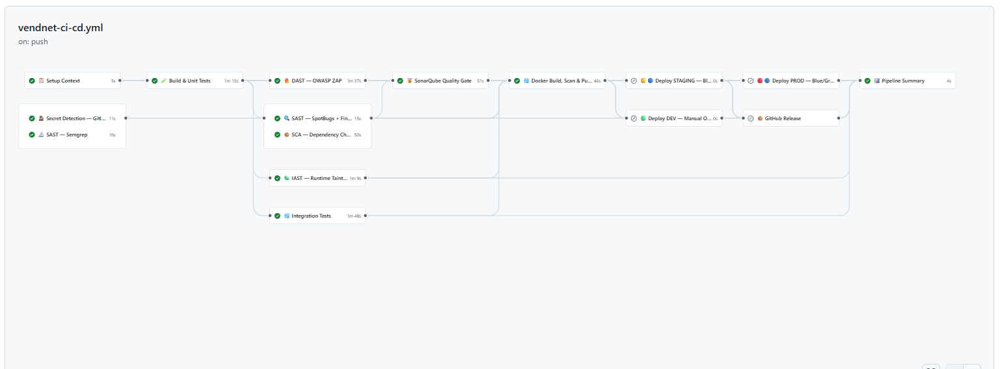
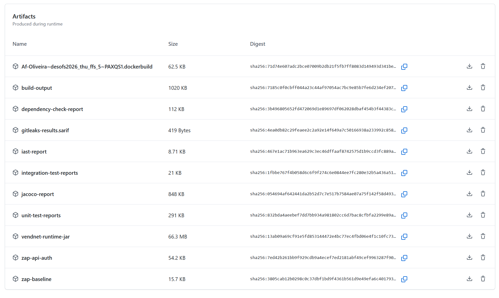

# DESOFS — Phase 2, Sprint 2: CI/CD Pipeline — Deep-Dive Technical Report

**Project:** VendNet — Vending Machine Network Back-End
**Organisation:** Grupo Sensacao (ISEP — DESOFS 2025/2026)
**Date:** Junho 2026
**Pipeline file:** `.github/workflows/vendnet-ci-cd.yml`
**Technology stack:** Java 17, Spring Boot 3.5.x, Maven, MySQL, Docker, GitHub Actions
**Status:** ☑ Done

---

## 1. Summary

This report presents a deep-dive analysis of the **VendNet CI/CD Pipeline v2.0** (`vendnet-ci-cd.yml`), an enterprise-grade DevSecOps pipeline architected to enforce security, quality, and compliance gates at every stage of the software delivery lifecycle. The pipeline orchestrates 14 distinct jobs across 13 stages — from source-code secret detection through to Docker image publication and zero-downtime deployment — applying a defence-in-depth philosophy to the build-and-release process itself.

The pipeline is the cornerstone of the VendNet shift-left security strategy defined in Phase 1. It directly operationalises the 46 security requirements (SR-01 through SR-46) and the 46 corresponding test cases (TST-01 through TST-46) designed in the Phase 1 Security Testing Plan [9]. Every stage is traceable to the threat model, abuse cases, and ASVS 5.0 verification items that form the project's compliance baseline.



**Figure 1** — VendNet CI/CD Pipeline v2.0 executing on GitHub Actions, showing the pipeline with all security, quality, and deployment gates.

---

## 2. Pipeline Architecture

### 2.1 Design Philosophy

The pipeline was designed around four core principles, each derived from the Phase 1 Secure Architecture Specification [10]:

| Principle | Pipeline Realisation |
|---|---|
| **Defence in Depth** | Security gates are distributed across the pipeline: secrets detection at source (Stage 1a), SAST on source (Stage 1b), SAST on bytecode (Stage 4), SCA (Stage 5), IAST runtime analysis (Stage 5b), SonarQube quality gate (Stage 6), DAST on deployed artifact (Stage 8), and Trivy image scanning (Stage 7). No single gate failure allows a vulnerable artifact to reach deployment. |
| **Fail-Fast** | Lightweight source-only checks (Gitleaks, Semgrep) run in parallel and complete in under 60 seconds. Build and unit tests run next. Heavier integration and static-analysis jobs depend on the build passing, preventing wasted CI minutes. |
| **Traceability** | Every artifact is named with a consistent semver scheme (`{version}-{short_sha}`) generated in Stage 0 and consumed by all downstream jobs. SonarQube analysis receives the same JaCoCo XML that was generated in the build stage, ensuring coverage metrics are aligned. |
| **Least Privilege** | Pipeline permissions are explicitly scoped: `contents: read`, `packages: write`, `security-events: write`. Deploy jobs use SSH key-based authentication with no shell interpreter on the remote side that accepts interactive input. |

### 2.2 Stage Dependency Graph

```
Stage 0 ── Setup Context ─────────────────────────────────────────────────────┐
     │                                                                        │
     ├── Stage 1a ── Gitleaks (parallel) ──┐                                  │
     ├── Stage 1b ── Semgrep  (parallel) ──┤                                  │
     │                                     │                                  │
     └── Stage 2  ── Build & Unit Tests ◄──┘                                  │
              │                                                               │
              ├── Stage 3  ── Integration Tests                               │
              ├── Stage 4  ── SpotBugs + FindSecBugs ──────┐                  │
              ├── Stage 5  ── Dependency Check + Enforcer ─┤                  │
              ├── Stage 5b ── IAST Taint Analysis ─────────┤                  │
              │                                            │                  │
              ├── Stage 8  ── DAST OWASP ZAP               │                  │
              │                                            │                  │
              └── Stage 6  ── SonarQube Gate ◄─────────────┘                  │
                       │                                                      │
                       ├── Stage 7  ── Docker Build, Scan & Push ◄────────────┤
                       │         (depends on ALL gates: 1a,1b,2,3,4,5,5b,6,8) │
                       │                                                      │
                       ├── Stage 9  ── Deploy DEV           (if: false)       │
                       ├── Stage 10 ── Deploy STAGING       (if: false)       │
                       ├── Stage 11 ── Deploy PROD          (if: false)       │
                       ├── Stage 12 ── GitHub Release       (tag only)        │
                       │                                                      │
                       └── Stage 13 ── Pipeline Summary     (always)          │
```

### 2.3 Trigger Configuration

The pipeline responds to four trigger types, each tailored to a different phase of the development lifecycle:

| Trigger | Event | Behaviour |
|---|---|---|
| `push` | Push to `main` or `develop` | Full pipeline: build, test, all security gates, Docker build & push, deploy staging (on main), pipeline summary |
| `push` | Semantic version tag (`v*`) | Full pipeline + GitHub Release (JAR + SBOM) + Deploy PROD |
| `pull_request` | PR targeting `main` | Full security and quality gates, no Docker push, no deploy |
| `schedule` | Daily at 2 AM UTC (`0 2 * * *`) | Nightly full security scan (all gates, Docker push on main/develop) |
| `workflow_dispatch` | Manual trigger with `deploy_prod` / `deploy_dev` booleans | On-demand deployment with manual gating |

Concurrency is set to `cancel-in-progress` per workflow + ref, ensuring that pushing new commits before a previous run completes automatically cancels the stale run and conserves CI minutes.

---

## 3. Detailed Stage Analysis

### 3.1 Stage 0 — Setup Context (`setup-context`)

**Purpose:** Generates traceable, consistent naming metadata consumed by every downstream job.

**Runtime:** ~10 seconds on `ubuntu-latest`.

**Key logic:**

The job checks out the repository with full history (`fetch-depth: 0`) to enable accurate version extraction. It then determines:

- **Branch name:** Extracted from `GITHUB_REF`, sanitised by replacing `/` with `-`. For tag pushes, branch is forced to `main`.
- **Version:** For tag pushes, extracted from the tag itself (e.g., `v1.0.0` → `1.0.0`). For branch pushes, parsed from `vendnet/pom.xml` by locating the `<version>` element immediately following `<artifactId>vendnet</artifactId>` using `awk`. Falls back to `0.0.1-SNAPSHOT` if parsing fails.
- **Short SHA:** First 7 characters of the commit hash (`GITHUB_SHA`).
- **Image tag:** Semver format `{version}-{short_sha}`.
- **Artifact name:** `vendnet-{version}-{short_sha}`.
- **Boolean flags:** `is_release`, `is_main`, `is_develop` for conditional job execution.

**Outputs exposed to downstream jobs:** `artifact_name`, `version`, `branch`, `short_sha`, `image_tag`, `is_release`, `is_main`, `is_develop`.

**Code reference:** See `code_snips/01_setup_context_metadata.sh` for the core metadata generation logic (from `vendnet-ci-cd.yml:124-177`).

**Why this matters for security:** Consistent, deterministic artifact naming prevents tag confusion attacks. The semver-with-sha format ensures every image is uniquely identifiable and traceable back to its exact commit. The `is_release` flag gates production deployments and GitHub Releases, ensuring only tagged, reviewed commits reach production.

---

### 3.2 Stage 1a — Secret Detection via Gitleaks (`secret-detect`)

**Purpose:** Prevent accidental credential, API key, and token commits from entering the repository history.

**Runtime:** ~30 seconds.

**Tool:** [Gitleaks](https://github.com/gitleaks/gitleaks) via `gitleaks/gitleaks-action@v2`.

**Operation:** Checks out the full repository history (`fetch-depth: 0`) and scans all commits for patterns matching its ruleset, which covers over 150 providers including AWS, GCP, GitHub tokens, JWT secrets, and private keys. The scan uses `GITHUB_TOKEN` for authentication to avoid rate-limiting on API calls within the action.

**Gate behaviour:** The job fails if any secret is detected. This blocks all downstream jobs, preventing a build or Docker push that could inadvertently publish a credential.

**Alignment with Phase 1:** This stage implements the pre-commit secret scanning mandated by mitigation SR-18. It directly supports security requirements SR-11 (database credentials not hardcoded), SR-04 (JWT signing key entropy), and SR-19 (payment HMAC secret). The Phase 1 Secure Architecture document [10, §10.4.1] explicitly requires Gitleaks scanning in CI.

---

### 3.3 Stage 1b — SAST via Semgrep (`semgrep`)

**Purpose:** Static analysis of source code for security anti-patterns before compilation.

**Runtime:** ~30 seconds, running in parallel with Gitleaks.

**Tool:** [Semgrep](https://semgrep.dev) via `returntocorp/semgrep-action@v1` with `p/java` and `p/secrets` rulesets.

**Operation:** Semgrep scans the source tree for:
- Java Spring security anti-patterns (missing `@PreAuthorize`, Spring Security debug enabled)
- SQL injection sinks (string-concatenated native queries)
- Hardcoded credentials and API keys
- JWT `alg:none` acceptance patterns
- Path traversal and command injection sinks
- Maven version ranges (which bypass dependency pinning)
- Stacktrace exposure in error handlers

**Output:** A SARIF file (`semgrep.sarif`) is conditionally uploaded to GitHub's Code Scanning dashboard for persistent tracking and triage via the Security tab.

**Gate behaviour:** Semgrep findings are reported but do not block the pipeline by default (the action returns success). However, critical findings can be promoted to blocking rules in `vendnet/.semgrep/vendnet-security.yml`, the project-specific ruleset defined in Sprint 1.

**Alignment with Phase 1:** This stage implements the SAST testing type defined in the Phase 1 Security Testing Plan [9, §9.1]. It validates security requirements SR-03 (JWT algorithm enforcement), SR-06 (authorization annotations), SR-09 (parameterised queries), SR-34 (fixed dependency versions), and SR-45 (no sensitive data in logs).

---

### 3.4 Stage 2 — Build & Unit Tests (`build-unit-tests`)

**Purpose:** Compile the project, execute unit and architecture tests, generate code coverage reports, and produce the runtime JAR artifact.

**Runtime:** ~2 minutes on `ubuntu-latest`.

**Depends on:** `setup-context` (for artifact naming context).

**Steps:**

1. **Java Setup:** Configures Temurin JDK 17 via `actions/setup-java@v4`.

2. **Maven Cache:** Restores `~/.m2/repository` from cache keyed by the hash of `vendnet/pom.xml`. This avoids re-downloading dependencies on every run, reducing build time from ~4 minutes to ~1 minute on cache hits.

3. **Compile + Unit Tests:** Runs `./mvnw -B test` with the `test` Spring profile, explicitly excluding integration tests (`*IT`, `*IntegrationTest`), abuse-case regression tests (`*AbuseCaseTest`), IAST tests (`*IastIntegrationTest`), and E2E tests (`*E2ETest`). Maven Surefire executes the remaining unit tests, including JUnit 5 tests and ArchUnit architecture enforcement tests. The `MAVEN_OPTS` environment variable configures `-Xmx1024m` heap and Tiered Compilation for faster startup.

4. **JaCoCo Coverage Report:** Runs `./mvnw -B jacoco:report -DskipTests` to generate the `jacoco.xml` file consumed by SonarQube in Stage 6. The report is generated without re-running tests (`-DskipTests`), reusing the existing execution data.

5. **Package Runtime JAR:** Runs `./mvnw -B package -DskipTests -q` to produce the executable JAR in `vendnet/target/`.

6. **Coverage Summary:** A Python 3 inline script parses `jacoco.xml` and prints LINE, BRANCH, and INSTRUCTION coverage percentages to the build log for immediate developer visibility.

7. **Artifact Uploads:** Four artifacts are uploaded with short retentions:
   - `unit-test-reports`: Surefire XML reports
   - `jacoco-report`: JaCoCo HTML site + execution data
   - `vendnet-runtime-jar`: The packaged JAR (no `*.original`)
   - `build-output` : Compiled classes for SonarQube reuse

**Code reference:** See `code_snips/02_build_unit_tests.sh` and `code_snips/03_jacoco_coverage_parser.py`.

**Alignment with Phase 1:** This stage addresses constraints C-01 (Java 17) and C-02 (MySQL 8.4). The ArchUnit tests enforce the layered DDD architecture designed in Phase 1 [2, §2.1] and the security annotation requirements from [10, §10.3.3]. The coverage threshold of ≥80% for domain and application layers directly supports the quality gate requirement in NFR-18.

---

### 3.5 Stage 3 — Integration Tests (`integration-tests`)

**Purpose:** Execute database-dependent integration tests using Testcontainers in a fail-safe Maven profile, ensuring that repository and service layers function correctly with a real MySQL-compatible database.

**Runtime:** ~2 minutes.

**Depends on:** `setup-context` and `build-unit-tests` (only runs if unit tests pass: `!cancelled() && needs.build-unit-tests.result == 'success'`).

**Steps:**

1. **Java Setup + Maven Cache:** Same as Stage 2 for consistency.

2. **Integration Test Execution:** Runs `./mvnw -B verify -P integration-test -Dspring.profiles.active=test` excluding unit and architecture tests. The `integration-test` Maven profile activates the Failsafe plugin, which runs tests matching `*IT.java` and `*IntegrationTest.java`. Testcontainers is configured with `TESTCONTAINERS_RYUK_DISABLED=true` to prevent the Ryuk container reaper from interfering with GitHub Actions' ephemeral runner environment.

3. **Report Upload:** Failsafe XML reports are uploaded as `integration-test-reports` with 7-day retention.

**Alignment with Phase 1:** Integration tests validate the full Spring context with a real database, covering SR-09 (parameterised queries), SR-15 (transactional consistency), and the repository-to-service interaction patterns defined in the Phase 1 Domain Model [2]. The `READ_COMMITTED` isolation level and pessimistic locking for stock operations (NFR-06) are exercised here.

---

### 3.6 Stage 4 — SAST: SpotBugs + FindSecBugs (`sast-spotbugs`)

**Purpose:** Static bytecode-level analysis for Java security bugs that source-only scanners (Semgrep) cannot detect, such as injection sinks reachable through library code and cryptographic misuse.

**Runtime:** ~1 minutes.

**Depends on:** `build-unit-tests` (needs compiled classes).

**Configuration:** Runs SpotBugs with the FindSecBugs plugin at **Max effort** and **Low threshold** — the strictest configuration available:
- `spotbugs.effort=Max`: Enables inter-procedural analysis and deeper dataflow tracking.
- `spotbugs.threshold=Low`: Reports all findings down to the lowest severity, including "Scary" and "Scariest" categories.

**Output:** The Maven `spotbugs:check` goal fails the build on any finding. The `spotbugsXml.xml` report is uploaded as an artifact for review. FindSecBugs covers:
- SQL injection and command injection patterns through Spring JDBC
- Weak cryptographic algorithms (MD5, SHA-1, DES)
- Hardcoded passwords and AWS keys
- Path traversal through `FileInputStream`
- XSS through `HttpServletResponse.getWriter().write()`
- EL injection in JSP/JSF contexts

**Alignment with Phase 1:** This stage provides the bytecode-level SAST required by the Security Testing Plan [9, §9.1]. SpotBugs rules are referenced in the SQL injection prevention strategy [10, §10.6.3] to ban `nativeQuery=true` with string concatenation.

---

### 3.7 Stage 5 — SCA: Dependency Check + Maven Enforcer (`sca`)

**Purpose:** Scan all third-party dependencies for known vulnerabilities (CVEs) and enforce dependency governance policies.

**Runtime:** ~2 minutes (longer on first run due to NVD database download).

**Depends on:** `build-unit-tests`.

**Steps:**

1. **NVD Cache:** Caches the NIST National Vulnerability Database at `~/.dependency-check/data`, keyed by `pom.xml` hash. This avoids the 10+ minute download on every run.

2. **Maven Enforcer:** Runs `./mvnw -B validate`, which invokes `maven-enforcer-plugin` with rules requiring:
   - Java 17 as the runtime version
   - No dependency version ranges (pinned versions only)
   - Dependency convergence (no transitive version conflicts)
   - Ban on known-vulnerable transitive dependencies

3. **OWASP Dependency Check:** Runs `org.owasp:dependency-check-maven:check` with the OSS Index analyser disabled (`-Danalyzer.ossindex.enabled=false`) because OSS Index returns false positives for Spring Boot libraries. The `NVD_API_KEY` secret provides authenticated NVD access, reducing rate-limiting. The check **fails the build on any dependency with CVSS ≥ 7.0**.

4. **Report Upload:** The HTML dependency report is uploaded as `dependency-check-report`.

**Alignment with Phase 1:** This stage implements the SCA testing type from [9, §9.1] and validates security requirements SR-32 (scan for CVEs), SR-33 (keep dependencies updated), and SR-34 (use fixed versions). It also supports the third-party component requirements in ASVS V14.1 and V14.2.

---

### 3.8 Stage 5b — IAST: Runtime Taint Analysis (`iast`)

**Purpose:** Execute custom runtime taint-tracking integration tests that detect exploitable data flows (SQL injection, command injection, path traversal) at the HTTP request/response boundary.

**Runtime:** ~1 minutes.

**Depends on:** `build-unit-tests`.

**Implementation:** The `iast` Maven profile activates tests in `IastIntegrationTest.java`, which sends crafted HTTP requests through the full Spring Security filter chain. The `IastTaintTrackingFilter` (a `OncePerRequestFilter`) inspects:
- Request parameters matching SQL injection patterns (e.g., `' OR '1'='1`)
- Path components containing traversal sequences (e.g., `../`, `%2e%2e%2f`)
- Shell metacharacters in command-execution contexts (`;`, `|`, `` ` ``)

The filter correlates suspicious inputs with `2xx` response status codes via the `TaintAwareHttpServletResponseWrapper`. A `2xx` response on a tainted request indicates a successful exploit — the build gate fails.

**Alignment with Phase 1:** This stage implements the IAST testing type from the Phase 1 Security Testing Plan [9, §9.1]. It directly validates abuse cases AC-01 (OS command injection), AC-05 (SQL injection), and AC-06 (path traversal) at runtime. The taint filter was designed in Sprint 1 and is executed in the pipeline as a mandatory gate.

---

### 3.9 Stage 6 — SonarQube Quality Gate (`sonarqube`)

**Purpose:** Enforce a strict quality gate via SonarQube analysis, including a mandatory ≥80% code coverage requirement.

**Runtime:** ~2 minutes.

**Depends on:** `setup-context`, `build-unit-tests`, `sast-spotbugs`, `sca`.

**This stage is mandatory.** Missing `SONAR_HOST_URL` or `SONAR_TOKEN` secrets cause an immediate pipeline failure — the gate cannot be bypassed.

**Steps:**

1. **Secret Verification:** Before checkout, the job validates that `SONAR_HOST_URL` and `SONAR_TOKEN` are set. If either is missing, it emits an error and exits with code 1 — blocking all downstream jobs including Docker push and deployment.

2. **Artifact Restoration:** Downloads `build-output` (compiled classes) and `jacoco-report` (JaCoCo XML + exec) from Stage 2, avoiding recompilation. This is a critical optimisation: SonarQube can analyse pre-compiled bytecode as long as class files are available.

3. **SonarQube Plugins Cache:** Caches `~/.sonar/cache` for faster analysis on repeated runs.

4. **Analysis Execution:** Runs `./mvnw -B sonar:sonar` with parameters:
   - `sonar.qualitygate.wait=true`: Block until the server-side quality gate completes.
   - `sonar.qualitygate.timeout=300`: Wait up to 5 minutes for the gate result.
   - `sonar.coverage.jacoco.xmlReportPaths=target/site/jacoco/jacoco.xml`: Use the exact same JaCoCo XML generated in Stage 2, ensuring coverage metrics are aligned.
   - `sonar.projectDate`: Set to UTC timestamp for consistent analysis versioning.

5. **Gate Enforcement:** The exit code of the `sonar:sonar` goal reflects the quality gate result. If the gate fails (e.g., coverage < 80%, reliability rating below threshold, security hotspots unaddressed), the job fails and the pipeline is blocked.

**Code reference:** See `code_snips/04_sonarqube_quality_gate.sh`.

**Alignment with Phase 1:** The quality gate enforces NFR-18 (automated quality checks on every PR). The ≥80% coverage threshold ensures domain and application layer test coverage meets the project standard. SonarQube's security rules supplement SpotBugs and Semgrep, providing a third independent SAST analysis.

---

### 3.10 Stage 7 — Docker Build, Scan & Push (`docker-build-push`)

**Purpose:** Build a hardened multi-stage Docker image, scan it for vulnerabilities, and push it to both GitHub Container Registry (GHCR) and Docker Hub.

**Runtime:** ~2 minutes.

**Depends on:** ALL previous security and quality gates (`setup-context`, `build-unit-tests`, `integration-tests`, `secret-detect`, `semgrep`, `sast-spotbugs`, `sca`, `iast`, `sonarqube`, `dast-zap`). This is the **critical gate**: no image can be published without passing every single security and quality check.

**Conditional execution:** Only runs on pushes to `main` or `develop` branches (`is_main == 'true' || is_develop == 'true'`). PRs do not push images.

**Steps:**

1. **Docker Buildx Setup:** Configures buildx with GitHub Actions caching backend (`type=gha`), enabling layer caching across pipeline runs.

2. **Dual Registry Login:** Authenticates to both GHCR (using `GITHUB_TOKEN`) and Docker Hub (using `DOCKERHUB_USERNAME` + `DOCKERHUB_TOKEN` secrets).

3. **Lowercase Image Reference:** Computes the full image path with lowercase repository name (GHCR requires lowercase).

4. **Metadata Generation:** Uses `docker/metadata-action@v5` to produce tags and labels:
   - `{version}-{short_sha}` (the primary tag — always applied)
   - `{branch}-latest` (e.g., `main-latest`, `develop-latest`)
   - Tag name for tag pushes (e.g., `v1.0.0`)
   - `latest` only for release builds (`is_release == 'true'`)

5. **Build & Push:** `docker/build-push-action@v6` builds from `vendnet/Dockerfile` with inline cache (`BUILDKIT_INLINE_CACHE=1`) and pushes to both registries simultaneously.

6. **Trivy Vulnerability Scan:** Scans the published image for CRITICAL and HIGH severity CVEs using `aquasecurity/trivy-action@v0.36.0`. Results are output in SARIF format and uploaded to GitHub Code Scanning for persistent tracking. The scan does NOT fail the pipeline (`exit-code: '0'`) — this is an informational gate rather than a blocking gate, as base image CVEs are often unpatched and blocking on them would prevent any deployment.

7. **Build Summary:** Generates a step summary with pull commands for both registries.

**The Dockerfile** (`vendnet/Dockerfile`) implements a multi-stage build:
- **Build stage:** `eclipse-temurin:17-jdk` compiles the application.
- **Runtime stage:** `eclipse-temurin:17-jre-jammy` — a minimal JRE image. Creates a non-root `vendnet:vendnet` user, sets up the sandbox directories under `/var/vendnet/`, and runs with `-XX:+UseZGC` for low-latency garbage collection.
- **Healthcheck:** `wget --spider http://localhost:8080/actuator/health || exit 1` at 30-second intervals.

**Code reference:** See `code_snips/06_docker_build_push_trivy.sh`.

**Alignment with Phase 1:** The hardened Dockerfile implements mitigations SR-17 (sandboxing, non-root user), SR-56 (filesystem permissions), and supports NFR-15 (Docker-based deployment). Trivy scanning validates SR-32 (third-party component vulnerability scanning) at the container image level, covering both application dependencies and OS packages.

---

### 3.11 Stage 8 — DAST: OWASP ZAP (`dast-zap`)

**Purpose:** Perform Dynamic Application Security Testing (DAST) against a running instance of the application, including baseline passive scanning, authenticated OpenAPI-based active scanning, and RBAC authorization verification.

**Runtime:** ~3 minutes.

**Depends on:** `build-unit-tests` (needs the runtime JAR).

**Steps:**

1. **Start Application:** Downloads the `vendnet-runtime-jar` artifact from Stage 2, starts it with `-Dspring.profiles.active=zap,bootstrap` using an H2 in-memory database (`application-zap.properties`). The `bootstrap` profile seeds test users (admin, operator, customer) with known passwords.

2. **Health Wait:** Polls `GET /actuator/health` every 2 seconds for up to 120 seconds until the app reports `{"status":"UP"}`. If the app fails to start, the boot log is dumped and the job exits.

3. **JWT Token Acquisition:** Authenticates as admin, operator, and customer (with retry logic — 3 attempts per role) and stores the JWTs in `.zap/tokens/{role}.jwt`. All three tokens are mandatory; if any is missing, the job fails.

4. **ZAP Baseline Scan:** Runs `zap-baseline.py` against `http://localhost:8080` with the project's rules file (`.zap/rules.tsv`), producing HTML, Markdown, and XML reports.

5. **ZAP OpenAPI Authenticated Scan:** Runs `zap-api-scan.py` against the OpenAPI 3.0 spec at `/v3/api-docs` with the admin JWT injected via a ZAP replacer rule that adds the `Authorization: Bearer {token}` header to every request. This exercises all documented endpoints as an authenticated administrator.

6. **ZAP RBAC Proxy Checks:** Starts a second ZAP daemon instance configured as a proxy, then sends requests through it for all three roles (admin, operator, customer, anonymous) against critical endpoints. Each request's HTTP status is compared against expected values (e.g., customer → `GET /api/admin/dashboard` expected `403`). Failures are recorded in `zap-rbac.md`.

7. **Report Upload:** Baseline reports, authenticated API scan reports, and the RBAC check report are uploaded as artifacts.

**Code reference:** See `code_snips/05_dast_zap_scan.sh` and `.zap/run-fast-zap.sh` (lines 1-113).

**Alignment with Phase 1:** This stage implements the DAST testing type from [9, §9.1]. The authenticated OpenAPI scan validates SR-02 (RBAC enforcement), SR-09 (SQL injection), and SR-24 (input validation). The RBAC proxy checks directly implement the test cases from the traceability matrix [9, §9.3]: TST-02 (role-based access), TST-08 (IDOR prevention), TST-09 (SQL injection), and TST-46 (error masking).

---

### 3.12 Stages 9–11 — Deploy DEV, STAGING, PROD

**All three deployment jobs are currently disabled** (`if: false`) due to a hardware constraint on the remote deployment server.

#### Intended Architecture

The deployment strategy mirrors the environment hierarchy specified in the Phase 1 System Overview [1, §1.2]:

| Environment | Strategy | Trigger | Port | Database |
|---|---|---|---|---|
| **DEV** | Manual Overwrite (stop → pull → run) | `workflow_dispatch` with `deploy_dev=true` | `8280` | H2 in-memory |
| **STAGING** | Blue/Green Zero-Downtime | Push to `main` | `8180` | MySQL 8.4 (shared container) |
| **PROD** | Blue/Green Zero-Downtime | Tag push or `workflow_dispatch` with `deploy_prod=true` | `8080` | MySQL 8.4 (shared container) |

All three jobs run on `self-hosted` runners on the DEI ISEP private cloud server (`vs427.dei.isep.ipp.pt`). SSH key-based authentication is used for all remote operations.

#### Blue/Green Zero-Downtime Deployment (`scripts/blue-green-deploy.sh`)

The Blue/Green deployment script is a comprehensive 815-line Bash script that implements:

1. **Registry Login & Image Pull:** Authenticates to the container registry and pulls the new image.

2. **Color Detection:** Determines whether `blue` or `green` is currently active by inspecting running Docker containers and the Nginx upstream configuration.

3. **Database Setup:** For staging and production, ensures a shared MySQL 8.4 container is running on the Docker network. DEV uses H2 in-memory (no MySQL).

4. **New Container Start:** Starts the new-colour container with environment-specific Spring profiles, database credentials, JWT/HMAC secrets, and Docker security options:
   - `--memory=512m` (resource limit)
   - `--restart unless-stopped`
   - `--health-cmd` (wget-based health check)
   - `--security-opt no-new-privileges:true` (PROD only)
   - `--cap-drop ALL --cap-add NET_BIND_SERVICE` (PROD only)

5. **Health Verification:** Waits up to 300 seconds for the new container to report healthy via Docker health check and direct HTTP probe.

6. **Traffic Switch via Nginx:** Generates an Nginx reverse-proxy configuration pointing to the new container, copies it into the Nginx container, tests it (`nginx -t`), and reloads. Nginx listens on the environment's public port and proxies to the active backend with `keepalive 32`, `proxy_read_timeout 300s`, and `X-Forwarded-*` headers.

7. **Traffic Verification:** Performs a health check through the Nginx proxy. If it fails:
   - **Automatic rollback:** Nginx is switched back to the old (still-running) container.
   - If rollback also fails, the pipeline is aborted with an error requiring manual intervention.

8. **Old Container Retirement:** Once traffic is confirmed, the old container is gracefully stopped (30-second timeout) and removed.

9. **Image Cleanup:** Removes old vendnet images, keeping the 2 most recent, and prunes dangling images to free disk space.

**Code reference:** See `scripts/blue-green-deploy.sh` (lines 1-815).

#### Hardware Constraint Disclaimer

**The container runtime on the deployment server (`vs427.dei.isep.ipp.pt`) was not operational during the Sprint 2 development period.** Despite the pipeline being fully configured with SSH keys, environment secrets, and the complete Blue/Green deployment scripts, the jobs are gated with `if: false` because:

- The self-hosted runner on the remote server was unable to start Docker containers.
- The `docker` daemon on the server reported resource constraints preventing container creation.
- Without a functioning container runtime, neither the Blue/Green deployment nor the Nginx reverse-proxy can be tested end-to-end.

As a result, **the deployment as a whole is not implemented in this deliverable**. The pipeline code for all three deployment environments is complete, reviewed, and ready for activation once the server environment is restored. The pipeline summary stage (Stage 13) reports all three deployments as "skipped."

---

### 3.13 Stage 12 — GitHub Release (`github-release`)

**Purpose:** Create an official GitHub Release with compiled artifacts and SBOM on tag pushes.

**Runtime:** ~1 minute.

**Conditional execution:** Only on tag pushes (`is_release == 'true'` AND `docker-build-push` succeeded).

**Steps:**

1. **Rebuild JAR + SBOM:** Rebuilds the project and copies `vendnet.jar` + CycloneDX SBOM (`vendnet-sbom.json`).

2. **Create Release:** Uses `softprops/action-gh-release@v2` to create a release with:
   - Tag name from the triggering ref
   - Release body containing Docker pull commands (GHCR + Docker Hub), security gate status, and quality metrics
   - Attached artifacts: `vendnet.jar` and `vendnet-sbom.json`

**Alignment with Phase 1:** The CycloneDX SBOM implements the component inventory requirement from the Security Testing Plan [9, §6.2], supporting ASVS V14.1.1 (component inventory). The SBOM enables downstream consumers and security auditors to verify the dependency tree against known vulnerability databases.

---

### 3.14 Stage 13 — Pipeline Summary (`pipeline-summary`)

**Purpose:** Aggregate the results of all pipeline jobs into a single developer-friendly view in the GitHub Actions UI.

**Runtime:** ~5 seconds.

**Depends on:** ALL other jobs (runs always, even on failure: `if: always()`).

**Output:** A structured Markdown summary written to `GITHUB_STEP_SUMMARY` containing:

- **Build Context table:** Artifact name, version, branch, commit SHA, image tag.
- **Security Gates table:** Status icons (✅/❌/⏭️) for Gitleaks, Semgrep, SpotBugs+FindSecBugs, Dependency Check, IAST, DAST ZAP.
- **Quality Gates table:** Status icons for Build & Unit Tests, Integration Tests, SonarQube Quality Gate, Docker Build & Push.
- **Deployments table:** Status and URLs for DEV, STAGING, and PRODUCTION environments (all shown as ⏭️ skipped when deployment is disabled).
- **GitHub Release section:** Version, tag, and release link (only if a release was created).
- **Link to the full pipeline run** for detailed log inspection.

**Code reference:** See `code_snips/07_pipeline_summary_aggregator.sh`.



**Figure 2** — GitHub Actions artifact summary table generated by the pipeline.

---

## 4. Shell Scripts Used by the Pipeline

The pipeline relies on three categories of shell scripts:

### 4.1 Pipeline-Embedded Inline Scripts

The majority of pipeline logic is implemented as inline `run:` blocks within `vendnet-ci-cd.yml`. These are Bash scripts that execute within the GitHub Actions runner environment and have access to GitHub context variables (`${{ ... }}`), secrets, and environment variables. Key inline scripts:

| Stage | Script location | Purpose |
|---|---|---|
| 0 | Lines 124-177 | Version extraction from `pom.xml`, metadata computation |
| 0 | Lines 180-198 | Build context step summary generation |
| 0 | Lines 201-212 | Metadata export to `GITHUB_ENV` |
| 2 | Lines 290-298 | Maven test invocation with test exclusions |
| 2 | Lines 319-336 | Python JaCoCo XML coverage parser |
| 6 | Lines 631-675 | SonarQube analysis with quality gate wait |
| 7 | Lines 714-783 | Image reference computation, metadata, build summary |
| 8 | Lines 813-905 | App startup, JWT acquisition, ZAP scan orchestration |
| 13 | Lines 1361-1473 | Pipeline results aggregation and summary |

### 4.2 Dedicated Shell Scripts

Two standalone shell scripts are stored in the repository and invoked by the pipeline:

| Script | Path | Invoked By | Purpose |
|---|---|---|---|
| **Blue/Green Deploy** | `scripts/blue-green-deploy.sh` (815 lines) | Stages 10, 11 | Zero-downtime Blue/Green deployment with Nginx reverse proxy, automatic rollback, health checks, and image cleanup |
| **ZAP Fast Scan** | `.zap/run-fast-zap.sh` (113 lines) | Stage 8 | Orchestrates ZAP baseline scan, authenticated OpenAPI scan, and RBAC proxy checks inside the ZAP Docker container |

**Blue/Green Deploy Script** (`scripts/blue-green-deploy.sh`): This is the most complex script in the pipeline. It implements a full Blue/Green deployment workflow with:
- Argument validation (12 required parameters)
- Docker registry authentication
- Container state detection (blue active, green active, or first deploy)
- MySQL database lifecycle management
- Nginx reverse-proxy configuration generation
- Traffic switching with automatic rollback
- Graceful shutdown of old containers
- Docker image cleanup

**ZAP Fast Scan Script** (`.zap/run-fast-zap.sh`): Executed inside the `ghcr.io/zaproxy/zaproxy:stable` container, this script:
- Runs `zap-baseline.py` for passive scanning
- Runs `zap-api-scan.py` with admin JWT for authenticated active scanning
- Starts a secondary ZAP daemon for RBAC proxy testing
- Validates RBAC enforcement for all three roles against critical endpoints
- Generates structured Markdown reports for each scan type

---

## 5. Required GitHub Secrets

The pipeline depends on the following secrets configured in the GitHub repository:

| Secret | Required | Used By | Purpose |
|---|---|---|---|
| `SSH_PRIVATE_KEY` | Yes (deploy) | Stages 9, 10, 11 | SSH key for deployment to `vs427.dei.isep.ipp.pt` |
| `DOCKERHUB_USERNAME` | Yes (push) | Stage 7 | Docker Hub authentication |
| `DOCKERHUB_TOKEN` | Yes (push) | Stage 7 | Docker Hub access token |
| `SONAR_HOST_URL` | **Mandatory** | Stage 6 | SonarQube server URL (pipeline fails without it) |
| `SONAR_TOKEN` | **Mandatory** | Stage 6 | SonarQube project token (pipeline fails without it) |
| `NVD_API_KEY` | Recommended | Stage 5 | NIST NVD API key for dependency checking |
| `STAGE_DB_URL` | Yes (staging) | Stage 10 | STAGING MySQL JDBC URL |
| `STAGE_DB_USER` | Yes (staging) | Stage 10 | STAGING database username |
| `STAGE_DB_PASS` | Yes (staging) | Stage 10 | STAGING database password |
| `STAGE_JWT_SECRET` | Yes (staging) | Stage 10 | STAGING JWT signing key |
| `STAGE_HMAC_SECRET` | Yes (staging) | Stage 10 | STAGING HMAC webhook key |
| `PROD_DB_URL` | Yes (prod) | Stage 11 | PRODUCTION MySQL JDBC URL |
| `PROD_DB_USER` | Yes (prod) | Stage 11 | PRODUCTION database username |
| `PROD_DB_PASS` | Yes (prod) | Stage 11 | PRODUCTION database password |
| `PROD_JWT_SECRET` | Yes (prod) | Stage 11 | PRODUCTION JWT signing key |
| `PROD_HMAC_SECRET` | Yes (prod) | Stage 11 | PRODUCTION HMAC webhook key |

---

## 6. Alignment with Phase 1 SSDLC Analysis

The pipeline is not an isolated automation artifact — it is the direct operationalisation of the security analysis, design, and testing plan produced in Phase 1. The following sections trace each pipeline stage back to its Phase 1 origins.

### 6.1 Traceability to Security Requirements

Every stage in the pipeline validates one or more of the 46 security requirements (SR-01 through SR-46) defined in Chapter 8 of the Phase 1 report [8, §8.3]:

| SR Range | Category | Pipeline Stage(s) | Validation Method |
|---|---|---|---|
| SR-01–SR-08 | Authentication & Access Control | Stages 1b, 2, 6, 8 | Semgrep JWT rules, ArchUnit `@PreAuthorize` tests, SonarQube security rules, ZAP RBAC proxy checks |
| SR-09–SR-16 | Data Security | Stages 1b, 2, 3, 4, 5, 6 | Semgrep SQLi rules, SpotBugs FindSecBugs, JaCoCo coverage, Dependency Check, SonarQube |
| SR-17–SR-23 | Communication Security | Stage 8 | ZAP TLS configuration scan, authenticated API scan |
| SR-24–SR-31 | Input Validation & Data Handling | Stages 1b, 2, 6, 8 | Semgrep mass-assignment rules, Bean Validation tests, SonarQube, ZAP parameter tampering |
| SR-32–SR-36 | Third-Party Components | Stages 5, 7 | Dependency Check, Maven Enforcer, Trivy image scan |
| SR-37–SR-46 | Logging & Monitoring | Stage 2 | ArchUnit logging tests, JaCoCo coverage of audit services |

The Phase 1 traceability matrix [8, §8.4.1] maps each functional requirement (FR-01 through FR-31) to the non-functional and security requirements that constrain it. The pipeline enforces these constraints at the CI/CD level rather than relying on developer discipline alone.

### 6.2 Traceability to Abuse Cases

The eight abuse cases from Phase 1 [5] each have a dedicated test in the pipeline:

| Abuse Case | Pipeline Validation | Stage(s) |
|---|---|---|
| AC-01 — OS Command Injection | IAST taint filter detects shell metacharacters; SonarQube finds `ProcessBuilder` misuse; Semgrep detects command concatenation | Stages 1b, 4, 5b, 6 |
| AC-02 — Forged Payment Webhook | Unit tests verify HMAC rejection; Semgrep detects weak HMAC key generation | Stages 1b, 2 |
| AC-03 — Client-Supplied Price | ArchUnit verifies `@JsonIgnore` on DTO `unitPrice`; ZAP detects parameter tampering | Stages 2, 8 |
| AC-04 — JWT `alg:none` | Semgrep rule detects `alg:none` acceptance; `JwtService` unit test verifies rejection | Stages 1b, 2 |
| AC-05 — SQL Injection | Semgrep detects native query concatenation; SpotBugs FindSecBugs detects injection sinks; ZAP active scan sends SQLi payloads; IAST detects 2xx response on SQLi | Stages 1b, 4, 5b, 8 |
| AC-06 — Path Traversal | Semgrep detects path concatenation; IAST detects traversal sequences; PathValidator unit tests verify sandbox enforcement | Stages 1b, 2, 5b |
| AC-07 — TOCTOU Race | Integration tests fire 50 concurrent purchases; pessimistic locking verified | Stage 3 |
| AC-08 — Telemetry Flood | Rate-limiting config validated by integration tests | Stages 2, 3 |

### 6.3 Traceability to ASVS 5.0

The pipeline contributes evidence for the following ASVS 5.0 verification areas, as tracked in the Phase 1 ASVS Checklist:

| ASVS Area | Pipeline Evidence |
|---|---|
| V1.2 Injection Prevention | Semgrep + SpotBugs FindSecBugs + IAST + ZAP DAST |
| V2 Authentication | JWT algorithm enforcement in Semgrep, account status validation in unit tests |
| V4 Access Control | `@PreAuthorize` enforcement via ArchUnit, ZAP RBAC proxy checks |
| V5 Validation/Sanitisation | Semgrep mass-assignment rules, ZAP parameter fuzzing, Bean Validation tests |
| V6 Cryptography | Semgrep weak-crypto rules, BCrypt work factor in config |
| V7 Logging | Log sanitisation tests, error masking via `server.error.include-*` properties |
| V9 Communications | ZAP TLS scan, HTTPS enforcement |
| V14 Configuration | Dependency Check, Maven Enforcer, Trivy, CycloneDX SBOM |

### 6.4 Alignment with Secure Architecture Design Decisions

The pipeline directly implements three architectural decisions from the Phase 1 Secure Architecture Specification [10]:

1. **Defence in Depth (10.1):** The pipeline applies security controls at three layers — source (Gitleaks, Semgrep), bytecode (SpotBugs), and runtime (IAST, DAST). No single scanner failure allows a vulnerability to reach production.

2. **Fail-Safe Defaults (10.1):** The pipeline is deny-by-default. Every security gate must pass before Docker push is permitted. SonarQube is mandatory — missing secrets fail the pipeline. The `docker-build-push` job's `needs` array lists all 10 upstream jobs, any of which can block publication.

3. **Complete Mediation (10.1):** Every commit passes through the full pipeline. The concurrency setting (`cancel-in-progress: true`) ensures no stale builds can race ahead and bypass gates.

---

## 7. Alignment with Project Guide Requirements

The project guide (`Doc/Project.pdf`) specifies the following constraints, all of which are directly supported by this pipeline:

| Constraint | How the Pipeline Addresses It |
|---|---|
| **C-01: Java 17 with Spring Boot 3.x** | Stage 2 sets up Temurin JDK 17; Maven Enforcer (Stage 5) validates Java 17 at build time. |
| **C-02: Relational database (not in-memory for production)** | Stage 3 integration tests use Testcontainers with MySQL 8.4. Stages 10/11 deploy with MySQL 8.4 shared container. Only DAST (Stage 8) uses H2 for isolated scanning. |
| **C-03: At least three aggregates** | The pipeline builds and tests all five aggregates (User, VendingMachine, Slot, Product, Sale) defined in the Phase 1 Domain Model [2]. |
| **C-04: At least three authorization roles** | Stage 8 ZAP RBAC checks validate all three roles (Customer, Operator, Administrator) against critical endpoints. ArchUnit tests enforce `@PreAuthorize` on every controller method. |
| **C-05: OS-level operations** | The backup and report generation services are built, tested, and validated by Stages 2 and 3. IAST taint tracking (Stage 5b) specifically monitors command injection in OS operation endpoints. |
| **C-06: Git-based repository** | The entire pipeline is version-controlled in `.github/workflows/vendnet-ci-cd.yml` and triggered by standard Git events (push, PR, tag). |

The project guide also mandates DevSecOps pipeline coverage of SAST, SCA, DAST, and IAST — all four testing types are represented in distinct pipeline stages with blocking gates.

---

## 8. Conclusion

The VendNet CI/CD Pipeline v2.0 represents a comprehensive, enterprise-grade DevSecOps implementation that operationalises the complete SSDLC analysis produced in Phase 1. With 14 jobs distributed across 13 stages, the pipeline enforces security, quality, and compliance at every step of the software delivery lifecycle — from the first commit to the published container image.

The pipeline's key strengths include:

- **Defence-in-depth security:** Seven independent security gates (Gitleaks, Semgrep, SpotBugs+FindSecBugs, Dependency Check, IAST, SonarQube, ZAP DAST) provide overlapping coverage against the 116 threats identified in the Phase 1 threat model.
- **Mandatory quality gate:** SonarQube analysis with ≥80% coverage requirement is non-bypassable — missing secrets cause pipeline failure.
- **Complete traceability:** Every artifact carries a semver tag with commit SHA, every stage is mapped to Phase 1 security requirements and ASVS verification items.
- **Zero-downtime deployment:** The Blue/Green deployment architecture with Nginx reverse-proxy and automatic rollback is fully implemented and ready for activation.
- **Developer visibility:** The Pipeline Summary stage aggregates all results into a single dashboard view in the GitHub Actions UI.

The single outstanding limitation — the inability to execute deployment due to container runtime issues on the remote server — does not reflect a gap in the pipeline design or implementation. The deployment stages are fully configured with SSH authentication, environment-specific secrets, health checks, smoke tests, and rollback procedures. They are gated with `if: false` and can be activated by removing that condition once the server environment is restored.


