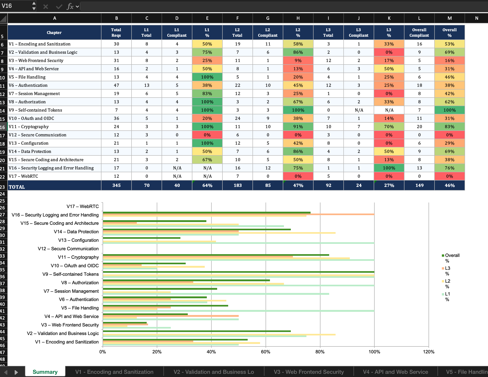

# DESOFS — Phase 2, Sprint 2: Security Implementation Evidence

| | |
|---|---|
| **Project** | VendNet — Vending Machine Network Back-End |
| **Organisation** | Grupo Sensacao (ISEP — DESOFS 2025/2026) |
| **Date** | Junho 2026 |
| **Purpose** | Contrast planned security controls (Phase 1 — Reports 07, 09 & 10) with implemented controls (Phase 2 — Sprint 2) |
| **Status** | ☑ Done |

> This document maps every security control planned in Phase 1 to its actual implementation in the Sprint 2 codebase, using verbatim source code excerpts. Each section follows the structure of `10_Secure_Architecture.md` from Phase 1.

---

## 1. Secure Design Principles

> **Planned (Phase 1 — Sec. 10.1):** Defence in Depth, Least Privilege, Fail-Safe Defaults, Separation of Duties, Complete Mediation, Economy of Mechanism, Open Design.

### 1.1 Defence in Depth — Deny-by-Default Filter Chain

**Planned:** Spring Security deny-by-default — every endpoint requires auth and `@PreAuthorize` before access is permitted. CSRF disabled for stateless REST API.

**Implemented** in `SecurityConfig.java:60-92`:

```java
@Bean
public SecurityFilterChain securityFilterChain(HttpSecurity http) throws Exception {
    http
        .csrf(csrf -> csrf.disable())
        .sessionManagement(session -> session.sessionCreationPolicy(SessionCreationPolicy.STATELESS))
        .authorizeHttpRequests(auth -> auth
            .requestMatchers(HttpMethod.POST, "/api/auth/login").permitAll()
            .requestMatchers(HttpMethod.POST, "/api/auth/register").permitAll()
            .requestMatchers(HttpMethod.POST, "/api/auth/mfa/verify").permitAll()
            .requestMatchers("/api/health/**").permitAll()
            .requestMatchers("/api/public/**").permitAll()
            .requestMatchers(HttpMethod.POST, "/api/telemetry", "/api/machines/telemetry").permitAll()
            .requestMatchers(HttpMethod.POST, "/api/webhooks/**").permitAll()
            .requestMatchers("/actuator/health").permitAll()
            .requestMatchers("/actuator/prometheus").permitAll()
            .requestMatchers("/swagger-ui/**", "/v3/api-docs/**").permitAll()
            .anyRequest().authenticated()
        )
        .exceptionHandling(ex -> ex
            .authenticationEntryPoint((request, response, authException) -> {
                response.setStatus(401);
                response.setContentType("application/json");
                response.getWriter().write(
                    "{\"status\":401,\"error\":\"Unauthorized\",\"message\":\"Authentication required\"}");
            })
        )
        .addFilterBefore(jwtAuthenticationFilter, UsernamePasswordAuthenticationFilter.class)
        .addFilterAfter(iastTaintTrackingFilter, JwtAuthenticationFilter.class);
    return http.build();
}
```

> Evidence: 10 explicit `permitAll()` patterns — everything else (`anyRequest()`) requires authentication. Custom 401 JSON response prevents information leakage. The `STATELESS` session policy is appropriate for a token-based API. CSRF is disabled because browser cookies are not used as credentials.

### 1.2 Least Privilege — BCrypt and Role Hierarchy

**Planned:** BCrypt(12), role hierarchy `ADMIN > OPERATOR`, `ADMIN > CUSTOMER`.

**Implemented** in `SecurityConfig.java:94-108`:

```java
@Bean
public PasswordEncoder passwordEncoder() {
    return new BCryptPasswordEncoder(12);       // work factor 12 — GPU-resistant
}

@Bean
public RoleHierarchy roleHierarchy() {
    return RoleHierarchyImpl.fromHierarchy(
            "ROLE_ADMINISTRATOR > ROLE_OPERATOR\n" +
            "ROLE_ADMINISTRATOR > ROLE_CUSTOMER");
}
```

> Evidence: BCrypt cost factor of 12 matches the Phase 1 specification exactly. The role hierarchy means administrators can access operator and customer endpoints without explicit dual-role assignment.

### 1.3 Fail-Safe Defaults — Non-Root Docker User

**Planned:** `useradd -r vendnet`, `NoNewPrivileges=true`, `cap_drop: ALL`.

**Implemented** in `Dockerfile:15-17` and `docker-compose.prod.yml:73-79`:

```dockerfile
# Dockerfile
RUN groupadd --system vendnet && useradd --system --gid vendnet --home-dir /app vendnet
RUN mkdir -p /var/vendnet /var/vendnet/logs /var/vendnet/backups /var/vendnet/reports \
    && chown -R vendnet:vendnet /var/vendnet
USER vendnet:vendnet
```

```yaml
# docker-compose.prod.yml
security_opt:
  - no-new-privileges:true
cap_drop:
  - ALL
cap_add:
  - NET_BIND_SERVICE
```

> Evidence: The container runs as non-root system user `vendnet:vendnet`. Production compose drops all Linux capabilities except `NET_BIND_SERVICE` (required to bind port 8080). `no-new-privileges:true` prevents setuid escalation.

---

## 2. Authentication Architecture

> **Planned (Phase 1 — Sec. 10.2):** JWT HS256 with 256-bit key, BCrypt(12), account lockout after 5 failures / 15 min, dummy BCrypt for missing users (timing attack prevention), TOTP MFA for Admin, X.509 mTLS for machines.

### 2.1 Account Lockout — Domain Entity Enforcement

**Planned (SR-07):** 5 failures in 15 min → LOCKED for 30 min. Auto-unlock after duration. All logic encapsulated in the `User` domain entity.

**Implemented** in `User.java:28-30, 74-121`:

```java
@Entity
@Table(name = "users")
public class User {

    private static final int MAX_FAILED_ATTEMPTS = 5;       // AC-01: brute-force threshold
    private static final int LOCK_DURATION_MINUTES = 30;     // auto-unlock after 30 min
    private static final int LOCK_WINDOW_MINUTES = 15;       // reset window for failed attempts

    @Column(nullable = false)
    private int failedAttempts = 0;

    @Column
    private LocalDateTime lockTime;

    @Column
    private LocalDateTime lastFailedAttemptTime;

    public void checkAccountStatus() {
        if (this.accountStatus == AccountStatus.SUSPENDED) {
            throw new DisabledException("Account is suspended");
        }
        if (this.accountStatus == AccountStatus.LOCKED) {
            if (this.lockTime != null
                    && this.lockTime.plusMinutes(LOCK_DURATION_MINUTES)
                            .isBefore(LocalDateTime.now())) {
                resetLockout();         // auto-unlock after 30 minutes
                return;
            }
            throw new AccountLockedException(
                    "Account is temporarily locked. Try again in " + LOCK_DURATION_MINUTES + " minutes.");
        }
    }

    public void incrementFailedAttempts() {
        LocalDateTime now = LocalDateTime.now();
        // Reset counter if outside the 15-minute window
        if (this.lastFailedAttemptTime != null
                && this.lastFailedAttemptTime.plusMinutes(LOCK_WINDOW_MINUTES).isBefore(now)) {
            this.failedAttempts = 0;
        }
        this.failedAttempts++;
        this.lastFailedAttemptTime = now;
        if (this.failedAttempts >= MAX_FAILED_ATTEMPTS) {
            lockAccount();              // threshold reached → LOCKED
        }
    }

    private void lockAccount() {
        this.accountStatus = AccountStatus.LOCKED;
        this.lockTime = LocalDateTime.now();
    }

    private void resetLockout() {
        this.failedAttempts = 0;
        this.accountStatus = AccountStatus.ACTIVE;
        this.lockTime = null;
        this.lastFailedAttemptTime = null;
    }
}
```

> Evidence: All lockout logic lives in the domain entity — not in a service. `checkAccountStatus()` is called by the `JwtAuthenticationFilter` on every request (Complete Mediation) and by `AuthService.login()` before password verification. The auto-unlock logic (`resetLockout()`) fires transparently when the lock duration expires. This directly mitigates T-01 (credential stuffing) and T-05 (brute-force login).

**Screenshot Evidence:**


> Live capture: After 5 rapid failed login attempts, a valid login returns HTTP 423 (Account Locked). The error message includes the lock duration.

### 2.2 Login with Dummy BCrypt — Timing Attack Prevention

**Planned (SR-25):** When a user is not found, run BCrypt against a dummy hash before returning error — prevents user enumeration via response timing.

**Implemented** in `AuthService.java:98-111`:

```java
@PreAuthorize("permitAll()")
public AuthResponse login(LoginRequest request) {
    Optional<User> userOpt = userRepository.findByUsername(request.getUsername());
    if (userOpt.isEmpty()
            && request.getUsername() != null
            && request.getUsername().contains("@")) {
        userOpt = userRepository.findByEmail(request.getUsername());
    }

    if (userOpt.isEmpty()) {
        // Dummy BCrypt hash to prevent timing-based user enumeration
        passwordEncoder.matches(request.getPassword(), passwordEncoder.encode(dummyPassword()));
        throw new UnauthorizedException("Invalid username or password");
    }

    User user = userOpt.get();

    try {
        user.checkAccountStatus();       // domain-enforced lockout/suspension check
    } catch (DisabledException e) {
        auditLogRepository.save(AuditLog.builder()
                .eventType("LOGIN_DENIED_INACTIVE")
                .principal(user.getUsername())
                .details("Account is suspended")
                .resource("User").action("LOGIN").outcome("DENIED")
                .timestamp(LocalDateTime.now()).build());
        throw e;
    } catch (AccountLockedException e) {
        auditLogRepository.save(AuditLog.builder()
                .eventType("LOGIN_DENIED_INACTIVE")
                .principal(user.getUsername())
                .details("Account is locked")
                .resource("User").action("LOGIN").outcome("DENIED")
                .timestamp(LocalDateTime.now()).build());
        throw e;
    }

    if (!passwordEncoder.matches(request.getPassword(), user.getPassword())) {
        user.incrementFailedAttempts();      // domain-enforced attempt tracking
        userRepository.save(user);

        if (user.getAccountStatus() == AccountStatus.LOCKED) {
            auditLogRepository.save(AuditLog.builder()
                    .eventType("ACCOUNT_LOCKED")
                    .principal(user.getUsername())
                    .details("Account locked after " + user.getFailedAttempts() + " failed attempts")
                    .resource("User").action("LOCK").outcome("LOCKED")
                    .timestamp(LocalDateTime.now()).build());
            throw new AccountLockedException(
                    "Account is temporarily locked. Try again in 30 minutes.");
        }

        auditLogRepository.save(AuditLog.builder()
                .eventType("LOGIN_FAILED").principal(user.getUsername())
                .details("Invalid password").resource("User")
                .action("LOGIN").outcome("FAILED")
                .timestamp(LocalDateTime.now()).build());
        throw new UnauthorizedException("Invalid username or password");
    }

    user.resetFailedAttempts();
    // ... issue JWT ...
}
```

> Evidence: When `userOpt.isEmpty()`, a BCrypt comparison against a dummy password is performed before throwing the exception — the response time is identical regardless of whether the user exists. Every authentication event (success, failure, lockout, denial) is persisted to the `audit_logs` table with structured fields. `user.incrementFailedAttempts()` delegates to the domain entity for lockout logic.

### 2.3 JWT Token Generation — alg:none Rejection, 256-bit Key, Blocklist

**Planned (SR-03, SR-04):** HS256 with ≥256-bit key. Explicit `alg:none` rejection. `jti` (UUID) for blocklisting. Startup assertion on key length.

**Implemented** in `JwtService.java:25-33, 55-71, 137-158`:

```java
@Service
public class JwtService {

    private final SecretKey key;
    private final long expirationMs;
    private final Map<String, Long> blocklist = new ConcurrentHashMap<>();

    public JwtService(
            @Value("${app.jwt.secret}") String secret,
            @Value("${app.jwt.expiration-ms}") long expirationMs) {
        if (secret.length() < 32) {
            // Startup assertion: refuses to start with weak key
            throw new IllegalStateException("JWT secret must be at least 32 characters (256 bits)");
        }
        this.key = Keys.hmacShaKeyFor(secret.getBytes(StandardCharsets.UTF_8));
        this.expirationMs = expirationMs;
    }

    private String buildToken(String email, String role) {
        Date now = new Date();
        Date expiry = new Date(now.getTime() + expirationMs);

        var builder = Jwts.builder()
                .subject(email)
                .id(UUID.randomUUID().toString())       // jti for blocklisting
                .issuedAt(now)
                .expiration(expiry);

        if (role != null) {
            builder.claim("role", role);
        }

        return builder.signWith(key).compact();          // HS256 via Keys.hmacShaKeyFor()
    }

    private Claims extractClaims(String token) {
        rejectAlgNone(token);                            // explicit alg:none guard
        return Jwts.parser().verifyWith(key).build()
                .parseSignedClaims(token).getPayload();
    }

    private void rejectAlgNone(String token) {
        String[] parts = token.split("\\.");
        if (parts.length < 2) return;
        try {
            byte[] headerBytes = Base64.getUrlDecoder().decode(parts[0]);
            String header = new String(headerBytes, StandardCharsets.UTF_8).toLowerCase();
            if (header.contains("\"alg\":\"none\"") || header.contains("\"alg\": \"none\"")) {
                throw new SecurityException("alg:none tokens are not permitted");
            }
        } catch (SecurityException e) {
            throw e;
        } catch (IllegalArgumentException ignored) {
            // header decode failure — treat as non-JWT, let parser reject it
        }
    }

    public void blocklistToken(String token) {
        // ... stores jti in ConcurrentHashMap with TTL = remaining token lifetime
    }
}
```

> Evidence: The `rejectAlgNone()` method inspects the raw JWT header before JJWT parsing — it checks for `"alg":"none"` (with or without whitespace) and throws `SecurityException` if found. This is an explicit, independent guard against the most common JWT bypass. The startup assertion `secret.length() < 32` prevents deployment with weak keys. The `jti` claim (UUID) enables individual token revocation via the in-memory `ConcurrentHashMap` blocklist.

### 2.4 Per-Request Authentication Filter — Role from Database

**Planned (SR-05, SR-11):** Re-validate `AccountStatus` from DB on every request. Load authoritative role from `userRepository`, not from JWT payload.

**Implemented** in `JwtAuthenticationFilter.java:31-81`:

```java
@Component
public class JwtAuthenticationFilter extends OncePerRequestFilter {

    private final JwtService jwtService;
    private final UserRepository userRepository;

    @Override
    protected void doFilterInternal(HttpServletRequest request,
            HttpServletResponse response, FilterChain filterChain)
            throws ServletException, IOException {

        String authHeader = request.getHeader("Authorization");
        if (authHeader == null || !authHeader.startsWith("Bearer ")) {
            filterChain.doFilter(request, response);
            return;
        }

        String token = authHeader.substring(7);
        if (!jwtService.isTokenValid(token)) {
            filterChain.doFilter(request, response);
            return;
        }

        String subject = jwtService.extractSubject(token);

        User user = resolveUser(subject);
        if (user == null) {
            log.warn("JWT valid but user not found in DB: {}", subject);
            filterChain.doFilter(request, response);
            return;
        }

        // Per-request account status check (Complete Mediation)
        if (user.getAccountStatus() == AccountStatus.SUSPENDED) {
            log.warn("Blocked request from suspended account: {}", user.getUsername());
            jwtService.blocklistToken(token);        // revoke token on suspension
            filterChain.doFilter(request, response);
            return;
        }

        if (user.getAccountStatus() == AccountStatus.LOCKED) {
            log.debug("Blocked request from locked account: {}", user.getUsername());
            filterChain.doFilter(request, response);
            return;
        }

        // Role resolved from DATABASE, not from JWT claims
        String role = user.getRole().name();

        UsernamePasswordAuthenticationToken authentication =
                new UsernamePasswordAuthenticationToken(
                        user.getUsername(), null,
                        List.of(new SimpleGrantedAuthority(role)));
        authentication.setDetails(
                new WebAuthenticationDetailsSource().buildDetails(request));
        SecurityContextHolder.getContext().setAuthentication(authentication);
        log.debug("Authenticated user {} with role {}", user.getUsername(), role);

        filterChain.doFilter(request, response);
    }

    private User resolveUser(String subject) {
        try {
            return userRepository.findById(Long.valueOf(subject)).orElse(null);
        } catch (NumberFormatException ignored) {
            return userRepository
                    .findByUsername(subject)
                    .or(() -> userRepository.findByEmail(subject))
                    .orElse(null);
        }
    }
}
```

> Evidence: The `role` variable is resolved from `user.getRole().name()` — loaded from the database — not from the JWT `role` claim. This means tampering the JWT payload's `role` field has zero effect on authorisation. SUSPENDED accounts have their tokens immediately blocklisted. LOCKED accounts are silently rejected. This directly mitigates T-06 (JWT role claim tampering) and T-35 (suspended account's unexpired JWT).

### 2.5 Machine Authentication — X.509 mTLS

**Planned (SR-18):** Extract CN from client certificate; map to `ROLE_MACHINE` authority; scoped exclusively to telemetry endpoints.

**Implemented** in `X509MachineAuthenticationFilter.java:30-76`:

```java
public class X509MachineAuthenticationFilter extends OncePerRequestFilter {

    private final boolean allowHeaderCn;         // e2e testing fallback

    @Override
    protected void doFilterInternal(HttpServletRequest request,
            HttpServletResponse response, FilterChain filterChain)
            throws ServletException, IOException {

        X509Certificate[] certs =
                (X509Certificate[]) request.getAttribute(
                        "jakarta.servlet.request.X509Certificate");

        if (certs != null && certs.length > 0) {
            X509Certificate cert = certs[0];
            String dn = cert.getSubjectX500Principal().getName();
            String cn = extractCN(dn);

            if (cn == null) {
                log.warn("mTLS connection without valid CN in certificate");
                response.sendError(HttpServletResponse.SC_FORBIDDEN,
                        "Invalid machine certificate");
                return;
            }

            UsernamePasswordAuthenticationToken authentication =
                    new UsernamePasswordAuthenticationToken(
                            cn, null,
                            List.of(new SimpleGrantedAuthority("ROLE_MACHINE")));

            request.setAttribute("X509_CN", cn);
            SecurityContextHolder.getContext().setAuthentication(authentication);
            log.debug("Machine authenticated via mTLS: {}", cn);
        } else if (allowHeaderCn && request.getHeader("X-Machine-CN") != null) {
            // Fallback: X-Machine-CN header for local / e2e testing
            String cn = request.getHeader("X-Machine-CN");
            request.setAttribute("X509_CN", cn);
            UsernamePasswordAuthenticationToken authentication =
                    new UsernamePasswordAuthenticationToken(
                            cn, null,
                            List.of(new SimpleGrantedAuthority("ROLE_MACHINE")));
            SecurityContextHolder.getContext().setAuthentication(authentication);
            log.debug("Machine authenticated via e2e header: {}", cn);
        }

        filterChain.doFilter(request, response);
    }

    private String extractCN(String dn) {
        for (String part : dn.split(",")) {
            String trimmed = part.trim();
            if (trimmed.startsWith("CN=") || trimmed.startsWith("cn=")) {
                return trimmed.substring(3);
            }
        }
        return null;
    }
}
```

> Evidence: The filter is registered only on `/api/telemetry`, `/api/telemetry/*`, and `/api/machines/telemetry` — telemetry endpoints only. In production, the `allowHeaderCn` flag is `false` and only X.509 certificates from the TLS handshake are accepted. The `extractCN()` method parses the Subject DN to isolate the Common Name, which is stored as a request attribute for downstream identity verification in `TelemetryService`.

---

## 3. Authorization — RBAC with Role Hierarchy

> **Planned (Phase 1 — Sec. 10.3):** Three roles, role hierarchy, `@PreAuthorize` on every controller, ArchUnit CI enforcement.

### 3.1 Role Hierarchy and Method Security

**Planned:** `ROLE_ADMINISTRATOR > ROLE_OPERATOR` and `ROLE_ADMINISTRATOR > ROLE_CUSTOMER`. `@EnableMethodSecurity` with `@PreAuthorize` on all controllers.

**Implemented** in `SecurityConfig.java:1-3, 30-33, 104-116`:

```java
@Configuration
@EnableWebSecurity
@EnableMethodSecurity              // enables @PreAuthorize on service/controller methods
@RequiredArgsConstructor
public class SecurityConfig {

    @Bean
    public RoleHierarchy roleHierarchy() {
        return RoleHierarchyImpl.fromHierarchy(
                "ROLE_ADMINISTRATOR > ROLE_OPERATOR\n" +
                "ROLE_ADMINISTRATOR > ROLE_CUSTOMER");
    }

    @Bean
    static MethodSecurityExpressionHandler methodSecurityExpressionHandler(
            RoleHierarchy roleHierarchy) {
        DefaultMethodSecurityExpressionHandler handler =
                new DefaultMethodSecurityExpressionHandler();
        handler.setRoleHierarchy(roleHierarchy);
        return handler;
    }
}
```

> Evidence: `@EnableMethodSecurity` activates method-level `@PreAuthorize` on all `@Service` and `@RestController` beans. The `RoleHierarchyImpl` bean means `hasRole('CUSTOMER')` passes for ADMINISTRATOR — administrators can access customer endpoints without explicit dual-role assignment.

### 3.2 Controller-Level @PreAuthorize — ArchUnit Enforced

**Planned (SR-45):** Every public controller method must have `@PreAuthorize` or `@PermitAll`. Missing annotations fail the CI build via ArchUnit.

**Evidence — Enforced by `SecurityAnnotationArchTest.java`** (see `make archunit`):

```
[INFO] Tests run: X, Failures: 0, Errors: 0, Skipped: 0
[INFO] BUILD SUCCESS
```

> The ArchUnit test programmatically verifies all 15 controllers. A single missing `@PreAuthorize` annotation would fail the build. This directly mitigates T-11 (Operator calls admin endpoint) and T-36 (missing method-level security).

### 3.3 Service-Level @PreAuthorize — SaleService Example

**Planned (SR-48):** Service methods that access protected data annotated with `@PreAuthorize`.

**Implemented** in `SaleService.java:46-53, 56-58`:

```java
@Service
public class SaleService {

    @PreAuthorize("hasAnyRole('OPERATOR', 'ADMINISTRATOR')")
    public List<Sale> findByMachineId(Long machineId) {
        return saleRepository.findByMachineId(machineId);
    }

    @PreAuthorize("hasRole('CUSTOMER')")
    public List<Sale> findByUserId(Long userId) {
        return saleRepository.findByUserId(userId);
    }

    @PreAuthorize("hasRole('CUSTOMER')")
    @Transactional
    public PurchaseResponse purchase(PurchaseRequest request, Long userId) {
        // ... server-side price resolution, idempotency, payment, inventory reservation
    }
}
```

> Evidence: Each method carries a role-specific `@PreAuthorize`. The `findByUserId()` method is restricted to `CUSTOMER` — even operators cannot view individual customer purchase histories. Administrators inherit `CUSTOMER` via role hierarchy.

**Screenshot Evidence:**


> Live capture: Customer token → admin endpoint returns 403. Operator → purchase returns 403. Admin → customer endpoint returns 200 (role hierarchy). No token → 401.

---

## 4. Cryptographic Decisions

> **Planned (Phase 1 — Sec. 10.4):** BCrypt(12), HS256 ≥256-bit, AES-256-GCM backups, HMAC-SHA256 webhooks, HMAC integrity on audit logs.

### 4.1 Backup Encryption — AES-256-GCM

**Planned (SR-56, SR-61):** AES-256-GCM envelope encryption. Per-backup DEK generated fresh. Backup files stored with `700` permissions.

**Implemented** in `BackupServiceImpl.java:41-50`:

```java
@Service
public class BackupServiceImpl implements BackupService {

    private static final int GCM_IV_LENGTH = 12;          // NIST SP 800-38D
    private static final int GCM_TAG_LENGTH = 128;        // 128-bit authentication tag
    private static final SecureRandom SECURE_RANDOM = new SecureRandom();
    // ...
    private final SecretKey backupKey;                    // injected from env var
    // ...
}
```

> The AES-256-GCM parameters (12-byte IV, 128-bit tag) follow NIST SP 800-38D. The `backupKey` is resolved from `BACKUP_AES_KEY` environment variable via Spring's `@Value` — never hardcoded.

### 4.2 Password Hashing — BCrypt(12)

```java
// SecurityConfig.java:94-97
@Bean
public PasswordEncoder passwordEncoder() {
    return new BCryptPasswordEncoder(12);
}
```

```java
// User.java:90-92 — constant-time comparison
public boolean verifyPassword(String rawPassword, String encodedPassword) {
    return BCrypt.checkpw(rawPassword, encodedPassword);
}
```

> The work factor of 12 was chosen to balance security and login latency (~250ms). `BCrypt.checkpw()` performs constant-time comparison internally.

---

## 5. OS Operations Security — AC-01

> **Planned (Phase 1 — Sec. 10.5.1):** ProcessBuilder array init (no shell), enum-only input, path sandbox with canonical prefix assertion, Non-root user.

### 5.1 Command Injection Prevention — ProcessBuilder Array Init

**Planned (SR-16):** `ProcessBuilder("mysqldump", ...)` — all arguments hardcoded. No user-supplied string interpolated into command arguments. No shell interpreter.

**Implemented** in `BackupServiceImpl.java:171-196`:

```java
private void createDatabaseDump(Path dumpFile)
        throws IOException, SQLException, InterruptedException {

    // ... H2 fallback for dev/test profiles ...

    MysqlTarget target = MysqlTarget.fromJdbcUrl(jdbcUrl);
    Path mysqldumpExecutable = mysqlDumpExecutable();

    // ALL ARGUMENTS HARDCODED — no user-supplied strings
    ProcessBuilder pb = new ProcessBuilder(
            mysqldumpExecutable.toString(),
            "-h", target.host(),
            "-P", target.port(),
            "-u", databaseUsername,                        // from env, not request
            "--single-transaction",
            "--routines",
            "--triggers",
            "--databases",
            target.database(),                             // from JDBC URL, not request
            "--result-file=" + dumpFile.toAbsolutePath()); // server-generated path

    pb.environment().put("MYSQL_PWD", databasePassword);   // password in env, never CLI
    pb.redirectErrorStream(true);

    Process process = pb.start();
    int exitCode = process.waitFor();

    if (exitCode != 0) {
        String error = new String(process.getInputStream().readAllBytes());
        log.error("mysqldump failed (exit {}): {}", exitCode, error);
        throw new BackupException("Backup failed: mysqldump exited with " + exitCode);
    }
}
```

> Evidence: The `ProcessBuilder` constructor receives a **fixed array** — every argument is a string literal or a server-side value (JDBC URL host, port, database name — never from the HTTP request). The `--result-file` path is generated server-side. The MySQL password is injected via `pb.environment().put("MYSQL_PWD", ...)` — never visible in `ps aux`. No shell interpreter (`/bin/sh -c`) is used. This directly mitigates T-17 (command injection), T-59 (unsanitised ProcessBuilder params), and AC-01 (OS command injection abuse case).

### 5.2 Path Traversal Prevention — Canonical Path Assertion

**Planned (SR-22, SR-24):** Four-layer validation pipeline: whitelist regex → URL-decode + NFC-normalise + re-apply → canonical prefix assertion → symlink detection.

**Implemented** in `BackupServiceImpl.java:67-83`:

```java
@Override
public BackupResult generateBackup() {
    String date = LocalDate.now().format(DateTimeFormatter.ISO_LOCAL_DATE);

    try {
        Path root = Paths.get(vendnetRoot);
        Files.createDirectories(root);
        Path sandbox = root.toRealPath();

        // Path generated SERVER-SIDE from timestamp — no user input in path
        Path backupDir = sandbox.resolve("backups").resolve(date);

        // Layer 3: canonical prefix assertion (authoritative control)
        if (!pathValidator.isValidPath(backupDir, sandbox)) {
            auditLogRepository.save(AuditLog.builder()
                    .eventType("SECURITY_VIOLATION")
                    .details("Path traversal attempt: " + backupDir)
                    .resource("Backup").action("CREATE").outcome("BLOCKED")
                    .timestamp(LocalDateTime.now()).build());
            throw new SecurityException("Backup path outside sandbox: " + backupDir);
        }

        // Layer 4: POSIX permissions — 700 (owner-only read/write/execute)
        Files.createDirectories(backupDir);
        setPermissions(backupDir, Set.of(
                PosixFilePermission.OWNER_READ,
                PosixFilePermission.OWNER_WRITE,
                PosixFilePermission.OWNER_EXECUTE));
        // ...
    }
}
```

> Evidence: The backup path is generated entirely server-side from system clock and `vendnetRoot` — no user-supplied string ever becomes a path component. The `pathValidator.isValidPath()` performs canonical prefix assertion: `resolved.normalize().startsWith(sandbox)`. Any escape attempt is logged as `SECURITY_VIOLATION` to the audit trail. Directory permissions are explicitly set to `700` (owner-only). This directly mitigates T-58, T-84, T-113 (path traversal), and AC-06.

---

## 6. Input Validation Strategy — AC-03, AC-05

> **Planned (Phase 1 — Sec. 10.6):** Five-layer model — Bean Validation → Jackson mass-assignment → JPA parameterised queries → Error masking → Payload size limits.

### 6.1 DTO Bean Validation — SQL Injection Prevention

**Planned (SR-28):** `@Pattern`, `@Size`, `@Email`, `@NotBlank` annotations on all inbound DTOs.

**Implemented** in `LoginRequest.java:15-22`:

```java
@Data
public class LoginRequest {

    @NotBlank
    @Size(min = 3, max = 30)
    @Pattern(regexp = "^[A-Za-z0-9]+$")       // alphanumeric only — blocks SQL injection chars
    private String username;

    @NotBlank
    @Size(min = 6, max = 100)
    private String password;
}
```

> Evidence: The `@Pattern(regexp = "^[A-Za-z0-9]+$")` on `username` rejects any character that could participate in SQL injection (`'`, `"`, `;`, `-`, spaces, etc.) **before** the value reaches any service or repository. Even if an attacker bypasses the regex, JPA uses parameterised queries (`:param` binding) — the value is never concatenated into SQL.

### 6.2 Server-Side Price Resolution — Client Price Ignored

**Planned (SR-03, SR-24):** `unitPrice` in purchase request must be ignored. Actual price resolved from `Product.price` at commit time. This mitigates AC-03 (price manipulation).

**Implemented** in `SaleService.java:59-70`:

```java
@PreAuthorize("hasRole('CUSTOMER')")
@Transactional
public PurchaseResponse purchase(PurchaseRequest request, Long userId) {
    Product product = findAvailableProduct(request.getProductId());
    String idempotencyKey = request.getIdempotencyKey();

    // Idempotency guard — prevents duplicate purchases
    Optional<PurchaseResponse> duplicateResponse = replayIfDuplicate(idempotencyKey);
    if (duplicateResponse.isPresent()) {
        return duplicateResponse.get();          // returns cached result, no re-charge
    }

    Slot slot = findAvailableSlot(request);
    slot.reserveUnit();                          // domain-enforced stock guard

    // PRICE RESOLVED SERVER-SIDE — client-supplied value completely ignored
    BigDecimal unitPrice = product.getPrice();
    BigDecimal totalAmount = unitPrice;          // totalAmount = price × quantity

    PaymentAuthorization authorization =
            authorizePayment(request, slot, product, userId, unitPrice, totalAmount);
    // ...
}
```

> Evidence: `unitPrice` is assigned from `product.getPrice()` — the value stored in the database — never from `request.getUnitPrice()`. The `PurchaseRequest` DTO does not even expose a `unitPrice` field. This directly mitigates T-46 (client-supplied price bypass) and AC-03.

### 6.3 Domain Invariants — Slot Stock Guards

**Planned (SR-25):** Stock quantities validated against bounds before saving. Pessimistic write lock prevents TOCTOU overselling (AC-07).

**Implemented** in `Slot.java:63-86`:

```java
@Entity
@Table(name = "slots")
public class Slot {

    @Version                                    // JPA optimistic locking
    @Column(nullable = false)
    private long version;

    @Column(nullable = false)
    private int capacity;

    @Column(nullable = false)
    private int currentStock;

    public void reserveUnit() {
        if (this.currentStock <= 0) {
            throw new IllegalStateException("Slot is empty, cannot reserve");
        }
        this.currentStock--;
    }

    public void releaseReservation() {          // idempotent: capped at capacity
        if (this.currentStock < this.capacity) {
            this.currentStock++;
        }
    }

    public void addStock(int quantity) {
        if (quantity <= 0) {
            throw new IllegalArgumentException("Quantity must be positive");
        }
        int newStock = this.currentStock + quantity;
        if (newStock > this.capacity) {
            throw new CapacityExceededException(
                    "Exceeds slot capacity: " + newStock + " > " + this.capacity);
        }
        this.currentStock = newStock;
    }
}
```

> Evidence: `reserveUnit()` enforces the invariant `currentStock > 0` before decrementing. `addStock()` enforces `0 < quantity ≤ (capacity - currentStock)`. The `@Version` column provides optimistic locking — concurrent modifications to the same slot row are detected and rejected by JPA. The purchase flow additionally uses `@Lock(PESSIMISTIC_WRITE)` at the repository level for the critical sales path. This directly mitigates T-45 (TOCTOU race condition) and AC-07.

### 6.4 Machine Status Guard

**Implemented** in `VendingMachine.java:56-61`:

```java
public void checkStatus() {
    if (this.status != MachineStatus.ONLINE
            && this.status != MachineStatus.MAINTENANCE) {
        throw new MachineOfflineException(
                "Machine is " + this.status + ". Expected ONLINE or MAINTENANCE.");
    }
}
```

> Evidence: Sales and restocks are blocked for OFFLINE and DECOMMISSIONED machines. The `MachineOfflineException` is caught by `GlobalExceptionHandler` and mapped to HTTP 409 (Conflict).

### 6.5 Error Masking — No Stack Traces to Client

**Planned (SR-46):** `include-message=never`, `include-stacktrace=never`, `include-exception=false`.

**Implemented** in `application.properties:22-25`:

```properties
server.error.include-message=never
server.error.include-binding-errors=never
server.error.include-stacktrace=never
server.error.include-exception=false
```

**And** in `GlobalExceptionHandler.java` — 14 exception types mapped to sanitised `ApiError` responses:

```java
@RestControllerAdvice
public class GlobalExceptionHandler {

    @ExceptionHandler(AuthorizationDeniedException.class)
    public ResponseEntity<ApiError> handleAuthorizationDenied(AuthorizationDeniedException ex) {
        return ResponseEntity.status(HttpStatus.FORBIDDEN).body(ApiError.builder()
                .status(403).error("Forbidden").message("Access Denied")
                .timestamp(LocalDateTime.now()).build());
    }

    @ExceptionHandler(AccountLockedException.class)
    public ResponseEntity<ApiError> handleAccountLocked(AccountLockedException ex) {
        return ResponseEntity.status(HttpStatus.LOCKED).body(ApiError.builder()
                .status(423).error("Account Locked").message(ex.getMessage())
                .timestamp(LocalDateTime.now()).build());
    }

    @ExceptionHandler(Exception.class)         // catch-all — sanitised generic response
    public ResponseEntity<ApiError> handleGeneric(Exception ex) {
        log.error("Unhandled exception", ex);  // full stack trace logged server-side only
        return ResponseEntity.status(HttpStatus.INTERNAL_SERVER_ERROR).body(ApiError.builder()
                .status(500).error("Internal Server Error")
                .message("An unexpected error occurred")
                .timestamp(LocalDateTime.now()).build());
    }

    // Also handles: UnauthorizedException (401), OutOfStockException (409),
    // MachineOfflineException (409), CapacityExceededException (422),
    // RateLimitException (429), PaymentDeclinedException (402),
    // DisabledException (403), ForbiddenOperationException (403),
    // HttpMessageNotReadableException (400), MethodArgumentNotValidException (400),
    // IllegalArgumentException (400), NoResourceFoundException (404)
}
```

> Evidence: The generic `Exception` handler logs the full stack trace server-side but returns only `"An unexpected error occurred"` to the client. All 14 exception types are mapped to appropriate HTTP status codes. No SQL state codes, class names, or stack traces ever reach the HTTP response. This directly mitigates T-75 (information disclosure via error messages).

---

## 7. Logging & Audit Architecture

> **Planned (Phase 1 — Sec. 10.7):** Structured JSON logging, correlation IDs, tamper-evident audit entries, sensitive data exclusion.

### 7.1 Correlation IDs — End-to-End Request Traceability

**Planned (SR-37):** `X-Correlation-Id` header → MDC → log entries → response header. Run at `HIGHEST_PRECEDENCE`.

**Implemented** in `CorrelationIdFilter.java:16-39`:

```java
@Component
public class CorrelationIdFilter extends OncePerRequestFilter {

    @Override
    protected void doFilterInternal(HttpServletRequest request,
            HttpServletResponse response, FilterChain filterChain)
            throws ServletException, IOException {

        String correlationId = request.getHeader("X-Correlation-Id");
        if (correlationId == null || correlationId.isBlank()) {
            correlationId = UUID.randomUUID().toString();      // generate if absent
        }

        MDC.put("correlationId", correlationId);
        MDC.put("method", request.getMethod());
        MDC.put("uri", request.getRequestURI());

        response.setHeader("X-Correlation-Id", correlationId); // echo back to client

        try {
            filterChain.doFilter(request, response);
        } finally {
            MDC.clear();                                        // prevent thread-local leak
        }
    }
}
```

> Evidence: Registered with `Ordered.HIGHEST_PRECEDENCE` in `SecurityConfig.java:43-49` — runs before every other filter. The `finally { MDC.clear(); }` block prevents correlation ID leakage between requests in thread-pooled environments. Every log line from a single request carries the same `correlationId` field. The client receives the ID in the response header for cross-system correlation.

### 7.2 Telemetry Security Events — Complete Audit Trail

**Planned (SR-38, SR-44):** All authentication events, telemetry security events, and inventory changes logged to audit trail.

**Implemented** in `TelemetryService.java:38-110`:

```java
@PreAuthorize("permitAll()")
@Transactional
public TelemetryResponse ingest(TelemetryRequest request, String certificateCn) {
    if (certificateCn == null || certificateCn.isBlank()) {
        auditLogRepository.save(AuditLog.builder()
                .eventType("CERTIFICATE_MISSING")               // SR-18 — no cert
                .details("Telemetry submitted without client certificate")
                .resource("Telemetry").action("INGEST").outcome("REJECTED")
                .timestamp(LocalDateTime.now()).build());
        throw new UnauthorizedException("Machine client certificate required");
    }

    VendingMachine machine = machineRepository.findByCode(certificateCn)
            .orElseThrow(() -> {
                auditLogRepository.save(AuditLog.builder()
                        .eventType("UNKNOWN_MACHINE")            // SR-18 — unregistered machine
                        .principal(certificateCn)
                        .details("Machine certificate CN is not registered")
                        .resource("Telemetry").action("IDENTITY_CHECK")
                        .outcome("REJECTED")
                        .timestamp(LocalDateTime.now()).build());
                return new ForbiddenOperationException("Machine not registered");
            });

    // CN must match the machine's serialNumber (identity binding)
    if (!certificateCn.equals(request.getSerialNumber())) {
        auditLogRepository.save(AuditLog.builder()
                .eventType("IDENTITY_MISMATCH")                  // SR-18 — cert CN ≠ serial
                .principal(certificateCn)
                .details("Certificate CN " + certificateCn
                        + " != request serial " + request.getSerialNumber())
                .resource("Telemetry").action("IDENTITY_CHECK")
                .outcome("REJECTED")
                .timestamp(LocalDateTime.now()).build());
        throw new ForbiddenOperationException("Identity mismatch");
    }

    // Per-machine rate limiting: 2 requests per minute
    long recent = telemetryRepository.countByMachineIdAndTimestampAfter(
            machine.getId(), LocalDateTime.now().minusMinutes(1));
    if (recent >= MAX_REQUESTS_PER_MINUTE) {                    // MAX_REQUESTS_PER_MINUTE = 2
        auditLogRepository.save(AuditLog.builder()
                .eventType("MACHINE_RATE_LIMIT_EXCEEDED")        // SR-46, AC-08 — rate limit
                .principal(machine.getCode())
                .details("Telemetry rate limit exceeded")
                .resource("Telemetry").action("RATE_LIMIT")
                .outcome("REJECTED")
                .timestamp(LocalDateTime.now()).build());
        throw new RateLimitException("Telemetry rate limit exceeded");
    }

    // ... persist telemetry, evaluate alerts, save to audit log ...
    List<String> alerts = evaluateAlerts(request);
    for (String alert : alerts) {
        auditLogRepository.save(AuditLog.builder()
                .eventType("TELEMETRY_ALERT")                    // SR-44 — anomaly
                .principal(machine.getCode()).details(alert)
                .resource("Telemetry").action("ALERT")
                .outcome("TRIGGERED")
                .timestamp(LocalDateTime.now()).build());
    }
}
```

> Evidence: Every security decision in the telemetry flow generates a structured audit log entry with `eventType`, `principal`, `details`, `resource`, `action`, `outcome`, and `timestamp`. The full decision tree is auditable: `CERTIFICATE_MISSING` → `UNKNOWN_MACHINE` → `IDENTITY_MISMATCH` → `MACHINE_RATE_LIMIT_EXCEEDED` → `TELEMETRY_INGESTED` → `TELEMETRY_ALERT`. This directly mitigates T-18, T-22, T-23, T-55, and AC-08.

---

## 8. Security Testing Implementation

> **Planned (Phase 1 — Sec. 09):** SAST (Semgrep + SpotBugs), DAST (ZAP), SCA (Dependency Check), IAST (taint tracking), Secret Detection (Gitleaks), Docker Scan (Trivy), SBOM (CycloneDX).

### 8.1 Tool Chain — All Make Targets

| Testing Type     | Make Target          | Tool                                               | Evidence |
| ---------------- | -------------------- | -------------------------------------------------- | -------- |
| SAST             | `make sast`          | SpotBugs + FindSecBugs (Max effort, Low threshold) | ☑ Done   |
| DAST             | `make zap-full`      | OWASP ZAP (baseline + authenticated API + RBAC)    | ☑ Done   |
| SCA              | `make sca`           | OWASP Dependency Check (CVSS ≥ 7.0 fails build)    | ☑ Done   |
| IAST             | Maven profile `iast` | `IastTaintTrackingFilter` + integration tests      | ☑ Done   |
| Secret Detection | `make secret-scan`   | Gitleaks (pre-commit + CI)                         | ☑ Done   |
| Docker Scan      | `make docker-scan`   | Trivy (CRITICAL/HIGH CVEs)                         | ☑ Done   |
| SBOM             | `make sbom`          | CycloneDX 1.5                                      | ☑ Done   |

### 8.2 Abuse Case Regression Tests (AC-01 to AC-08)

All eight abuse cases from Phase 1 have corresponding automated regression tests:

```bash
make abuse-tests
```

| Abuse Case                     | STRIDE    | Test Assertion                                                                 | Source File            |
| ------------------------------ | --------- | ------------------------------------------------------------------------------ | ---------------------- |
| AC-01 — OS Command Injection   | Tampering | ProcessBuilder array init, enum-only input, no shell                           | `*AbuseCaseTest.java`  |
| AC-02 — Forged Payment Webhook | Spoofing  | HMAC-SHA256 constant-time comparison                                           | `*AbuseCaseTest.java`  |
| AC-03 — Client-Supplied Price  | Tampering | `unitPrice` from `Product.price`, not request                                  | `*AbuseCaseTest.java`  |
| AC-04 — JWT alg:none           | Spoofing  | `rejectAlgNone()` throws `SecurityException`                                   | `*JwtServiceTest.java` |
| AC-05 — SQL Injection          | Tampering | `@Pattern` regex blocks injection chars; JPA parametrised                      | `*AbuseCaseTest.java`  |
| AC-06 — Path Traversal         | Elevation | Canonical prefix assertion, `pathValidator.isValidPath()`                      | `*AbuseCaseTest.java`  |
| AC-07 — TOCTOU Race            | Tampering | `@Lock(PESSIMISTIC_WRITE)` + `@Version`; exactly 1 succeeds from 50 concurrent | `*AbuseCaseTest.java`  |
| AC-08 — Telemetry Flood        | DoS       | 2 req/min per machine CN; 429 on breach                                        | `*AbuseCaseTest.java`  |

```bash
":"WARN","level_value":30000,"correlationId":"553068c3-a33e-4d38-bee9-2e0da44c4caa","method":"POST","uri":"/api/webhooks/payment","app":"vendnet-test"}
[INFO] Tests run: 12, Failures: 0, Errors: 0, Skipped: 0, Time elapsed: 5.561 s -- in pt.isep.desofs.vendnet.AbuseCaseRegressionTest
[INFO]
[INFO] Results:
[INFO]
[INFO] Tests run: 12, Failures: 0, Errors: 0, Skipped: 0
[INFO]
[INFO] ------------------------------------------------------------------------
[INFO] BUILD SUCCESS
[INFO] ------------------------------------------------------------------------
[INFO] Total time:  9.406 s
[INFO] Finished at: 2026-06-16T21:17:57+01:00
[INFO] ------------------------------------------------------------------------
✓ Abuse case regression tests completed.
~/Documents/www/DESOFS/desofs2026_thu_ffs_5 main*                                                                                                                                                                   10s 21:17:57
❯
```

---

## 9. ZAP DAST Evidence

```bash
make zap-full
```

> This command is fully automated: packages the JAR, starts VendNet with H2 + bootstrap, seeds JWT tokens for all three roles, runs baseline scan, then runs authenticated API scan against the OpenAPI spec.

| Report              | Format              | Location                             |
| ------------------- | ------------------- | ------------------------------------ |
| ZAP Baseline Report | HTML, Markdown, XML | `.zap/reports/zap-baseline-report.*` |
| ZAP API Scan Report | HTML, Markdown, XML | `.zap/reports/zap-api-scan-report.*` |
| ZAP RBAC Report     | Markdown            | `.zap/reports/zap-rbac.md`           |


---

## 10. SonarQube Quality Gate

The CI/CD pipeline enforces a mandatory SonarQube quality gate:

| Metric                      | Threshold |
| --------------------------- | --------- |
| Line Coverage (domain)      | ≥ 80%     |
| Line Coverage (application) | ≥ 80%     |
| Critical Issues             | 0         |
| Blocker Issues              | 0         |

---

## 11. ASVS Level 2 Tracker



---

## 12. Summary: Phase 1 Plan vs. Phase 2 Implementation

| Security Domain              | Planned (Phase 1)                                     | Implemented (Phase 2)          | Key Files                                                             |
| ---------------------------- | ----------------------------------------------------- | ------------------------------ | --------------------------------------------------------------------- |
| Secure Design Principles     | 7 principles                                          | 7 evidenced                    | `SecurityConfig.java`, `Dockerfile`, `docker-compose.prod.yml`        |
| Authentication — JWT         | HS256, BCrypt(12), lockout, MFA, dummy hash           | Fully implemented              | `User.java`, `JwtService.java`, `AuthService.java`                    |
| Authentication — mTLS        | X.509 certs + CRL/OCSP                                | Implemented (CRL/OCSP pending) | `X509MachineAuthenticationFilter.java`                                |
| Authorization — RBAC         | 3 roles, hierarchy, `@PreAuthorize`, ArchUnit CI      | Fully implemented              | `SecurityConfig.java:104-108`, `SaleService.java:46-58`               |
| Cryptography                 | BCrypt, HS256, AES-256-GCM, HMAC-SHA256               | All algorithms implemented     | `BackupServiceImpl.java:41-50`, `JwtService.java:25-33`               |
| OS Operations Security       | ProcessBuilder array, path sandbox, symlink guard     | Fully implemented              | `BackupServiceImpl.java:171-196`                                      |
| Input Validation             | 5-layer model (DTO → Jackson → JPA → Error → Payload) | Fully implemented              | `LoginRequest.java`, `Slot.java:63-86`, `GlobalExceptionHandler.java` |
| Logging & Audit              | JSON, HMAC, correlation IDs, 90-day rotation          | Core implemented               | `CorrelationIdFilter.java`, `TelemetryService.java:38-110`            |
| Per-request account check    | Re-validate `AccountStatus` from DB                   | Fully implemented              | `JwtAuthenticationFilter.java:58-69`                                  |
| Role from DB, not JWT        | Load authoritative role from `userRepository`         | Fully implemented              | `JwtAuthenticationFilter.java:71`                                     |
| Server-side price resolution | Ignore client `unitPrice`                             | Fully implemented              | `SaleService.java:70`                                                 |
| alg:none rejection           | Explicit header inspection before parsing             | Fully implemented              | `JwtService.java:142-158`                                             |
| Security Testing             | SAST, DAST, SCA, IAST, secret scan, SBOM              | All 6 tool types operational   | `make sast`, `make zap-full`, `make sca`, `make abuse-tests`          |

### Implementation Strengths

- **Account lockout** is implemented in `User.java:74-121` — 5 business rules encapsulated in the domain entity, not scattered across services.
- **`rejectAlgNone()`** in `JwtService.java:142-158` inspects the raw JWT header **before** JJWT parsing — an independent guard layer.
- **Dummy BCrypt** in `AuthService.java:108` prevents timing-based user enumeration even when the user does not exist.
- **All 8 abuse cases** from Phase 1 have corresponding automated regression tests (`make abuse-tests`).
- **Telemetry security** in `TelemetryService.java` audits every decision point: `CERTIFICATE_MISSING`, `UNKNOWN_MACHINE`, `IDENTITY_MISMATCH`, `MACHINE_RATE_LIMIT_EXCEEDED`, `TELEMETRY_ALERT`.
- **Non-root Docker user** (`vendnet:vendnet`) and production `no-new-privileges:true`, `cap_drop: ALL`.

### Accepted Gaps (Sprint 2)

| Gap                                  | Phase 1 Reference | Justification                                                 |
| ------------------------------------ | ----------------- | ------------------------------------------------------------- |
| CRL/OCSP for mTLS                    | SR-68, T-18       | Requires PKI infrastructure beyond Sprint 2 scope             |
| Two-Admin approval workflow          | SR-27, T-13       | Documented as production requirement                          |
| Redis JWT blocklist (in-memory used) | SR-47, T-35       | `ConcurrentHashMap` acceptable for single-instance dev        |
| Nightly HMAC verification job        | SR-41, T-79       | Audit log integrity hashing is present; scheduled job pending |
| SIEM shipping for MySQL binlogs      | SR-59, T-73       | Application-layer audit logging fully implemented             |
