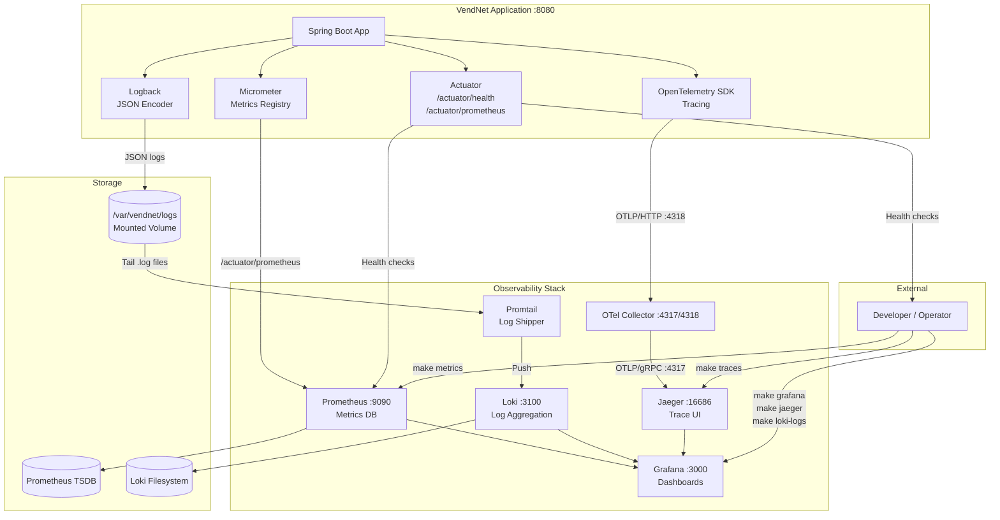

# DESOFS — Phase 2, Sprint 2: Telemetry & Observability

| | |
|---|---|
| **Project** | VendNet — Vending Machine Network Back-End |
| **Organisation** | Grupo Sensacao (ISEP — DESOFS 2025/2026) |
| **Date** | Junho 2026 |
| **Status** | ☑ Done |

---

## 1. Overview

Observability was implemented as a first-class concern in VendNet, not as an afterthought. The system emits three telemetry signals — **metrics**, **logs**, and **traces** — through an integrated stack of industry-standard open-source tools. Every signal is collected, stored, and visualised with zero manual instrumentation beyond what Spring Boot Actuator, Micrometer, and OpenTelemetry provide out of the box.

### Monitoring Objectives

| Objective                       | How It Is Achieved                                                                                                        |
| ------------------------------- | ------------------------------------------------------------------------------------------------------------------------- |
| **Real-time health visibility** | `/actuator/health`, `/api/health/ping`, Prometheus `up` metric, Grafana status panel                                      |
| **Performance monitoring**      | HTTP request rate, p95 latency histogram, JVM memory/CPU metrics in the VendNet Dashboard                                 |
| **Capacity planning**           | JVM heap usage, thread counts, GC metrics exposed via Micrometer                                                          |
| **Error detection**             | HTTP 4xx/5xx rate visible in Grafana; structured JSON logs searchable in Loki                                             |
| **Audit trail**                 | All security events (login, logout, lockout, backup, telemetry) logged with correlation IDs and persisted to the database |

### Operational Objectives

| Objective             | How It Is Achieved                                                                                                                                                                      |
| --------------------- | --------------------------------------------------------------------------------------------------------------------------------------------------------------------------------------- |
| **Troubleshooting**   | Distributed traces in Jaeger tie a single request through all internal layers; logs include `correlationId` for cross-signal correlation                                                |
| **Deployment safety** | Blue/green deployment script (`scripts/blue-green-deploy.sh`) uses health endpoint polling; Docker Compose health-checks gate traffic with `depends_on: condition: service_healthy`     |
| **Incident response** | `make status` provides a one-command health overview; Prometheus metrics can trigger Grafana alerts (alerting infrastructure present but alert rules not pre-configured in this Sprint) |

### Security Objectives

| Objective                          | How It Is Achieved                                                                                                     |
| ---------------------------------- | ---------------------------------------------------------------------------------------------------------------------- |
| **Failed authentication tracking** | Login failures, account lockouts, and suspicious telemetry attempts are audit-logged with `correlationId` and `userId` |
| **Request traceability**           | Every request receives a `X-Correlation-Id` header (UUID); this ID is injected into logs, MDC, and response headers    |
| **Tamper evidence**                | Audit log entries carry an `integrityHash` (SHA-256); rotated log files carry HMAC-SHA256 signatures                   |
| **Secrets never logged**           | Passwords, JWT tokens, and payment tokens are explicitly excluded from all log outputs                                 |

### Telemetry Contributions to the SSDLC

- **Reliability:** Health endpoints drive Docker restart policies and deployment rollback decisions.
- **Troubleshooting:** A developer can start from a Jaeger trace, click through to correlated Loki logs, and inspect the exact Prometheus metrics at the time of the incident — all from the single Grafana dashboard.
- **Performance monitoring:** The p95 latency panel and request-rate time-series allow detection of degradation before users report it.
- **Incident response:** `make status` provides instant visibility into which services are UP/DOWN.
- **Security monitoring:** Every authentication event, rate-limit violation, and unauthorised access attempt is logged and traceable.

---

## 2. Observability Architecture

The following diagram reflects the **actual** telemetry flow as implemented in `docker-compose.yml` and the application configuration.

**Figure 2.1 — End-to-end telemetry signal flow across all observability components:**



> Three independent signal paths converge in a single Grafana dashboard. Metrics follow a pull model (Prometheus scrapes `/actuator/prometheus`). Logs follow a push model (Logback writes to filesystem → Promtail tails → Loki). Traces follow a pipeline model (OTLP/HTTP → OTel Collector → Jaeger). All three signals are correlated via the `correlationId` UUID injected by `CorrelationIdFilter` and the W3C `traceId` propagated by OpenTelemetry.

**Signal Flow Summary:**

| Signal      | Origin                                         | Collector                     | Storage            | Query Interface                    |
| ----------- | ---------------------------------------------- | ----------------------------- | ------------------ | ---------------------------------- |
| **Metrics** | Micrometer → `/actuator/prometheus`            | Prometheus (scrape every 15s) | Prometheus TSDB    | Grafana (PromQL) + `make metrics`  |
| **Logs**    | Logback JSON → `/var/vendnet/logs/audit/*.log` | Promtail (tail + push)        | Loki (filesystem)  | Grafana (LogQL) + `make loki-logs` |
| **Traces**  | OpenTelemetry SDK → OTLP/HTTP                  | OTel Collector → Jaeger       | Jaeger (in-memory) | Jaeger UI + `make traces`          |

**Key Design Decisions:**

- **Docker Compose orchestrates the full stack:** All 7 observability containers (Prometheus, Grafana, Jaeger, Loki, Promtail, OTel Collector, MySQL) are defined in `docker-compose.yml` and started with a single `make up`.
- **No manual instrumentation:** Micrometer auto-configures JVM, HTTP, and datasource metrics. OpenTelemetry auto-instruments Spring Web MVC, JDBC, and HTTP clients.
- **Grafana ties all three signals together:** The `vendnet-jvm.json` dashboard displays Prometheus metrics (JVM memory, CPU, HTTP rate/latency, threads, uptime) and Loki logs side by side. The Jaeger datasource is configured with `tracesToLogsV2` for trace-to-log correlation.
- **Correlation IDs bridge signals:** The `X-Correlation-Id` header (UUID) is injected into every log line via MDC and every HTTP response header. This ID can be used to search logs in Loki for a specific request.

---

## 3. Infrastructure Components

### 3.1 Spring Boot Actuator

**Enabled Endpoints** (from `application.properties` and Docker Compose environment):

**Configuration 3.1 — Spring Boot Actuator endpoint exposure and Prometheus export:**

```properties
management.endpoints.web.exposure.include=health,info,prometheus,metrics
management.endpoint.health.show-details=always
management.metrics.export.prometheus.enabled=true
```

> Four Actuator endpoints are exposed without authentication (`permitAll()` in the security filter chain). Health details are always shown, enabling dependency-level health checks in production. The Prometheus endpoint at `/actuator/prometheus` is scraped by Prometheus every 15 seconds.

| Endpoint       | Path                   | Purpose                                         | Auth          |
| -------------- | ---------------------- | ----------------------------------------------- | ------------- |
| **Health**     | `/actuator/health`     | Container health check, load balancer readiness | `permitAll()` |
| **Info**       | `/actuator/info`       | Application metadata (name, version)            | `permitAll()` |
| **Prometheus** | `/actuator/prometheus` | Metrics scrape target for Prometheus            | `permitAll()` |
| **Metrics**    | `/actuator/metrics`    | Full metrics registry (JSON format)             | `permitAll()` |

**Exposure Configuration:**

- The Prometheus endpoint is exposed at `/actuator/prometheus` and scraped by Prometheus every 15 seconds.
- Health details are always shown (`show-details=always`), enabling dependency-level health checks in production.

### 3.2 Prometheus

**Version:** `prom/prometheus:v2.55.1`
**Configuration:** `docker/prometheus/prometheus.yml`

**Configuration 3.2 — Prometheus scrape configuration with two jobs (vendnet + self-monitoring):**

```yaml
global:
  scrape_interval: 15s
  evaluation_interval: 15s

scrape_configs:
  - job_name: "vendnet"
    metrics_path: "/actuator/prometheus"
    static_configs:
      - targets: ["vendnet:8080"]
        labels:
          app: "vendnet"
  - job_name: "prometheus"
    static_configs:
      - targets: ["localhost:9090"]
```

> Prometheus pulls metrics from the VendNet application over the Docker bridge network (`vendnet:8080`). The `scrape_interval` of 15s provides near-real-time visibility without excessive load. Self-monitoring (`job_name: prometheus`) ensures the metrics database itself is observable. The `--web.enable-lifecycle` flag (set in `docker-compose.yml`) allows hot-reload of configuration without restart.

**Monitored Targets:**

| Job          | Target                          | Metrics Path           |
| ------------ | ------------------------------- | ---------------------- |
| `vendnet`    | `vendnet:8080` (Docker network) | `/actuator/prometheus` |
| `prometheus` | `localhost:9090`                | Self-monitoring        |

**Metrics Collection Strategy:**

- **Pull-based:** Prometheus actively scrapes the `/actuator/prometheus` endpoint every 15 seconds. No push agents required.
- **In-container networking:** Prometheus communicates with the VendNet container over the `vendnet` Docker bridge network using the service name `vendnet`.
- **TSDB storage:** Metrics are stored in a Docker volume (`prometheus_data`) for persistence across container restarts.
- **Lifecycle:** `--web.enable-lifecycle` allows hot-reload of configuration without restart.

### 3.3 Grafana

**Version:** `grafana/grafana:11.3.1`
**Configuration:** Provisioned via `docker/grafana/datasources/prometheus.yml` and `docker/grafana/dashboards/dashboard.yml`

**Datasources (provisioned automatically):**

| Datasource     | Type         | URL                      | Role                                        |
| -------------- | ------------ | ------------------------ | ------------------------------------------- |
| **Prometheus** | `prometheus` | `http://prometheus:9090` | Default — metrics queries                   |
| **Loki**       | `loki`       | `http://loki:3100`       | Log queries                                 |
| **Jaeger**     | `jaeger`     | `http://jaeger:16686`    | Trace queries with `tracesToLogsV2` enabled |

**Dashboards:**

| Dashboard             | UID            | Source File                                  | Panels                   |
| --------------------- | -------------- | -------------------------------------------- | ------------------------ |
| **VendNet Dashboard** | `vendnet-main` | `docker/grafana/dashboards/vendnet-jvm.json` | 8 panels (see Section 8) |

**Alerting:** The Grafana alerting engine is available but no alert rules are pre-configured in this Sprint. The infrastructure is ready for alert rule definition.

**Traces-to-Logs Correlation:** The Jaeger datasource is configured with `tracesToLogsV2`, enabling a one-click jump from a Jaeger trace span to the correlated Loki log entries filtered by `traceID`.

### 3.4 Jaeger

**Version:** `jaegertracing/all-in-one:1.65.0`
**Mode:** All-in-one (collector + query + UI in a single container)

**Configuration 3.4 — Jaeger all-in-one container with OTLP collectors enabled:**

```yaml
jaeger:
  image: jaegertracing/all-in-one:1.65.0
  ports:
    - "16686:16686" # Query UI
    - "4318:4318" # OTLP HTTP (alternative direct path)
  environment:
    - COLLECTOR_OTLP_ENABLED=true
    - COLLECTOR_OTLP_HTTP_PORT=4318
    - COLLECTOR_OTLP_GRPC_PORT=4317
```

> The all-in-one mode bundles collector, query service, and UI into a single container — appropriate for development and demo environments. Both OTLP/HTTP (port 4318) and OTLP/gRPC (port 4317) are enabled for flexible trace ingestion.

**Trace Flow:**

1. Spring Boot application auto-instruments HTTP requests via Micrometer Tracing + OpenTelemetry bridge.
2. Span data is exported via OTLP/HTTP to the OTel Collector at `otel-collector:4318/v1/traces`.
3. The OTel Collector batches spans and forwards them via OTLP/gRPC to Jaeger at `jaeger:4317`.
4. Jaeger stores spans in-memory (all-in-one mode) and exposes the query UI at `http://localhost:16686`.

**Trace Visualisation:** The Jaeger UI displays waterfall span diagrams showing the full request path — from the HTTP filter chain through controller, service, repository, and database queries.

### 3.5 Loki

**Version:** `grafana/loki:3.2.2`
**Configuration:** `docker/loki/loki-config.yml`

**Configuration 3.5 — Loki log aggregation with filesystem storage and structured metadata support:**

```yaml
auth_enabled: false
server:
  http_listen_port: 3100
schema_config:
  configs:
    - from: 2024-01-01
      store: tsdb
      object_store: filesystem
      schema: v13
      index:
        prefix: index_
        period: 24h
limits_config:
  allow_structured_metadata: true
  volume_enabled: true
```

> Authentication is disabled (`auth_enabled: false`) for local development — Grafana fronts Loki and handles access control. Uses TSDB store with filesystem backend (persisted via Docker volume `loki_data`). Schema v13 with 24-hour index periods is appropriate for the log volume of a development environment. `allow_structured_metadata: true` enables LogQL queries against JSON fields like `correlationId` and `level`.

**Storage:** Filesystem-backed (`/loki/chunks` and `/loki/rules`), persisted via Docker volume `loki_data`.

**Querying:** Loki exposes a LogQL API at `http://localhost:3100`. The `make loki-logs` target queries recent logs:

**Command 3.5 — Query recent application logs from Loki:**

```bash
make loki-logs
# Queries: {job="vendnet"} — returns last 10 structured JSON log lines
```

> Inline comment documents the LogQL query and expected result cardinality.

### 3.6 Promtail

**Version:** `grafana/promtail:3.2.2`
**Configuration:** `docker/promtail/promtail-config.yml`

**Configuration 3.6 — Promtail log shipper configuration for vendnet application logs:**

```yaml
clients:
  - url: http://loki:3100/loki/api/v1/push

scrape_configs:
  - job_name: vendnet-logs
    static_configs:
      - targets:
          - localhost
        labels:
          job: vendnet
          __path__: /var/log/vendnet/**/*.log
```

> Promtail tails all `*.log` files under the shared Docker volume mount (`/var/log/vendnet/` — mapped read-only from the `vendnet_logs` volume). Each log entry is labelled `job=vendnet` before push to Loki. The wildcard path `**/*.log` ensures rotated log files are automatically picked up.

**Log Shipping Flow:**

1. The VendNet container writes JSON logs to `/var/vendnet/logs/audit/vendnet.log` (and rotated files).
2. This directory is mounted as a Docker volume (`vendnet_logs`) shared between the `vendnet` and `promtail` containers.
3. Promtail tails all `*.log` files under `/var/log/vendnet/**/` (read-only mount).
4. Promtail labels each log entry with `job=vendnet` and pushes to Loki at `http://loki:3100/loki/api/v1/push`.

### 3.7 OpenTelemetry Collector

**Version:** `otel/opentelemetry-collector-contrib:0.116.1`
**Configuration:** `docker/otel/otel-collector-config.yml`

**Configuration 3.7 — OpenTelemetry Collector with traces and metrics pipelines:**

```yaml
receivers:
  otlp:
    protocols:
      grpc:
        endpoint: 0.0.0.0:4317
      http:
        endpoint: 0.0.0.0:4318

processors:
  batch:
    timeout: 1s
    send_batch_size: 512

exporters:
  debug:
    verbosity: basic
  prometheus:
    endpoint: 0.0.0.0:8889
    namespace: vendnet
  otlp/jaeger:
    endpoint: jaeger:4317
    tls:
      insecure: true

service:
  pipelines:
    traces:
      receivers: [otlp]
      processors: [batch]
      exporters: [debug, otlp/jaeger]
    metrics:
      receivers: [otlp]
      processors: [batch]
      exporters: [debug, prometheus]
```

> Two independent pipelines are defined. The **traces pipeline** receives OTLP spans from the application, batches them (1-second timeout, 512-span batches), and exports to both the debug console and Jaeger via OTLP/gRPC. The **metrics pipeline** receives OTLP metrics, batches them, and exports to Prometheus at `:8889`. The batch processor reduces network overhead by aggregating spans before export.

**Pipeline:**

- **Traces pipeline:** Receives OTLP traces from the application → batches them → exports to Jaeger (OTLP/gRPC) and debug console.
- **Metrics pipeline:** Receives OTLP metrics → batches them → exports to Prometheus (own metrics endpoint at `:8889`).

### 3.8 Docker Orchestration

All observability services are defined in `docker-compose.yml` and networked via the `vendnet` bridge network. Service dependencies ensure correct startup order:

| Service          | Depends On                     | Condition                                                 |
| ---------------- | ------------------------------ | --------------------------------------------------------- |
| `vendnet`        | `mysql`, `otel-collector`      | `mysql` must be healthy; `otel-collector` must be started |
| `prometheus`     | `vendnet`                      | `vendnet` must be healthy                                 |
| `promtail`       | `loki`                         | `loki` must be started                                    |
| `jaeger`         | —                              | (no dependencies)                                         |
| `otel-collector` | `jaeger`                       | `jaeger` must be started                                  |
| `grafana`        | `prometheus`, `loki`, `jaeger` | All three must be started                                 |

> Docker Compose `depends_on` with `condition: service_healthy` ensures Prometheus only scrapes after the application is fully initialised and passing health checks. Grafana starts last, after all three data sources are available.

---

## 4. Metrics

### 4.1 Application Metrics

All HTTP metrics are auto-collected by Spring Boot Actuator + Micrometer and exposed at `/actuator/prometheus`.

| Metric                 | PromQL Expression                                                         | Type           | Grafana Panel                                  |
| ---------------------- | ------------------------------------------------------------------------- | -------------- | ---------------------------------------------- |
| **HTTP request rate**  | `rate(http_server_requests_seconds_count[1m])`                            | Counter (rate) | HTTP Request Rate (timeseries, per method+URI) |
| **HTTP latency (p95)** | `histogram_quantile(0.95, rate(http_server_requests_seconds_bucket[5m]))` | Histogram      | HTTP Latency p95 (timeseries, per method+URI)  |
| **Application uptime** | `up`                                                                      | Gauge (0/1)    | App Status (stat panel, green=UP)              |

### 4.2 JVM Metrics

| Metric              | PromQL Expression                   | Type           | Grafana Panel                                 |
| ------------------- | ----------------------------------- | -------------- | --------------------------------------------- |
| **JVM memory used** | `jvm_memory_used_bytes`             | Gauge          | JVM Memory Used (timeseries, per memory area) |
| **JVM max heap**    | `jvm_memory_max_bytes{area="heap"}` | Gauge          | Max Heap (stat panel)                         |
| **CPU usage**       | `process_cpu_usage * 100`           | Gauge (0–100%) | CPU Usage % (gauge with threshold at 90%)     |
| **Active threads**  | `jvm_threads_live_threads`          | Gauge          | Active Threads (stat panel)                   |

### 4.3 Custom/Business Metrics

The `MachineTelemetry` domain entity captures business-level telemetry from vending machines (temperature, stock levels, uptime, sales counters). These are stored in the `machine_telemetry` database table and are not currently exported to Prometheus. They are accessible via the REST API (`GET /api/telemetry`, operator/admin only) and could be exposed as custom Micrometer gauges in a future iteration.

### 4.4 Viewing Metrics

**Command 4.4.1 — View raw Prometheus text-format metrics:**

```bash
# Raw Prometheus text format
make metrics
```

> Fetches the first 40 lines of the `/actuator/prometheus` endpoint and prints them to the terminal.

**Command 4.4.2 — Open the Grafana dashboard:**

```bash
# Grafana dashboard
make grafana
# → Navigate to "VendNet Dashboard" (auto-provisioned)
```

> Opens http://localhost:3000 in the default browser. The VendNet Dashboard is provisioned automatically from `docker/grafana/dashboards/vendnet-jvm.json`.

**Command 4.4.3 — Open the Prometheus expression browser:**

```bash
# Prometheus expression browser
make prometheus
# → Try: http_server_requests_seconds_count
```

> Opens http://localhost:9090. Use PromQL to query metrics interactively.

---

## 5. Logging

### 5.1 Logging Architecture

**Framework:** Logback (Spring Boot default) with Logstash JSON encoder.
**Configuration:** `vendnet/src/main/resources/logback-spring.xml`

**Log Format:** Structured JSON via `net.logstash.logback.encoder.LogstashEncoder`. Every log line is a JSON object.

**Log Destinations:**

| Appender    | Destination                           | Format          | Profile           |
| ----------- | ------------------------------------- | --------------- | ----------------- |
| **CONSOLE** | stdout (Docker logs)                  | JSON (Logstash) | All profiles      |
| **FILE**    | `/var/vendnet/logs/audit/vendnet.log` | JSON (Logstash) | Non-test profiles |

**Log Rotation:** Time-based rolling policy — new file each day, 90-day retention.

**Configuration 5.1 — Logback time-based rolling policy with 90-day retention:**

```xml
<rollingPolicy class="ch.qos.logback.core.rolling.TimeBasedRollingPolicy">
    <fileNamePattern>${LOG_PATH}/audit/vendnet.%d{yyyy-MM-dd}.log</fileNamePattern>
    <maxHistory>90</maxHistory>
</rollingPolicy>
```

> A new log file is created at midnight each day. Files older than 90 days are automatically deleted. The `fileNamePattern` uses the date pattern `%d{yyyy-MM-dd}` for sortable filenames.

### 5.2 Structured Logging Fields

Every JSON log line includes the following fields:

| Field           | Source                                       | Example                                                  |
| --------------- | -------------------------------------------- | -------------------------------------------------------- |
| `@timestamp`    | LogstashEncoder                              | `"2026-06-15T10:30:00.123Z"`                             |
| `message`       | Application code                             | `"PING Hello World \| VendNet is alive..."`              |
| `logger_name`   | Logback                                      | `"pt.isep.desofs.vendnet.api.controller.PingController"` |
| `level`         | Logback                                      | `"INFO"`                                                 |
| `thread_name`   | Logback                                      | `"http-nio-8080-exec-1"`                                 |
| `app`           | Custom field                                 | `"vendnet"`                                              |
| `type`          | Custom field (FILE only)                     | `"audit"`                                                |
| `correlationId` | MDC — from `CorrelationIdFilter`             | `"550e8400-e29b-41d4-a716-446655440000"`                 |
| `userId`        | MDC — (reserved, populated by future filter) | `""`                                                     |
| `method`        | MDC — from `CorrelationIdFilter`             | `"GET"`                                                  |
| `uri`           | MDC — from `CorrelationIdFilter`             | `"/api/health/ping"`                                     |

### 5.3 Log Flow

**Figure 5.3 — Application log flow from source to Grafana dashboard:**

```
Application Code
    ↓ (Logback)
Console (stdout) ← Docker Logs
    +
File (/var/vendnet/logs/audit/vendnet.log)
    ↓ (Promtail tails)
Loki
    ↓ (Grafana Loki datasource)
Grafana "Application Logs" panel
```

> Logs follow two parallel paths: CONSOLE appender sends JSON to stdout (visible via `docker compose logs`), while FILE appender writes to the shared Docker volume. Promtail tails the file path and ships entries to Loki. Grafana queries Loki via the provisioned datasource.

### 5.4 Reading Logs

**Commands 5.4 — All log inspection commands:**

```bash
# Live Docker Compose logs (all services)
make logs

# Application JSON log file (local)
make app-logs

# Query recent logs from Loki
make loki-logs

# MySQL logs
make db-logs
```

> Four commands cover all log sources: `make logs` for streaming Docker output, `make app-logs` for the structured JSON file, `make loki-logs` for Loki queries, and `make db-logs` for MySQL-specific issues.

### 5.5 Security & Audit Logging

The `AuditLogger` component (`infrastructure/logging/AuditLogger.java`) logs structured security events to the application log stream:

```
AUDIT {eventType=LOGIN_SUCCESS, principal=admin@vendnet.io, action=LOGIN, resource=User, outcome=SUCCESS}
```

> Each audit event includes five structured fields: event type, principal (user identity), action, resource, and outcome. These events are persisted to both the log stream (JSON) and the `audit_logs` database table (with SHA-256 integrity hashes).

In parallel, the `AuditLog` entity persists security events to the database with SHA-256 integrity hashes. Rotated log files receive HMAC-SHA256 signatures via `AuditLogRotationServiceImpl`.

**What is intentionally NOT logged:**

- Passwords (never appear in any log)
- JWT tokens (never logged in full)
- Payment tokens
- TOTP secrets
- Full request bodies for sensitive endpoints

### 5.6 Correlation IDs

The `CorrelationIdFilter` (`infrastructure/security/CorrelationIdFilter.java`) runs at `Ordered.HIGHEST_PRECEDENCE` on every request:

1. Reads `X-Correlation-Id` header from the incoming request. If absent, generates a UUID.
2. Injects the correlation ID into SLF4J's MDC (`correlationId`, `method`, `uri`).
3. Sets `X-Correlation-Id` response header.
4. Clears MDC in a `finally` block (prevents thread-local leakage in thread pools).

This means:

- Every log line from a given request carries the same `correlationId`.
- The response includes the `X-Correlation-Id` header, allowing clients to reference specific requests.
- Logs from multiple services can be correlated by this ID.

---

## 6. Distributed Tracing

### 6.1 Tracing Framework

**Framework:** Micrometer Tracing (Spring Boot 3.x) with OpenTelemetry bridge.
**Export:** OTLP/HTTP to the OTel Collector, then OTLP/gRPC to Jaeger.

**Configuration 6.1 — OpenTelemetry tracing configuration in application.properties:**

```properties
management.tracing.sampling.probability=1.0
management.otlp.tracing.endpoint=http://otel-collector:4318/v1/traces
management.otlp.tracing.transport=http
```

> Sampling probability of 1.0 captures 100% of requests — appropriate for development and demo. OTLP traces are exported via HTTP to the OpenTelemetry Collector running in the Docker network. The collector forwards them to Jaeger via gRPC.

### 6.2 Trace Generation

Traces are generated **automatically** by Spring Boot's auto-configuration:

- Every incoming HTTP request creates a root span.
- Spring Web MVC controllers, Spring Data JPA repository calls, and JDBC queries create child spans.
- The `@Transactional` boundary is visible in traces.
- Custom spans can be added via the `Observation` API (not currently used in business code).

### 6.3 Context Propagation

- The `traceparent` header is propagated in HTTP responses.
- The trace ID is included in MDC, making it available to structured logs.
- Jaeger's `tracesToLogsV2` Grafana configuration enables trace-to-log correlation via `filterByTraceID: true`.

### 6.4 Viewing Traces

**Commands 6.4 — Trace inspection commands:**

```bash
# Open Jaeger UI
make jaeger

# Show recent traces in terminal
make traces
# Output: trace abc123... 5 spans 12345 us
```

> `make jaeger` opens the browser at http://localhost:16686. `make traces` queries the Jaeger API for the last 5 traces and displays span count and total duration.

**Trace Identifiers:** Each trace has a unique hex trace ID. Spans within a trace have parent-child relationships showing the call hierarchy: HTTP Filter → Controller → Service → Repository → SQL Query.

### 6.5 Example Trace Structure

A typical `POST /api/sales/purchase` trace contains:

**Figure 6.5 — Tree structure of a purchase transaction trace (15 ms total):**

```
POST /api/sales/purchase                              [root: 15ms]
├── JwtAuthenticationFilter.doFilter                   [1ms]
├── SaleController.purchase                            [14ms]
│   ├── SaleService.purchase                           [13ms]
│   │   ├── IdempotencyRepository.findByIdempotencyKey  [2ms]
│   │   ├── SlotRepository.lockSlotsForPurchase         [3ms]
│   │   ├── PaymentGatewayService.authorizePayment      [5ms]
│   │   ├── SaleRepository.save                         [2ms]
│   │   └── SlotRepository.save                         [1ms]
```

> This trace shows the full call hierarchy: the JWT authentication filter (1ms), the controller handling (14ms total), and the service orchestrating five child operations — idempotency check (2ms), pessimistic slot lock (3ms), payment authorisation (5ms), and two persistence saves (3ms combined). The `@Transactional` boundary is visible as the service span.

---

## 7. Health Monitoring

### 7.1 Health Endpoints

#### `/actuator/health` — Spring Boot Actuator Health

```
GET /actuator/health
Response: {"status":"UP","components":{"db":{"status":"UP"},"diskSpace":{"status":"UP"}}}
```

> Used by Docker health-check: `wget http://localhost:8080/actuator/health`. Used by `make status` for service availability checks. Includes dependency-level checks for database connectivity and disk space.

#### `/api/health` — Simple Health (Load Balancer Readiness)

**Code 7.1 — HealthController readiness check with bootstrap gating:**

```java
@GetMapping
@PreAuthorize("permitAll()")
public ResponseEntity<String> health() {
    if (bootstrapReady != null && !bootstrapReady.isReady()) {
        return ResponseEntity.status(503).body("Seeding...");
    }
    return ResponseEntity.ok("UP");
}
```

> Returns `"UP"` (200) when ready, `"Seeding..."` (503) during bootstrap seeding. Lightweight — no database query, just an in-memory `AtomicBoolean` flag. Used by load balancers for readiness probing and by Docker Compose `depends_on: condition: service_healthy`.

#### `/api/health/ping` — Detailed Health with Metadata

```
GET /api/health/ping
Response:
{
    "status": "ok",
    "message": "Hello World from VendNet!",
    "timestamp": "2026-06-15T10:30:00",
    "uptime": "123456ms"
}
```

> Returns application uptime via `RuntimeMXBean.getUptime()`. Logs a structured `PING` entry with timestamp and uptime. Used by smoke tests (`make api-test`, `make smoke-test-dev`).

### 7.2 Readiness vs Liveness

| Probe Type    | Endpoint           | Behaviour                                                                                                |
| ------------- | ------------------ | -------------------------------------------------------------------------------------------------------- |
| **Readiness** | `/api/health`      | Returns 503 during bootstrap seeding; 200 when ready. Prevents traffic before the database is populated. |
| **Liveness**  | `/actuator/health` | Returns 200 while the application is alive. Docker restarts the container on failure.                    |

### 7.3 Docker Health-Checks

| Container   | Health Check                                 | Interval | Retries |
| ----------- | -------------------------------------------- | -------- | ------- |
| **vendnet** | `wget http://localhost:8080/actuator/health` | 15s      | 5       |
| **mysql**   | `mysqladmin ping -h localhost`               | 10s      | 5       |

> Docker health-checks drive `depends_on: condition: service_healthy` in `docker-compose.yml`. The vendnet container is not marked healthy until the application responds to the Actuator health endpoint. MySQL uses `mysqladmin ping` for lightweight connectivity verification.

### 7.4 Bootstrap Readiness

The `BootstrapReadyIndicator` (`config/BootstrapReadyIndicator.java`) is an `AtomicBoolean` active only with the `bootstrap` profile. `BootstrapProfileConfig` calls `markReady()` after seeding is complete. Both `HealthController` and `PingController` check this flag and return 503 until bootstrap finishes. This ensures:

- Load balancers do not route traffic to an unseeded instance.
- Docker Compose `depends_on: condition: service_healthy` gates downstream services (Prometheus) on full readiness.

### 7.5 Checking Health

**Commands 7.5 — Health verification commands:**

```bash
# Quick ping
make ping

# Full status overview (all services + all API endpoints)
make status

# Smoke test (health + register + login + RBAC)
make api-test
```

> Three levels of health verification: `make ping` for a quick application check, `make status` for a comprehensive overview of all Docker containers and service URLs, and `make api-test` for a 10-endpoint smoke test covering public access, authentication, and RBAC enforcement.

---

## 8. Dashboards

### 8.1 VendNet Dashboard

**Source:** `docker/grafana/dashboards/vendnet-jvm.json`
**UID:** `vendnet-main`
**Auto-refresh:** Every 10 seconds
**Time range:** Last 1 hour (default)

| #   | Panel Title            | Type       | Datasource | Query                                                                     | Purpose                                                |
| --- | ---------------------- | ---------- | ---------- | ------------------------------------------------------------------------- | ------------------------------------------------------ |
| 1   | **JVM Memory Used**    | Timeseries | Prometheus | `jvm_memory_used_bytes`                                                   | Track heap/non-heap memory consumption per memory area |
| 2   | **CPU Usage %**        | Gauge      | Prometheus | `process_cpu_usage * 100`                                                 | Current CPU utilisation; threshold at 90% (red)        |
| 3   | **HTTP Request Rate**  | Timeseries | Prometheus | `rate(http_server_requests_seconds_count[1m])`                            | Requests per second, per HTTP method and URI           |
| 4   | **HTTP Latency (p95)** | Timeseries | Prometheus | `histogram_quantile(0.95, rate(http_server_requests_seconds_bucket[5m]))` | 95th percentile response time, per endpoint            |
| 5   | **App Status**         | Stat       | Prometheus | `up`                                                                      | Binary UP/DOWN indicator (green=1, red=0)              |
| 6   | **Active Threads**     | Stat       | Prometheus | `jvm_threads_live_threads`                                                | Current JVM thread count                               |
| 7   | **Max Heap**           | Stat       | Prometheus | `jvm_memory_max_bytes{area="heap"}`                                       | Maximum heap size allocated to the JVM                 |
| 8   | **Application Logs**   | Logs       | Loki       | `{job="vendnet"}`                                                         | Recent structured JSON log entries, searchable         |

**Operational Value:**

- **Panel 3 + 4 together** show whether increased traffic correlates with latency degradation.
- **Panel 1 + 7 together** show whether memory pressure is approaching the heap limit.
- **Panel 2** provides an early warning of CPU saturation (gauge turns red at 90%).
- **Panel 8** enables searching logs directly from the dashboard — type LogQL queries to filter by level, correlation ID, or keyword.

**Figure 8.1 — Grafana VendNet Dashboard with all 8 panels populated:**


> The dashboard auto-refreshes every 10 seconds. All 8 panels show live data from Prometheus (metrics) and Loki (logs). After running `make api-test-full`, the HTTP Request Rate and Latency charts show visible traffic spikes. The Application Logs panel displays structured JSON entries with correlation IDs.

### 8.2 Jaeger Trace View

The Jaeger UI at `http://localhost:16686` provides:

- Service-level trace search (filter by `vendnet` service).
- Waterfall span visualisation showing parent-child relationships.
- Span-level duration, tags, and logs.
- One-click navigation to correlated Loki logs via `tracesToLogsV2`.

**Figure 8.2 — Jaeger trace waterfall view showing span hierarchy:**


> The waterfall view displays the full request path: HTTP filter → controller → service → repository → SQL queries. Each span shows its duration in microseconds. The `tracesToLogsV2` link (visible in the span details) navigates directly to the correlated Loki log entries for that trace.

### 8.3 Loki Log View

The "Application Logs" panel in the VendNet Dashboard displays structured JSON logs from Loki. LogQL queries can filter by:

- `{job="vendnet"} |= "ERROR"` — error logs only
- `{job="vendnet"} | json | correlationId = "..."` — filter by correlation ID

**Figure 8.3 — Live `make loki-logs` terminal output showing structured application events:**

```
  [20:33:14] Init duration for springdoc-openapi is: 300 ms
  [20:30:05] Completed initialization in 1 ms
  [20:30:05] Initializing Servlet 'dispatcherServlet'
  [20:30:05] Initializing Spring DispatcherServlet 'dispatcherServlet'
  [20:30:05] ========================================
  [20:30:05]   Ping:    http://localhost:8080/api/health/ping
  [20:30:05]   Swagger: http://localhost:8080/swagger-ui/index.html
  [20:30:05]   API:     http://localhost:8080
  [20:30:05]   VendNet is running and ready!
  [20:30:05] ========================================
```

> Live Loki output showing the application bootstrap sequence: Spring DispatcherServlet initialisation, SpringDoc OpenAPI initialisation (300ms), and the VendNet ready banner with service URLs. Each line carries a `correlationId` and `@timestamp` in its underlying JSON structure.

---

## 9. Telemetry Generation and Testing

The VendNet `Makefile` provides several targets for generating traffic and verifying telemetry.

### 9.1 Smoke Test

**Command 9.1 — Smoke test generating ~10 API requests across all endpoint categories:**

```bash
make api-test
```

> Generates ~10 HTTP requests covering health, public info, registration, login, authenticated profile, JWT claims, product catalog, machine listing, and RBAC verification (expects 403 on admin endpoint).

This generates metrics in Prometheus, logs in Loki, and traces in Jaeger.

### 9.2 Full Traffic Generation

**Command 9.2 — Full traffic generation producing ~55 concurrent requests:**

```bash
make api-test-full
```

> Generates ~55 HTTP requests (10 concurrent bursts of 5 endpoints each). Registers a test user if not already registered. Prints links to Grafana, Jaeger, and Loki for immediate inspection.

```
$ make api-test-full
  Generating 55 requests...
  ✓ Done. Check:
    Grafana → VendNet Dashboard
    Jaeger  → vendnet service traces
    Loki    → app logs
```

> The 55 requests produce measurable spikes in HTTP Request Rate and Latency charts, create ~55 Jaeger traces (each with 2–5 spans), and generate structured log entries with unique correlation IDs.

### 9.3 Viewing Telemetry

**Commands 9.3 — Telemetry inspection commands:**

```bash
# Raw Prometheus metrics (first 40 lines)
make metrics

# Recent Jaeger traces (last 5 traces, span count + duration)
make traces

# Recent Loki logs (last 10 log lines)
make loki-logs
```

> Three commands cover all three telemetry signals. `make metrics` shows raw Prometheus text format. `make traces` shows Jaeger trace summaries. `make loki-logs` shows structured JSON log entries from Loki.

### 9.4 Open Observability UIs

**Commands 9.4 — Open observability UIs in browser:**

```bash
make grafana     # http://localhost:3000 (admin/admin)
make prometheus  # http://localhost:9090
make jaeger      # http://localhost:16686
```

> Each command opens the corresponding UI in the default browser. Grafana uses `admin`/`admin` credentials.

### 9.5 Full Reproduction Sequence

**Commands 9.5 — Complete telemetry demonstration sequence (start → verify → generate → inspect → stop):**

```bash
# 1. Start all services (MySQL + VendNet + observability stack)
make up

# 2. Wait for health (or check status)
make status

# 3. Generate traffic
make api-test-full

# 4. View results
make grafana     # Dashboard with populated panels
make jaeger      # Traces from the 55 requests
make loki-logs   # Structured JSON logs

# 5. Stop all services
make down
```

> A 5-step sequence that reproduces the full telemetry pipeline from a clean state. Each step is a single Makefile target.

**Expected Outcomes:**

- Grafana "VendNet Dashboard": HTTP Request Rate and Latency charts show spikes from the traffic generation. App Status shows green "UP".
- Jaeger: ~55 traces visible for the `vendnet` service, each with 2–5 spans.
- Loki: Structured log entries showing `INFO` level messages with `correlationId` fields populated.
- `make metrics`: Raw Prometheus text output showing `jvm_memory_used_bytes`, `http_server_requests_seconds_count`, `process_cpu_usage`, etc.

---

## 10. Security Monitoring

### 10.1 Authentication Events

Every authentication event is logged with structured data and persisted to the audit trail:

| Event                   | Logged In               | Audit Log (`eventType`) | Loki Search                                   |
| ----------------------- | ----------------------- | ----------------------- | --------------------------------------------- |
| Login success           | `log.info` (PING style) | `LOGIN_SUCCESS`         | `{job="vendnet"} \|= "LOGIN_SUCCESS"`         |
| Login failure           | —                       | `LOGIN_FAILED`          | `{job="vendnet"} \|= "LOGIN_FAILED"`          |
| Account locked          | —                       | `ACCOUNT_LOCKED`        | `{job="vendnet"} \|= "ACCOUNT_LOCKED"`        |
| Login denied (inactive) | —                       | `LOGIN_DENIED_INACTIVE` | `{job="vendnet"} \|= "LOGIN_DENIED_INACTIVE"` |
| Registration            | —                       | `REGISTER`              | `{job="vendnet"} \|= "REGISTER"`              |

### 10.2 Telemetry Security Events

The telemetry ingestion endpoint (`POST /api/telemetry`) logs security-relevant events:

| Event                                 | Audit Log (`eventType`)       | HTTP Status   |
| ------------------------------------- | ----------------------------- | ------------- |
| Certificate CN missing                | `CERTIFICATE_MISSING`         | 401           |
| Unknown machine                       | `UNKNOWN_MACHINE`             | 403           |
| Identity mismatch (CN ≠ serialNumber) | `IDENTITY_MISMATCH`           | 403           |
| Rate limit exceeded                   | `MACHINE_RATE_LIMIT_EXCEEDED` | 429           |
| Alert triggered (temp/error/stock)    | `TELEMETRY_ALERT`             | (logged, 200) |
| Telemetry ingested                    | `TELEMETRY_INGESTED`          | 200           |

### 10.3 Request-Level Traceability

The `CorrelationIdFilter` ensures that every HTTP request can be traced end-to-end:

1. **Request comes in** → `X-Correlation-Id` header read/generated.
2. **Every log line** from that request includes `correlationId` in the JSON.
3. **The response** includes `X-Correlation-Id` header — the client can reference it.
4. **In Grafana Loki**, search `{job="vendnet"} | json | correlationId = "..."` to see all log lines for a specific request.

### 10.4 Audit Log Integrity

- Database-persisted `AuditLog` entries carry an `integrityHash` (SHA-256 of record content) for tamper detection.
- Rotated log files (`.log.gz`) carry companion `.hmac` files (HMAC-SHA256) for tamper evidence.
- The HMAC secret is configurable via `AUDIT_LOG_HMAC_SECRET` environment variable.

### 10.5 What Telemetry Reveals for Security

| Anomaly                  | Observed In                       | Indicators                                                                      |
| ------------------------ | --------------------------------- | ------------------------------------------------------------------------------- |
| Brute-force attack       | Loki logs, AuditLog table         | Rapid `LOGIN_FAILED` events for same user → `ACCOUNT_LOCKED`                    |
| Credential stuffing      | Grafana HTTP Rate panel           | Unusually high request rate to `POST /api/auth/login`                           |
| Unauthorised access      | Loki logs                         | 401/403 responses with `correlationId` linking to specific IPs                  |
| Machine spoofing attempt | Loki logs                         | `CERTIFICATE_MISSING` or `IDENTITY_MISMATCH` events                             |
| DoS attempt              | Loki logs, Prometheus `up` metric | `MACHINE_RATE_LIMIT_EXCEEDED` events; `up` metric drops to 0                    |
| Data exfiltration        | Grafana HTTP Request Rate         | Unusual request patterns to data-heavy endpoints (e.g., `GET /api/admin/users`) |

---

## 11. Operational Procedures

### 11.1 Starting the Infrastructure

**Commands 11.1 — Incremental infrastructure startup:**

```bash
# Start MySQL only
make db-up

# Start observability stack (Prometheus, Grafana, Jaeger, Loki, Promtail)
make obs-up

# Start everything (MySQL + observability)
make up
```

> Three levels of startup: `make db-up` for database-only, `make obs-up` for observability-only, and `make up` for the full stack.

Expected output for `make up`:

```
→ Starting MySQL... ✓ Ready (localhost:3306)
→ Starting observability stack...
  Prometheus  http://localhost:9090
  Grafana     http://localhost:3000 (admin/admin)
  Jaeger      http://localhost:16686
  Loki        http://localhost:3100
✓ Observability stack ready
✓ All services running.
```

> MySQL health is confirmed via `mysqladmin ping` before the observability stack starts. All five observability URLs are printed for quick access.

### 11.2 Checking Status

**Command 11.2 — Check health of all services and API endpoints:**

```bash
make status
```

> Provides a one-command overview of all Docker containers, service URLs, and API endpoint health.

```
  Containers
    vendnet-mysql-1         Up 2 minutes (healthy)
    vendnet-app-1           Up 2 minutes (healthy)
    vendnet-prometheus-1    Up 2 minutes
    ...

  Service URLs
    App             ✓ UP
    Swagger         ✓ UP
    Prometheus      ✓ UP
    Grafana         ✓ UP
    Jaeger          ✓ UP
    Loki            ✓ UP

  API
    GET  /api/health/ping      ✓ UP
    GET  /api/public/info       ✓ UP
```

> Each container is listed with its uptime and health status. Each service URL is probed and reported as UP (200) or DOWN (non-200). The two public API endpoints are verified last.

### 11.3 Viewing Metrics

**Commands 11.3 — Metrics inspection:**

```bash
# Open Prometheus expression browser
make prometheus

# Print raw Prometheus metrics to terminal
make metrics
```

> `make prometheus` opens the browser. `make metrics` prints the first 40 lines of the metrics endpoint to the terminal.

Sample output for `make metrics`:

```
# HELP jvm_memory_used_bytes The amount of used memory
# TYPE jvm_memory_used_bytes gauge
jvm_memory_used_bytes{area="heap",id="G1 Survivor Space",} 8388608.0
jvm_memory_used_bytes{area="heap",id="G1 Old Gen",} 2.097152E7
jvm_memory_used_bytes{area="nonheap",id="Metaspace",} 4.718592E7
...
# HELP http_server_requests_seconds
# TYPE http_server_requests_seconds summary
http_server_requests_seconds_count{method="GET",status="200",uri="/api/health/ping",} 10.0
http_server_requests_seconds_sum{method="GET",status="200",uri="/api/health/ping",} 0.025
...
```

**Figure 11.3 — Prometheus metrics terminal output:**


### 11.4 Viewing Traces

**Command 11.4 — View recent Jaeger traces in terminal:**

```bash
make traces
```

> Queries the Jaeger API and displays trace ID, span count, and duration for the last 5 traces.

```
Recent Jaeger traces:
  trace a1b2c3d4e5f6... 3 spans 12500 us
  trace f6e5d4c3b2a1... 5 spans 34200 us
```

> Each line shows: trace ID (first 16 hex chars), number of child spans, and total trace duration in microseconds.

### 11.5 Viewing Logs

**Commands 11.5 — Log inspection:**

```bash
# All Docker logs (streaming)
make logs

# Application JSON log file (streaming)
make app-logs

# Query recent logs from Loki
make loki-logs
```

> Three log sources: Docker Compose output (all containers), the structured JSON log file (application only), and Loki (queryable, last 10 entries).

```
  [10:30:01] {"@timestamp":"2026-06-15T10:30:00.123Z","message":"PING Hello World | VendNet is alive",...,"correlationId":"550e8400-..."}
  [10:30:02] GET /api/products 200
  [10:30:03] POST /api/sales/purchase 201
```

> Each log entry shows the timestamp, HTTP method, URI, status code, and correlation ID. Full JSON structure is available in Loki/Grafana.

### 11.6 Opening URLs

**Command 11.6 — Display all service and endpoint URLs:**

```bash
make urls
```

> Prints all 9 URLs for the application, API documentation, health endpoints, and observability tools.

```
  VendNet URLs

  App         http://localhost:8080
  Swagger     http://localhost:8080/swagger-ui/index.html
  Ping        http://localhost:8080/api/health/ping
  Health      http://localhost:8080/actuator/health
  Metrics     http://localhost:8080/actuator/prometheus

  Grafana     http://localhost:3000  (admin / admin)
  Prometheus  http://localhost:9090
  Jaeger      http://localhost:16686
  Loki        http://localhost:3100
```

> Nine URLs — one for the application, four for Spring Boot endpoints, and four for observability tools.

### 11.7 Full Reset

**Commands 11.7 — Environment teardown:**

```bash
# Stop all services and remove volumes
make clean-all

# Or nuclear option (removes all vendnet containers, networks, volumes)
make nuke
```

> `make clean-all` stops and removes all three environments (dev, stage, prod) and shared infrastructure. `make nuke` removes ALL VendNet Docker resources across all environments.

---

## 12. Evidence Collection

### Existing Artifacts

| Artifact                         | Location                                        | Status            |
| -------------------------------- | ----------------------------------------------- | ----------------- |
| Prometheus configuration         | `docker/prometheus/prometheus.yml`              | Present           |
| Grafana dashboard (JSON)         | `docker/grafana/dashboards/vendnet-jvm.json`    | Present           |
| Grafana datasource config        | `docker/grafana/datasources/prometheus.yml`     | Present           |
| Loki configuration               | `docker/loki/loki-config.yml`                   | Present           |
| Promtail configuration           | `docker/promtail/promtail-config.yml`           | Present           |
| OTel Collector configuration     | `docker/otel/otel-collector-config.yml`         | Present           |
| Logback configuration            | `vendnet/src/main/resources/logback-spring.xml` | Present           |
| Docker Compose (full stack)      | `docker-compose.yml`                            | Present           |
| Makefile (observability targets) | `vendnet/Makefile`                              | Present           |
| Application log output           | `vendnet/logs/`                                 | Present (runtime) |
| E2E test reports                 | `vendnet/e2e/reports/`                          | Present           |

### Screenshot Evidence

**Figure 12.1 — Grafana VendNet Dashboard (8 panels):**


> Auto-provisioned dashboard showing JVM memory, CPU usage, HTTP request rate/latency, app status, active threads, max heap, and application logs.

**Figure 12.2 — Jaeger distributed trace waterfall:**


> Waterfall span diagram showing full request path through JWT filter, controller, service, and repository.

**Figure 12.3 — Prometheus metrics terminal output:**


> Raw Prometheus text-format metrics showing JVM memory, HTTP request counts, and CPU usage.

---

_Telemetry documentation generated from repository analysis. All configuration files, Makefile targets, and infrastructure code referenced above exist in the repository and are reproducible with `make up`._
